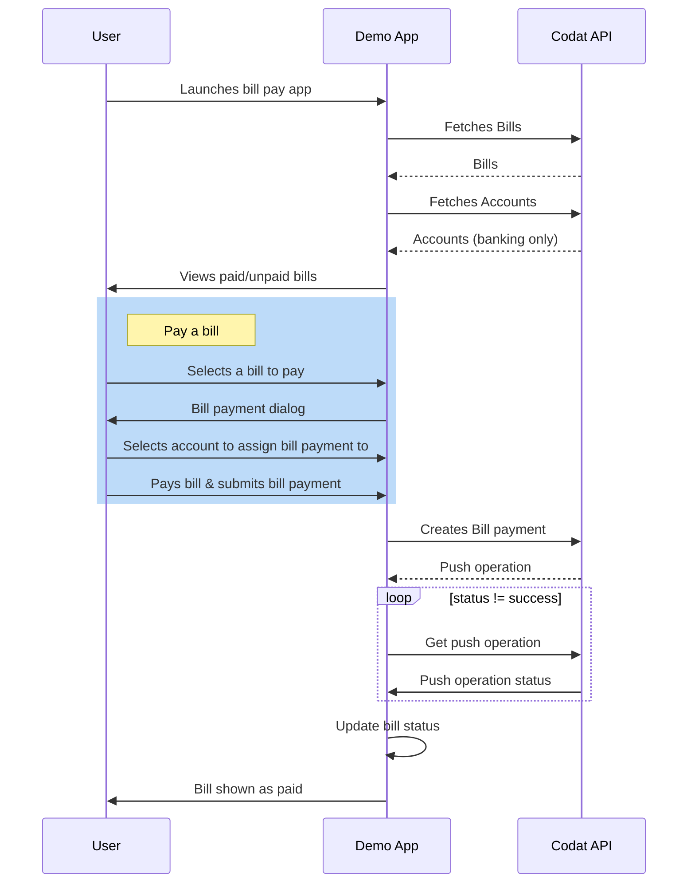

Now you're ready to explore the functionality of the bill pay demo app in more depth. The user flow diagram describes the app's functionality at a high level, while the API requests document the flow of data between the app and Codat's Accounting API.

Sections:

- Connect the demo app to QuickBooks Online
- View bills
- Pay a bill


### Understand the authorization process

Using the demo app and Hosted Link, create a company and then authorize access to your sandbox data in QuickBooks Online. For a seamless user experience, we've customized the Hosted Link flow to use the same branding and colors as the demo app UI.

1. From the **Bill Pay** start screen, click **Get Started**.
2. Follow the instructions to:
   1. Create a company in Codat.
   2. Connect to **Intuit QuickBooks Sandbox** in the Hosted Link flow. This creates a data connection to QuickBooks Online.
   3. Authorize the demo app to access data from your sandbox QuickBooks Online company.
   4. When you've completed the Hosted Link flow, click **Launch Bills Portal** to open the demo app. Behind the scenes, the demo app redirects you to the redirect URL.


### Bill pay user flow - split into 2 separate diagrams with explanations



### API: Pull accounts payable

When launched, the demo app [retrives a list of all bills](/accounting-api#/operations/list-bills) from your sandbox QuickBooks Online company, in descending order of issue date.

<details>
  <summary>Expanding box</summary>
Text goes here
</details>

```http title="List bills request"
GET https://<YOUR_DOMAIN>/companies/<COMPANY_ID>/data/bills?page=1&pageSize=100&orderBy=-issueDate
```

```json title="List bills response example"
{
  "results": [
    {
      "id": "181",
      "supplierRef": {
        "id": "41",
        "supplierName": "Mark Howard"
      },
      "purchaseOrderRefs": [],
      "issueDate": "2023-04-01T00:00:00",
      "dueDate": "2023-04-01T00:00:00",
      "currency": "GBP",
      "currencyRate": 1,
      "lineItems": [
        {
          "description": "monthly office rent",
          "unitAmount": 1250,
          "quantity": 1,
          "discountAmount": 0,
          "subTotal": 1250,
          "taxAmount": 250,
          "totalAmount": 1500,
          "accountRef": {
            "id": "41",
            "name": "Rent Expense"
          },
          "taxRateRef": {
            "id": "3_Bills",
            "name": "20.0% S Bills",
            "effectiveTaxRate": 20
          },
          "trackingCategoryRefs": [],
          "tracking": {
            "categoryRefs": [],
            "isBilledTo": "Unknown",
            "isRebilledTo": "NotApplicable"
          },
          "isDirectCost": false
        }
      ],
      "withholdingTax": [],
      "status": "Open",
      "subTotal": 1250,
      "taxAmount": 250,
      "totalAmount": 1500,
      "amountDue": 1500,
      "modifiedDate": "2023-05-02T10:35:04Z",
      "sourceModifiedDate": "2023-03-27T23:30:01Z",
      "paymentAllocations": [],
      "metadata": {
        "isDeleted": false
      }
    },
    # ...
  ],
  "pageNumber": 1,
  "pageSize": 100,
  "totalResults": 8,
  "_links": {
    "current": {
      "href": "/companies/0f655a48-f6c2-43b4-857b-f2d6793f90b8/data/bills?page=1&pageSize=100&orderBy=-issueDate"
    },
    "self": {
      "href": "/companies/0f655a48-f6c2-43b4-857b-f2d6793f90b8/data/bills"
    }
  }
}
```

:::info View unpaid bills query

When the **View unpaid bills only toggle** is selected in the UI, the `&query=status=Open` query is appended to the request URL as a [Codat query string](/using-the-api/querying). This returns only unpaid bills.

:::

### API: Pull bank accounts

At step 2 in "Make a mock payment", the demo app [retrieves the company's latest accounts](/accounting-api#/operations/list-accounts) and queries the results by account type and currency.

```http
ADD REQUEST HERE
```

### API: Post a Bill payment to the accounting platform

When you make a mock payment, the demo app pushes a Bill payment to QuickBooks for the total amount of the bill. This reconciles the payment against the outstanding bill.

```http
ADD REQUEST HERE
```
### 💪 Ready for more?

Try these suggestions to make the most of your experience with the demo app:

- **Access sandbox data for a different region**  
  You can set up a sandbox QuickBooks Online company that contains data for a different region, then run through the demo app guide again. For more information, see [Create and test with a sandbox company](https://developer.intuit.com/app/developer/qbo/docs/develop/sandboxes/manage-your-sandboxes) in the Intuit developer documentation.

- **Expand the app's functionality**  
  Go one step further and develop other features that make the Accounts Payable process simpler for your customers. For example, you could provide the ability to pay a bill using a credit note, or create a new bill from within your application.

- **Further reading**  
  Explore accounting automation topics in the [Codat Blog](https://www.codat.io/blog/category/accounting-automation/). 

You can also find out more about the [Accounting API](/accounting-api/overview), or explore other [use cases](/usecases/overview).