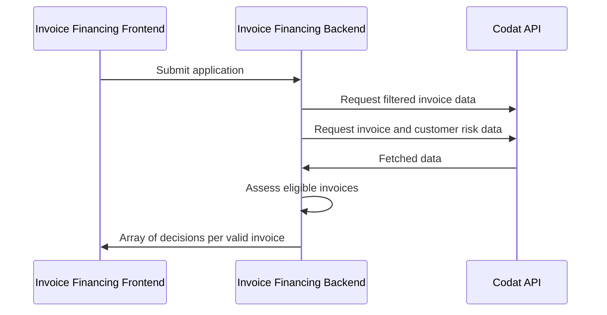

import Tabs from '@theme/Tabs';
import TabItem from '@theme/TabItem';

### 🚀 In this section, you will...
* Review the basic process flow followed by the demo app,
* Create a new invoice financing application,
* Create a Codat company and connect it to the Codat Sandbox,
* Fetch financial data to assess risk levels associated with customers and invoices, and
* Receive a decision on the loan application. 

:::note Invoice financing process flow

This diagram shows the steps of the underwriting process as performed by the demo app. It helps you visualize the relationship and information exchange between the app's different components.


:::  

### <input type="checkbox" unchecked /> Start a new loan application  

:::note Loan application frontend

We use [Swagger](http://localhost:5069/swagger/index.html) to act as a presentation layer to interact with the demo endpoints. There are two endpoints that support the creation and processing of the application form, and three endpoints to interact with webhook rules you have previously set up. Remember to click **Try it out** and **Execute** when working with Swagger.
:::

Call the `GET /applications/start` endpoint to trigger the creation of a new invoice financing loan application. In the background, the app creates a company using Codat's `POST /companies` endpoint using the application `id` as the company name.

Codat returns the company and application `id`s in the endpoint response together with a `linkUrl`. In the demo, we will use these elements to fill in the application details and connect a data source next.  

```json title="Example endpoint response"
  {
    "id": "1c727866-6923-4f81-aa7b-c7fd8c533586",
    "codatCompanyId": "a9e28b79-6a98-4190-948d-3bd4d60e7c0a",
    "status": "Started", 
    "linkUrl": "https://link.codat.io/company/a9e28b79-6a98-4190-948d-3bd4d60e7c0a"
  }
```

### <input type="checkbox" unchecked /> Provide application details  

Once you receive the the application id, complete the application form using the `/applications/{applicationId}/form` endpoint. In our demo, we request the applicant's full name, company name, and the loan amount, length, and purpose. If the details provided are valid, they are stored against the application `id` with an acknowledgement of their receipt. 

```json title="Example application form"
  {
    "id": "applicationId", 
    "companyName": "Example Company",
    "fullName": "John Smith",
    "loanAmount": 25000.00, // must be greater than zero 
    "loanTerm": 36, // must be at least 12 months
    "loanPurpose": "Growth marketing campaign"
  }
```

### <input type="checkbox" unchecked /> Share financial data  

Next, you need to provide Codat access to an accounting platform so that we can fetch the data required to assess the risk of the application associated with the applicant's customers and invoices. Open the `linkUrl` returned by the new application response in your browser window. Follow the flow built using [Link](/auth-flow/overview), our hosted or embedded integrated authorization flow. 

Select the **Codat Sandbox** as the source of accounting data.
* You can choose any company type that best fits your use case.
* You don't need to enter any credentials to authorize this connection. 
* You should also skip the step of uploading business documents. 

We fetch the applicant's unpaid invoices, customers associated to these unpaid invoices, and each customer's historic (paid) invoices to use in the decision making. You can [read more](/accounting-api/guides/invoice-finance/inv-fin-decision) about the queries we used to perform the specific fetching. 


### <input type="checkbox" unchecked /> Make the decision on the loan 

The demo app now has all the components that it needs to assess the risk associated with each customer, and risk associated with each invoice. These assessments determine the decision on each unpaid invoice included in the loan request. 

Poll the `GET applications/{applicationId}` endpoint in [Swagger](http://localhost:5069/swagger/index.html) anytime to check the status of your loan. Once the app processes all the relevant invoices, it will automatically return a response that includes a decision on each invoice assessed as part of the application.

IS THIS NEEDED HERE OR ON THE NEXT PAGE INSTEAD

```json title="Example decision response"
  {
    "status": "Started/AccountsLinked/Fetching/FetchError/Processing/ProcessingError/Complete" // Response displays one of these possible application statuses
    "decisions": [ // An array of decisions per each invoice Id analysed during the application
      {
        "invoiceId": "string", // Codat's internal Id associated with fetched invoices
        "invoiceNo": "string", // Identifying number of the invoice in the applicant's accounting system
        "amountDue": decimal,  // Amount to be paid on the invoice issued to customer
        "offerAmount": decimal // Amount the app offers to lend, calculated as 90% of amountDue
        "rate": decimal // Rate with which the app offers to lend, based on each invoice's risk
      }
                 ]
  }
```

You can [read more](/accounting-api/guides/invoice-finance/inv-fin-decision) about the risk assessments the app performs, and further detail of the decisioning logic. The thresholds used with the logic are set in the `appsettings.json` file. 

### 💪 Ready for more? 

Try these suggestions to make the most of your experience with the demo app:

- **Play around with thresholds**  
  In the `appsettings.json` file of the `Codat.Demos.InvoiceFinancing.Api\` directory, set your own example thresholds for data points used for risk assessment and see how this affects the application decision.

- **Finance an invoice-based loan using different datasets**  
  Start another loan application, and choose a different Sandbox company type to get a different set of financial data to be used in the decision-making. 

- **Use a company's real data**  
  Take the demo one step further and use real credentials to access existing financial data in an accounting platform. Set up the [integration](/integrations/accounting/overview) you plan to use, and connect to it while following the auth flow. Then, review how the app makes a decision based on your company's real data. 

- **Inspect the invoice financing logic**  
  We provide [detailed information](/accounting-api/guides/invoice-finance/inv-fin-decision) about the risk assessment logic we included in our demo app, and how exactly the financial data is fetched and analyzed. 
  

### Recap

You have now successfully run the demo app, covering all the key inoice financing process steps. You have started and completed an application, connected and fetched accounting data, and received a decision on your application. 