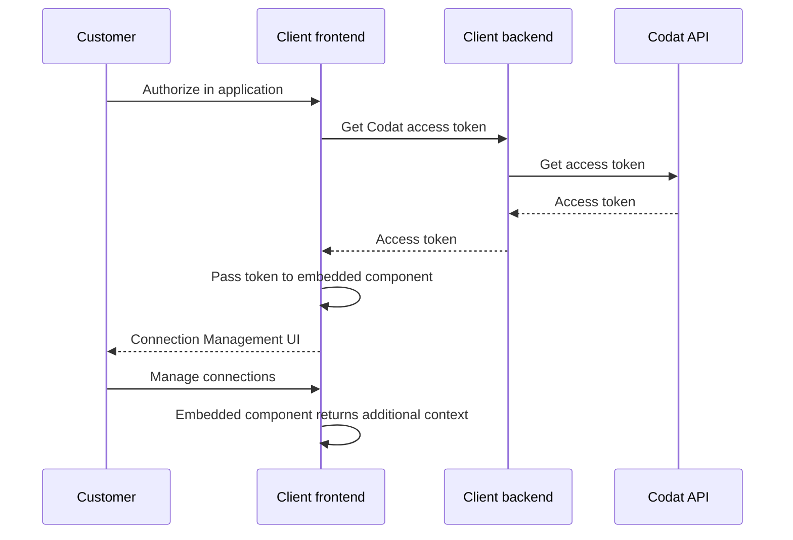

import Tabs from "@theme/Tabs";
import TabItem from "@theme/TabItem";

## Overview

Give your customers the ability to manage the access permissions they have given you by using our **Connection Management SDK** in your front-end code. This is key from a regulatory perspective and builds trust between you and your customer. 

### Features

With its sleek UI and low-code deployment, the component provides the following critical functionality:

- Displays active and inactive accounting, banking, and commerce connections.
- Allows the user to unlink active connection retaining previously fetched data.
- Enables the user to reauthorize a previously unlinked connection. 


## Prerequisites

### Your application

You need a JavaScript application to render the component. The component works with all major JavaScript frameworks, including React, and with vanilla JavaScript. You can choose to implement it in TypeScript. We don't recommend using it in an iframe because it will not work for security reasons (CORS).

:::tip Link SDK and Connection Management SDK

The Connection Management SDK is an independent component and doesn't require our [Link SDK](/auth-flow/authorize-embedded-link) to work. You can use the Link SDK to enhance your customers' auth flow experience to achieve an 89% average conversion rate.

:::

### Access token

Once your customer authorizes within your application, use the [Get access token](/platform-api#/operations/get-connection-management-access-token) endpoint to retrieve an access token for this customer's company. 

Pass it to the Connection Management component so that we can get the company-specific information and display it in the UI. We summarized this process on the diagram: 



### CORS settings

To control the domain list that your application can make token requests from, register the allowed origins using the [Set CORS settings](/platform-api#/operations/set-connection-management-cors-settings) endpoint. This is a required setting for the Connection Management component to work. 

To display the origins you previously registered for your instance, use the [Get CORS settings](/platform-api#/operations/get-connection-management-cors-settings) endpoint. 

## Get started

<Tabs>
<TabItem value="react" label="React">

#### Get started with React

1. **Create a component that mounts the SDK** 

  We recommend setting the component to `width: 460px; height: 840px`. The code snippet below uses these parameters. 

2. **Use the component to mount the SDK** 

  We suggest wrapping the SDK (named `CodatConnections` in our snippet) in a modal so that you can adjust its positioning. Itt can also manage when to display Connection Management, passing the relevant [access token](/auth-flow/optimize/connection-management#access-token) and callbacks.

  ```js
  import { useEffect, useRef, useState } from "react";

  const initialize = (
    url: string,
    target: HTMLElement,
    props: unknown
  ): Promise<void> => {
    return import(url).then(
      ({ CodatConnections }) =>
        new CodatConnections({
          target,
          props,
        })
    );
  };

  function App() {
    const componentMount = useRef<HTMLDivElement>(null);
    const [modalOpen, setModalOpen] = useState(false);

    const onClose = () => setModalOpen(false);

    useEffect(() => {
      const sdkUrl = "https://connections-sdk.codat.io";
      const target = componentMount.current;

      if (target && target.children.length === 0) {
        initialize(sdkUrl, target, {
          accessToken:
            "YOUR_ACCESS_TOKEN",
          onReconnect: () => alert("On reconnect callback!!"),
          onDisconnect: () => alert("On disconnect callback!!"),
          onError: () => alert("On error callback!!"),
          onClose,
        });
      }
    }, [componentMount, modalOpen]);

    return (
      <div
        style={{
          width: "460px",
          height: "840px",
          margin: "1rem 0",
        }}
        ref={componentMount}
      ></div>
    );
  }

  export default App;
  ```
   
3. **If you're using content security policy (CSP) headers:**
    
       * Allowlist Codat by adding `*.codat.io` to `default-src` (or each of of `script-src, style-src, font-src, connect-src, img-src`).
       * Add `unsafe-inline` to `style-src`. Don't use a hash because this can change at any time without warning.
 
</TabItem>

<TabItem value="nextjs" label="NextJS">

#### Get started with NextJS

:::note NextJS and urlImports

NextJS is opinionated about the import strategy we're suggesting, and has an experimental feature called [urlImports](https://nextjs.org/docs/app/api-reference/next-config-js/urlImports). If you follow our NextJS example, you'll be warned you need to use the urlImports feature. 

Link SDK and urlImports are not compatible, because NextJS assumes the resources are static and caches the SDK, causing various issues.

In the example below, you'll see that we use webpack's [magic comments](https://webpack.js.org/api/module-methods/#magic-comments) feature to avoid NextJS's caching and use normal [import()](https://developer.mozilla.org/en-US/docs/Web/JavaScript/Reference/Operators/import) behavior.
:::

1. **Create a component that mounts the SDK** 

  You can copy and paste the example <a href="https://github.com/codatio/sdk-link/blob/main/examples/languages/next/src/app/components/CodatConnections.tsx" target="_blank">`CodatConnections.tsx`</a> file to an appropriate location in your app. We recommend setting the component to `width: 460px; height: 840px`. 
  
  We use [`"use client"`](https://nextjs.org/docs/getting-started/react-essentials#the-use-client-directive) in the script to define this as client-side code, and the import is ignored in webpack to avoid NextJS caching (as above).

2. **Use the component to mount the SDK** 

  We suggest wrapping the `CodatConnections` component in a modal to [adjust its positioning](https://github.com/codatio/sdk-link/blob/main/examples/languages/next/src/app/page.module.css). Your component can also manage when to [display the Link component](https://github.com/codatio/sdk-link/blob/main/examples/languages/next/src/app/page.tsx), passing the relevant company ID and callbacks.

  ```js
  // page.tsx

  "use client";

  import {
    ConnectionCallbackArgs,
    ErrorCallbackArgs,
  } from "@codat/sdk-link-types"
  import { CodatConnections } from "./components/CodatConnections";
  import Image from "next/image";
  import styles from "./page.module.css";
  import { useState } from "react";
  
  export default function Home() {
    const [companyId, setCompanyId] = useState(""); //provide company ID
    const [modalOpen, setModalOpen] = useState(false);

    const onConnection = (connection: ConnectionCallbackArgs) => 
      alert(`On connection callback - ${connection.connectionId}`);
    const onClose = () => setModalOpen(false);
    const onFinish = () => alert("On finish callback");
    const onError = (error: ErrorCallbackArgs) => 
      alert(`On error callback - ${error.message}`);
  
    return (
      <main className={styles.main}>
        // ... some other components
        {modalOpen && (
          <div className={styles.modalWrapper}>
            <CodatConnections
              companyId={companyId}
              onConnection={onConnection}
              onError={onError}
              onClose={onClose}
              onFinish={onFinish}
            />
          </div>
        )}
      </main>
    );
  };
  ```
   
3. **Conditional steps**

    - **If you're using TypeScript**, extend your type declarations with our types by installing the types package using `npm install --save-dev @codat/sdk-link-types`. Otherwise, delete the type related code in the snippets.

    - **If you're using content security policy (CSP) headers**, edit these headers:

       * Allowlist Codat by adding `*.codat.io` to `default-src` (or each of of `script-src, style-src, font-src, connect-src, img-src`).
       * Add `unsafe-inline` to `style-src`. Do *not* use a hash because this can change at any time without warning.
 
</TabItem>

<TabItem value="javascript" label="JavaScript">

#### Get started with JavaScript

1. **Create a target `div` for the `CodatConnections` component** 

  It should have an `id` of `codat-link-container`.
  
  The `CodatConnections` component will be mounted within this div. We recommend setting `width: 460px; height: 840px` for this element and styling it as a modal by nesting it within a modal wrapper (e.g. `position: fixed; inset: 0`).

  The created `CodatConnections` component expands to fit 100% of the specified dimensions.
   
2. **Import the Link SDK component** 

  If you're using the component inside a `script` tag, the tag must have `type="module"` set. 

  ```bash
   import { CodatConnections } from "https://link-sdk.codat.io";
  ```

3. **Define callbacks** 
  
  ```js
  const closeCallback = () => {
   linkSdkTarget.style.pointerEvents = "none";
   linkSdkTarget.removeChild(linkSdkTarget.children[0]);
  };

  const onClose = () => closeCallback();
  const onConnection = (connection) =>
   alert(`On connection callback  = ${connection.connectionId}`);
  const onFinish = () => alert("On finish callback");
  const onError = (error) => alert(`On error callback : ${error.message}`);
  ```

5. **Initialize the Link SDK component in your app** 

  Supply the `companyId` of the company you want to authorize:

 ```js
  const target = document.querySelector("#codat-link-container");
  
  const openModal = () => {
   linkSdkTarget.style.pointerEvents = "initial";
   new CodatConnections({
     target: linkSdkTarget,
     props: {
       companyId,
       onConnection,
       onClose,
       onFinish,
       onError,
     },
   });
  };
 ```
4. **Conditional steps**  

  - **If you're using TypeScript**, extend your type declarations with our types. Download the <a href="https://github.com/codatio/sdk-link/blob/main/snippets/types.d.ts" target="_blank"> `types.d.ts`</a> file, then copy and paste its contents into a new or existing `.d.ts` file.

 - **If you're using content security policy (CSP) headers**, edit these headers:
    * Allowlist Codat by adding `*.codat.io` to `default-src` (or each of of `script-src, style-src, font-src, connect-src, img-src`).
    * Add `unsafe-inline` to `style-src`. Do *not* use a hash because this can change at any time without warning.

</TabItem>

<TabItem value="angular" label="Angular">

#### Get started with Angular

:::note Angular and urlImports

In the example below, we use webpack's [magic comments](https://webpack.js.org/api/module-methods/#magic-comments) feature to avoid Angular's caching and use normal [import()](https://developer.mozilla.org/en-US/docs/Web/JavaScript/Reference/Operators/import) behavior.
:::

1. **Create a component that mounts the SDK** 

  See the <a href="https://github.com/codatio/sdk-link/blob/main/examples/languages/angular/src/app/codat-link/" target="_blank">`codat-link folder`</a> for an example module.

2. **Define company ID and callbacks** 

```js
//app.component.ts

  companyId = '';//provide company ID
  linkOpen = false;

  openLink() {
    if (this.companyId) {
      this.linkOpen = true;
    }
  }

  closeLink() {
    this.linkOpen = false;
  }

  onConnection(connection: ConnectionCallbackArgs) {
    alert(`On connection callback : ${connection.connectionId}`);
  }

  onError(error: ErrorCallbackArgs) {
    alert(`On error callback : ${error.message}`);
  }

  onFinish() {
    alert('On finish callback');
  }

```

3. **Use the component to mount the SDK**

```html
<!-- app.component.html -->

<button (click)="openLink()">Start authing</button>
  <app-codat-link
    [companyId]="companyId"
    (connection)="onConnection($event)"
    (close)="closeLink()"
    (error)="onError($event)"
    (finish)="onFinish()"
    *ngIf="linkOpen"
  ></app-codat-link>
```
4. **Conditional steps**
   - **If you're using TypeScript**, extend your type declarations with our types. Download the <a href="https://github.com/codatio/sdk-link/blob/main/snippets/types.d.ts" target="_blank"> `types.d.ts`</a> file, then copy and paste its contents into a new or existing `.d.ts` file.
   -  **If you're using content security policy (CSP) headers**, edit these headers:
      * Allowlist Codat by adding `*.codat.io` to `default-src` (or each of of `script-src, style-src, font-src, connect-src, img-src`).
      * Add `unsafe-inline` to `style-src`. Do *not* use a hash because this can change at any time without warning.
 
</TabItem>

<TabItem value="vue" label="Vue">

#### Get started with Vue

1. **Create a component that mounts the SDK** 

  You can copy and paste the example <a href="https://github.com/codatio/sdk-link/blob/main/examples/languages/vue/src/components/CodatConnections.vue" target="_blank">`CodatConnections.vue`</a> file to an appropriate location in your app. We recommend setting `width: 460px; height: 840px` for this component.

2. **Use this component to mount the SDK** 

  We suggest wrapping the `CodatConnections` component in a modal to [adjust its positioning](https://github.com/codatio/sdk-link/blob/main/examples/languages/vue/src/App.vue). The component can also manage when to [display the Link component](https://github.com/codatio/sdk-link/blob/main/examples/languages/vue/src/App.vue), passing the relevant company ID and callbacks.

  ```js
  // App.vue

  <script setup lang="ts">
    import CodatConnections from './components/CodatConnections.vue'
    import { ref } from 'vue'
    import type { ConnectionCallbackArgs, ErrorCallbackArgs } from 'https://link-sdk.codat.io'  

    const companyId = ref('') //provide company ID
    const modalOpen = ref(false) 

    const onConnection = (connection: ConnectionCallbackArgs) =>
      alert(`On connection callback - ${connection.connectionId}`);
    const onClose = () => (modalOpen = false);
    const onFinish = () => alert("On finish callback");
    const onError = (error: ErrorCallbackArgs) =>
      alert(`On error callback - ${error.message}`);

  </script>

  <div class="app">
    <main>
        {#if modalOpen}
        <div class="modal-wrapper">
          <CodatConnections {companyId} {onConnection} {onClose} {onError} {onFinish} />
        </div>
      {/if}
    </main>
  </div>
  ```
   
4. **Conditional steps**
    - **If you're using TypeScript**, extend your type declarations with our types. Download the <a href="https://github.com/codatio/sdk-link/blob/main/snippets/types.d.ts" target="_blank"> `types.d.ts`</a> file, then copy and paste its contents into a new or existing `.d.ts` file.
    - **If you're using content security policy (CSP) headers**, edit these headers:
       * Allowlist Codat by adding `*.codat.io` to `default-src` (or each of of `script-src, style-src, font-src, connect-src, img-src`).
       * Add `unsafe-inline` to `style-src`. Do *not* use a hash because this can change at any time without warning.
 
</TabItem>

<TabItem value="svelte" label="Svelte">

#### Get started with Svelte

1. **Create a component that mounts the SDK** 

  You can copy and paste the example <a href="https://github.com/codatio/sdk-link/blob/main/examples/languages/svelte/src/lib/CodatConnections.svelte" target="_blank">`CodatConnections.svelte`</a> file to an appropriate location in your Svelte app. We recommend setting `width: 460px; height: 840px` for this component.
2. **Use the component to mount the SDK**  

  We suggest wrapping the `CodatConnections` component in a modal to [adjust its positioning](https://github.com/codatio/sdk-link/blob/main/examples/languages/svelte/src/App.svelte). The component can also manage when to [display the Link component](https://github.com/codatio/sdk-link/blob/main/examples/languages/svelte/src/App.svelte), passing the relevant company ID and callbacks.

  ```js
  // App.svelte

  <script lang="ts">
    import CodatConnections from "./lib/CodatConnections.svelte";
    import type {
      ConnectionCallbackArgs,
      ErrorCallbackArgs,
    } from "https://link-sdk.codat.io";

    let modalOpen = false;
    let companyId = "" //provide company ID

    const onConnection = (connection: ConnectionCallbackArgs) =>
      alert(`On connection callback - ${connection.connectionId}`);
    const onClose = () => (modalOpen = false);
    const onFinish = () => alert("On finish callback");
    const onError = (error: ErrorCallbackArgs) =>
      alert(`On error callback - ${error.message}`);

  </script>

  <div class="app">
    <main>
        {#if modalOpen}
        <div class="modal-wrapper">
          <CodatConnections {companyId} {onConnection} {onClose} {onError} {onFinish} />
        </div>
      {/if}
    </main>
  </div>

  ```
   
4. **Conditional steps**
    - **If you're using TypeScript**, extend your type declarations with our types. Download the <a href="https://github.com/codatio/sdk-link/blob/main/snippets/types.d.ts" target="_blank"> `types.d.ts`</a> file, then copy and paste its contents into a new or existing `.d.ts` file.
    - **If you're using content security policy (CSP) headers**, edit these headers:
       * Allowlist Codat by adding `*.codat.io` to `default-src` (or each of of `script-src, style-src, font-src, connect-src, img-src`).
       * Add `unsafe-inline` to `style-src`. Do *not* use a hash because this can change at any time without warning.
 
</TabItem>

</Tabs>

## Interface options

The component **doesn't support** the [branding](/auth-flow/customize/branding) and [customization](/auth-flow/customize/customize-link) settings that you can apply to our [Link auth journey](/auth-flow/authorize-embedded-link) in the [Codat Portal](https://app.codat.io/settings). However, you can use the SDK's `options` property to change some of these settings. 

```js
<CodatConnections
  accessToken={accessToken}
 onClose: () => void = () => {};
 onError: ({correlationId?: string;
  message?: string;
  errorCode?: number;
  userRecoverable: boolean}) => void = () => {};
onReconnect: (args: {connectionId: string}) => void = () => {};
onDisconnect: (args: {connectionId: string}) => void = () => {};
  options={{
      text: {...},
  }}
/>
```
The `options` prop is optional and accepts an object containing the following optional properties:

| Property                  | Description                                                                                                                        |
|---------------------------|------------------------------------------------------------------------------------------------------------------------------------|
| `text`                    | Contains options that control what text is displayed to the user.                                        |

The object is applied as the SDK component is mounted and doesn't support reloading. Make sure to modify the options before mounting the component.

### Custom text

Use the `text` property to control some of the text displayed within the Connection Management UI. You can override the following text options:

| Option                                  |Type and description                                                                                                                                                                                                                                                                                                              |
|-------------------------------------------------|--------------------------------------------------------------------------------------------------------------------------------------------------------------------------------------------------------------------------------------------------------------------------------------------------------------------------|
| `accounting.connectionDetails.dataTypes`<br/>`banking.connectionDetails.dataTypes`<br/>`commerce.connectionDetails.dataTypes`      |`array[string]` _(accepts Markdown)_ <br/><br/>List of requested data types displayed before reconnecting an accounting, banking or commerce platform. <br/><br/> If this is not set, the UI will not display a list of data types when reconnecting.|

## Changelog

:::tip Change management

As with all Codat products, this SDK is subject to [our change management policy](/introduction/change-policy). We will give appropriate notice for changes to it and any associated APIs. We have rigorous testing and security measures in place to ensure you can import our SDK with confidence.
:::

#### April 2024


---

## Read next

- [Optimize your auth flow](/auth-flow/optimize/optimize-the-connection-journey)
