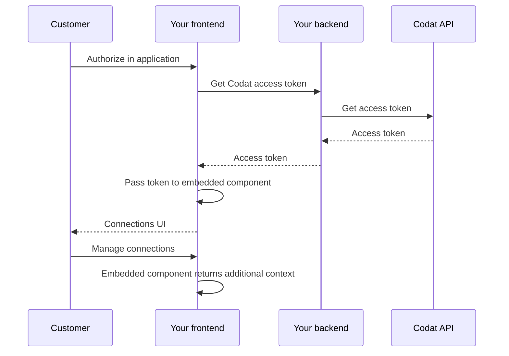

import Tabs from "@theme/Tabs";
import TabItem from "@theme/TabItem";

## Overview

Give your customers the ability to manage the access permissions they have given you by using our **Connections SDK** in your front end. This is key from a regulatory perspective, builds trust between you and your customer, and is required by some accounting platforms (e.g. Xero). 


### Functionality

With its sleek UI and low-code deployment, the component provides the following critical functionality:

- Displays accounting, banking, and commerce connections in `Linked`, `Unlinked`, and `Deauthorized` statuses.
- Provides the details of first authorization date and most recent sync date.
- Allows the user to disconnect an active connection, setting it to a `Unlinked` state and retaining previously fetched data.
- Enables the user to reauthorize a previously unlinked or deauthorized connection, setting it back to `Linked` status. 

You can read more about [Connection statuses](https://docs.codat.io/core-concepts/connections#connection-status) at Codat.

## Prerequisites

### Your application

You need a JavaScript application to render the component. The component can be used in any part of your application and works with all major JavaScript frameworks, such as React and Typescript. You can also implement it in vanilla JavaScript. We don't recommend using it in an iframe because it will not work for security reasons (CORS).

:::tip Link SDK and Connections SDK

The Connections SDK is an independent component and doesn't require our [Link SDK](/auth-flow/authorize-embedded-link) to work. You can use the Link SDK in your app to enhance your customers' auth flow experience and achieve an 89% average conversion rate.

:::

### Access token

Once your customer authorizes within your application, use the [Get access token](/platform-api#/operations/get-connection-management-access-token) endpoint to retrieve an access token for this customer's company. 

:::tip Token validity
The token is only valid for one hour and applies to a single company.
:::

<Tabs>

<TabItem value="nodejs" label="TypeScript">

```javascript
const accessTokenRes = await platformClient.connectionManagement.getAccessToken({
    companyId: companyId,
  });

if(accessTokenRes.statusCode == 200){
  const accessToken = accessTokenRes.connectionManagementAccessToken.accessToken
  console.log(accessToken)
}
```

</TabItem>

<TabItem value="python" label="Python">

```python
access_token_req = operations.GetConnectionManagementAccessTokenRequest(
    company_id=company_id,
)

access_token_res = platform_client.connection_management.get_access_token(access_token_req)

if access_token_res.connection_management_access_token is not None:
    print(access_token_res.connection_management_access_token.access_token)
```

</TabItem>

<TabItem value="csharp" label="C#">

```csharp
var accessTokenRes = await platformClient.ConnectionManagement.GetAccessTokenAsync(new() {
    CompanyId = companyId,
};);

if(accessTokenRes.StatusCode != 200){
  throw new Exception("Could not create company");
}

var accessToken = accessTokenRes.ConnectionManagementAccessToken.AccessToken;
Console.WriteLine(accessToken);
```

</TabItem>

<TabItem value="go" label="Go">

```go
ctx := context.Background()
accessTokenReq, err := platformClient.ConnectionManagement.GetAccessToken(ctx,
  operations.GetConnectionManagementAccessTokenRequest{
    CompanyID: companyID,
	}
)

if accessTokenReq.StatusCode == 200 {
  accessToken := accessTokenReq.ConnectionManagementAccessToken.AccessToken
  fmt.Println("%s", accessToken)
}
```
</TabItem>

<TabItem value="java" label="Java">

```java
GetConnectionManagementAccessTokenRequest accessTokenReq = GetConnectionManagementAccessTokenRequest.builder()
  .companyId(companyId)
  .build();

GetConnectionManagementAccessTokenResponse accessTokenRes = platformClient.connectionManagement().getAccessToken()
  .request(accessTokenReq)
  .call();

if (accessTokenRes.connectionManagementAccessToken().isPresent()) {
  accessToken = companyResponse.connectionManagementAccessToken().get().accessToken;
  System.out.println(accessToken);
}
```
</TabItem>

</Tabs>

Pass the token to the Connections component so that we can get the company-specific information and display it in the UI. We summarized this process on the diagram: 



### CORS settings

[Cross-origin resource sharing](https://en.wikipedia.org/wiki/Cross-origin_resource_sharing) (CORS) settings are required for the Connections component to work. To control the domain list that your application can make token requests from, register the allowed origins using the [Set CORS settings](/platform-api#/operations/set-connection-management-cors-settings) endpoint.

To display the origins you previously registered for your instance, use the [Get CORS settings](/platform-api#/operations/get-connection-management-cors-settings) endpoint. 

## Get started

:::tip Install the npm package

Take advantage of our [npm package](https://www.npmjs.com/package/@codat/sdk-connections) so you don't have to manually import and maintain type definitions. You will benefit from it the most if you are using Typescript.

`$ npm i -S @codat/sdk-connections`

:::

<Tabs>
<TabItem value="react" label="React">

#### Get started with React

1. **Create a component that mounts the SDK** 

  We recommend setting the component to `width: 460px; height: 840px` because it's optimized to look best with these parameters. The code snippet below uses these parameters. 

2. **Use the component to mount the SDK** 

  We suggest wrapping the SDK (named `CodatConnections` in our snippet) in a modal so that you can adjust its positioning. It can also manage when to display Connections, passing the relevant [access token](/auth-flow/optimize/connection-management#access-token) and callbacks.

  ```js
  // ConnectionManagement.tsx

  import {
    DisconnectCallbackArgs,
    ErrorCallbackArgs,
  } from "@codat/sdk-connections";

  import { CodatConnections } from "./components/CodatConnections";
  import { useState } from "react";

  export const ConnectionManagement = ({
    accessToken,
  }: {
    accessToken: string;
  }) => {
    const [modalOpen, setModalOpen] = useState(false);

    const onDisconnect = (connection: DisconnectCallbackArgs) =>
      alert(`On disconnect callback - ${connection.connectionId}`);
    const onReconnect = (connection: DisconnectCallbackArgs) =>
      alert(`On reconnect callback - ${connection.connectionId}`);
    const onClose = () => setModalOpen(false);
    const onError = (error: ErrorCallbackArgs) =>
      alert(`On error callback - ${error.message}`);

    return (
      <div>
        <p>Some content</p>
        <button onClick={() => setModalOpen(true)}>Manage connections</button>
        {modalOpen && (
          <div className="modal-wrapper">
            <CodatConnections
              accessToken={accessToken}
              onDisconnect={onDisconnect}
              onReconnect={onReconnect}
              onError={onError}
              onClose={onClose}
            />
          </div>
        )}
        ;
      </div>
    );
  };
  ```
   
3. **If you're using content security policy (CSP) headers:**
    
       * Allowlist Codat by adding `*.codat.io` to `default-src` (or each of of `script-src, style-src, font-src, connect-src, img-src`).
       * Add `unsafe-inline` to `style-src`. Don't use a hash because this can change at any time without warning.
 
</TabItem>

<TabItem value="nextjs" label="NextJS">

#### Get started with NextJS

:::note NextJS and urlImports

NextJS is opinionated about the import strategy we're suggesting, and has an experimental feature called [urlImports](https://nextjs.org/docs/app/api-reference/next-config-js/urlImports). Connections SDK and urlImports are not compatible, because NextJS assumes the resources are static and caches the SDK, causing various issues.

In the snippet below, you'll see that we use webpack's [magic comments](https://webpack.js.org/api/module-methods/#magic-comments) feature to avoid NextJS's caching and use normal [import()](https://developer.mozilla.org/en-US/docs/Web/JavaScript/Reference/Operators/import) behavior.
:::

1. **Create a component that mounts the SDK** 

  We recommend setting the component to `width: 460px; height: 840px` because it's optimized to look best with these parameters. 
  
  We use [`"use client"`](https://nextjs.org/docs/getting-started/react-essentials#the-use-client-directive) in the script to define this as client-side code, and the import is ignored in webpack to avoid NextJS caching (as above).

2. **Use the component to mount the SDK** 

  We suggest wrapping the SDK (named `CodatConnections` in our snippet) in a modal so that you can adjust its positioning. Itt can also manage when to display Connections, passing the relevant [access token](/auth-flow/optimize/connection-management#access-token) and callbacks.

  ```js
  // page.tsx

  "use client";

  import {
    DisconnectCallbackArgs,
    ErrorCallbackArgs,
    ReconnectCallbackArgs,
  } from "@codat/sdk-connections";

  import { CodatConnections } from "./components/CodatConnections";
  import Image from "next/image";
  import styles from "./page.module.css";
  import { useState } from "react";

  export default function Home() {
    const [accessToken, setAccessToken] = useState(""); //provide accessToken
    const [modalOpen, setModalOpen] = useState(false);

    const onDisconnect = (connection: DisconnectCallbackArgs) =>
      alert(`On disconnect callback - ${connection.connectionId}`);
    const onReconnect = (connection: ReconnectCallbackArgs) =>
      alert(`On reconnect callback - ${connection.connectionId}`);
    const onClose = () => setModalOpen(false);
    const onError = (error: ErrorCallbackArgs) =>
      alert(`On error callback - ${error.message}`);

    return (
      <main className={styles.main}>
        {/* // ... some other components */}
        {modalOpen && (
          <div className={styles.modalWrapper}>
            <CodatConnections
              accessToken={accessToken}
              onDisconnect={onDisconnect}
              onReconnect={onReconnect}
              onError={onError}
              onClose={onClose}
            />
          </div>
        )}
      </main>
    );
  }
  ```
   
3. **If you're using content security policy (CSP) headers:**

    * Allowlist Codat by adding `*.codat.io` to `default-src` (or each of of `script-src, style-src, font-src, connect-src, img-src`).
    * Add `unsafe-inline` to `style-src`. Do *not* use a hash because this can change at any time without warning.
 
</TabItem>

<TabItem value="javascript" label="JavaScript">

#### Get started with JavaScript

1. **Create a target `div` for the `CodatConnections` component** 

  It should have an `id` of `codat-connections-container`.
  
  The `CodatConnections` component will be mounted within this div. We recommend setting `width: 460px; height: 840px` for this element and styling it as a modal by nesting it within a modal wrapper (e.g. `position: fixed; inset: 0`). The component is optimized to look best with these parameters.

  The created `CodatConnections` component expands to fit 100% of the specified dimensions.
   
2. **Import the Connections SDK component** 

  If you're using the component inside a `script` tag, the tag must have `type="module"` set. 

  ```bash
  import { CodatConnections } from "https://connections-sdk.codat.io";
  ```

3. **Define callbacks** 
  
  ```js
  const closeCallback = () => {
    connectionsSdkTarget.style.pointerEvents = "none";
    connectionsSdkTarget.removeChild(connectionsSdkTarget.children[0]);
  };

  const onClose = () => closeCallback();
  const onReconnect = (connection) =>
    alert(`On reconnect callback  = ${connection.connectionId}`);
  const onDisconnect = (connection) =>
    alert(`On disconnect callback  = ${connection.connectionId}`);
  const onError = (error) => alert(`On error callback : ${error.message}`);
  ```

5. **Initialize the Link SDK component in your app** 

  Supply the `accessToken` for the company you want to manage connections for:

 ```js
  const connectionsSdkTarget = document.querySelector(
    "#codat-connections-container"
  );

  const openModal = () => {
    connectionsSdkTarget.style.pointerEvents = "initial";
    new CodatConnections({
      target: connectionsSdkTarget,
      props: {
        accessToken,
        onReconnect,
        onClose,
        onDisconnect,
        onError,
      },
    });
  };
 ```
4. **If you're using content security policy (CSP) headers**:
    * Allowlist Codat by adding `*.codat.io` to `default-src` (or each of of `script-src, style-src, font-src, connect-src, img-src`).
    * Add `unsafe-inline` to `style-src`. Do *not* use a hash because this can change at any time without warning.

</TabItem>

<TabItem value="angular" label="Angular">

#### Get started with Angular

:::note Angular and urlImports

In the snippet below, we use webpack's [magic comments](https://webpack.js.org/api/module-methods/#magic-comments) feature to avoid Angular's caching and use normal [import()](https://developer.mozilla.org/en-US/docs/Web/JavaScript/Reference/Operators/import) behavior.
:::

1. **Create a component that mounts the SDK** 

2. **Define access token and callbacks** 

  ```js
  //app.component.ts

  accessToken = ''; // provide access token
  connectionsSdkOpen = false;

  openConnectionsSdk() {
    if (this.accessToken) {
      this.connectionsSdkOpen = true;
    }
  }

  closeConnectionsSdk() {
    this.connectionsSdkOpen = false;
  }

  onDisconnect(connection) {
    alert(`On disconnect callback : ${connection.connectionId}`);
  }

  onReconnect(connection) {
    alert(`On reconnect callback : ${connection.connectionId}`);
  }

  onError(error) {
    alert(`On error callback : ${error.message}`);
  }
  ```

3. **Use the component to mount the SDK**

  ```html
  <!-- app.component.html -->

  <button (click)="openConnectionsSdk()">Manage connections</button>
    <app-codat-connections
      [accessToken]="accessToken"
      (connection)="onDisconnect($event)"
      (connection)="onReconnect($event)"
      (close)="closeConnectionsSdk()"
      (error)="onError($event)"
      *ngIf="connectionsSdkOpen"
    ></app-codat-connections>
  ```

4. **If you're using content security policy (CSP) headers**:
      * Allowlist Codat by adding `*.codat.io` to `default-src` (or each of of `script-src, style-src, font-src, connect-src, img-src`).
      * Add `unsafe-inline` to `style-src`. Do *not* use a hash because this can change at any time without warning.
 
</TabItem>

<TabItem value="vue" label="Vue">

#### Get started with Vue

1. **Create a component that mounts the SDK** 

 We recommend setting `width: 460px; height: 840px` for this component because it's optimized to look best with these parameters.

2. **Use this component to mount the SDK** 

  We suggest wrapping the SDK (named `CodatConnections` in our snippet) in a modal so that you can adjust its positioning. Itt can also manage when to display Connections, passing the relevant [access token](/auth-flow/optimize/connection-management#access-token) and callbacks.

  ```js
  // App.vue

  <script setup lang="ts">
    import CodatConnections from './components/CodatConnections.vue'
    import { ref } from 'vue'
    import type { DisconnectCallbackArgs, ReconnectCallbackArgs, ErrorCallbackArgs } from 'https://connections-sdk.codat.io'  

    const accessToken = ref('') //provide access token
    const modalOpen = ref(false) 

    const onDisconnect = (connection: DisconnectCallbackArgs) =>
      alert(`On disconnect callback - ${connection.connectionId}`);
    const onReconnect = (connection: ReconnectCallbackArgs) =>
      alert(`On reconnect callback - ${connection.connectionId}`);
    const onClose = () => (modalOpen = false);
    const onError = (error: ErrorCallbackArgs) =>
      alert(`On error callback - ${error.message}`);
  </script>

  <div class="app">
    <main>
        {#if modalOpen}
        <div class="modal-wrapper">
          <CodatConnections {accessToken} {onDisconnect} {onReconnect} {onClose} {onError} />
        </div>
      {/if}
    </main>
  </div>
  ```
   
4. **If you're using content security policy (CSP) headers**:
       * Allowlist Codat by adding `*.codat.io` to `default-src` (or each of of `script-src, style-src, font-src, connect-src, img-src`).
       * Add `unsafe-inline` to `style-src`. Do *not* use a hash because this can change at any time without warning.
 
</TabItem>

<TabItem value="svelte" label="Svelte">

#### Get started with Svelte

1. **Create a component that mounts the SDK** 

  We recommend setting `width: 460px; height: 840px` for this component because it's optimized to look best with these parameters.

2. **Use the component to mount the SDK**  

  We suggest wrapping the SDK (named `CodatConnections` in our snippet) in a modal so that you can adjust its positioning. Itt can also manage when to display Connections, passing the relevant [access token](/auth-flow/optimize/connection-management#access-token) and callbacks.

  ```js
  // App.svelte

  <script lang="ts">
    import CodatConnections from "./lib/CodatConnections.svelte";
    import type {
      DisconnectCallbackArgs,
      ReconnectCallbackArgs,
      ErrorCallbackArgs,
    } from "https://connections-sdk.codat.io";

    let modalOpen = false;
    let accessToken = ""; //provide access token

    const onDisconnect = (connection: DisconnectCallbackArgs) =>
      alert(`On disconnect callback - ${connection.connectionId}`);
    const onReconnect = (connection: ReconnectCallbackArgs) =>
      alert(`On disconnect callback - ${connection.connectionId}`);
    const onClose = () => (modalOpen = false);
    const onError = (error: ErrorCallbackArgs) =>
      alert(`On error callback - ${error.message}`);
  </script>

  // App.svelte

  <div class="app">
    <main>
      {#if modalOpen}
        <div class="modal-wrapper">
          <CodatConnections
            {accessToken}
            {onDisconnect}
            {onReconnect}
            {onClose}
            {onError}
          />
        </div>
      {/if}
    </main>
  </div>

  ```
   
4. **If you're using content security policy (CSP) headers**:
       * Allowlist Codat by adding `*.codat.io` to `default-src` (or each of of `script-src, style-src, font-src, connect-src, img-src`).
       * Add `unsafe-inline` to `style-src`. Do *not* use a hash because this can change at any time without warning.
 
</TabItem>

</Tabs>

## Interface options

The component **doesn't support** the [branding](/auth-flow/customize/branding) and [customization](/auth-flow/customize/customize-link) settings that you can apply to our [Link auth journey](/auth-flow/authorize-embedded-link) in the [Codat Portal](https://app.codat.io/settings). However, you can use the SDK's `options` property to change some of these settings. 

```js
<CodatConnections
  accessToken={accessToken}
 onClose: () => void = () => {};
 onError: ({correlationId?: string;
  message?: string;
  errorCode?: number;
  userRecoverable: boolean}) => void = () => {};
onReconnect: (args: {connectionId: string}) => void = () => {};
onDisconnect: (args: {connectionId: string}) => void = () => {};
  options={{
      text: {...},
  }}
/>
```
The `options` prop is optional and accepts an object containing the following optional properties:

| Property                  | Description                                                                                                                        |
|---------------------------|------------------------------------------------------------------------------------------------------------------------------------|
| `text`                    | Contains options that control what text is displayed to the user.                                        |

The object is applied as the SDK component is mounted and doesn't support reloading. Make sure to modify the options before mounting the component.

### Custom text

Use the `text` property to control some of the text displayed within the Connections UI. You can override the following text options:

| Option                                  |Type and description                                                                                                                                                                                                                                                                                                              |
|-------------------------------------------------|--------------------------------------------------------------------------------------------------------------------------------------------------------------------------------------------------------------------------------------------------------------------------------------------------------------------------|
| `accounting.connectionDetails.dataTypes`<br/>`banking.connectionDetails.dataTypes`<br/>`commerce.connectionDetails.dataTypes`      |`array[string]` _(accepts Markdown)_ <br/><br/>List of requested data types displayed before disconnecting or reconnecting an accounting, banking or commerce platform. <br/><br/> If this is not set, the UI will not display a list of data types when disconnecting or reconnecting.|

## Changelog

:::tip Change management

As with all Codat products, this SDK is subject to [our change management policy](/introduction/change-policy). We will give appropriate notice for changes to it and any associated APIs. We have rigorous testing and security measures in place to ensure you can import our SDK with confidence.
:::

#### April 2024

- Initial release of the SDK.

---

## Read next

- [Optimize your auth flow](/auth-flow/optimize/optimize-the-connection-journey)
