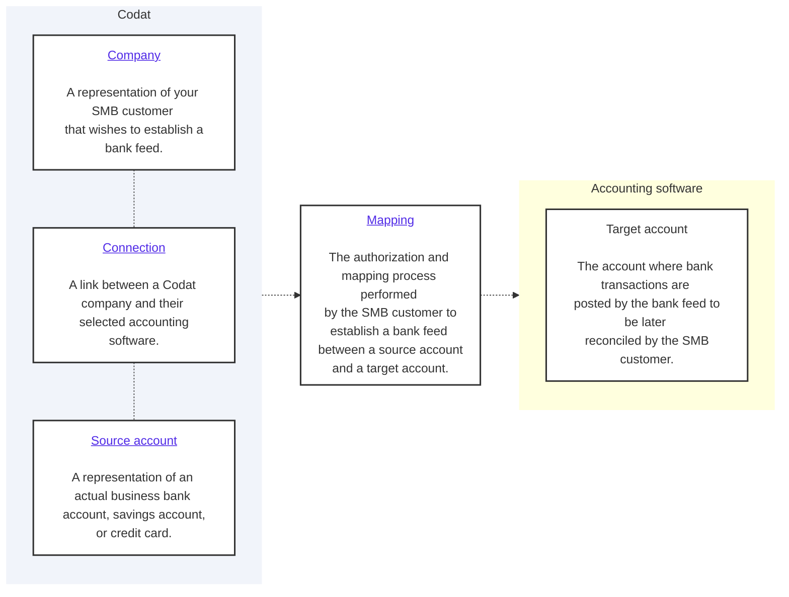

import Tabs from "@theme/Tabs";
import TabItem from "@theme/TabItem"

## Overview

When implementing your bank feed solution, you need to create your customer as a [company](../terms/company) in Codat before registering their accounting platform as a connection and creating a source account to represent the company's actual bank account.

You can see how these elements fit together and where they sit in the overall bank feeds process on the diagram below.



:::tip Authorize your API calls

Remember to [authenticate](/using-the-api/authentication) when making calls to our API. Navigate to **Developers > API keys** in the Portal to pick up your authorization header.

:::

## Create a company

Within Bank Feeds API, a company represents your SMB customer that wishes to export their transactions from your application to their accounting software. 

To create it, use our [Create company](/bank-feeds-api#/operations/create-company) endpoint. It returns a JSON response containing the company `id`. You will use this `id` to establish a connection to an accounting platform. 

<Tabs>

<TabItem value="HTTP" label="HTTP">

#### Request

```json
POST /companies

{
    "name": "{CompanyName}"
}
```

#### Response

```json
{
    "id": "77921ff9-2491-4dfe-b23b-ff28f3e31e4f",
    "name": "Sawayn Group",
    "platform": "",
    "redirect": "https://link.codat.io/company/77921ff9-2491-4dfe-b23b-ff28f3e31e4f",
    "dataConnections": [],
    "created": "2023-09-06T09:13:35.8188152Z"
}
```

</TabItem >

</Tabs>

## Create a connection

Next, use the [Create connection](/bank-feeds-api#/operations/create-connection) endpoint to connect the company to an accounting data source via one of our integrations. This will allow you to synchronize data with that source. 

In the request body, specify a `platformKey` of the accounting platform you're looking to connect.

| Accounting platform | platformKey |
| ---  | ---  |
| Quickbooks Online Bankfeeds | `hcws` |
| Xero | `gbol` |
| FreeAgent | `fbrh` |
| Sage Bank Feeds | `olpr` |

As an example, let's create a QuickBooks Online (QBO) connection. In response, the endpoint returns a `dataConnection` object with a `PendingAuth` status and a `linkUrl`. Direct your customer to the `linkUrl` to initiate our [Link auth flow](/auth-flow/overview) and enable them to authorize this connection.

<Tabs>

<TabItem value="HTTP" label="HTTP">

#### Request

```json

POST /companies/{companyId}/connections
{
    "platformKey": "hcws"
}

```

#### Response

```json
 {
  "id": "7baba7cc-4ae0-48fd-a617-98d55a6fc008",
  "integrationId": "6b113e06-e818-45d7-977b-8e6bb3d01269",
  "sourceId": "56e6575a-3f1f-4918-b009-f7535555f0d6",
  "platformName": "QuickBooks Online Bank Feeds",
  "linkUrl": "https://link-api.codat.io/companies/COMPANY_ID/connections/CONNECTION_ID/start?otp=742271", 
  "status": "PendingAuth",
  "created": "2022-09-01T10:21:57.0807447Z",
  "sourceType": "BankFeed"
}
```
</TabItem >

</Tabs>

:::info One-time password for QBO

For QBO, the `linkUrl` contains a one-time password (OTP) that expires after one hour. If the OTP has expired, your customer will receive a `401` error when loading the page. Generate a new OTP by sending a `GET` request:
```
GET /companies/{companyId}/connections/{connectionId}
```
:::

### Deauthorize a connection

If your customer wants to revoke their approval and sever the connection to their accounting package, use the [Unlink connection](/bank-feeds-api#/operations/unlink-connection) endpoint.

```json
PATCH /companies/:companyId/connections/{connectionId}
 {
 "status": "Unlinked"
 }
```

## Create a source account

Finally, create a source account using our [Create source account](/bank-feeds-api#/operations/create-source-account) endpoint. It represents the company's actual financial account, savings account or credit card within Codat. We categorize accounts as a credit or a debit account type for standardization. 

As an example, let's create a debit account. If the source account passes validation, you will receive a **synchronous response** with a `200` status code indicating a successful operation.

:::note UK-specific requirements

For bank accounts in GBP, `sortCode` is also a required field. 

:::

<Tabs>

<TabItem value="HTTP" label="HTTP">

#### Request

```json 
POST /companies/{companyId}/connections/{connectionId}/connectionInfo/bankFeedAccounts
{
  "id": "ac-001",
  "accountName": "Checking Account",
  "accountType": "Debit",
  "accountNumber": "12345670",
  "currency": "GBP",
  "balance": 4002
}
```
#### Response

```json
{
  "id": "a3f28138-e2b9-4daa-92e1-5a99fb29ac42",
  "accountName": "Checking Account",
  "accountType": "Debit",
  "accountNumber": "12345670",
  "currency": "GBP",
  "balance": 4002.00,
  "status": "pending",
  "modifiedDate": "2023-09-06T09:13:40.2266667"
}   
```
</TabItem >

</Tabs>

Once the source account is successfully created, guide your customer through the **mapping process** to associate it with a corresponding target account in their accounting software. The account will stay in a `pending` status until that happens, and it must change to `linked` before you can successfully transmit any bank transactions.

### Multi-currency accounts

You can create multiple accounts in different currencies using the same [Create source account](/bank-feeds-api#/operations/create-source-account) endpoint for the company and the connection. If the user has not enabled multi-currency in their accounting software, you will receive an error message which you can display to the user.

### Update a source account

You may need to modify a source account before the mapping is finalized. For example, your customer might want a bank account name to appear in their accounting software. To do that, use the [Update source account](/bank-feeds-api#/operations/update-source-account) endpoint.

<Tabs>

<TabItem value="HTTP" label="HTTP">

```json
PUT /companies/{companyId}/connections/{connectionId}/connectionInfo/bankFeedAccounts/{accountId}

{
  "id": "ac-001",
  "accountName": "Bank of X Checking Account",
  "accountType": "Debit",
  "accountNumber": "12345670",
  "currency": "GBP",
  "balance": 4002
}
```
</TabItem >

</Tabs>

### Remove a source account

If your customer decides to close their account, you can also remove it from Codat using the [Delete source account](/bank-feeds-api#/operations/delete-source-account) endpoint. This will not delete the account from your customer's accounting software, but it will disable the bank feed, preventing any new transactions from appearing.

<Tabs>

<TabItem value="HTTP" label="HTTP">

```json
DELETE /companies/{companyId}/connections/{connectionId}/connectionInfo/bankFeedAccounts/{accountId}
```
</TabItem >

</Tabs>

:::tip Recap

You have created the structure of key objects required by Codat's Bank Feeds API: a company, its connection to an accounting data source, and a source account. 

Next, provide your customer with a **mapping** process interface so they can associate the source account with a target account in their accounting software.
:::

---

## Read next

* Enable your customer to map accounts to their accounting platform via a [mapping UI](/bank-feeds/mapping-overview).

