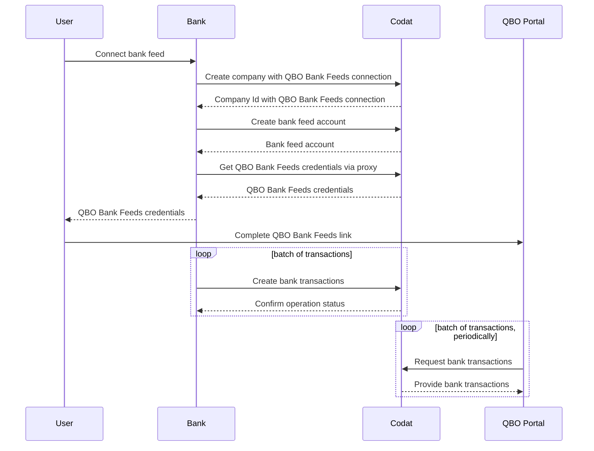

import Tabs from '@theme/Tabs';
import TabItem from '@theme/TabItem';

:::info Integrations and languages

This tutorial focuses on reconciling bank feeds with QuickBooks Online (QBO), and uses our Bank Feeds client library. The Bank Feeds library is available in [C#](https://github.com/codatio/client-sdk-csharp/tree/main/bank-feeds), [TypeScript](https://github.com/codatio/client-sdk-typescript/tree/main/bank-feeds), [Python](https://github.com/codatio/client-sdk-python/tree/main/bank-feeds) and [Go](https://github.com/codatio/client-sdk-go/tree/main/bank-feeds).

:::

## Summary

🎯 Our QuickBooks Online Bank Feeds integration makes it possible for your customers to connect bank accounts from your application to QBO. See how you can support your users by syncing their bank transaction data to QBO Bank Feeds, ensuring the records match each other. 

⏳ Estimated time to review: 10-15 minutes

## Why reconcile bank transactions

Traditionally, bank reconciliation is done by comparing a bank statement to the ledger entries. However, outdated methods like manual data processing and
screen scraping no longer satisfy SMBs' demand for efficient, effortless processes.

Help your SMB customers sync their bank statements digitally to their accounting software and automatically reconcile transactions, therefore removing manual effort, reducing potential for errors, and facilitating transaction matching.

This saves your customers time and gives them the context they need to properly analyze and optimize their spend.

## Solution overview

We have done the heavy lifting for you by building bank feeds integrations with a standardized data model to the accounting platforms your customers already use. This gives you access to real-time data that you can fetch, create, or update to support your customers. In this tutorial, we focus on our QuickBooks Online Bank Feeds integration. 

:::tip Prerequisites

1. Make sure you have enabled the QuickBooks Online Bank Feeds integration. You can do that in the [Codat Portal](https://app.codat.io/settings/integrations/bankfeeds), or [read more](/integrations/bank-feeds/qbo-bank-feeds/qbo-bank-feeds-setup) for detailed instructions.

2. Intuit must have approved your company to appear in the QuickBooks Online bank selection screen. Submit a request to Codat so that we can organize this with Intuit on your behalf. 

We also expect that your application has a UI that your SMB users interact with.

:::

### Preparation

Use our SDKs to easily implement the bank feeds solution in your app. We strongly recommend utilizing our SDKs to make your build simple to implement and easy to maintain. 

First, install the client library: 

<Tabs>

<TabItem value="csharp" label="C#">

```bash
    dotnet add package Codat.BankFeeds
```
</TabItem>

<TabItem value="nodejs" label="TypeScript">

```bash
    npm add @codat/platform
```
or
```bash
    yarn add @codat/platform
```
</TabItem>

<TabItem value="python" label="Python">

```bash
    pip install codat-bank-feeds
```
</TabItem>

<TabItem value="go" label="Go">

```bash
    go get github.com/codatio/client-sdk-go/bank-feeds
```
</TabItem>

</Tabs>


Next, import the package and add your Base64 encoded API key within an authorization header. You can copy your authorization header in the [Developers](https://app.codat.io/developers/api-keys) section of the Codat Portal. In our example, we chose to call the client library `bank_feeds_client`.

<Tabs>

<TabItem value="csharp" label="C#">

```c#
using Codat.BankFeeds;
using CodatPlatform.Models.Shared;

var bankFeedsClient = new CodatBankFeedsSDK(
    security: new Security() {
        AuthHeader = "Basic BASE_64_ENCODED(API_KEY)",
    }
);
```
</TabItem>

<TabItem value="nodejs" label="TypeScript">

```javascript
import { CodatBankFeeds } from "@codat/bank-feeds";

const bankFeedsClient = new CodatBankFeeds({
  security: {
    authHeader: "Basic BASE_64_ENCODED(API_KEY)",
  },
});
```
</TabItem>

<TabItem value="python" label="Python">

```python
import codatbankfeeds
from codatbankfeeds.models import operations, shared

bank_feeds_client = codatbankfeeds.CodatBankFeeds(
    security=shared.Security(
        auth_header="Basic BASE_64_ENCODED(API_KEY)",
    ),
)
```
</TabItem>

<TabItem value="go" label="Go">

```go
package main

import(
	"github.com/codatio/client-sdk-go/bank-feeds"
	"github.com/codatio/client-sdk-go/bank-feeds/pkg/models/shared"
)

func main() {
    bankFeedsClient := codatbankfeeds.New(
        codatbankfeeds.WithSecurity(shared.Security{
            AuthHeader: "Basic BASE_64_ENCODED(API_KEY)",
        }),
    )
}
```
</TabItem>

</Tabs>

### Bank feeds process flow



## Solution walkthrough

Provide your users with a link or a button in your app so they can trigger the connection of their bank accounts to QBO Bank Feeds. Use an appropriate call-to-action, such as _Connect account to QuickBooks_.

When an SMB user clicks the button or link you added, initiate the process described below to create a Codat company with a QBO Bank Feeds connection and provide opportunity to authorize that connection.

### Create a company with a QBO Bank Feeds connection

Use our [Create company](/bank-feeds-api#/operations/create-company) endpoint to trigger company creation, which will represent your SMB customer in Codat. In response, you will receive a company Id, which is required by subsequent endpoints.

<Tabs>

<TabItem value="csharp" label="C#">

```c#
var companyCreatedRes = await bankFeedsClient.Companies.CreateAsync(new CompanyRequestBody() {
    Name = "Elaborate Events, Inc",
  });

if(companyCreatedRes.Company != null) {
    var company = companyCreatedRes.Company;
    logger.LogInformation('{CompanyId} {CompanyName}', company.Id, company.Name);
}
```
</TabItem>

<TabItem value="nodejs" label="TypeScript">

```javascript
bankFeedsClient.companies.create({
    name: "Elaborate Events, Inc",
}).then((companyCreatedRes: CreateCompanyResponse) => {
    if (companyCreatedRes.statusCode == 200) {
        console.log(companyCreatedRes.company.id, companyCreatedRes.company.name)
    }
});
```
</TabItem>

<TabItem value="python" label="Python">

```python
req = shared.CompanyRequestBody(
    name='Elaborate Events, Inc'
    )

company_created_res = bank_feeds_client.companies.create(req)
print(company_created_res.company.id, company_created_res.company.name)
```
</TabItem>

<TabItem value="go" label="Go">

```go
ctx := context.Background()

companyCreatedRes, err := bankFeedsClient.Companies.Create(ctx, shared.CompanyRequestBody{
    Name: "Elaborate Events, Inc",
})

if err != nil {
    log.Fatal(err)
}

if companyCreatedRes.Company != nil {
    fmt.Println("%s %s", companyCreatedRes.Company.Id, companyCreatedRes.Company.Name)
}
```
</TabItem>

</Tabs>

Next, call the [Create connection](/bank-feeds-api#/operations/create-connection) endpoint to establish a data link to QBO Bank Feeds for the company. We pass the response from the previous endpoint in the request, and also include the platform key, which for QBO Bank Feeds is `hcws`.

<Tabs>

<TabItem value="csharp" label="C#">

```c#
var connectionCreatedRes = await bankFeedsClient.Connections.CreateAsync(new CreateConnectionRequest() {
    RequestBody = new CreateConnectionRequestBody() {
        PlatformKey = "hcws", // Codat's platform key for QBO Bank Feeds
    },
    CompanyId = companyCreatedRes.Company.Id,
});
```
</TabItem>

<TabItem value="nodejs" label="TypeScript">

```javascript
bankFeedsClient.connections.create({
  requestBody: {
    platformKey: "hcws", // Codat's platform key for QBO Bank Feeds
  },
  companyId: companyCreatedRes.company.id,
}).then((connectionCreatedRes: CreateConnectionResponse) => {
  if (connectionCreatedRes.statusCode == 200) {
    // handle response
  }
});
```
</TabItem>

<TabItem value="python" label="Python">

```python
req = operations.CreateConnectionRequest(
    request_body=operations.CreateConnectionRequestBody(
        platform_key='hcws', # Codat's platform key for QBO Bank Feeds
    ),
    company_id=company_created_res.company.id,
)

connection_created_res = bank_feeds_client.connections.create(req)
```
</TabItem>

<TabItem value="go" label="Go">

```go
ctx := context.Background()
connectionCreatedRes, err := bankFeedsClient.Connections.Create(ctx, operations.CreateConnectionRequest{
    RequestBody: &operations.CreateConnectionRequestBody{
        PlatformKey: codatbankfeeds.String("hcws"), // Codat's platform key for QBO Bank Feeds
    },
    CompanyID: companyCreatedRes.Company.ID,
})
```
</TabItem>

</Tabs>

### Create bank feeds bank accounts

Now, use the [Create source account](/bank-feeds-api#/operations/create-source-account) endpoint to add your SMB's source bank accounts to Codat. These are the accounts the SMB user will be able to connect to QBO Bank Feeds. In the response, you will receive the source account created in the connected platform.

<Tabs>

<TabItem value="csharp" label="C#">

```c#
var accountCreatedRes = await bankFeedsClient.SourceAccounts.CreateAsync(new CreateSourceAccountRequest() {
    SourceAccount = new SourceAccount() {
        AccountName = "Account 002",
        AccountNumber = "12345670",
        AccountType = "Debit",
        Balance = 6531.4,
        Currency = "GBP",
        SortCode = "123456",
    },
    CompanyId = companyCreatedRes.Company.Id,
    ConnectionId = connectionCreatedRes.Connection.Id,
});
```
</TabItem>

<TabItem value="nodejs" label="TypeScript">

```javascript
bankFeedsClient.sourceAccounts.create({
  sourceAccount: {
    accountName: "Account 002",
    accountNumber: "12345670",
    accountType: "Debit",
    balance: 6531.4,
    currency: "GBP",
    sortCode: "123456",
  },
  companyId: companyCreatedRes.company.id,
  connectionId: connectionCreatedRes.connection.id,
}).then((accountCreatedRes: CreateSourceAccountResponse) => {
  if (accountCreatedRes.statusCode == 200) {
    // handle response
  }

```
</TabItem>

<TabItem value="python" label="Python">

```python
account_create_req = operations.CreateSourceAccountRequest(
    source_account=shared.SourceAccount(
        account_name='Account 002',
        account_number='12345670',
        account_type='Debit',
        balance=6531.4,
        currency='GBP',
        sort_code='123456',
    ),
    company_id=company_created_res.company.id,
    connection_id=connection_created_res.connection.id
)

account_created_res = bank_feeds_client.source_accounts.create(account_create_req)
```
</TabItem>

<TabItem value="go" label="Go">

```go
ctx := context.Background()
accountCreatedRes, err := bankFeedsClient.SourceAccounts.Create(ctx, operations.CreateSourceAccountRequest{
        SourceAccount: &shared.SourceAccount{
            AccountName: codatbankfeeds.String("Account 002"),
            AccountNumber: codatbankfeeds.String("12345670"),
            AccountType: codatbankfeeds.String("Debit"),
            Balance: codatbankfeeds.Float64(6531.4),
            Currency: codatbankfeeds.String("GBP"),
            SortCode: codatbankfeeds.String("123456"),
        },
    CompanyID: companyCreatedRes.Company.ID,
    ConnectionID: connectionCreatedRes.Connection.ID,
})
```
</TabItem>

</Tabs>

### Authorize the connection

Finally, use our [Generate source account credentials](/bank-feeds-api#/operations/generate-credentials) endpoint to authorize the previously created data connection. Embed the call to this endpoint in the UI flow the user triggered when choosing to link their bank accounts. 

In response, you will receive login credentials that your user needs to enter in QBO Banking to link a bank account. Share them with the user, and consider providing instructions on steps to take in QBO. For example, this is how we manage it in our QBO Link flow:


<Tabs>

<TabItem value="csharp" label="C#">

```c#
var credentialsRes = await bankFeedsClient.SourceAccounts.GenerateCredentialsAsync(new GenerateCredentialsRequest() {
    CompanyId = companyCreatedRes.Company.Id,
    ConnectionId = connectionCreatedRes.Connection.Id,
});

var companyCredentials = credentialsRes.BankAccountCredentials;
logger.LogInformation("{Username} {Password}", companyCredentials.Username, companyCredentials.Password);
```
</TabItem>

<TabItem value="nodejs" label="TypeScript">

```javascript
bankFeedsClient.sourceAccounts.generateCredentials({
  companyId: companyCreatedRes.company.id,
  connectionId: connectionCreatedRes.connection.id,
}).then((credentialsRes: GenerateCredentialsResponse) => {
  if (credentialsRes.statusCode == 200) {
    const companyCredentials = credentialsRes.BankAccountCredentials;
    console.log(companyCredentials.username, companyCredentials.password)
  }
});

```
</TabItem>

<TabItem value="python" label="Python">

```python
credentials_res = bank_feeds_client.source_accounts.generate_credentials(
    operations.GenerateCredentialsRequest(
        company_id=company_created_res.company.id,
        connection_id=connection_created_res.connection.id
    ))
    
company_credentials = credentials_res.bank_account_credentials
print(company_credentials.username, company_credentials.password)
```
</TabItem>

<TabItem value="go" label="Go">

```go
ctx := context.Background()
credentialsRes, err := bankFeedsClient.SourceAccounts.GenerateCredentials(ctx, operations.GenerateCredentialsRequest{
    CompanyID: companyCreatedRes.Company.ID,
    ConnectionID: connectionCreatedRes.Connection.ID,
})

if err != nil {
    log.Fatal(err)
}

if credentialsRes.BankAccountCredentials != nil {
    // handle response
    companyCredentials := credentialsRes.BankAccountCredentials
    fmt.Println("%s %s", companyCredentials.Username, companyCredentials.Password)
}
```
</TabItem>

</Tabs>

When completing the authorization in QBO Banking, your user chooses the bank accounts they want to connect. At the same time, they also choose a `feed_start_date` value that is then used to limit the load of historic transactions to seven days.

Once this is complete, you can sync transactions between the bank and Codat. QBO will then poll Codat periodically to pull these transactions to their bank feed.

### Sync bank feeds bank transactions

:::tip Bank transactions guidelines

- You can push historic (back-dated) transactions that are up to seven days old based on the `feed_start_date`, as chosen by the SMB user in the QBO UI.
- Syncing future-dated transactions to QBO is not supported.
- You can only sync bank transactions from one connected account at a time.
- Bank transactions must be synced in chronological order (from earliest to latest) based on the `cleared_on_date`.
- Bank transactions can't be older than the most recent transaction available on the destination bank account.
- Up to 1000 bank transactions can be synced at a time.

:::

Use the [Create bank transactions](/bank-feeds-api#/operations/create-bank-transactions) endpoint to post your SMB user's bank transactions to Codat. 

Because of the way bank transactions work, we recommend you post seven days of transactions on the initial sync. For subsequent syncs, we recommend you post daily transaction data. 

<Tabs>

<TabItem value="csharp" label="C#">

```c#
var res = await bankFeedsClient.Transactions.CreateAsync(new CreateBankTransactionsRequest() {
    CreateBankTransactions = new CreateBankTransactions() {
        AccountId = accountCreatedRes.Account.Id,
        Transactions = new List<CreateBankTransaction>() {
            new CreateBankTransaction() {
                Amount=2088.76M,
                Date="2022-10-23T00:00:00.000Z",
                Description="HSBC Covent Grdn ATM W",
                Id = "fa946773-9251-4aa5-ac3f-5ad019da1ffe",
            },
            new CreateBankTransaction() {
                Amount=4686.51M,
                Date="2022-10-23T00:00:00.000Z",
                Description="Forbes subscription",
                Id = "097b0074-f154-471b-9e6e-13b99d488e1e",
            },
            new CreateBankTransaction() {
                Amount=5759.47M,
                Date="2022-10-23T00:00:00.000Z",
                Description="Wholesale Balloons, Ltd",
                Id = "450ad2ab-d442-4698-82d5-02a94bb4f63c",
            },
        },
    },
    AccountId = accountCreatedRes.Account.Id,
    CompanyId = companyCreatedRes.Company.Id,
    ConnectionId = connectionCreatedRes.Connection.Id,
});


```
</TabItem>

<TabItem value="nodejs" label="TypeScript">

```javascript
bankFeedsClient.transactions.create({
  createBankTransactions: {
    accountId: accountCreatedRes.account.id,
    transactions: [
        {
            amount: 2088.76,
            date: "2022-10-23T00:00:00.000Z",
            description: "HSBC Covent Grdn ATM W",
            id: "fa946773-9251-4aa5-ac3f-5ad019da1ffe",
        },
        {
            amount: 4686.51,
            date: "2022-10-23T00:00:00.000Z",
            description: "Forbes subscription",
            id: "097b0074-f154-471b-9e6e-13b99d488e1e",
        },
        {
            amount: 5759.47,
            date: "2022-10-23T00:00:00.000Z",
            description: "Wholesale Balloons, Ltd",
            id: "450ad2ab-d442-4698-82d5-02a94bb4f63c",
        },
    ],
  },
  accountId: accountCreatedRes.account.id,
  companyId: companyCreatedRes.company.id,
  connectionId: connectionCreatedRes.connection.id,
}).then((res: CreateBankTransactionsResponse) => {
  if (res.statusCode == 200) {
    // handle response
  }
});
```
</TabItem>

<TabItem value="python" label="Python">

```python
req = operations.CreateBankTransactionsRequest(
    create_bank_transactions=shared.CreateBankTransactions(
        account_id=account_created_res.account.id,
        transactions=[
            shared.CreateBankTransaction(
                amount=2088.76,
                date_='2022-10-23T00:00:00.000Z',
                description='HSBC Covent Grdn ATM W',
                id='fa946773-9251-4aa5-ac3f-5ad019da1ffe',
            ),
            shared.CreateBankTransaction(
                amount=4686.51,
                date_='2022-10-23T00:00:00.000Z',
                description='Forbes subscription',
                id='097b0074-f154-471b-9e6e-13b99d488e1e',
            ),
            shared.CreateBankTransaction(
                amount=5759.47,
                date_='2022-10-23T00:00:00.000Z',
                description='Wholesale Balloons, Ltd',
                id='450ad2ab-d442-4698-82d5-02a94bb4f63c',
            ),
        ],
    ),
    account_id=account_created_res.account.id,
    company_id=company_created_res.company.id,
    connection_id=connection_created_res.connection.id
)

res = bank_feeds_client.transactions.create(req)
```
</TabItem>

<TabItem value="go" label="Go">

```go
ctx := context.Background()
res, err := bankFeedsClient.Transactions.Create(ctx, operations.CreateBankTransactionsRequest{
    CreateBankTransactions: &shared.CreateBankTransactions{
        AccountID: accountCreatedRes.Account.ID,
        Transactions: []shared.CreateBankTransaction{
            shared.CreateBankTransaction() {
                Amount: codatbankfeeds.Float64(2088.76M),
                Date: codatbankfeeds.String("2022-10-23T00:00:00.000Z"),
                Description: codatbankfeeds.String("HSBC Covent Grdn ATM W"),
                Id: codatbankfeeds.String("fa946773-9251-4aa5-ac3f-5ad019da1ffe"),
            },
            shared.CreateBankTransaction() {
                Amount: codatbankfeeds.Float64(4686.51M),
                Date: codatbankfeeds.String("2022-10-23T00:00:00.000Z"),
                Description: codatbankfeeds.String("Forbes subscription"),
                Id: codatbankfeeds.String("097b0074-f154-471b-9e6e-13b99d488e1e"),
            },
            shared.CreateBankTransaction() {
                Amount: codatbankfeeds.Float64(5759.47M),
                Date: codatbankfeeds.String("2022-10-23T00:00:00.000Z"),
                Description: codatbankfeeds.String("Wholesale Balloons, Ltd"),
                Id: codatbankfeeds.String("450ad2ab-d442-4698-82d5-02a94bb4f63c"),
            },
        },
    },
    AccountID: accountCreatedRes.Account.ID,
    CompanyID:companyCreatedRes.Company.ID,
    ConnectionID: connectionCreatedRes.Connection.ID,
})
```
</TabItem>

</Tabs>

Repeat the request for the remainder of the SMB user's source bank accounts. Keep the bank transactions in Codat up to date, as QBO polls Codat periodically to pull these transactions to their bank feeds. 

:::tip Recap

That's it - you have followed Codat's bank transactions reconciliation process flow and understood how to implement it in code. You can now use this tutorial as a basis for your application.

:::

---

## Read next

* Expand your coverage of bank feeds to [Xero](/integrations/bank-feeds/xero-bank-feeds/) and [Sage](/integrations/bank-feeds/sage-bank-feeds/)
* Learn more about how Codat can automate your lending solutions on the examples of [loan qualification](/lending/guides/invoice-finance/introduction) and [invoice financing](/lending/guides/invoice-finance/introduction)
