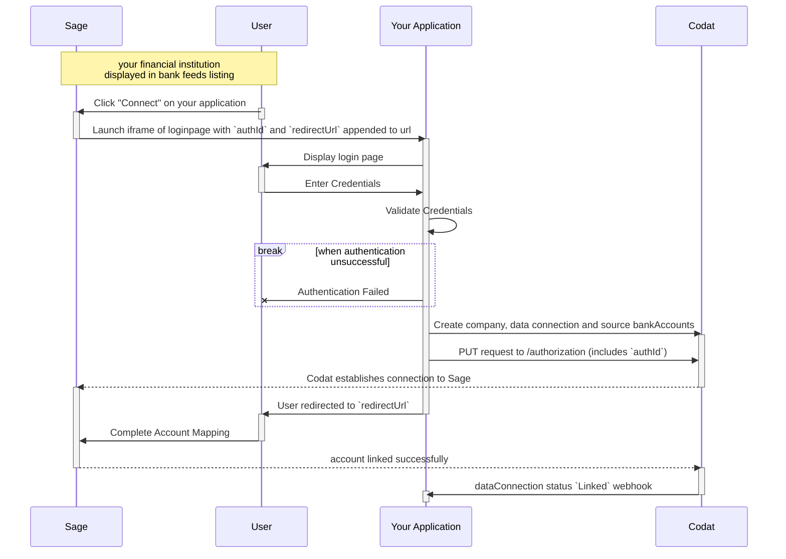

import Tabs from "@theme/Tabs";
import TabItem from "@theme/TabItem";
import Loom from '@components/global/Loom'

# Sage Bank Feeds Mapping

<Loom source="https://www.loom.com/embed/48972835b6e74d199448b794f41b9997" />

<br/>

Our [Sage Bank Feeds](/integrations/bank-feeds/Sage-bank-feeds/) integration requires an authorization UI to authenticate an SMB user prior to creating source accounts within Codat.

## Process

The process for mapping a source account with Sage Bank Feeds begins within Sage. From there, users are directed to a [hosted login page](/bank-feeds/mapping/Sage-mapping#hosted-login-page) where they should enter their credentials, and you should verify their identity. 

Upon successful authentication, you should then create the [company, dataConnection, and source accounts](/bank-feeds/setup) within Codat. Once Sage verifies these details, the bank feed for your company will become active.



## Sage Redirect
When your customer attempts to establish their bankfeed from Sage, they will be redirected to your hosted page through a link that is constructed as follows:

   ```http
   https://{authorizationRedirectUrl}?authorizationId={authId}&redirectUri={redirectUri}
   ```

   1. The `authorizationRedirectUrl` is the web app URL that you configured in the Codat Portal for the Sage Bank Feeds integration.
   2. The `authId` is the unique authorization identifier for the company, this will be supplied by Sage and will be required when creating the dataconnection.
   3. The `redirectUri` is the URI the SMB user will be redirected to after authentication through your web app, this will also be supplied by Sage.


## Hosted login page
### Company verification
To ensure a seamless identity verification experience for the company when they land on your hosted login page, your interface should accomplish the following tasks:

- **Parameter Retrieval:** Capture the `authId` and `redirectUri` parameters that Sage provides when it redirects users to your hosted page.
  
- **iframe Compatibility:** Given that your page will appear in an iframe within Sage's platform, include a "Content-Security-Policy" header set to `frame-ancestors 'self' https://*.Sagebankdrive.com https://*.Sage.com https://*.intacct.com https://*.Sageone.com` to make sure it functions properly within the Sage iframe.

- **User Verification:** Implement a form on the interface that can securely validate the credentials entered, thereby verifying the identity of your user.

- **Post-Authentication Redirect:** Once the user successfully authenticates, redirect them to the `redirectUri` initially provided by Sage.


### Connecting the company 

Once you have verified who the Company is, you should then create the company, dataConnection and source accounts in Codat, you can follow the same steps outlined in [setup](/bank-feeds/setup).

For Sage bank feeds, an extra step is required to authorize the connection. This involves utilizing the `authId` provided by Sage, which can be included in an update request to the dataconnection.

<Tabs>

<TabItem value="request-url" label="Request Url">

authorize data connection request url

```http
PUT company/{companyId}/connections/{connectionId}/authorization
```
</TabItem >

<TabItem value="request-body" label="Request Body">

sample request body:

```json
{
    "authorizationId": "ae6b6e5d-4634-4087-80e3-b04ecafb0cf7"
}
```

</TabItem >

</Tabs>

If your request responds with a `200` response status code, the next step is to redirect the company to the given `redirectUri`, appending the `authId` as a query parameter.

```
{redirectUri}?state={authId}

// example:

redirect_uri=https://snd01eu.Sagebankdrive.com/api/v1/indirectredirect/11111-22222-33333-88888-9999?state=1122-3344-5566-7788
```

### Establishing the bank feed

Once the connection is successfully set up, Sage will show a dialog box featuring a list of available source bank accounts that can be linked to initiate bank feeds.

For example:


The dataConnection status will then change to linked, and which point you will be able to [push bankTransactions](/bank-feeds/pushing-transactions).


---
## Read next

[Pushing transactions](/bank-feeds/pushing-transactions).