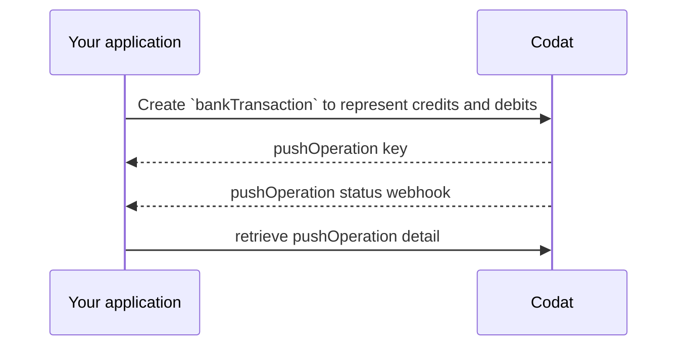

import Tabs from "@theme/Tabs";
import TabItem from "@theme/TabItem"

# Bank transactions
Once a company has mapped their source account to a target account, you can begin pushing transactions to their bankfeed.

## Generate bankTransactions object

Before you can record the companies bankTransactions in their accounting platform, you'll need to generate a `transactions` object for each transaction that has been made from their account.

The bankTransaction object must **only contain transactions that have cleared** and should not include any pending or upcoming transactions.

At the top level of the bankTransactions object, you should include the `sourceAccount` id of for the transactions to be associated with. 

Each transaction within the `transactions` array should include the following:
- `id` this is a string and should be your unique identifier for a given transaction.
- `amount` the amount of the transaction, if its spending money (`Debit`) then the signage should be negative (e.g. -42.00).
- `balance` the balance of the account in the given currency after the given transaction, **often platforms use this to represent the balance of the account.**
- `date` the date the transaction took place, all transactions in the object should be ordered oldest to newest.
- `description` a short description of the transaction, this could include details such as the merchant or the exchange rate if its in a foreign currency.
- `transactionType` supports `Debit` to show money leaving the account and `Credit` to represent money coming into the account.

:::caution Transaction Signs
Make sure the transaction `amount` signs align with the `transactionType`. Codat issues a warning for inconsistencies, such as a `Debit` transaction with a positive amount.
:::

## Push bank transactions

Steps:
- [Creating bankTransactions](pushing-transactions#creating-banktransactions)
- [Monitoring the status of the request](pushing-transactions#monitoring-the-status-of-the-request)



### Create bankTransactions

Regularly uploading transactions throughout the day ensures that your customers' bank feed balances are close to real-time. This enhanced accuracy aids companies with increased accuracy for their planning and forecasting.

<Tabs>

  <TabItem value="request-url" label="Request URL">

  Use the [create-bank-transactions](/bank-feeds-api#/operations/create-bank-transactions) endpoint

  ```http
  POST /companies/:companyId/connections/:connectionId/push/bankAccounts/:accountId/bankTransactions
  ```

  </TabItem>

  <TabItem value="request-body" label="Request Body">

  Sample request body with `debit` and `credit` transactions

```json
{
    "accountId": "sourceAccountId",
    "transactions": [
        {
            "id": "63e2b848-951a-4657-a889-ded00f0e616a",
            "amount": 100.0,
            "balance": 100.0,
            "date": "2023-08-22T10:21:00.000Z",
            "description": "Repayment of Credit Card",
            "transactionType": "Credit"
        },
        {
            "id": "710ed9f9-feb6-4ab7-9055-05a26d31718c",
            "amount": -100.0,
            "balance": 0.00,
            "date": "2023-08-22T10:22:00.000Z",
            "description": "Amazon US | $1.25 | PXDFGSDTR | c2dddf4c-eece-4a9b-a392-8c8e65b59e47",
            "transactionType": "Debit"
        },
        {
            "id": "d9b04a83-1fd7-4a5e-bd7d-8433828749f4",
            "amount": -60.0,
            "balance": -60.0,
            "date": "2023-08-22T10:23:00.000Z",
            "description": "Office Supplies from Office Mart",
            "transactionType": "Debit"
        },
        {
            "id": "f5e8f94c-5f72-4f64-aa26-344d1fbb3aa7",
            "amount": -17.54,
            "balance": -77.54,
            "date": "2023-08-22T10:24:00.000Z",
            "description": "Tech book from Amazon",
            "transactionType": "Debit"
        },
        {
            "id": "c3e59033-8aa1-4f11-8f08-46f5b0da3f2c",
            "amount": -180.0,
            "balance": -257.54,
            "date": "2023-08-22T10:25:00.000Z",
            "description": "Client Dinner from Fine Dining Restaurant",
            "transactionType": "Debit"
        },
        {
            "id": "9d1b4a39-5e89-47dd-8df7-02a2426658d4",
            "amount": -1200.0,
            "balance": -1457.54,
            "date": "2023-08-22T10:26:00.000Z",
            "description": "Marketing Campaign from Advertising Agency",
            "transactionType": "Debit"
        }
    ]
}
```

  </TabItem >

  <TabItem value="response" label="Response">

  Example response:

  ```json
{
    "changes": [
        {
            "type": "Created",
            "recordRef": {
                "dataType": "bankTransactions"
            }
        }
    ],
    "data": {
        "accountId": "a3f28138-e2b9-4daa-92e1-5a99fb29ac42",
        "transactions": [
            {
                "id": "63e2b848-951a-4657-a889-ded00f0e616a",
                "date": "2023-08-22T10:21:00Z",
                "description": "Repayment of Credit Card",
                "reconciled": false,
                "amount": 100.0,
                "balance": 100.0,
                "transactionType": "Credit"
            },
            {
                "id": "710ed9f9-feb6-4ab7-9055-05a26d31718c",
                "date": "2023-08-22T10:22:00Z",
                "description": "Amazon US | $1.25 | PXDFGSDTR | c2dddf4c-eece-4a9b-a392-8c8e65b59e47",
                "reconciled": false,
                "amount": -100.0,
                "balance": 0.0,
                "transactionType": "Debit"
            },
            {
                "id": "d9b04a83-1fd7-4a5e-bd7d-8433828749f4",
                "date": "2023-08-22T10:23:00Z",
                "description": "Office Supplies from Office Mart",
                "reconciled": false,
                "amount": -60.0,
                "balance": -60.0,
                "transactionType": "Debit"
            },
            {
                "id": "f5e8f94c-5f72-4f64-aa26-344d1fbb3aa7",
                "date": "2023-08-22T10:24:00Z",
                "description": "Tech book from Amazon",
                "reconciled": false,
                "amount": -17.54,
                "balance": -77.54,
                "transactionType": "Debit"
            },
            {
                "id": "c3e59033-8aa1-4f11-8f08-46f5b0da3f2c",
                "date": "2023-08-22T10:25:00Z",
                "description": "Client Dinner from Fine Dining Restaurant",
                "reconciled": false,
                "amount": -180.0,
                "balance": -257.54,
                "transactionType": "Debit"
            },
            {
                "id": "9d1b4a39-5e89-47dd-8df7-02a2426658d4",
                "date": "2023-08-22T10:26:00Z",
                "description": "Marketing Campaign from Advertising Agency",
                "reconciled": false,
                "amount": -1200.0,
                "balance": -1457.54,
                "transactionType": "Debit"
            }
        ]
    },
    "dataType": "bankTransactions",
    "companyId": "77921ff9-2491-4dfe-b23b-ff28f3e31e4f",
    "pushOperationKey": "af72f845-1e59-47b4-94ce-65feedc6f119",
    "dataConnectionKey": "0e47da62-c3c0-401b-a593-3543824d2a6d",
    "requestedOnUtc": "2023-09-12T12:58:39.5065472Z",
    "status": "Pending",
    "validation": {
        "errors": [],
        "warnings": []
    },
    "statusCode": 202
}
  ```

  </TabItem >

</Tabs>

When you make the request, you will receive a pushOperation response with a `Pending` status and `202` statusCode, the pushOperation object will include the following information:

- **pushOperationKey**: a unique idempotent identifier generated by Codat to represent this single pushOperation that can be used to track its status
- **dataType**: the type of data being created, in this case, `bankTransaction`
- **status**: the status of the create operation, which can be `Pending`, `Failed`, `Success` or `TimedOut` 
- **requestedOnUtc**: the datetime (in UTC) when the operation was requested 
- **completedOnUtc**: the datetime (in UTC) when the operaion was completed, null if `Pending`
- **validation**: a human-readable object that contains validation details, including errors, encountered during the operation.
- **changes**: an array that communicates which record has changed (`recordRef` property) and the manner in which it changed (`type` property that can be `Unknown`, `Created`, `Modified`, or `Deleted`)

:::caution QuickBooks Online Bank Feeds Syncing Info

Transactions pushed to QuickBooks Online bank feeds will show a 'Success' status once validated and saved by Codat. 

These transactions will only become available to the user in their accounting software after synchronization between QBO and Codat.

Users can manually sync from the QBO interface, and QBO will also automatically poll Codat daily for updates.

:::


### Monitor the status of the request
After your request has been accepted, it will have a status of `Pending`. You should use the [Push Operation Status Changed](../using-the-api/webhooks/core-rules-types#push-operation-status-has-changed) webhooks to track when the status of your pushOperation changes to `Success` or `Failed`.

If the request is successful, you will receive a webhook like this:

```json
{
 "CompanyId":"c2dddf4c-eece-4a9b-a392-8c8e65b59e47",
 "RuleId":"5a6f112d-b0fa-4c0b-9ea4-7dd4075bc43d",
 "Type":"Push Operation Status Changed",
 "AlertId":"a6bb69d5-631c-4732-8e4e-18bea36aea20",
 "Message":"bankTransactions triggered notification for PushOperationStatusChanged at 2023-09-12T18:19:42.742Z",
 "Data":{
    "dataType":"bankTransactions",
    "status":"Success",
    "pushOperationKey":"e881111f-b6a4-4740-b125-340a6c300cd3"
    }
}
```

If you want to see a history of all pushOperations for your company, you can retrieve these from the [list-push-operations](/bank-feeds-api#/operations/list-create-operations) endpoint.