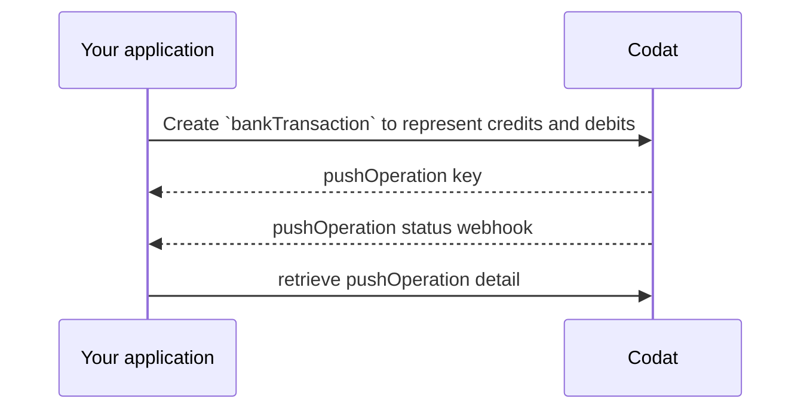

import Tabs from "@theme/Tabs";
import TabItem from "@theme/TabItem"

Once a company has mapped their source account to a target account, you can begin creating bank transactions in their accounting platform using the established [bank feed](../terms/bank-feed).

## Generate transactions

Before you can record your customer's bank transactions in their accounting platform, you need to generate a `transactions` object for each transaction that has been made from their account. 

Collect transaction data within your own application and map it to Codat's [Bank transactions](/bank-feeds-api#/schemas/BankTransactions) schema. Add this to [Create bank transactions](/bank-feeds-api#/schemas/CreateBankTransactions), including the `sourceAccount` id that the transactions should be associated with at the top level.  

:::caution Transaction signs
Make sure the transaction `amount` signs align with the `transactionType`. Codat issues a warning for inconsistencies, such as a `Debit` transaction with a positive amount.
:::

## Push bank transactions

In Codat, creating a bank transaction is a two-step process (learn more about it [here](/using-the-api/push)). It requires you to check the data model of the data type you want to create first to ensure all required properties are included in your request. 

Next, you are ready to create the bank transaction. You will receive `pushOperation` key in return. You can then use it to monitor the status of the operation, or display its results.



### Create bank transactions

We recommend regularly uploading transactions throughout the day so that your customers' bank feed balances are close to real-time. This enhanced accuracy helps companies with their planning and forecasting.

Use our [Create bank transactions](/bank-feeds-api#/operations/create-bank-transactions) to create bank transactions. In response, you will receive a `pushOperation` object with a `Pending` status.

<Tabs>

<TabItem value="HTTP" label="HTTP">

#### Request with `debit` and `credit` transactions

```json
POST /companies/{companyId}/connections/{connectionId}/push/bankAccounts/{accountId}/bankTransactions

{
    "accountId": "sourceAccountId",
    "transactions": [
        {
            "id": "63e2b848-951a-4657-a889-ded00f0e616a",
            "amount": 100.0,
            "balance": 100.0,
            "date": "2023-08-22T10:21:00.000Z",
            "description": "Repayment of Credit Card",
            "transactionType": "Credit"
        },
        {
            "id": "710ed9f9-feb6-4ab7-9055-05a26d31718c",
            "amount": -100.0,
            "balance": 0.00,
            "date": "2023-08-22T10:22:00.000Z",
            "description": "Amazon US | $1.25 | PXDFGSDTR | c2dddf4c-eece-4a9b-a392-8c8e65b59e47",
            "transactionType": "Debit"
        },
        {
            "id": "d9b04a83-1fd7-4a5e-bd7d-8433828749f4",
            "amount": -60.0,
            "balance": -60.0,
            "date": "2023-08-22T10:23:00.000Z",
            "description": "Office Supplies from Office Mart",
            "transactionType": "Debit"
        },
        {
            "id": "f5e8f94c-5f72-4f64-aa26-344d1fbb3aa7",
            "amount": -17.54,
            "balance": -77.54,
            "date": "2023-08-22T10:24:00.000Z",
            "description": "Tech book from Amazon",
            "transactionType": "Debit"
        },
        {
            "id": "c3e59033-8aa1-4f11-8f08-46f5b0da3f2c",
            "amount": -180.0,
            "balance": -257.54,
            "date": "2023-08-22T10:25:00.000Z",
            "description": "Client Dinner from Fine Dining Restaurant",
            "transactionType": "Debit"
        },
        {
            "id": "9d1b4a39-5e89-47dd-8df7-02a2426658d4",
            "amount": -1200.0,
            "balance": -1457.54,
            "date": "2023-08-22T10:26:00.000Z",
            "description": "Marketing Campaign from Advertising Agency",
            "transactionType": "Debit"
        }
    ]
}
```

#### Response

```json
{
    "changes": [
        {
            "type": "Created",
            "recordRef": {
                "dataType": "bankTransactions"
            }
        }
    ],
    "data": {
        "accountId": "a3f28138-e2b9-4daa-92e1-5a99fb29ac42",
        "transactions": [
            {
                "id": "63e2b848-951a-4657-a889-ded00f0e616a",
                "date": "2023-08-22T10:21:00Z",
                "description": "Repayment of Credit Card",
                "reconciled": false,
                "amount": 100.0,
                "balance": 100.0,
                "transactionType": "Credit"
            },
            {
                "id": "710ed9f9-feb6-4ab7-9055-05a26d31718c",
                "date": "2023-08-22T10:22:00Z",
                "description": "Amazon US | $1.25 | PXDFGSDTR | c2dddf4c-eece-4a9b-a392-8c8e65b59e47",
                "reconciled": false,
                "amount": -100.0,
                "balance": 0.0,
                "transactionType": "Debit"
            },
            {
                "id": "d9b04a83-1fd7-4a5e-bd7d-8433828749f4",
                "date": "2023-08-22T10:23:00Z",
                "description": "Office Supplies from Office Mart",
                "reconciled": false,
                "amount": -60.0,
                "balance": -60.0,
                "transactionType": "Debit"
            },
            {
                "id": "f5e8f94c-5f72-4f64-aa26-344d1fbb3aa7",
                "date": "2023-08-22T10:24:00Z",
                "description": "Tech book from Amazon",
                "reconciled": false,
                "amount": -17.54,
                "balance": -77.54,
                "transactionType": "Debit"
            },
            {
                "id": "c3e59033-8aa1-4f11-8f08-46f5b0da3f2c",
                "date": "2023-08-22T10:25:00Z",
                "description": "Client Dinner from Fine Dining Restaurant",
                "reconciled": false,
                "amount": -180.0,
                "balance": -257.54,
                "transactionType": "Debit"
            },
            {
                "id": "9d1b4a39-5e89-47dd-8df7-02a2426658d4",
                "date": "2023-08-22T10:26:00Z",
                "description": "Marketing Campaign from Advertising Agency",
                "reconciled": false,
                "amount": -1200.0,
                "balance": -1457.54,
                "transactionType": "Debit"
            }
        ]
    },
    "dataType": "bankTransactions",
    "companyId": "77921ff9-2491-4dfe-b23b-ff28f3e31e4f",
    "pushOperationKey": "af72f845-1e59-47b4-94ce-65feedc6f119",
    "dataConnectionKey": "0e47da62-c3c0-401b-a593-3543824d2a6d",
    "requestedOnUtc": "2023-09-12T12:58:39.5065472Z",
    "status": "Pending",
    "validation": {
        "errors": [],
        "warnings": []
    },
    "statusCode": 202
}
```
</TabItem >

</Tabs>

:::caution QuickBooks Online bank feeds syncing info

Transactions pushed to QuickBooks Online bank feeds will show a `Success` status when they validated and saved by Codat. However, they will only become available in their accounting software after synchronization between QBO and Codat.

QBO automatically polls Codat daily for updates, and users can also manually trigger that sync from the QBO interface.

:::


### Monitor request status

After you submit your request to create bank transactions to our API, it will have a status of `Pending`. Use the [Push Operation Status Changed](/bank-feeds/setup#webhooks) webhook to track when the status of your push operation changes to `Success` or `Failed`.

If the request is successful, you will receive a webhook like this:

```json
{
 "CompanyId":"c2dddf4c-eece-4a9b-a392-8c8e65b59e47",
 "RuleId":"5a6f112d-b0fa-4c0b-9ea4-7dd4075bc43d",
 "Type":"Push Operation Status Changed",
 "AlertId":"a6bb69d5-631c-4732-8e4e-18bea36aea20",
 "Message":"bankTransactions triggered notification for PushOperationStatusChanged at 2023-09-12T18:19:42.742Z",
 "Data":{
    "dataType":"bankTransactions",
    "status":"Success",
    "pushOperationKey":"e881111f-b6a4-4740-b125-340a6c300cd3"
    }
}
```

If you want to see a history of all push operations for a specific company, retrieve these by calling the [List create operations](/bank-feeds-api#/operations/list-create-operations) endpoint.
