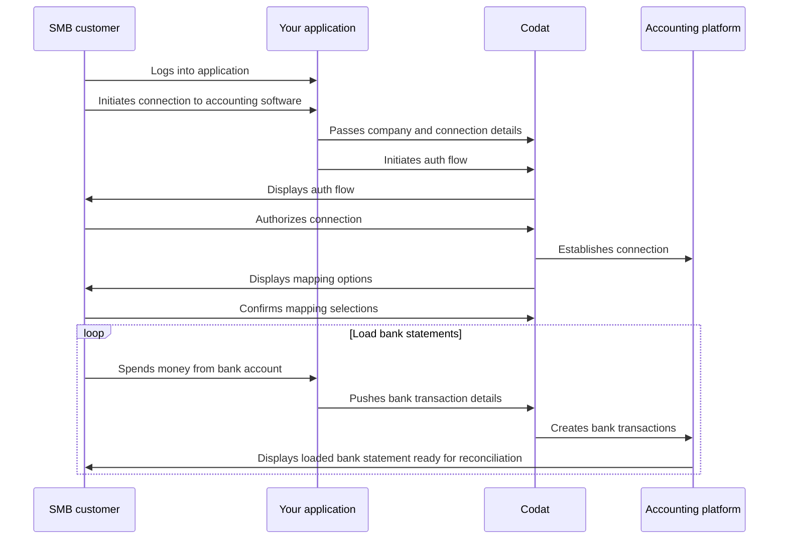

import Tabs from "@theme/Tabs";
import TabItem from "@theme/TabItem"
import {IntegrationsList} from '@components/global/Integrations'
import {bankfeedsExternalMappingIntegrations, bankfeedsIntegrations} from '@components/global/Integrations/integrations'

## Journey overview

The diagram below represents the overall activity flow when using Bank Feeds API, including your SMB customer and their accounting platform. It assumes you are using Codat's mapping interface to let the user select the accounts used for pushing bank statements.

If you are using one of the [other mapping UI options](/bank-feeds/mapping/overview), you can visualize the flow by simply changing the actor of the mapping operation from `Codat` to `Your application` or `Accounting platform`.



Once you decide to build this flow with Bank Feeds API, you need to configure Codat accordingly. Let's go through these requirements in detail.

## Enable Bank Feeds API

Reach out to your Codat account manager to enable Bank Feeds API for your client. 

## Manage data sources

In the <a href="https://app.codat.io" target="_blank">Codat Portal</a>, navigate to **Settings > Integrations** and click **Manage integrations**. Next, click **Manage** next to the specific integration you want to enable and set it up to serve as a data source for the product. 

<IntegrationsList integrations={bankfeedsIntegrations}/>

Some of these integrations require additional setup specific to bank feeds. We walk you through these in our integration-specific instructions in the _Manage integrations_ section of our Bank Feeds API documentation. 

## Authorization flow

As part of using Bank Feeds API, you will need your customers to authorize your access to their data. To do so, use [Link](/auth-flow/authorize-embedded-link) - our pre-built, embeddable, conversion-optimized, and white-labeled authorization flow. 

The solution lets you tailor the authorization journey to your business needs. You can:

* [Customize Link settings](/auth-flow/customize/customize-link).
* [Set up company branding](/auth-flow/customize/branding).
* [Set up redirects](/auth-flow/customize/set-up-redirects).

## Webhooks

Codat supports a range of [webhooks](/using-the-api/webhooks/core-rules-types) to help you manage your data pipelines. In the <a href="https://app.codat.io" target="_blank">Codat Portal</a>, navigate to **Settings > Webhooks > Rules** and click **Create new rule** to set up the following webhook and get the most out of Bank Feeds API:

- [Push operation status has changed](/using-the-api/webhooks/core-rules-types#push-operation-status-has-changed)  

  Use this webhook to track the completion of the operation to create bank transactions in the target platform. When you receive a notification from this webhook, check the `status` value in the body. A `Success` status means the `transactions` array has been successfully pushed to the accounting software. In case of errors, resolve the issue and resend the payload.


## Client libraries

Use our comprehensive [Bank Feeds API library](/get-started/libraries) to kick-start and simplify your build. 
Simply install the library in one of the supported languages and pass your base64-encoded API key to the constructor.

<Tabs>

<TabItem value="nodejs" label="TypeScript">

#### Install

##### NPM
```sh
npm add @codat/bank-feeds
```

##### Yarn
```sh
yarn add @codat/bank-feeds
```

#### Initialize

```javascript
import { CodatBankFeeds } from "@codat/bank-feeds";

const bankFeedsClient = new CodatBankFeeds({
        security: {
            authHeader: "Basic BASE_64_ENCODED(API_KEY)",
        },
    });
```

</TabItem>

<TabItem value="python" label="Python">

#### Install

```sh
pip install codat-bankfeeds
```

#### Initialize

```python
import codatbankfeeds
from codatbankfeeds.models import shared

bank_feeds_client = codatbankfeeds.CodatBankFeeds(
    security=shared.Security(
        auth_header="Basic BASE_64_ENCODED(API_KEY)",
    ),
)
```

</TabItem>

<TabItem value="csharp" label="C#">

#### Install

```sh
dotnet add package Codat.BankFeeds
```

#### Initialize

```csharp
using Codat.BankFeeds;
using Codat.BankFeeds.Models.Shared;

var bankFeedsClient = new CodatBankFeeds(
    security: new Security() {
        AuthHeader = "Basic BASE_64_ENCODED(API_KEY)",
    }
);
```

</TabItem>

<TabItem value="go" label="Go">

#### Install

```sh
go get github.com/codatio/client-sdk-go/bank-feeds
```

#### Initialize

```go
import (
	"context"
	bankfeeds "github.com/codatio/client-sdk-go/bank-feeds/v4"
	"github.com/codatio/client-sdk-go/bank-feeds/v4/pkg/models/shared"
	"log"
)

func main() {
  bankfeedsClient := bankfeeds.New(
      bankfeeds.WithSecurity(shared.Security{
        AuthHeader: "Basic BASE_64_ENCODED(API_KEY)",
      }),
    )
}

```

</TabItem>

</Tabs>


:::tip Recap

You have enabled Bank Feeds API, set up the relevant integrations, configured auth flow parameters, and noted the recommended webhook. This completes the initial setup of the product. 

Next, you will create a Codat [company](../terms/company), its [connection](../terms/connection), and a source bank account to build out the core infrastructure required to establish a bank feed.
  
:::

---

## Read next

* [Create the key elements](/bank-feeds/create-account) of the Codat infrastructure required to establish a bank feed.