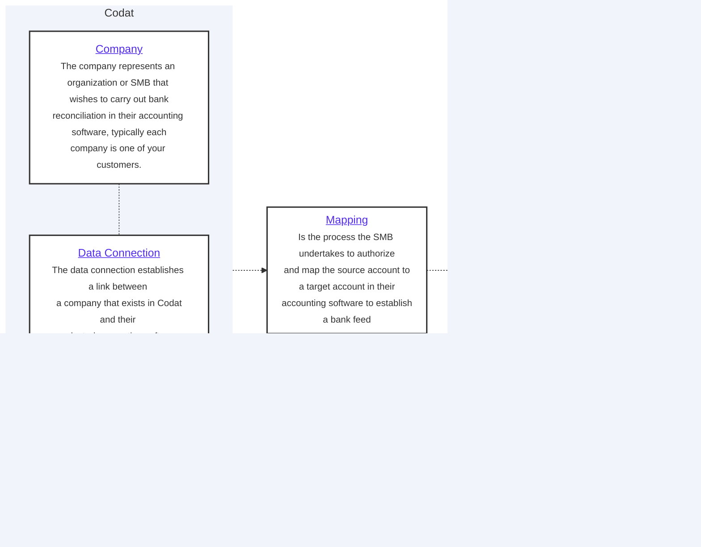

import Tabs from "@theme/Tabs";
import TabItem from "@theme/TabItem"

# Bank feeds setup

## Overview



### Creating a company

Within the bank feeds api, a company represents a business that wishes to export their transactions from your application to their accounting software, the first step of the process is to create a company in Codat:

<Tabs>

<TabItem value="Request URL" label="Request URL">

You can create a company by using the [Create company](/bank-feeds-api#/operations/create-company) endpoint:

```json
POST /companies

{
    "name": "{CompanyName}"
}
```

</TabItem >

<TabItem value="Response" label="Response">

The endpoint returns a JSON response containing the company `id` which you should use to create the data connection and specify which integration the company wishes to establish a bankfeed.

```json
{
    "id": "77921ff9-2491-4dfe-b23b-ff28f3e31e4f",
    "name": "Sawayn Group",
    "platform": "",
    "redirect": "https://link.codat.io/company/77921ff9-2491-4dfe-b23b-ff28f3e31e4f",
    "dataConnections": [],
    "created": "2023-09-06T09:13:35.8188152Z"
}
```

</TabItem >

</Tabs>

### Creating a data connection

Using the [Create a data connection](/bank-feeds-api#/operations/create-connection) endpoint, create a data connection to the chosen accounting package for the company.

   In the request body specify one of the following as the `platformKey`


| Accounting platform | platformKey |
| ---  | ---  |
| Quickbooks Online Bankfeeds | `hcws` |
| Xero | `gbol` |
| FreeAgent | `fbrh` |
| Sage Bank Feeds | `olpr` |


<Tabs>

<TabItem value="dataconnection-request" label="Request">

Sample request to create a QuickBooks Online Data Connection for a company.
   
```json

POST /companies/:companyId/connections
{
    "platformKey": "hcws"
}

```

</TabItem >

<TabItem value="dataconnection-response" label="Response">

The endpoint returns a `200` response. The body contains a `dataConnection` object in `PendingAuth` status and a `linkUrl`, you should cache the `linkUrl` as it will be required later to enable the company to link their accounting package.

   ```json

   {
     "id": "7baba7cc-4ae0-48fd-a617-98d55a6fc008",
     "integrationId": "6b113e06-e818-45d7-977b-8e6bb3d01269",
     "sourceId": "56e6575a-3f1f-4918-b009-f7535555f0d6",
     "platformName": "QuickBooks Online Bank Feeds",
     "linkUrl": "https://link-api.codat.io/companies/COMPANY_ID/connections/CONNECTION_ID/start?otp=742271", 
     "status": "PendingAuth",
     "created": "2022-09-01T10:21:57.0807447Z",
     "sourceType": "BankFeed"
   }

   ```

  **QuickBooks Online Bank Feeds**

   For QuickBooks Online Bankfeeds, The `linkUrl` contains a one time password (OTP) which expires after one hour. If the OTP has expired, your customer will receive a 401 error when loading the page and you should generate a new OTP by a GET request to:
```
GET /companies/:companyId/connections/:connectionId
```
    
</TabItem >

</Tabs>

<details>
  <summary>Deauthorizing a dataConnection</summary>

  If the company wishes to revoke the connection to their accounting package, you can do so using the [unlink-connection](/bank-feeds-api#/operations/unlink-connection) endpoint.

  ```json
  PATCH /companies/:companyId/connections/:connectionId
  {
  "status": "Unlinked"
  }

  
  ```

</details>

---

## Read next

* [Create a source account](/bank-feeds/create-account)

