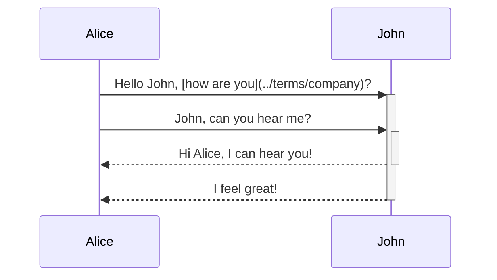
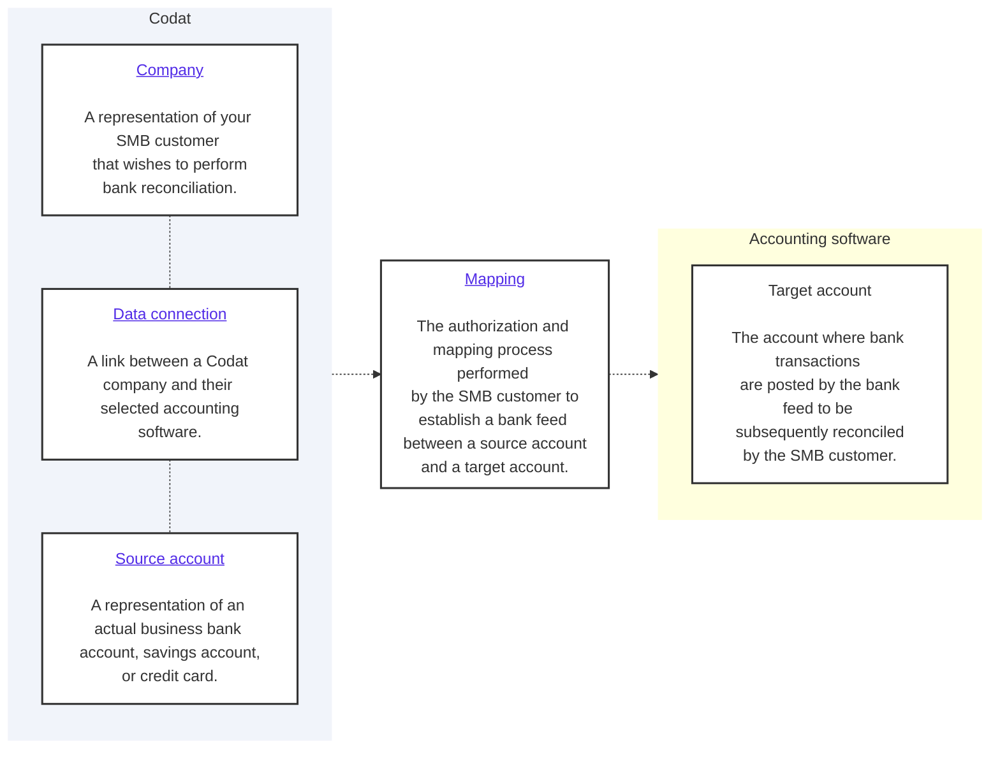

import Tabs from "@theme/Tabs";
import TabItem from "@theme/TabItem"
import {IntegrationsList} from '@components/global/Integrations'
import {bankfeedsExternalMappingIntegrations, bankfeedsIntegrations} from '@components/global/Integrations/integrations'

## Journey overview

blabla

diagram of steps without codat but with the user

beofre you can do that, you need to set up codat in the following ways. 

As a prerequisite to providing this process to your customers, you need to:
* Configure Codat accordingly.
* Prepare an account mapping interface. 

Let's go through these requirements in detail. 

## Configure Bank Feeds API in Codat

:::tip Your lending journey

Our Lending API supports the data collection step of your lending journey, which starts in your own web application. Enable Lending API and configure it, then embed our [Link SDK](/auth-flow/authorize-embedded-link) in your app to handle the auth flow. Determine where the collected data will be stored and manage the subsequent steps of the lending process in your app. 

:::

## Enable Lending API

1. Open the <a href="https://app.codat.io" target="_blank">Codat Portal</a> and sign in.
2. Click on **Settings > Organizational settings > Products**.
3. In the list of products, find _Lending API_ and click **Enable**. Then, follow the on-screen prompt.

### Data sources

In the <a href="https://app.codat.io" target="_blank">Codat Portal</a>, navigate to **Settings > Integrations** to enable and set up the integrations that will serve as a data source for the product. 

Follow the respective guides for integration-specific instructions. 

These integrations also require some enhanced setup specifically for bank feeds. We talk you through these in "Manage integrations". 

<IntegrationsList integrations={bankfeedsIntegrations}/>

### Authorization flow

As part of using the Lending API, you will need your customers to authorize your access to their data. To do so, use Link - our pre-built, conversion-optimized, and white-labelled authorization flow. 

We recommend you fully embed the Link auth flow in your experience by using our [Embedded Link](/auth-flow/authorize-embedded-link) SDK in your front-end code. You can also choose our out-of-the-box [Hosted Link](/auth-flow/authorize-hosted-link) auth flow option to get up and running as quick as possible. 

The solution lets you tailor the authorization journey to your business needs. You can:

* [Customize Link settings](/auth-flow/customize/customize-link)
* [Set up company branding](/auth-flow/customize/branding)
* [Set up redirects](/auth-flow/customize/set-up-redirects)

## Use Lending API

then you also need to create the infrastructure required 

Before you can collect your SMB customer's data, you need to create a Codat [company](./terms/company) and connect it to a data source (for example, an accounting platform). You can do that in two ways:

* In the [Codat Portal](https://app.codat.io) by navigating to **Companies > Create company**
* By calling the [Create company](/lending-api#/operations/create-company) endpoint of our API

Remember to [authenticate](/using-the-api/authentication) if you are making calls to our API. Navigate to **Developers > API keys** in the Portal to pick up your authorization header.

To establish a connection to a data source and sync business data, your customer must grant you access. They can do so using our [Link auth flow](/auth-flow/overview) solution, which we recommend you use in your app.

## Mapping

# Authorization and mapping

The method of connecting and mapping this source account to your target account varies depending on the accounting package your customer is using, typically there are three methods of mapping the source account to a target account.

## Internal Mapping

#### Supported integrations
<IntegrationsList integrations={bankfeedsExternalMappingIntegrations}/>

### Codat User Interface

The bank feeds mapping interface allows for customization with your own logo and primary color scheme. Designed to meet all third-party requirements, it enables a seamless launch of your bank feeds product, ensuring an outstanding experience for your customers with minimal development effort.

##### Learn more [here](/bank-feeds/mapping/codat-ui)

---

### API

Should you desire a more integrated user experience, you have the option to allow users to map their accounts directly within your own application.

This can be achieved by utilizing the account mapping endpoints. These endpoints also drive the functionality of the white-labeled user interface. 

##### Learn more [here](/bank-feeds/mapping/api-mapping)

---

## External Mapping

### QuickBooks Online Bank Feeds

<IntegrationsList filter={['QuickBooks Online bank feeds']} />

For Bank Feeds in QuickBooks Online, the account mapping is conducted within the QuickBooks platform itself. Codat produces a secure username and password against a dataConnection which can be entered into QuickBooks, facilitating the account and transaction verification process.

There are two ways you can share credentials with a Company - either via a hosted and customizable Codat credentials page, or alternatively through the generate-credentials endpoint.

##### Learn more [here](/bank-feeds/mapping/qbo-mapping)

---

### Sage Bank Feeds

<IntegrationsList filter={['Sage bank feeds']} />

Codat's Sage Bank Feeds integration requires an authorization UI to authenticate an SMB user prior to creating source accounts within Codat.

After source accounts have been created, the user can then map these to existing or new accounts within Sage.

##### Learn more [here](/bank-feeds/mapping/sage-mapping)

---

## Read next

* [Create a source account](/bank-feeds/create-account)

