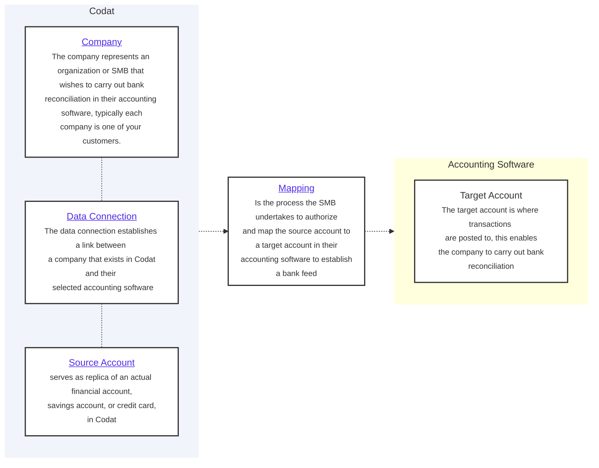

import Tabs from "@theme/Tabs";
import TabItem from "@theme/TabItem"

# Bank feeds Setup

## Overview



### Creating a Company

Within the bank feeds api, a company represents a business that wishes to export their transactions from your application to their accounting software, the first step of the process is to create a company in Codat:

<Tabs>

<TabItem value="Request URL" label="Request URL">

You can create a company by using the [Create company](/bank-feeds-api#/operations/create-company) endpoint:

```json title="Request"
POST /companies

{
    "name": "{CompanyName}"
}
```

</TabItem >

<TabItem value="Response" label="Response">

The endpoint returns a JSON response containing the company `id` which you should use to create the data connection and specify which integration the company wishes to establish a bankfeed.

```json title=Response
{
    "id": "77921ff9-2491-4dfe-b23b-ff28f3e31e4f",
    "name": "Sawayn Group",
    "platform": "",
    "redirect": "https://link.codat.io/company/77921ff9-2491-4dfe-b23b-ff28f3e31e4f",
    "dataConnections": [],
    "created": "2023-09-06T09:13:35.8188152Z"
}
```

</TabItem >

</Tabs>

### Creating a Data Connection

Using the [Create a data connection](/bank-feeds-api#/operations/create-connection) endpoint, create a data connection to the chosen accounting package for the company.

   In the request body specify one of the following as the `platformKey`


| Accounting platform | platformKey |
| ---  | ---  |
| Quickbooks Online Bankfeeds | `hcws` |
| Xero | `gbol` |
| FreeAgent | `fbrh` |
| Sage Bank Feeds | `olpr` |


<Tabs>

<TabItem value="dataconnection-request" label="Request">

Sample request to create a QuickBooks Online Data Connection for a company.
   
```json

POST /companies/:companyId/connections
{
    "platformKey": "hcws"
}

```

</TabItem >

<TabItem value="dataconnection-response" label="Response">

The endpoint returns a `200` response. The body contains a `dataConnection` object in `PendingAuth` status and a `linkUrl`, you should cache the `linkUrl` as it will be required later to enable the company to link their accounting package.

   ```json

   {
     "id": "7baba7cc-4ae0-48fd-a617-98d55a6fc008",
     "integrationId": "6b113e06-e818-45d7-977b-8e6bb3d01269",
     "sourceId": "56e6575a-3f1f-4918-b009-f7535555f0d6",
     "platformName": "QuickBooks Online Bank Feeds",
     "linkUrl": "https://link-api.codat.io/companies/COMPANY_ID/connections/CONNECTION_ID/start?otp=742271", 
     "status": "PendingAuth",
     "created": "2022-09-01T10:21:57.0807447Z",
     "sourceType": "BankFeed"
   }

   ```

  **QuickBooks Online Bank Feeds**

   For QuickBooks Online Bankfeeds, The `linkUrl` contains a one time password (OTP) which expires after one hour. If the OTP has expired, your customer will receive a 401 error when loading the page and you should generate a new OTP by a GET request to:
```
GET /companies/:companyId/connections/:connectionId
```
    
</TabItem >

</Tabs>

<details>
  <summary>Deauthorizing a dataConnection</summary>

  If the company wishes to revoke the connection to their accounting package, you can do so using the [unlink-connection](/bank-feeds-api#/operations/unlink-connection) endpoint.

  ```json
  PATCH /companies/:companyId/connections/:connectionId
  {
  "status": "Unlinked"
  }

  
  ```

</details>

## Creating a Source Account

To establish a bank feed with your customer's accounting software, you'll first need to [set up source accounts](/bank-feeds-api#/operations/create-source-account). These accounts serve as representations of the company's financial accounts within the Codat platform. 

During the subsequent mapping process, these source accounts can be linked to corresponding accounts in the customer's accounting software.


:::note UK specific requirements

For GBP bank accounts, `sortCode` is also a required field. 


:::

Codat categorizes bank accounts into either credit or debit types for standardization. 

Below is a list that matches Open Banking's AccountSubType with Codat's standardized accountType:

| AccountSubType   | accountType (Codat) | 
| ---------------- | ------------------- |
| `ChargeCard`     | `Credit`            |
| `CreditCard`     | `Credit`            |
| `CurrentAccount` | `Debit`             |
| `EMoney`         | `Debit`             |
| `Loan`           | `Credit`            |
| `Mortgage`       | `Credit`            |
| `PrePaidCard`    | `Debit`             |
| `Savings`        | `Debit`             |


<Tabs>

  <TabItem value="source-request" label="Request">

Example request body for creating a debit account:


```json 
POST /companies/:companyId/connections/:connectionId/connectionInfo/bankFeedAccounts
{
    "id": "ac-001",
    "accountName": "Checking Account",
    "accountType": "Debit",
    "accountNumber": "12345670",
    "currency": "GBP",
    "balance": 4002
}
 ```

  </TabItem >

  <TabItem value="source-response" label="Response">

Example of a response for a credit card received upon source account creation: 

```json
{
    "id": "a3f28138-e2b9-4daa-92e1-5a99fb29ac42",
    "accountName": "Checking Account",
    "accountType": "credit",
    "accountNumber": "4243",
    "currency": "GBP",
    "balance": 100.00,
    "status": "pending",
    "modifiedDate": "2023-09-06T09:13:40.2266667"
}   
```

Note that this is a **synchronous response** - assuming the sourceAccount passes validation, you should expect a `200` status code indicating a successful operation.
   
  </TabItem >

</Tabs>

The account status will stay as `pending` until the company associates the source account with a corresponding target account in their accounting software. 

You must wait for the status to change to `linked` before you can successfully transmit any bank transactions.

Once the source account is successfully created you can then guide the company through the **mapping process**.

:::tip Adding multi currency accounts 💱

You can create multiple accounts in different currencies using the same POST endpoint for the company and data connection.

If the user has not enabled multi-currency in their accounting software you will get an error message which you can display to the user.

:::


<details>
  <summary>Updating a source account</summary>

In certain situations, you might wish to modify a source account prior to its mapping. This could occur if the user at the company has a preference for a specific bank account name to appear in their accounting software.

To achieve this, you can use the [update-source-accounts](/bank-feeds-api#/operations/update-source-account) endpoint.

```json
PUT /companies/:companyId/connections/:connectionId/connectionInfo/bankFeedAccounts/:accountId
{
    "id": "ac-001",
    "accountName": "Bank of X Checking Account",
    "accountType": "Debit",
    "accountNumber": "12345670",
    "currency": "GBP",
    "balance": 4002
}

```

</details>

<details>
  <summary>Removing a source account</summary>

If your customer decides to close their account, you can also [remove it from Codat](/bank-feeds-api#/operations/delete-source-account) . Doing so will not delete the account from their accounting software, but it will disable the bank feed, preventing any new transactions from appearing.

```json
DELETE /companies/:companyId/connections/:connectionId/connectionInfo/bankFeedAccounts/:accountId
```


</details>


---

## Read next

[Authorization and mapping](/integrations/bank-feeds/mapping).

