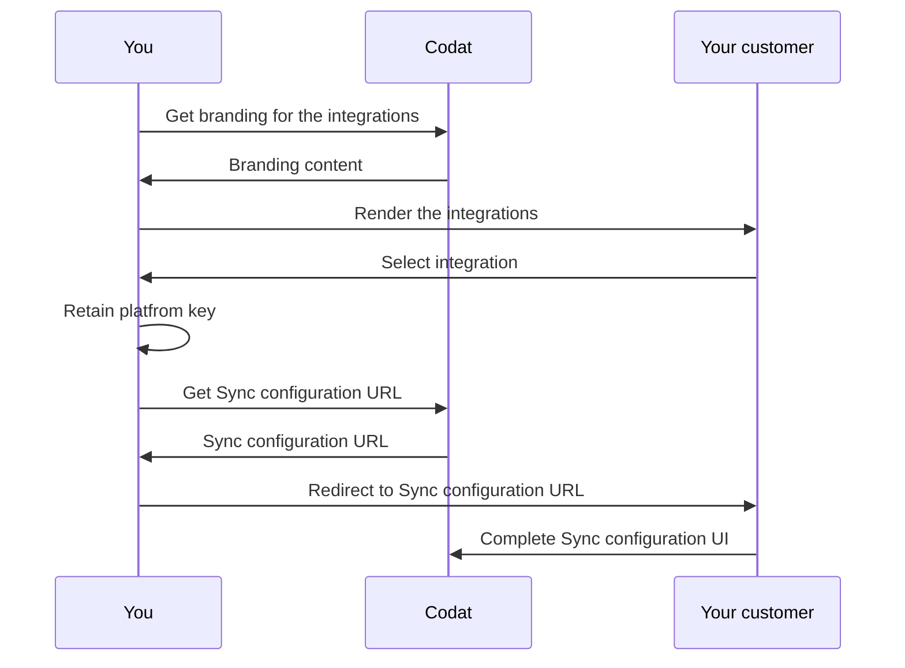

import Tabs from "@theme/Tabs";
import TabItem from "@theme/TabItem";

Sync for Commerce can be implemented within a commerce platform (Point of Sales, Payments, or eCommerce) where sales data originates and within an accounting package to which sales data is synchronized.

Follow the guidance below to perform the initial setup for Sync for Commerce and enable your customers to select the systems they want to connect and start the Sync configuration process.

Before you begin, check how to [use Codat's API](/using-the-api/overview), because you will need to have access to the API to complete the setup. 
you need to have access to Codat's API. 

:::info Codat connector

To finish the setup, Codat will deploy a simple connector to your API that allows us to connect to your customers' data. Your Solutions Engineer will work with you to make this happen. However, you can complete most of the steps below before the Codat connector is deployed.

:::

## Overview

You will need to implement a simple UI within your software that presents your users with a list of source platforms they can synchronize their data with. These can be commerce platforms or accounting packages. 

This interface should be available only to authenticated users - those who are logged into your system. Once the user has selected a system to connect, you need to redirect them to Codat’s Sync configuration user interface. This initial flow is presented on the diagram below.



## Available integrations

You can view the accounting and commerce platforms Sync for Commerce supports in the tables below. For your convenience, we also included the `platformKey`. It is a unique identifier for each integration Codat supports, and you will use it in subsequent setup steps.

<Tabs>

  <TabItem value="acctg" label="Accounting packages">  

  Sync for Commerce currently supports the following accounting packages:

  | Accounting packages               | Platform key |
  |-----------------------------------|--------------|
  | Exact (NL)                        |  qudb        |
  | Exact (UK)                        |  pbbf        |
  | FreeAgent                         |  fbrh        |
  | MYOB                              |  pdvj        |
  | Sage Business Cloud (coming soon) |  tgff        |
  | QuickBooks Online                 |  qhyg        |
  | Xero                              |  gbol        |

  </TabItem>

  <TabItem value="cmmrc" label="Commerce platforms">  

  Sync for Commerce currently supports the following commerce platforms:

  | Commerce platforms | Platform key |
  |--------------------|--------------|
  | Clover             | fqly         |
  | Lightspeed K       | ldgh         |
  | Shopify            | fztf         |
  | Zettle by PayPal   | ugxp         |

  </TabItem>
</Tabs>

## 1. Get branding for the integrations

To populate your platform selection screen with integration logos, you can fetch branding for each integration (identified by `platformKey`). Use our [Get branding for an integration](/sync-for-commerce-api#/operations/get-integration-branding) endpoint:

```http
GET /config/integrations/{platformKey}/branding
```

```json title="Sample response of a Xero branding request"
{
  "logo": {
    "full": {
      "image": {
      "src": "https://static.codat.io/public/officialLogos/Full/Xero_Full.png",
      "alt": "xero full icon"
      }
    },
  "square": {
    "image": {
      "src": "https://static.codat.io/public/officialLogos/Full/Xero_Square.png",
      "alt": "xero square icon"
      }
    }
  },
  "button": {},
  "sourceId": "8a156a5a-39cb-4f9d-856e-76ef9b9a9607"
}
```

## 2. Render the integrations

Using the branding your previously obtained, display each of the relevant integrations in your UI. Make sure to exclude the integration representing the connector that Codat has deployed to your API. 

Your users will then use the UI to identify the right system they want to connect. 

Depending on the technology you are using, integration display code will vary. Using React, it might look something like this: 

```shell 
<div>
   {
     integrations.map((integration, i) => (
       <div
         key={i}
         onClick={selectIntegration(integration.key)}
       >
         

         <h3>{integration.name}</h3>

         <div>Link your {integration.name} account</div>
       </div>
     )
   }
</div>
```
Make sure you retain the `platformKey` of the integration your merchant selected. In the example above, the value passed to the `onClick` function that retains it.

## 3. Handle the integration selection

Once the user selects the system they would like to connect, you are ready to transfer them to Codat’s Sync configuration UI. Here, your customer will authorize access to the system they have selected and configure their sales data synchronization settings.

To do so, redirect your user to the Sync configuration URL. This URL is unique to each of your customers and is secured with a single-use, time-limited access code. Request this URL from our API each time you want to take the user to the configuration UI. Use our [Retrieve Sync flow URL](/sync-for-commerce-api#/operations/get-sync-flow-url) endpoint: 

```http
GET /config/sync/commerce/{commerceKey}/{accoutingKey}/start?merchantIdentifier={yourMerchantIdentifier}
```
You will need to populate parameter values as follows:

<Tabs>
<TabItem value="acctg" label="Accounting packages">  

- `commerceKey`: the `platformKey` of the commerce platform selected by the user in your UI
- `accountingKey`: refers to the Codat connector. Your Solutions Engineer will provide this to you
  
</TabItem>

<TabItem value="cmmrc" label="Commerce platforms">  

- `commerceKey`: the `platformKey` of the commerce platform selected by the user in your UI
- `accountingKey`: refers to the Codat connector. Your Solutions Engineer will provide this to you
- `yourMerchantIdenfifier`: your unique identifier for your customer

</TabItem>
</Tabs>
 
In response, you will receive a URL. Redirect the user to this URL to complete the hand-off to Codat.


```json
{
  "url": "https://sync-flow.codat.io/ef075d52-0378-4718-879b-0bb0cadb20e3/partnercommerce/xero/start?merchantIdentifier=demo merchant&otp=422149"
}
```

:::tip URL security

The redirect URL is unique to each of your customers and is secured with a single-use access code that expires after 30 seconds. This is a security measure that prevents unauthorized third parties from gaining access to a merchant’s Sync configuration information.

If the access code has expired when the user is redirected, they will see an `HTTP 401` error. In this case, simply request the URL again to get a new link and access code.
:::

---

## Read next

- [Advanced product features](/commerce/advanced-setup)