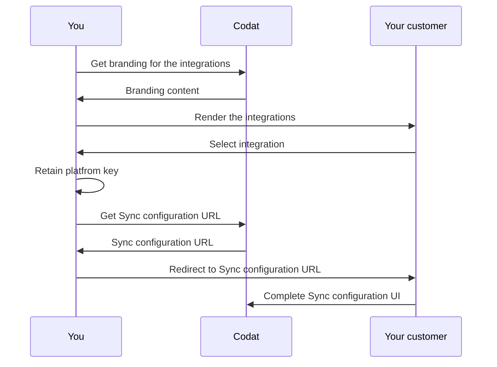

import Tabs from "@theme/Tabs";
import TabItem from "@theme/TabItem";

Enable your customers to select the systems they want to connect and start the Sync Configuration process.

Sync for Commerce can be implemented within a Commerce platform (Point of Sales, Payments, or eCommerce) where sales data originates, and/or within an Accounting package to which sales data is synchronised.

The following steps require access to Codat’s API. See [LINK DESCRIPTION PLEASE](/using-the-api/overview).

:::info
To complete your set up, Codat will need to deploy a simple connector to your API, to allow us to connect to your customer’s data. Your Solutions Engineer will work with you to make this happen. However, you can implement most of the steps below before the Codat connector is deployed.
:::

## Overview

[FOR ACCOUTNING PACKAGES] 

Within your software, you will need to implement a simple UI that presents users with a list of Commerce platforms for your customer to synchronise data with.

[FOR COMMERCE PLATFORMS]

Within your software, you will need to implement a simple UI that presents users with a list of available Accounting packages for your customer to synchronise data with.


This UI should be available only to authenticated users (i.e. users who are logged into your system).

Once the user has selected a system to connect, you will need to re-direct them to Codat’s Sync Configuration User Interface (UI).

Standard setup



## Available integrations

You can view the accounting and commerce platfors Sync for Commerce supports in the tables below. For your convenience, we also included the `platformKey`. It is a unique identifier for each integration Codat supports, and you will use it in subsequent setup steps.

<Tabs>

  <TabItem value="acctg" label="Accounting packages">  

  Sync for Commerce currently supports the following accounting packages:

  | Accounting packages               | Platform key |
  |-----------------------------------|--------------|
  | QuickBooks Online                 |              |
  | Xero                              |              |
  | FreeAgent                         |              |
  | MYOB                              |              |
  | Exact (UK and NL)                 |              |
  | Sage Business Cloud [coming soon] |              |

  </TabItem>

  <TabItem value="cmmrc" label="Commerce platforms">  

  Sync for Commerce currently supports the following commerce platforms:

  | Commerce platforms | Platform key |
  |--------------------|--------------|
  | Zettle by PayPal   |              |
  | Lightspeed         |              |
  | Clover             |              |
  | Shopify            |              |

  </TabItem>
</Tabs>


## 1. Get branding for the integrations
To populate your UI, you can get logos for each of Codat’s integrations.

To get branding for a given integration (identified by platformKey), call:


GET /config/integrations/{platformKey}/branding
Sample response where the platformKey is gbol (Xero):

```
{
  "logo": {
    "full": {
      "image": {
      "src": "https://static.codat.io/public/officialLogos/Full/Xero_Full.png",
      "alt": "xero full icon"
      }
    },
  "square": {
    "image": {
      "src": "https://static.codat.io/public/officialLogos/Full/Xero_Square.png",
      "alt": "xero square icon"
      }
    }
  },
  "button": {},
  "sourceId": "8a156a5a-39cb-4f9d-856e-76ef9b9a9607"
}
```

## 2. Render the integrations
In your UI, display each of these integrations, using the branding obtained in the previous step to help the user identify the right system to connect. You should exclude the integration representing the connector that Codat has deployed to your API.

Depending on your frontend stack, this will vary. Using React, it might look something like this:

```
<div>
  {
    integrations.map((integration, i) => (
      <div
        key={i}
        onClick={selectIntegration(integration.key)}
      >
        

        <h3>{integration.name}</h3>

        <div>Link your {integration.name} account</div>
      </div>
    )
  }
</div>
```
Make sure you retain the platformKey of the integration your merchant selected. In the example above, this is passed to the onClick function, which takes care of this.

## 3. Handle the integration selection
Once the user has selected the system they’d like to connect, you’re ready to hand them off to Codat’s Sync Configuration UI, where your customer will authorize access to the system they’ve selected and configure their sales data synchronization.

 This is done be re-directing them to Sync Configuration URL. This URL is unique to each of your customers and is secured with a single use, time limited access code. You will need to request this URL from Codat’s API each time you want to take the user to the Sync Configuration UI.

To get a Sync Configuration URL, call:


`GET /config/sync/commerce/{commerceKey}/{accoutingKey}/start?merchantIdentifier={yourMerchantIdentifier}`

You will need to populate parameter values as follows:

[FOR ACCOUTNING PACKAGES] 

commerceKey: the platformKey for the Commerce platform selected by the user in your UI.

accountingKey: this refers to the Codat connector to your system. Your Solutions Engineer will provide this to you.

[FOR COMMERCE PLATFORMS] 

accountingKey: the platformKey for the Accounting package selected by the user in your UI.

commerceKey: this refers to the Codat connector to your system. Your Solutions Engineer will provide this to you.

 

yourMerchantIdenfifier: Your unique identifier for your customer. 

 

Sample response:
```
{
  "url": "https://sync-flow.codat.io/df074e52-0267-4707-879b-0cc2adbd20e3/partnercommerce/xero/start?merchantIdentifier=demo merchant&otp=479149"
}
```

Re-direct the user to the Sync Configuration URL returned in the response, to complete the hand-off to Codat.

:::tip
This URL is unique to each of your customers and is secured with a single use, time limited access code that expires after 30 seconds. You will need to request this URL from Codat’s API each time you want to take the user to the Sync Configuration UI, and re-direct the user within 30 seconds.

This is a security measure that prevents unauthorized 3rd parties from gaining access to a merchant’s Sync Configuration information.

If the access code has expired when the user is re-directed, they’ll see an HTTP 401 error. In this situation, simply request the URL again to get a new URL (which will include a new access code).
:::

---

## Read next

- [Advanced product features](/commerce/advanced-setup)