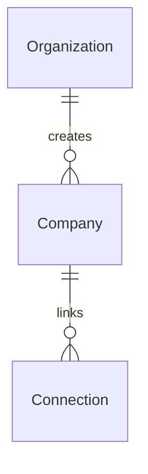
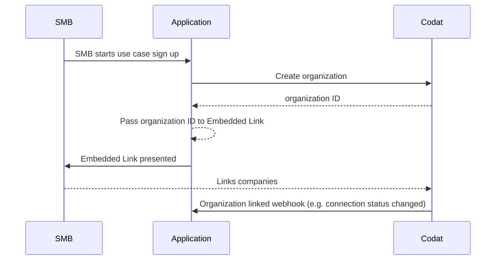
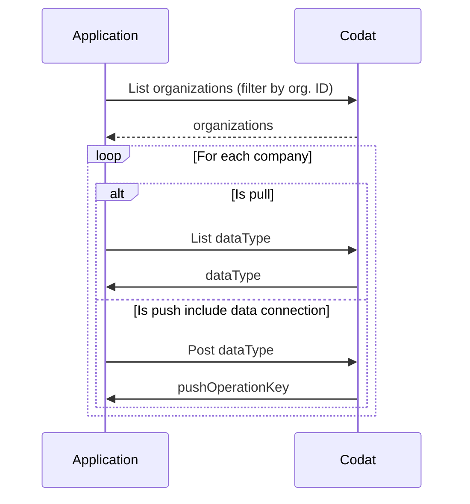

### What is an organization

An organization is group of companies identified when a customer links their software packages.

Companies within an organization may or may not be related. 

### What's the relationship between organizations, companies and data connections?

### How do I use an organization?

#### Link flow

1. Embed Link into your front end application
2. Create organization
3. Pass organization ID to Link
4. Customer links software platforms via Link
5. Access an organization via our `GET /organization` endpoint
6. Use company IDs and data connection IDs to access data

#### Accessing organization data

1. Get organization
2. Loop through companies
2. Pass company ID and sometimes connection ID to relevant data endpoint
