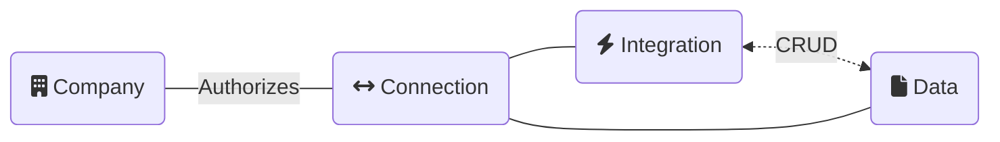

  
- [Companies](/core-concepts/companies) - A company represents your SMB customer.
- [Connections](/core-concepts/connections) - A connection represents authorized access to company data via an integration.
- [Integrations](/core-concepts/integrations) - A Codat-built integration with a data provider.
- [Data types](/core-concepts/data-type-settings) - The types of data you can push and pull - e.g. an Invoice.
- [Data status](/core-concepts/status) - The state of data synchronization.

---

## Read next

- See how these core concepts work in the [Common API reference](/codat-api)
- Next concept: [Companies](/core-concepts/companies)