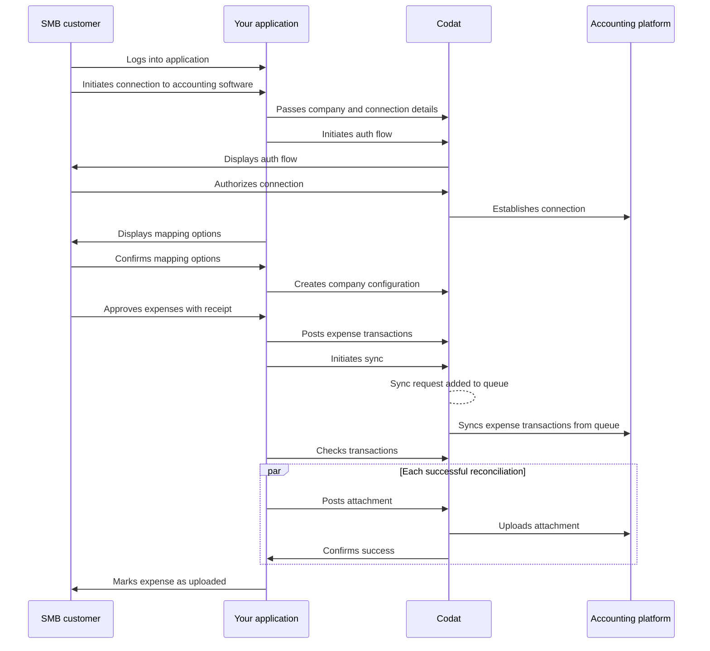

import { IntegrationsList } from "@components/global/Integrations";
import { integrationsFilterExpenses } from "@components/global/Integrations/integrations";
import Tabs from "@theme/Tabs";
import TabItem from "@theme/TabItem"

## Journey overview

The diagram below represents the end-to-end sync process for pushing expenses from your application to your SMB customer's accounting software. Once you decide to build with Sync for Expenses, you need to configure Codat accordingly. Let's go through these requirements in detail.

## Enable Sync for Expenses

1. Open the <a href="https://app.codat.io" target="_blank">Codat Portal</a> and sign in.
2. Click on **Settings > Organizational settings > Products**.
3. In the list of products, find _Sync for Expenses_ and click **Enable**. Then, follow the on-screen prompt.

## Configure Sync for Expenses
### Data types

By default, the data types required for Sync for Expenses will be activated automatically when Sync for Expenses is enabled for your Codat instance. If you need to manage the data types, navigate to **Settings > Integrations > Data types** in the <a href="https://app.codat.io" target="_blank">Codat Portal</a>.

Enable the [data types](/core-concepts/data-type-settings#override-the-default-sync-settings) required for Sync for Expenses with the following settings: 

| Data type name | `dataType` | Use case | Fetch on first link? | Sync frequency |
| :- | :- | :- | :- | :- |
| Accounts            | `chartOfAccounts`    | Accounts used within the general ledger to record and categorize expenses.                                                                                                                             | ✅                  | Daily          |
| Bank accounts       | `bankAccounts`       | A bank account is a primary account from which expenses will be paid.                                                                                                                           | ✅                  | Daily          |
| Company             | `company`            | The company info contains helpful information, such as the name of the linked company and its base currency and registered addresses.                                                                         | ✅                  | Daily          |
| Customers           | `customers`          | Customers can be used to record and associate income transactions, such as reclaiming a cashback reward.                                                                                                | ✅                  | Daily          |
| Suppliers           | `suppliers`          | All expenses go against a single supplier representing the expense provider, preventing a company's accounting software from becoming overrun with duplicate merchants.                                     | ✅                  | Daily          |
| Tax rates           | `taxRates`           | Tax rates enable companies to track expenses against the relevant tax code, helping them to make the expense billable or track taxes that can be reclaimed.                                | ✅                  | Daily          |
| Tracking categories | `trackingCategories` | Tracking categories provide an additional means of categorizing and tagging an expense (e.g. locations, departments).                                            | ✅                  | Daily          |

#### Additional data types

You can also choose to enable additional data types that may enhance your Sync for Expenses experience. With these, you can choose the [synchronization frequency](/core-concepts/data-type-settings#choose-a-synchronization-frequency) and first link fetch based on your requirements. We recommend setting it to a daily or a monthly sync.

  
Additional data types

| Data type name | `dataType` | Solution enhancement |
| :- | :- | :- | 
| Direct costs        | `directCosts`        | Sync for Expenses uses direct cost to represent the expense transaction within the accounting platform.        |
| Direct incomes      | `directIncomes`      | Direct incomes are used to represent any income-generating transaction type, such as cashback rewards.    |
| Journal entries     | `journalEntries`     | Journal entries are used when an accounting platform does not support a representation of direct costs. They are also used to represent transfers, such as topping up or paying down an expense card.   |
| Transfers           | `transfers`          | A record of an expense transaction between two bank accounts, such as topping up or paying down the expense card.        |

### Manage data sources

In the <a href="https://app.codat.io" target="_blank">Codat Portal</a>, navigate to **Settings > Integrations** and click **Manage integrations**. Next, click **Manage** next to the specific integration you want to enable and set it up to serve as a data source for the product. 

You can also view detailed configuration instructions by clicking on the relevant tile:

<IntegrationsList filter={integrationsFilterExpenses} />

### Authorization flow

As part of using Sync for Expenses, you will need your customers to authorize your access to their data. To do so, use [Embedded Link](/auth-flow/authorize-embedded-link) - our pre-built, embeddable, conversion-optimized, and white-labeled authorization flow.

The solution lets you tailor the authorization journey to your business needs. You can:

* [Customize Link settings](/auth-flow/customize/customize-link).
* [Set up company branding](/auth-flow/customize/branding).
* [Set up redirects](/auth-flow/customize/set-up-redirects).

### Webhooks

Codat supports a range of [event types](/using-the-api/webhooks/event-types) to help you manage your data pipelines. In the <a href="https://app.codat.io" target="_blank">Codat Portal</a>, navigate to **Settings > Webhooks > Configure consumer** and click **Add endpoint** to set up the following webhook consumers and get the most out of Sync for Expenses:

- [NewCompanySynchronized](/using-the-api/webhooks/event-types)

  Use this event to track the completion of all enabled data type syncs for a newly connected company. When you receive a notification from the webhook consumer, you can proceed to the next steps of the expense management process. 

- [SyncFailed](/using-the-api/webhooks/event-types)

  Use this event to track any failures that might occur during the sync process. When you receive a notification from the webhook consumer, you need to review the error details and reprocess the failed transactions.

- [SyncCompleted](/using-the-api/webhooks/event-types)

  Use this event to track that the expense transactions have been synced successfully. When you receive a notification from the webhook consumer, you can proceed to the next steps of the expense management process - for example, checking the transactions or informing your SMB customer of the completion.

### Client libraries

Use our comprehensive [Sync for Expenses library](/get-started/libraries) to kick-start and simplify your build. Simply install the library in one of the supported languages and pass your base64-encoded API key to the constructor.

:::tip Recap

You have enabled Sync for Expenses, set up the relevant integrations, configured auth flow parameters, and noted the recommended event types. This completes the initial setup of the product.

Next, you will create a company and its connections to build out the core infrastructure required to manage expenses with Codat.

:::

---

## Read next

- Check out our [client libraries](/get-started/libraries) to kick start your Sync for Expenses build.
- [Configure customer](/expenses/configure-customer) to continue building your expense management process.
