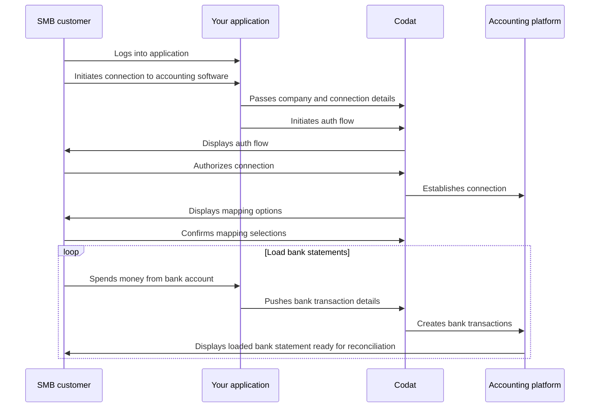

import { IntegrationsList } from "@components/global/Integrations";
import { integrationsFilterExpenses } from "@components/global/Integrations/integrations";

## Journey overview

The diagram below represents the overall activity flow when using Sync for Payables. You can manage bills, suppliers, and payment methods in different ways and order. 

We will take you through each of these elements so that you can build the flow that suits you and your customers best.




Once you decide to build with Sync for Payables, you need to configure Codat accordingly. Let's go through these requirements in detail.


## Connect to an SMB’s accounting platform

In Codat, a company represents a business sharing access to their data. Each company can have multiple data connections to different data sources. For example, a business can have one connection to Xero for accounting data and a connection to Plaid for Open banking data.


With Sync for Expenses, each company will have two data connections:

- One will be to their accounting platform
- The other will be to the partner expense integration

The partner expense connection is created with the 'Linked' status, so you won't need to authorize this connection again. 

## Enable your SMB to authorize access to their data

Before you can push expenses to your customer’s accounting platform, you need to get access to it. There are three ways you can enable your customers to grant access to their financial accounts:

1.  **Embedded Link:** Codat's Embedded Link is a JavaScript component that neatly sits in your front-end code, and can be deployed in a matter of minutes (see [Embedded link](/auth-flow/authorize-embedded-link)).

2.  **Hosted Link**: a beautifully simple, pre-built, conversion-optimized, and customizable authentication flow (See [Authorize with Hosted Link](/auth-flow/authorize-hosted-link)).

3.  **Build your own SMB authentication flow** for a fully customized bespoke user journey (See [Build your own auth flow](/auth-flow/build/build-your-own-authorization-journey)).

### Create a data connection

Once your customer has authorized access to their accounting platform, you will need to create a connection against the company for the partner expense integration.

``` http
  POST https://api.codat.io/companies/{companyId}/sync/expenses/connections/partnerexpense
```

### Check data types

By default, the data types required for Sync for Expenses will be activated automatically when Sync for Expenses is enabled for your Codat instance.
However, if you are experiencing problems when trying to access data from the accounting platform, please check that the following recommended data types have not been disabled. 

<details>
  <summary>Recommended data type settings</summary>

| DataType name | dataType | Use case | Fetch on first link? | Sync frequency |
| :- | :- | :- | :- | :- |
| Accounts            | `chartOfAccounts`    | Accounts used within the general ledger to record and categorize expenses.                                                                                                                             | ✅                  | daily          |
| Bank Accounts       | `bankAccounts`       | A bank account is a primary account from which expenses will be paid.                                                                                                                           | ✅                  | daily          |
| Company             | `company`            | The company info contains helpful information such as the name of the linked company & base currency and registered addresses.                                                                         | ✅                  | daily          |
| Customers           | `customers`          | Customers can be used to record and associate income transactions such as reclaiming a cashback reward.                                                                                                | ✅                  | daily          |
| Suppliers           | `suppliers`          | All expenses go against a single supplier representing the expense provider, this prevents a company's accounting software from becoming overrun with multiple merchants.                                     | ✅                  | daily          |
| Tax Rates           | `taxRates`           | Tax rates enable companies to track expenses against the relevant tax code, this enables them to either make the expense billable or track taxes that can be reclaimed.                                | ✅                  | daily          |
| Tracking Categories | `trackingCategories` | Tracking categories provide an additional means of categorizing and tagging an expense, for example, locations and departments are considered tracking categories.                                            | ✅                  | daily          |

</details>

You can also choose to enable additional data types that may enhance your Sync for Expenses experience.

<details>
  <summary>Other useful data types</summary>

| DataType Name | dataType | Use Case |
| :- | :- | :- | 
| Direct Costs        | `directCosts`        | Sync for Expenses uses direct cost to represent the expense transaction within the accounting platform.        |
| Direct Incomes      | `directIncomes`      | Typically direct incomes are used to represent any income-generating transaction type, such as cashback rewards.    |
| Journal Entries     | `journalEntries`     | Journal entries are used when an accounting platform does not support a representation of direct costs. They are also used to represent transfers, such as topping up or paying down an expense card.   |
| Transfers           | `transfers`          | A record of an expense transaction between two bank accounts, such as topping up or paying down the expense card.        |
</details>


### Webhook events

Sync for Expenses provides two webhooks that you can subscribe to.

**Sync Failed**

The `Sync Failed` webhook is triggered if any failures occurred during the sync process.


**Sync Completed**

The `Sync Completed` webhook is triggered when a sync completes without any failures.

