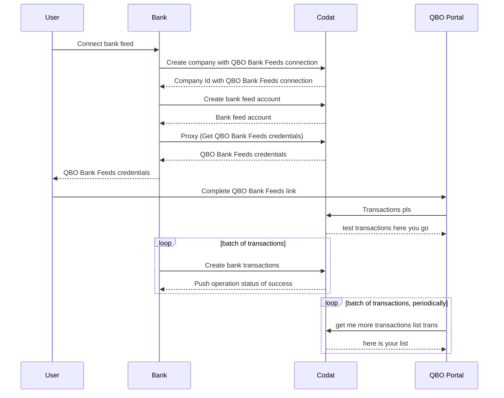

:::info Integrations and languages

This tutorial focuses on reconciling bank feeds with QuickBooks Online (QBO), and uses an [SDK written in Python](https://github.com/codatio/client-sdk-python/tree/main/bankfeeds). We also provide this SDK in Typescript and Go on our [GitHub](https://github.com/orgs/codatio/repositories).

:::

## Tutorial summary

🎯 Our QuickBooks Online Bank Feeds integration makes it possible for your customers to connect bank accounts from your application to QBO. See how you can support your users by syncing their bank transaction data to QBO Bank Feeds, ensuring the records match each other. 

⏳ Estimated time to review: 10-15 minutes

🛠️ This tutorial includes code snippets from our [Python SDK](https://github.com/codatio/client-sdk-python/tree/main/bankfeeds). However, we use the same method names in our [Typescript](https://github.com/codatio/client-sdk-typescript/tree/main/bankfeeds) and [Go](https://github.com/codatio/client-sdk-go/tree/main/bankfeeds) SDKs, which you can use instead.

## Why reconcile bank transactions

Traditionally, bank reconciliation is done by comparing a bank statement to the ledger entries. However, outdated methods like manual data processing and
screen scraping no longer satisfy SMBs' demand for efficient, effortless processes.

Help your SMB customers sync their bank statements digitally to their accounting software and automatically reconcile transactions, therefore removing manual effort, reducing potential for errors, and facilitating transaction matching.

This saves your customers time and gives them the context they need to properly analyze and optimize their spend.

## Solution overview

We have done the heavy lifting for you by building bank feeds integrations with a standardized data model to the accounting platforms your customers already use. This gives you access to real-time data that you can fetch, create, or update to support your customers. In this tutorial, we focus on our QuickBooks Online Bank Feeds integration. 

:::tip Prerequisites

1. Make sure you have enabled the QuickBooks Online Bank Feeds integration. You can do that in the [Codat Portal](https://app.codat.io/settings/integrations/bankfeeds), or [read more](/bank-feeds-api/qbo-bank-feeds/qbo-bank-feeds-setup) for detailed instructions.

2. Intuit must have approved your company to appear in the QuickBooks Online bank selection screen. Submit a request to Codat so that we can organize this with Intuit on your behalf. 

We also expect your application has a UI that your SMB users interact with.

:::

### Preparation

Use our SDKs to easily implement the bank feeds solution in your app. We use the [Python SDK](https://github.com/codatio/client-sdk-python/tree/main/bankfeeds) in this tutorial, but you can also find Typescript and Go SDKs on [GitHub](https://github.com/orgs/codatio/repositories). 

First, install the client library: 

```python
pip install codat-bank-feeds
```

Next, import the package and add your Base64 encoded API key within an authorization header. You can copy your authorization header in the [Developers](https://app.codat.io/developers/api-keys) section of the Codat Portal. In our example, we chose to call the client library `bank_feeds_client`.

```python
import codatbankfeeds
from codatbankfeeds.models import operations, shared

bank_feeds_client = codatbankfeeds.CodatBankFeeds(
    security=shared.Security(
        auth_header="Basic BASE_64_ENCODED(API_KEY)",
    ),
)
```

### Bank feeds process flow



### SOME TITLE TO SAY HERE WE START

Provide your users with a link or a button in your app so they can trigger the connection of their bank accounts to QBO Bank Feeds. Use an appropriate call-to-action, such as _Connect account to QuickBooks_.

When an SMB user clicks the button or link you added, create a Codat company with a QBO Bank Feeds connection for them.

BASICALLY ONE BUTTON TRIGGERS THE WHOLE LOT 

#### Create a company with a QBO Bank Feeds connection

Use our [Create company](/bank-feeds-api#/operations/create-company) endpoint to trigger company creation, which will represent your SMB customer in Codat. In response, you will receive a company Id, which is required by subsequent endpoints.

```python
   req = shared.CompanyRequestBody(
    description='Requested early access to the new bank reconciliation scheme.',
    name='Elaborate Events, Inc',
                                  )
   companies_response = bank_feeds_client.companies.create(req)
```

Next, call the [Create connection](/bank-feeds-api#/operations/create-data-connection) endpoint to establish a data link to QBO Bank Feeds for the company. We pass the response from the previous endpoint in the request, and also include the platform key, which for QBO Bank Feeds is `hcws`.

```python
   req = operations.CreateDataConnectionRequest(
       request_body=operations.CreateDataConnectionRequestBody(
           platform_key='hcws', #Codat's platform key for QBO Bank Feeds
       ),
       company_id=companies_response.company.id,
   )
   connections_response = bank_feeds_client.connections.create(req)
```

#### Create bank feeds bank accounts

Now, use the [Create bank feed bank accounts](/bank-feeds-api#/operations/create-bank-feed) endpoint to add source bank accounts to Codat. These are the accounts the SMB user will be able to connect to QBO Bank Feeds. In the response, you will receive a list of created bank accounts.

```python
req = operations.CreateBankFeedRequest(
    request_body=[
        shared.BankFeedAccount(
            account_name='Account 002',
            account_number='12345670',
            account_type='Debit',
            balance=6531.4,
            currency='GBP',
            id='352c5955-907a-4ff1-a3a2-fa9467739251',
            sort_code='123456',
        ),
    ],
    company_id=companies_response.company.id,
    connection_id=connections_response.connection.id,
)

bank_accounts_response = bank_feeds_client.bank_feed_accounts.create(req)
```

#### Authorize the connection via proxy

Finally, use our [Proxy](/bank-feeds-api#/operations/proxy) endpoint to authorize the previously created data connection by querying QuickBooks Online's own authorization flow endpoints. 

DO WE NEED TO DIRECT THE PERSON TO A QBO WEB ADDRESS, OR THIS ENDPOINT DOES THAT BY ITSELF?

Embed Generate credentials endpoint in your own UI - generates credentials in your own flow. 
Fake credentials basically 

enerat5e credentials button somewhere on the bank's page
they need to paste it into QBO


```python

req = operations.ProxyRequest(
    company_id=companies_response.company.id,
    connection_id=connections_response.connection.id,
    endpoint='generatecredentials?dataconnectionid={connection_id}',
)

proxy_response = bank_feeds_client.connections.proxy(req)
```


 username and password

then QBO comes to ask / pull the bank transactions once it's gone to linked

feed start date that the user has selected

YOU GET BACK THE PASSWORD AND LOGIN AND NOW YOU NEED TO GIVE IT TO THE SMB AND TELL THEM TO GO T OQBO AND ENTER IT THERE. you can choose to give some instructions to the user on what/ where to do in qbo, like we do in own flow here (link or screenshot)

Note that `feed_start_date` value is chosen by your SMB user in the QBO Auth UI and is used to limit the load of historic transactions to seven days. 

When an SMB user has completed authorization and connected one or more bank accounts to QuickBooks Online, you can create and sync their bank transactions with QBO, one account at a time. Once it's linked, QBO ocmes to ask for transactions. test transactions two lines. we give them two test transactions. then we sync transactions between codat and bank, like so: 

#### Create bank feeds bank transactions

Note the following guidelines before syncing bank transactions, or [read more](/bank-feeds-api/qbo-bank-feeds/qbo-bank-feeds-push-bank-transactions) about them:

- You can push historic (back-dated) transactions that are up to seven days old based on the `feed_start_date`, as chosen by the SMB user in the QBO UI.
- Syncing future-dated transactions to QBO is not supported.
- You can only sync bank transactions from one connected account at a time.
- Bank transactions must be synced in chronological order (from earliest to latest) based on the `cleared_on_date`.
- Bank transactions can't be older than the most recent transaction available on the destination bank account.
- Up to 1000 bank transactions can be synced at a time.

Use the [Create bank transactions](/bank-feeds-api#/operations/create-bank-transactions) endpoint to post your SMB user's bank transactions to QuickBooks Online. 

Because of the way bank transactions work, we recommend you post seven days of transactions on the initial sync. For subsequent syncs, we recommend you post daily transaction data. 


QBO sources the transactions from codat. so you pushed bank feeds transactions to codat, and then qbo pulled from codat.
flow isbank -> codat -> qbo

```python
req = operations.CreateBankTransactionsRequest(
    bank_transactions=shared.BankTransactions(
        account_id=bank_accounts_response.account.id,
        amount=7991.59,
        balance=8009.11,
        cleared_on_date='2023-01-10T14:14:14.1057478Z',
        description='HSBC Covent Grdn ATM W',
        id='ca1ba928-fc81-4674-acb7-39205929396f',
        modified_date='2023-01-09T14:14:14.1057478Z',
        reconciled=False,
        source_modified_date='2023-01-09T14:14:14.1057478Z',
        transaction_type=shared.BankTransactionType.ATM,
    ),
    account_id=bank_accounts_response.account.id, ACCOUNT ID TWICE?
    company_id=companies_response.company.id,
    connection_id=connections_response.connection.id,
)

create_transactions_response = bank_feeds_client.bank_account_transactions.create(req)
```
Repeat the request for the remainder of the SMB user's source bank accounts. , and qbo on a periodic basis comes to codat and asks for those transactions. 

### Enhance your users' experience

Once the bank transactions have been synced between the bank feed and QuickBooks Online, you can enhance your SMB user's experience and allow them to view the synced transactions and their status in your application's UI. 

To display the bank transactions for a specific bank account, use the [List bank transactions for a bank account](/bank-feeds-api#/operations/list-bank-account-transactions) endpoint. 

```python
req = operations.ListBankAccountTransactionsRequest(
    account_id=bank_accounts_response.account.id,
    company_id=companies_response.company.id,
    connection_id=connections_response.connection.id,
    order_by='-modifiedDate',
    page=1,
    page_size=100,
    query='quidem',
)

list_transactions_response = bank_feeds_client.bank_account_transactions.list(req)
```

:::tip Recap

That's it - you have followed Codat's bank transactions reconciliation process flow and understood how to implement it in code. You can now use this tutorial as a basis for your application.

:::

---

## Read next

* Expand your coverage of bank feds to [Xero](/bank-feeds-api/xero-bank-feeds/) and [Sage](/bank-feeds-api/sage-bank-feeds/)
* Learn more about how Codat can automate your lending solutions on the examples of [loan qualification](/guides/loan-qualification/introduction) and [invoice financing](/guides/invoice-finance/introduction)