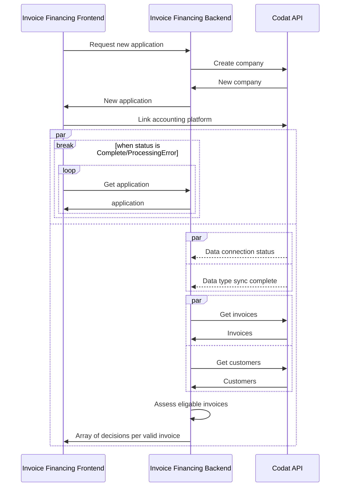

import Tabs from '@theme/Tabs';
import TabItem from '@theme/TabItem';

### 🚀 In this section, you will...
* Review the basic process flow followed by the demo app,
* Create a new invoice financing application,
* Create a Codat company and connect it to the Codat Sandbox,
* Fetch financial data to assess risk levels associated with customers and invoices, and
* Receive a decision on the loan application. 

:::note Invoice financing process flow

This diagram shows the steps of the invoice financing process as performed by the demo app. It helps you visualize the relationship and information exchange between the app's different components.


:::  

### <input type="checkbox" unchecked /> Start a new loan application  

:::note Loan application frontend

We use [Swagger](http://localhost:7278/swagger/index.html) to act as a presentation layer to interact with the demo endpoints. Remember to click **Try it out** and **Execute** when working with Swagger.
:::

Call the `POST /applications/start` endpoint to trigger the creation of a new invoice financing loan application. In the background, the app creates a company using Codat's `POST /companies` endpoint using the application `id` as the company name.

Codat returns the company and application `id`s in the endpoint response together with a `linkUrl`. In the demo, we will use these elements to connect a data source.  

```json title="Example POST /applications/start response"
  {
    "id": "1c727866-6923-4f81-aa7b-c7fd8c533586",
    "codatCompanyId": "a9e28b79-6a98-4190-948d-3bd4d60e7c0a",
    "status": "Started", 
    "linkUrl": "https://link.codat.io/company/a9e28b79-6a98-4190-948d-3bd4d60e7c0a"
  }
```
### <input type="checkbox" unchecked /> Share financial data  

Next, you need to provide Codat with access to an accounting platform so we can fetch the data required to assess the risk of the loan application. Open the `linkUrl` returned in the response from `POST /applications/start` in your browser. Follow the flow built using [Link](/auth-flow/overview), our hosted or embedded integrated authorization flow. 

Select the **Codat Sandbox** as the source of accounting data.
* Choose the **Invoice Financing US Company** company type.
* You don't need to enter any credentials to authorize this connection. 
* You should also skip the step of uploading business documents. 

We fetch the applicant's unpaid invoices, customers associated to these unpaid invoices, and each customer's historic (paid) invoices to use in the decision making. You can [read more](/guides/invoice-finance/inv-fin-decision) about the queries we used to perform the specific fetching. 


### <input type="checkbox" unchecked /> Receive the decision on the loan 

The demo app now has all the components that it needs to assess the risk associated with each customer, and risk associated with each invoice. These assessments determine the decision on each unpaid invoice included in the loan request. 

Poll the `GET applications/{applicationId}` endpoint in [Swagger](http://localhost:7278/swagger/index.html) anytime to check the status of your application. Once the app processes all the relevant invoices, it will automatically return a response with an offer for each invoice approved for financing.

You can [read more](/guides/invoice-finance/inv-fin-decision) about the risk assessments the app performs, and further detail of the decisioning logic. The thresholds used with the logic are set in the `appsettings.json` file. 

### 💪 Ready for more? 

Try these suggestions to make the most of your experience with the demo app:

- **Play around with thresholds**  
  In the `appsettings.json` file of the `Codat.Demos.InvoiceFinancing.Api\` directory, set your own example thresholds for data points used for risk assessment and see how this affects the application decision.

- **Finance an invoice-based loan using different datasets**  
  Start another loan application, and choose a different Sandbox company type to get a different set of financial data to be used in the decision-making. 

- **Use a company's real data**  
  Take the demo one step further and use real credentials to access existing financial data in an accounting platform. Set up the [integration](/integrations/accounting/overview) you plan to use, and connect to it while following the auth flow. Then, review how the app makes a decision based on your company's real data. 

- **Inspect the invoice financing logic**  
  We provide [detailed information](/guides/invoice-finance/inv-fin-decision) about the risk assessment logic we included in our demo app, and how exactly the financial data is fetched and analyzed. 
  

### Recap

You have now successfully run the demo app, covering all the key steps in an invoice financing process. You have started and completed an application, connected and fetched accounting data, and received a decision on your application. 

---

### Read next

- Review the app's fetching and decisioning logic [in detail](/guides/invoice-finance/inv-fin-decision)