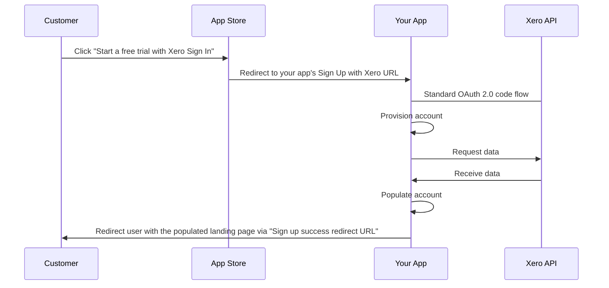

The **Sign Up with Xero** flow allows you to quickly onboard potential customers using pre-populated data from their Xero accounting software and show them the unique value of your app faster. Codat’s API makes it easier for you to implement it by helping you build and use redirect URLs and creating relevant companies and connections. We also provide a detailed guide of the steps you need to take.

<div className="video-container">
  <iframe width="560" height="315" src="https://www.youtube.com/embed/pFGHti5Y17Q?t=30" title="YouTube video player" frameborder="0" allow="accelerometer; autoplay; clipboard-write; encrypted-media; gyroscope; picture-in-picture; web-share" allowfullscreen></iframe>
</div>

## When to build

The [Sign Up with Xero](https://developer.xero.com/documentation/xero-app-store/app-partner-guides/sign-up/) flow is a strict requirement for all app partners seeking certification and listing on the Xero App Store. Therefore, Xero expects to see a working example of the flow as part of your App Partner application. Note that you will only be able to launch your app and complete your listing once your application is fully approved.

## What to build

The flow is intended to bring potential customers directly to your app from the Xero App Store and provide them a trial or an account for your app that is  pre-populated with their Xero data.

When the customer initiates your app from the App Store, they should be immediately directed via a `Sign up with Xero URL` to authorize a connection with Xero using the standard OAuth 2.0 flow. 

Upon completion, your app should provision an account or a trial for the customer, interact with the Xero API to receive the customer's data, and populate the provisioned account with it. 

Finally, present the user with the resulting account via the `Sign up success redirect URL`. We expect this URL to lead to an existing page you have built (for example, signup, application, or onboarding forms). If you do not yet have one, consider creating it to provide a landing page for the customer. 



## How to build

### Retrieve the Sign Up with Xero URL

The **Sign Up with Xero URL** is the URL that is shared with the end user for them to authorize access to Xero. It is generated by Codat, but requires you to action the following: 

1. Retrieve the `clientId` and `platformKey`.

   These two values will form part of the **Sign Up with Xero URL**. 

   Call our `GET https://api.codat.io/profile/syncSettings` endpoint and pick up the `clientId` returned in the response. For Xero, the `platformKey` value is `gbol`, as captured in our [accounting platform key list](/integrations/accounting/overview#platform-keys). 
   
2. Generate the URL.

   Use the values retrieved previously to generate a URL with the following structure: `https://link-api.codat.io/clients/{ClientID}/signUpWith/{PlatformKey}`  
   Note that this URL should also be used as a response to checkpoint _6. Purchase/sign up page URL_ in your App Store listing.

When this link is initiated by the customer, it triggers the creation of a company and a connection in Codat, and redirects them to Xero login for authorization. Once authorized, they will be redirected to your **Sign up success redirect URL**.

### Set the Sign up success redirect URL

Navigate to **Settings > Auth flow > Redirects** to access the [Redirects](https://app.codat.io/settings/redirects) page in the Codat Portal. Under **Sign up success redirect URL**, enter the base URL of the form you will display to the customer, without any parameter replacements. Your changes will be auto-saved.


### Pre-populate customer's account with Xero data 

Once the customer authorizes the Xero connection, use the Xero OpenID data to pre-populate onboarding forms or fields. Here is an example redirect with OpenID parameters:

```
{SignUpSuccessRedirectURL}?companyId=f3069a22-ce9a-499b-b341-a7d6564c65z1&connectionId=4302ebaf-aba6-4763-ba61-47a7992634a3&statusCode=200&openId_email=j.doe%2B1%40codat.io&openId_given_name=John&openId_family_name=Doe
```

You can also use the Codat API and `companyId` to pull additional information of interest, such as company info, customers, or accounts. 

### Manage the Codat company

When the **Sign Up with Xero URL** is triggered and a Codat company is created, it has a name that follows the `Xero-YYYY-MM-DD-THHMMSS` convention. This is because we do not have any identifying information for the user at that point. 

If you have specific requirements for company naming, you can update the name via the API using our [Update company](/codat-api#/operations/update-company) endpoint. Use the `companyId` returned as part of the Xero OpenID data. 

### Manage user cancellation

You should build logic to handle the scenario of a user cancelling mid-flow, and serve a relevant error page. This is similar to what we recommend when using our [Link auth flow](https://docs.codat.io/auth-flow/overview). 

As part of the OpenID response parameters, you will receive the appropriate status code that you can manage accordingly. For a full list of our status codes, see [Status codes and errors](https://docs.codat.io/using-the-api/errors).

 