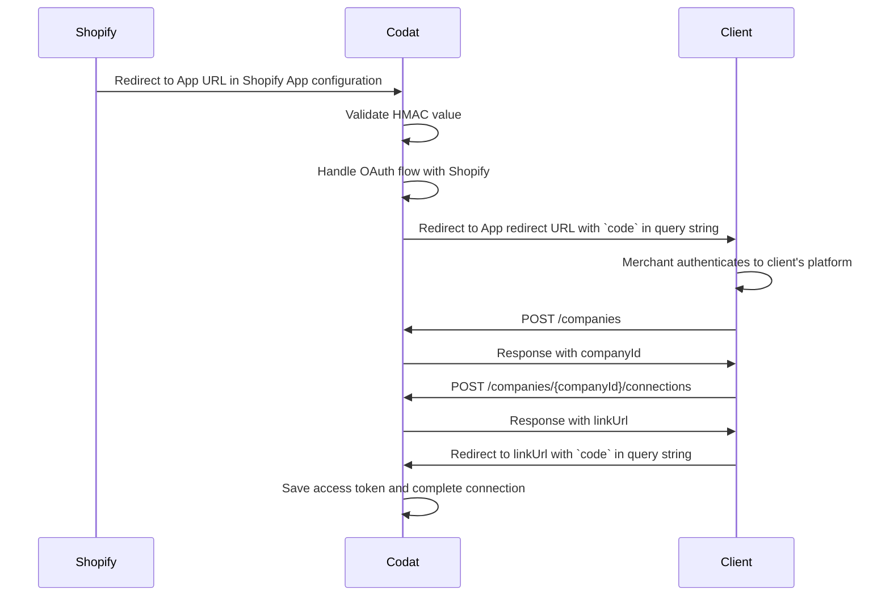

Set up the Shopify integration to retrieve commerce data from customers who sell their products on Shopify's ecommerce platform.

This article explains how to set up the Shopify integration using the _public apps_ approach.

You will learn how to...

- [Create a Shopify app](/integrations/commerce/shopify/commerce-shopify-public-apps#create-a-public-shopify-app)
- [Submit your app to Shopify for approval](/integrations/commerce/shopify/commerce-shopify-public-apps#submit-your-app-to-shopify-for-approval)
- [Buid an app for merchant authorization](/integrations/commerce/shopify/commerce-shopify-public-apps#build-an-app-for-merchant-authorization)
- [Add your app's credentials to the Shopify integration](/integrations/commerce/shopify/commerce-shopify-public-apps#add-your-apps-credentials-to-the-shopify-integration)
- [Enable the Shopify integration](/integrations/commerce/shopify/commerce-shopify-public-apps#enable-the-shopify-integration)
- [Check the commerce sync settings](/integrations/commerce/shopify/commerce-shopify-public-apps#check-the-commerce-sync-settings)

## Before you begin

Before setting up the integration, make sure that you:

- Understand [how public apps work](/integrations/commerce/shopify/commerce-shopify#about-public-apps).
- Have [built an endpoint](/integrations/commerce/shopify/commerce-shopify-public-apps#build-an-app-for-merchant-authorization) that can be used to identify a merchant on your system.

## Create a public Shopify app

When the app is created, you can view the app's secure credentials.

1. Log in to the [Shopify Partners](https://developers.shopify.com/) site using your Shopify partner account credentials.

   :::note Shopify partner account
   [Create a partner account](https://partners.shopify.com/signup/developer) if you don't already have one.
   :::

2. In the side panel, click **Apps**.
3. On the **Apps** page, click **Create app**.
4. In the **Use Shopify Partners** box, click **Create app manually**.
5. On the **Create an app manually** page, enter the requested information:
   - **App name:** enter a name for your app. Do not use _Shopify_ as part of the app name.
   - **App URL:** enter `https://commerceintegration.codat.io/publicApp/{your-client-id}`
   - **Allowed redirection URL(s):** enter `https://commerceintegration.codat.io/oauth/callback`
6. Click **Create app**. Your app is created and the app page is displayed.
7. In the side panel, click **App setup** to view the app's configuration settings.
8. Optional: if you need to access over 60 days' of orders, do the following on the **App setup** page:
   1. In the **Read all orders** box, click **Request access**.
   2. Enter the details requested in the dialog, then submit your request to Shopify.
9. In the **GDPR mandatory webhooks** section, enter the following Codat webhook URLs:
   - **Customer data request endpoint:** `https://commerceintegration.codat.io/webhooks/customer/request`
   - **Customer data erasure endpoint:** `https://commerceintegration.codat.io/webhooks/customer/redact`
   - **Shop data erasure endpoint:** `https://commerceintegration.codat.io/webhooks/shop/redact`
10. Click the **Save** button that appears at the top of the page.

Your app's **API key** and **API secret key** are shown in the **App credentials** section of the App setup page. You'll need these when you [add your app's credentials to the integration](/integrations/commerce/shopify/commerce-shopify-public-apps#add-your-apps-credentials-to-the-shopify-integration).

If you plan to charge for your app, you will need to integrate to [Shopify's billing API](https://shopify.dev/docs/apps/billing).

## Submit your app to Shopify for approval

Your public app must be [approved by Shopify](https://shopify.dev/apps/store/requirements) before you can use the integration with a Production Store. The review and approval process might take up to two weeks.

In the Shopify Partners site:

1. Click the name of your app.
2. In the side panel, click **Distribution**.
3. On the **Distribution** page, click **Choose Shopify App Store**, then confirm your selection in the dialog that appears.

4. Click **Create listing**.
5. Select your Shopify partner account at the authentication prompt. The **App listing** page for your app opens.
6. Click **App visibility**.
7. In the **Manage app visibility** dialog, select **Unlisted**, unless you want your app to be visible in the public Shopify App Store, then click **Save**.

   :::note Differences between listed and unlisted apps

   You can make your Shopify app _listed_ (fully visible in the Shopify App Store) or _unlisted_ (it will not appear in Shopify App Store search engines or results). Both types of apps have a public Shopify App Store URL.

   :::

8. Click **Start listing**. The **English listing** page is displayed.
9. Enter all the required listing information and save the form.
10. On the **App listing** page, click the **Submit app** button at the top right. The button is not available until you've completed all the required listing information.

Your app is then sent to Shopify for review and approval.

Additionally, if you need access to over 60 days of orders from Shopify stores, you must submit a _Read all orders_ request, as noted in [Create a Shopify public app](/integrations/commerce/shopify/commerce-shopify-public-apps#create-a-shopify-public-app). You'll receive an email from Shopify when your request has been processed. This might take up to seven business days.

Codat can't guarantee that Shopify will approve your public app or grant access to over 60 days of order data.

## Build an app for merchant authorization

When a merchant adds your app to their store, we need to be able to identify them. To do that, we will redirect them to the **App Redirect URL** endpoint you entered in the [integration settings](/integrations/commerce/shopify/commerce-shopify-public-apps#add-your-apps-credentials-to-the-shopify-integration) at the end of the auth flow. 

We will generate and include a `code` query string parameter in the initial redirect to maintain context. Allow the user to authenticate themselves on the redirect page, and then create (or use an existing) Codat company and data connection. The data connection response will contain a `linkURL`. Append the `code` to the query string of the URL and redirect the user to complete their auth flow with us.

## Add your app's credentials to the Shopify integration

In the Codat Portal, add the secure credentials for your Shopify app to the integration.

1. On the navigation bar, select **Settings > Integrations > Commerce**.

2. Click **Set up** next to the **Shopify** integration.

   The **Integration settings** page is displayed.

3. Enter your app's credentials from Shopify (to find these, see [Create a Shopify public app](/integrations/commerce/shopify/commerce-shopify-public-apps#create-a-shopify-public-app)).
   - For **Client ID**, enter the **API key** from Shopify.
   - For **Client secret**, enter the **API secret key** from Shopify.
   - For **App Redirect URL**, enter the location of your [authentication endpoint](/integrations/commerce/shopify/commerce-shopify-public-app#build-an-app-for-merchant-authorization).

4. If you requested access to over 60 days of orders and your access was approved, turn on **Has request to read all orders**. Otherwise leave this setting turned off.

   

5. Under **Access to company data**, configure the permitted sync frequency for the integration. Select **Allow one-off data sync…** or **Allow continuous data sync**.

6. Click **Save**.

## Enable the Shopify integration

1. In the Codat Portal, go to the <a className="external" href="https://app.codat.io/settings/integrations/commerce" target="blank">**Commerce integrations**</a> page.
2. Locate **Shopify** and click the toggle to enable the integration.

You can also click **Manage** to view the integration's settings page and then enable the integration from there.

## Check the commerce sync settings

All commerce data types must be enabled before you can pull commerce transactions from Shopify to Codat. Follow the steps in [Commerce sync settings](/integrations/commerce/commerce-sync-settings). You only need to do this once.

## Next steps

[Test your Shopify integration](test-shopify) before sending Link URLs to merchants.