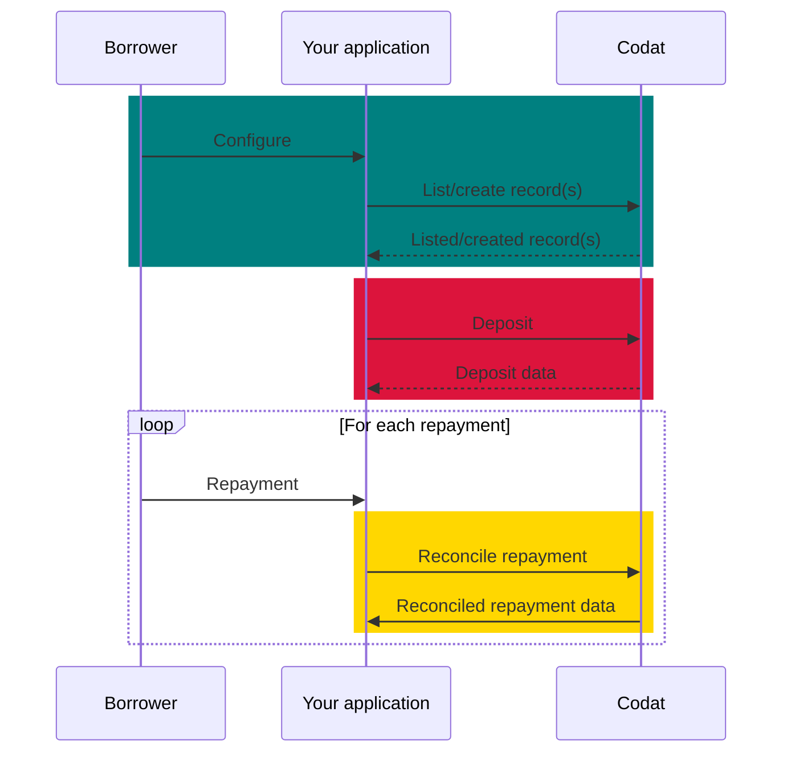
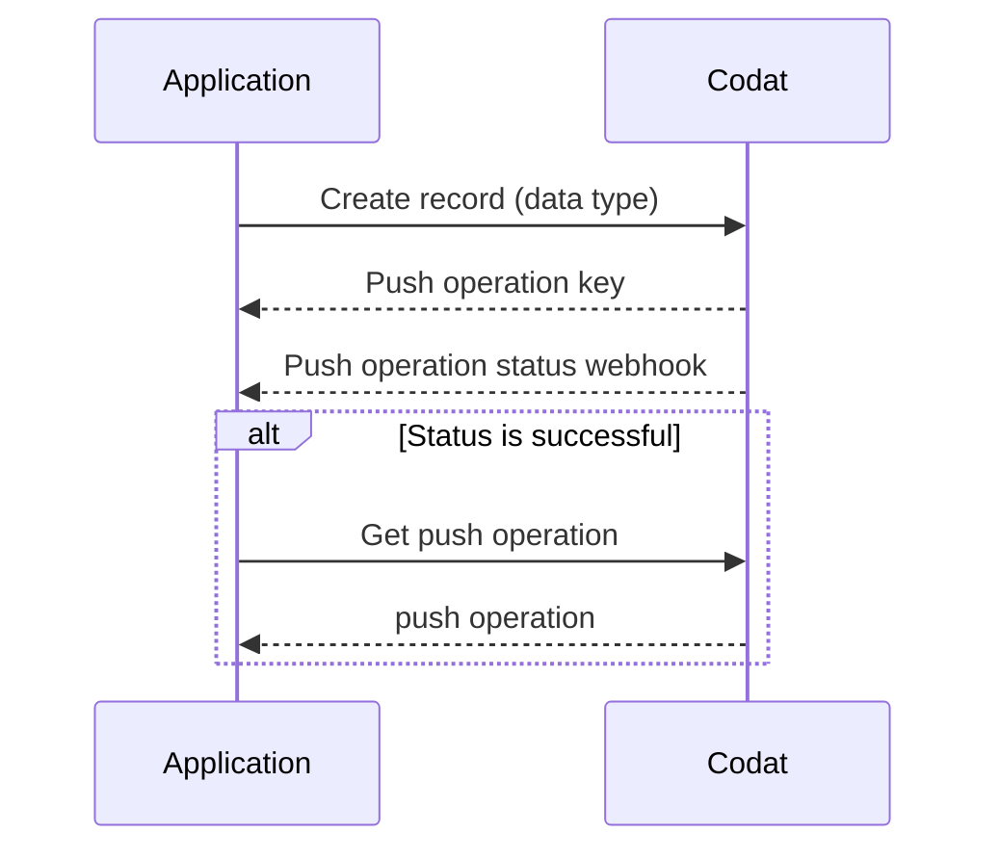
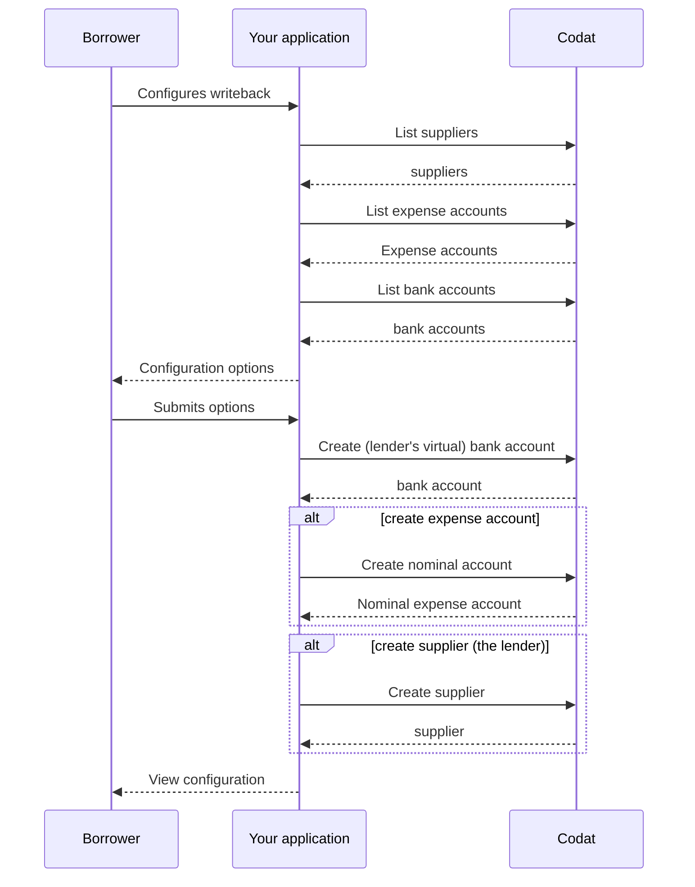
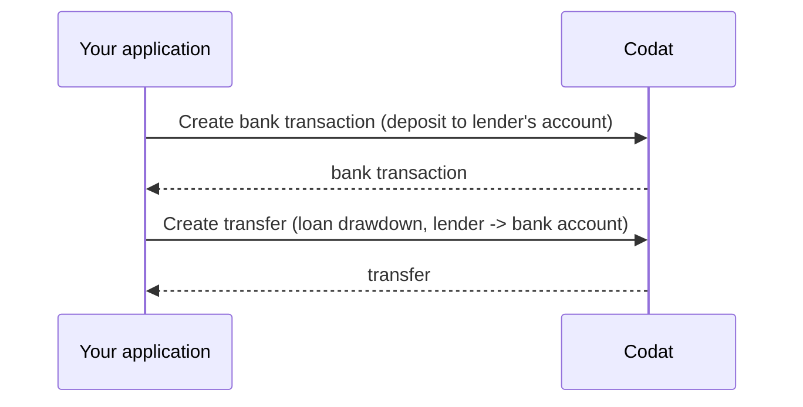
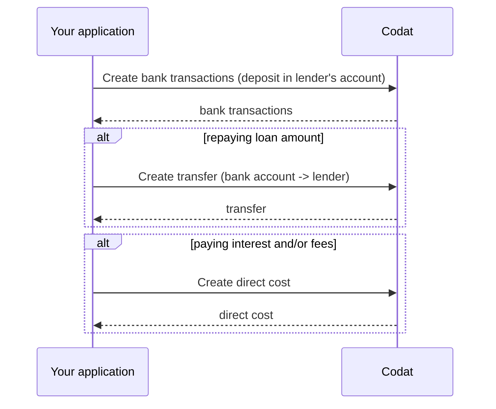

import Tabs from '@theme/Tabs';
import TabItem from '@theme/TabItem';
import WritebackMapping from "@components/global/Prototypes/WritebackMapping";

## Concept overview

:::tip In this guide...

This guide takes you through the steps needed to implement and run the loan writeback procedure in your lending business. 


You will learn how to configure Codat in support of loan writeback and create transactions that represent the deposit and repayment of the loan in your customers' accoungting platforms. 

covers the loan writeback procedure for general lending, such as term loans, but does not cover requirements specific to invoice finance.

### What is loan writeback?

Loan writeback (also known as lending writeback) is the process of continuously updating an accounting platform with information on a loan. It helps maintain an accurate position of the loan during the entire lending cycle by recording the loan liability, any interest, fees, or repayments, and facilitating the reconciliation of bank transactions. 

:::info Mandatory loan writeback

Certain accounting platforms **require** lenders to continuously update their books with money lent to SMBs. For example, **Xero** obligates lenders going through the [App Partner certification](/integrations/accounting/xero/xero-app-partner-program) process to handle the writeback process. 

:::

### Why use it?

A bookkeeper can account for a loan in numerous ways in an accounting platform. For example, some bookkeepers may erroneously register a loan as a direct income or even a sales invoice. This results in loans being improperly recorded as revenue and repayments as operating costs. At the end of the reporting period, this can make it hard for the bookkeeper to close their books. 

By implementing loan writeback functionality in your application, you can make sure loan bookeeping is done regularly, correctly, and quickly, and always see an up-to-date state of the borrower's accounts.

### What's the process?

The process of loan writeback involves recording loan withdrawals, repayments, and interest in the SMB's accounting platform. It can be split into three stages, as shown on the diagram below: 

1. **Configure** loan writeback for your SMB customer.  

2. **Deposit** funds into your SMB's accounting platform.

3. **Repay** money owed to you, the lender, in your SMB's accounting platform.



## Prerequisites

* Check that you have [created a Codat company](/configure/portal/companies#add-a-new-company) that represents your SMB customer and linked it to an accounting platform. If you are already using Codat for lending, it's likely you have previously created some companies. 

You should also create and connect a test company to use while building your solution.

* Familiarize yourself with Codat's approach of asynchronously [creating and updating data](/using-the-api/push), which can be summarized as follows:



* If you are implementing loan writeback for Xero, *Xero Bank Feeds API* needs to be enabled for your registered app. Xero usually does this during the certification process for lenders' apps so that you can test your solution before completing the certification.

* Provide the customer with a user interface that gives the option to enable the loan writeback process flow and configure or update their account mapping, for example: 

<WritebackMapping/>

## Configure loan writeback

First, your SMB customer will use your UI to configure loan writeback accounts so that the accounting entries are reflected correctly in their accounting platform. They will create or select existing, and subsequently map, the following elements:

* SMB bank account, the borrower's business account where the loan is deposited.
* Lender bank account, a virtual account that contains the lender's transactions.
* Expense account, an account to record incurred fees and interest.
* Supplier record, a record to identify you, the lender, in future transactions.

Let's go through that in detail. On the diagram below, you can see the configuration sequence covering the display and selection of a bank account, an expense account, and a supplier record. Alternative steps are also provided in case a new account and a new supplier need to be created. 



### Bank account

Loan writeback process operates with two bank accounts: a borrower's business bank account, where the money lent is deposited, and a lender's bank account, which is a virtual bank account in the accounting platform that acts as a container for lender transactions. 

First, your customer needs to choose one of their existing bank accounts. This account will be used to depost the loan. Call our [List bank accounts](/lending-api#/operations/list-accounting-bank-accounts) endpoint to retrieve the customer's existing bank accounts. 

<Tabs>
<TabItem value="nodejs" label="TypeScript">

```javascript
codatLending.accountingBankData.accounts.list({
    companyId: "8a210b68-6988-11ed-a1eb-0242ac120002",
    connectionId: "2e9d2c44-f675-40ba-8049-353bfcb5e171"
}).then((res: ListAccountingBankAccountsResponse) => {
if (res.statusCode == 200) {
    // handle response
}
});
```
</TabItem>

<TabItem value="python" label="Python">

```python
bank_accounts_list_request = operations.ListAccountingBankAccountsRequest(
    company_id='8a210b68-6988-11ed-a1eb-0242ac120002',
    connection_id='2e9d2c44-f675-40ba-8049-353bfcb5e171'
)

bank_accounts_list_response = codat_lending.accounting_bank_data.accounts.list(bank_accounts_list_request)
```
</TabItem>

<TabItem value="csharp" label="C#">

```csharp
var bankAccountsListResponse = await codatLending.AccountingBankData.Accounts.ListAsync(new ListAccountingBankAccountsRequest() {
    CompanyId = "8a210b68-6988-11ed-a1eb-0242ac120002",
    ConnectionId = "2e9d2c44-f675-40ba-8049-353bfcb5e171"
});
```
</TabItem>

<TabItem value="go" label="Go">

```go
ctx := context.Background()
bankAccountsListResponse, err := codatLending.AccountingBankData.Accounts.List(
    ctx, 
    operations.ListAccountingBankAccountsRequest{
        CompanyID: "8a210b68-6988-11ed-a1eb-0242ac120002",
        ConnectionID: "2e9d2c44-f675-40ba-8049-353bfcb5e171",
    })
```
</TabItem>

<TabItem value="http" label="HTTP">

```http
GET https://api.codat.io/companies/{companyId}/connections/{connectionId}/data/bankAccounts
```
</TabItem>

</Tabs>

Display the response to the customer and allow them to select the account. Store the returned `id` and use it as the borrower's `accountId` in future operations. 

Next, create a new bank account that will act as a virtual bank account for your lending activity:

1. Use our [Get create/update bank account model](/lending-api#/operations/get-create-update-bankAccounts-model) to get the expected data for the bank account creation request payload. The data required can vary depending on the platform.
2. Use the [Create bank account](/lending-api#/operations/create-bank-account) endpoint to create the new account in the accounting platform.

<Tabs>
<TabItem value="nodejs" label="TypeScript">

```javascript
codatLending.loanWriteback.bankAccounts.create({
    accountingBankAccount: {
        accountName: "saepe",
        accountNumber: "fuga",
        accountType: AccountingBankAccountType.Credit,
        availableBalance: 3595.08,
        balance: 6130.64,
        currency: "USD",
        iBan: "saepe",
        institution: "commodi",
        nominalCode: "molestiae",
        overdraftLimit: 2444.25,
        sortCode: "error",
    },
    companyId: "8a210b68-6988-11ed-a1eb-0242ac120002",
    connectionId: "2e9d2c44-f675-40ba-8049-353bfcb5e171",
}).then((res: CreateBankAccountResponse) => {
if (res.statusCode == 200) {
    // handle response
}
});
```
</TabItem>

<TabItem value="python" label="Python">

```python
create_bank_account_request = operations.CreateBankAccountRequest(
    accounting_bank_account=shared.AccountingBankAccount(
        account_name='saepe',
        account_number='fuga',
        account_type=shared.AccountingBankAccountType.CREDIT,
        available_balance=Decimal('3595.08'),
        balance=Decimal('6130.64'),
        currency='USD',
        i_ban='saepe',
        institution='commodi',
        nominal_code='molestiae',
        overdraft_limit=Decimal('2444.25'),
        sort_code='error',
    ),
    company_id='8a210b68-6988-11ed-a1eb-0242ac120002',
    connection_id='2e9d2c44-f675-40ba-8049-353bfcb5e171'
)

create_bank_account_response = codat_lending.loan_writeback.bank_accounts.create(create_bank_account_request)
```
</TabItem>

<TabItem value="csharp" label="C#">

```csharp
var createBankAccountResponse = await codatLending.LoanWriteback.BankAccounts.CreateAsync(
    new CreateBankAccountRequest() {
        AccountingBankAccount = new AccountingBankAccount() {
            AccountName = "saepe",
            AccountNumber = "fuga",
            AccountType = CodatLending.Models.Shared.AccountingBankAccountType.Credit,
            AvailableBalance = 3595.08M,
            Balance = 6130.64M,
            Currency = "USD",
            IBan = "saepe",
            Institution = "commodi",
            NominalCode = "molestiae",
            OverdraftLimit = 2444.25M,
            SortCode = "error",
        },
        CompanyId = "8a210b68-6988-11ed-a1eb-0242ac120002",
        ConnectionId = "2e9d2c44-f675-40ba-8049-353bfcb5e171",
});
```
</TabItem>

<TabItem value="go" label="Go">

```go
ctx := context.Background()
createBankAccountResponse, err := codatLending.LoanWriteback.BankAccounts.Create(ctx, operations.CreateBankAccountRequest{
    AccountingBankAccount: &shared.AccountingBankAccount{
        AccountName: lending.String("saepe"),
        AccountNumber: lending.String("fuga"),
        AccountType: shared.AccountingBankAccountTypeCredit.ToPointer(),
        AvailableBalance: types.MustNewDecimalFromString("3595.08"),
        Balance: types.MustNewDecimalFromString("6130.64"),
        Currency: lending.String("USD"),
        IBan: lending.String("saepe"),
        Institution: lending.String("commodi"),
        NominalCode: lending.String("molestiae"),
        OverdraftLimit: types.MustNewDecimalFromString("2444.25"),
        SortCode: lending.String("error"),
    },
    CompanyID: "8a210b68-6988-11ed-a1eb-0242ac120002",
    ConnectionID: "2e9d2c44-f675-40ba-8049-353bfcb5e171",
})
```
</TabItem>

<TabItem value="http" label="HTTP">

```http
POST https://api.codat.io/companies/{companyId}/connections/{connectionId}/push/bankAccounts
```
</TabItem>

</Tabs>

In response, you will receive account creation details which you can display to your customer. Just as you did with the `accountId`, store the `id` and use it as `lenderBankAccountId` in future transactions. 

### Supplier

In order to create a *spend money* transaction, Codat requires you, the lender, to be represented as a [supplier](./terms/supplier) in your SMB's accounting system. 

Let your customer check if your record already exists in their accounts. Use our [List suppliers](/lending-api#/operations/list-accounting-suppliers) endpoint to fetch the list of existing suppliers. 

<Tabs>
<TabItem value="nodejs" label="TypeScript">

```javascript
codatLending.accountsPayable.suppliers.list({
    companyId: "8a210b68-6988-11ed-a1eb-0242ac120002",
}).then((res: ListAccountingSuppliersResponse) => {
if (res.statusCode == 200) {
    // handle response
}
});
```
</TabItem>

<TabItem value="python" label="Python">

```python
suppliers_list_request = operations.ListAccountingSuppliersRequest(
    company_id='8a210b68-6988-11ed-a1eb-0242ac120002',
)

suppliers_list_response = codat_lending.accounts_payable.suppliers.list(suppliers_list_request)
```
</TabItem>

<TabItem value="csharp" label="C#">

```csharp
var suppliersListResponse = await codatLending.AccountsPayable.Suppliers.ListAsync(new ListAccountingSuppliersRequest() {
    CompanyId = "8a210b68-6988-11ed-a1eb-0242ac120002"
});
```
</TabItem>

<TabItem value="go" label="Go">

```go
ctx := context.Background()
suppliersListResponse, err := codatLending.AccountsPayable.Suppliers.List(ctx, operations.ListAccountingSuppliersRequest{
    CompanyID: "8a210b68-6988-11ed-a1eb-0242ac120002"
})
```
</TabItem>

<TabItem value="http" label="HTTP">

```http
GET https://api.codat.io/companies/{companyId}/data/suppliers
```
</TabItem>

</Tabs>

Display the response to the customer and allow them to find and select your lender record in their supplier list. Store the `id` and use it as supplier Id in future transactions.

If this is the first time you have lent to this SMB customer, you may need to create yourself as a new supplier in their accounting platform. First, use our [Get create/update supplier model](/lending-api#/operations/get-create-update-suppliers-model) to get the expected data for the supplier creation request payload. Next, use that payload and call our [Create supplier](/lending-api#/operations/create-supplier) endpoint.

<Tabs>
<TabItem value="nodejs" label="TypeScript">

```javascript
codatLending.loanWriteback.suppliers.create({
    accountingSupplier: {
        addresses: [
        {
            line1: "Stoney Business Park",
            city: "London",
            country: "UK",
            postalCode: "SE14 1PE",
            type: AccountingAddressType.Billing,
        },
        ],
        contactName: "David",
        defaultCurrency: "GBP",
        emailAddress: "david@example.com",
        phone: "+44 25691 154789",
        registrationNumber: "0115633",
        status: SupplierStatus.Active,
        supplierName: "Bank of Dave",
    },
    companyId: "8a210b68-6988-11ed-a1eb-0242ac120002",
    connectionId: "2e9d2c44-f675-40ba-8049-353bfcb5e171",
    }).then((res: CreateSupplierResponse) => {
    if (res.statusCode == 200) {
        // handle response
    }
});
```
</TabItem>

<TabItem value="python" label="Python">

```python
supplier_create_request = operations.CreateSupplierRequest(
    accounting_supplier=shared.AccountingSupplier(
        addresses=[
            shared.AccountingAddress(
                line1='Stoney Business Park',
                city='London',
                country='UK',
                postal_code='SE14 1PE',
                type=shared.AccountingAddressType.BILLING,
            ),
        ],
        contact_name='David',
        default_currency='GBP',
        email_address='david@example.com',
        phone='+44 25691 154789',
        registration_number='0115633',
        status=shared.SupplierStatus.ACTIVE,
        supplier_name='Bank of Dave',
    ),
    company_id='8a210b68-6988-11ed-a1eb-0242ac120002',
    connection_id='2e9d2c44-f675-40ba-8049-353bfcb5e171',
)

supplier_create_response = codat_lending.loan_writeback.suppliers.create(supplier_create_request)
```
</TabItem>

<TabItem value="csharp" label="C#">

```csharp
var suppliersCreateResponse = await codatLending.LoanWriteback.Suppliers.CreateAsync(new CreateSupplierRequest() {
    AccountingSupplier = new AccountingSupplier() {
        Addresses = new List<AccountingAddress>() {
            new AccountingAddress() {
                Line1 = "Stoney Business Park",
                City = "London",
                Country = "UK",
                PostalCode = "SE14 1PE",
                Type = CodatLending.Models.Shared.AccountingAddressType.Billing,
            },
        },
        ContactName = "David",
        DefaultCurrency = "GBP",
        EmailAddress = "david@example.com",
        Phone = "+44 25691 154789",
        RegistrationNumber = "0115633",
        Status = CodatLending.Models.Shared.SupplierStatus.Active,
        SupplierName = "Bank of Dave",
    },
    CompanyId = "8a210b68-6988-11ed-a1eb-0242ac120002",
    ConnectionId = "2e9d2c44-f675-40ba-8049-353bfcb5e171",
});
```
</TabItem>

<TabItem value="go" label="Go">

```go
ctx := context.Background()
suppliersCreateResponse, err := codatLending.LoanWriteback.Suppliers.Create(ctx, operations.CreateSupplierRequest{
    AccountingSupplier: &shared.AccountingSupplier{
        Addresses: []shared.AccountingAddress{
            shared.AccountingAddress{
                Line1: lending.String("nulla"),
                City: lending.String("London"),
                Country: lending.String("UK"),
                PostalCode: lending.String("SE14 1PE"),
                Type: shared.AccountingAddressTypeBilling,
            },
        },
        ContactName: lending.String("David"),
        DefaultCurrency: lending.String("GBP"),
        EmailAddress: lending.String("david@example.com"),
        Phone: lending.String("+44 25691 154789"),
        RegistrationNumber: lending.String("0115633"),
        Status: shared.SupplierStatusActive,
        SupplierName: lending.String("Bank of Dave"),
    },
    CompanyID: "8a210b68-6988-11ed-a1eb-0242ac120002",
    ConnectionID: "2e9d2c44-f675-40ba-8049-353bfcb5e171",
})
```
</TabItem>

<TabItem value="http" label="HTTP">

```http
POST https://api.codat.io/companies/{companyId}/connections/{connectionId}/push/suppliers
```

#### Request body
```json
{
    "contactName": "David",
    "defaultCurrency": "GBP",
    "emailAddress": "david@example.com",
    "phone": "+44 25691 154789",
    "registrationNumber": "0115633",
    "status": "Active",
    "supplierName": "Bank of Dave",
    "addresses": [
        {
            "line1": "Stoney Business Park",
            "city": "London",
            "country": "UK",
            "postalCode": "SE14 1PE",
            "type": "Billing",
        }
    ]
}
```
</TabItem>

</Tabs>

Similarly, store the `id` and use it in future transactions.

### Expense account

Finally, use our [List accounts](/lending-api#/operations/list-accounting-accounts) endpoint filtered by `type=Expense` to retrieve the customer's existing expense accounts. Let them choose one that will be used to record fees and interest. 

<Tabs>
<TabItem value="nodejs" label="TypeScript">

```javascript
codatLending.financialStatements.accounts.list({
    companyId: "8a210b68-6988-11ed-a1eb-0242ac120002",
    query: "type=Expense",
}).then((res: ListAccountingAccountsResponse) => {
if (res.statusCode == 200) {
    // handle response
}
});
```
</TabItem>

<TabItem value="python" label="Python">

```python
accounts_list_request = operations.ListAccountingAccountsRequest(
    company_id='8a210b68-6988-11ed-a1eb-0242ac120002',
    query='type=Expense',
)

accounts_list_response = codat_lending.financial_statements.accounts.list(accounts_list_request)
```
</TabItem>

<TabItem value="csharp" label="C#">

```csharp
var accountsListResponse = await codatLending.FinancialStatements.Accounts.ListAsync(new ListAccountingAccountsRequest() {
    CompanyId = "8a210b68-6988-11ed-a1eb-0242ac120002",
    Query = "type=Expense",
});
```
</TabItem>

<TabItem value="go" label="Go">

```go
ctx := context.Background()
accountsListResponse, err := codatLending.FinancialStatements.Accounts.List(ctx, operations.ListAccountingAccountsRequest{
    CompanyID: "8a210b68-6988-11ed-a1eb-0242ac120002",
    Query: lending.String("type=Expense"),
})
```
</TabItem>

<TabItem value="http" label="HTTP">

```http
GET https://api.codat.io/companies/{companyId}/data/accounts?query=type%3e0Expense
```
</TabItem>

</Tabs>

Display the response to the customer and allow them to select the desired expense account. Store the `id` and use it as the expense account Id in future operations. 

If the customer wants to create a new nominal expense account for this purpose, use our [Get create account model](//lending-api#/operations/get-create-chartOfAccounts-model) to figure out what payload is required for account creation. Next, call the [Create account](/lending-api#/operations/create-account) endpoint to create the new account. 

<Tabs>
<TabItem value="nodejs" label="TypeScript">

```javascript
codatLending.loanWriteback.accounts.create({
accountingAccount: {
    currency: "USD",
    currentBalance: 0,
    description: "Invoices the business has issued but has not yet collected payment on.",
    fullyQualifiedCategory: "Asset.Current",
    fullyQualifiedName: "Cash On Hand",
    name: "Accounts Receivable",
    nominalCode: "610",
    status: AccountStatus.Active,
    type: AccountType.Asset,
    
},
companyId: "8a210b68-6988-11ed-a1eb-0242ac120002",
connectionId: "2e9d2c44-f675-40ba-8049-353bfcb5e171",
}).then((res: CreateAccountResponse) => {
if (res.statusCode == 200) {
    // handle response
}
});
```
</TabItem>

<TabItem value="python" label="Python">

```python
accounts_create_request = operations.CreateAccountRequest(
    accounting_account=shared.AccountingAccount(
        currency='USD',
        current_balance=Decimal('0'),
        description='Invoices the business has issued but has not yet collected payment on.',
        fully_qualified_category='Asset.Current',
        fully_qualified_name='Cash On Hand',
        name='Accounts Receivable',
        nominal_code='610',
        status=shared.AccountStatus.ACTIVE,
        type=shared.AccountType.ASSET,
    ),
    company_id='8a210b68-6988-11ed-a1eb-0242ac120002',
    connection_id='2e9d2c44-f675-40ba-8049-353bfcb5e171',
)

accounts_create_response = codat_lending.loan_writeback.accounts.create(accounts_create_request)
```
</TabItem>

<TabItem value="csharp" label="C#">

```csharp
var accountsCreateResponse = await codatLending.LoanWriteback.Accounts.CreateAsync(new CreateAccountRequest() {
    AccountingAccount = new AccountingAccount() {
        Currency = "USD",
        CurrentBalance = 0M,
        Description = "Invoices the business has issued but has not yet collected payment on.",
        FullyQualifiedCategory = "Asset.Current",
        FullyQualifiedName = "Cash On Hand",
        Name = "Accounts Receivable",
        NominalCode = "610",
        Status = CodatLending.Models.Shared.AccountStatus.Active,
        Type = CodatLending.Models.Shared.AccountType.Asset
    },
    CompanyId = "8a210b68-6988-11ed-a1eb-0242ac120002",
    ConnectionId = "2e9d2c44-f675-40ba-8049-353bfcb5e171",
});
```
</TabItem>

<TabItem value="go" label="Go">

```go
ctx := context.Background()
accountsCreateResponse, err := codatLending.LoanWriteback.Accounts.Create(ctx, operations.CreateAccountRequest{
    AccountingAccount: &shared.AccountingAccount{
        Currency: lending.String("USD"),
        CurrentBalance: types.MustNewDecimalFromString("0"),
        Description: lending.String("Invoices the business has issued but has not yet collected payment on."),
        FullyQualifiedCategory: lending.String("Asset.Current"),
        FullyQualifiedName: lending.String("Cash On Hand"),
        Name: lending.String("Accounts Receivable"),
        NominalCode: lending.String("610"),
        Status: shared.AccountStatusActive.ToPointer(),
        Type: shared.AccountTypeAsset.ToPointer(),
    },
    CompanyID: "8a210b68-6988-11ed-a1eb-0242ac120002",
    ConnectionID: "2e9d2c44-f675-40ba-8049-353bfcb5e171"
})
```
</TabItem>

<TabItem value="http" label="HTTP">

```http
POST https://api.codat.io/companies/{companyId}/connections/{connectionId}/push/accounts
```

#### Request body

```json
{
    "currency": "USD",
    "currentBalance": 0,
    "description": "Invoices the business has issued but has not yet collected payment on.",
    "fullyQualifiedCategory": "Asset.Current",
    "fullyQualifiedName": "Cash On Hand",
    "name": "Accounts Receivable",
    "nominalCode": "610",
    "status": "Active",
    "type": "Asset"
}
```
</TabItem>

</Tabs>

In response, you will receive account creation details which you can display to your customer. Similarly, store the `id` and use it in future transactions. 

## Deposit the loan

Once you receive the configuration information, you are ready to deposit funds into the borrower's bank account. This is also known as *loan drawdown*, and it is a two-step process:

1. [Create a bank transaction](/lending/guides/general-loan-writeback#create-bank-transaction) depositing the amount into the lender's bank account to make the funds available for drawdown. 

2. [Create a transfer](/lending/guides/general-loan-writeback#create-transfer) from the lender's bank account to the borrower's bank account. 



### Create bank transaction

To record the loan deposit into the lender's bank account: 

1. Get the [create bank account transactions model](/lending-api#/operations/get-create-bank-transactions-model) to determine the parameters required for transaction creation. 

2. [Create bank account transactions](/lending-api#/operations/create-bank-transactions) to deposit the amount into the lender's bank account.

We provided example bank transaction creation payloads in the snippets below:

<Tabs>
<TabItem value="nodejs" label="TypeScript">

```javascript
codatLending.loanWriteback.bankTransactions.create({
    accountingCreateBankTransactions: {
        accountId: lendersBankAccount.Id, // lender's virtual bank account id you would have stored from the configuration step
        transactions: [
        {
            id: transactionId, // some unique identifier of the bank transaction
            amount: amount, // amount to pay
            date: date time now,
            description: description,
        },
        ],
    },
    accountId: lendersBankAccount.Id,
    companyId: "8a210b68-6988-11ed-a1eb-0242ac120002",
    connectionId: "2e9d2c44-f675-40ba-8049-353bfcb5e171",
}).then((res: CreateBankTransactionsResponse) => {
if (res.statusCode == 200) {
    // handle response
}
});
```
</TabItem>

<TabItem value="python" label="Python">

```python
bank_transactions_create_request = operations.CreateBankTransactionsRequest(
    accounting_create_bank_transactions=shared.AccountingCreateBankTransactions(
        account_id=lenders_bank_account.id, # lender's virtual bank account id you would have stored from the configuration step
        transactions=[
            shared.CreateBankAccountTransaction(
                id=transaction_id, # some unique identifier of the bank transaction
                amount=Decimal(amount), # amount to pay
                date_=date time now,
                description=description,
            ),
        ],
    ),
    account_id=lenders_bank_account.id,
    company_id='8a210b68-6988-11ed-a1eb-0242ac120002',
    connection_id='2e9d2c44-f675-40ba-8049-353bfcb5e171',
)

bank_transactions_create_response = codat_lending.loan_writeback.bank_transactions.create(bank_transactions_create_request)
```
</TabItem>

<TabItem value="csharp" label="C#">

```csharp
var bankTransactionsCreateResponse = await codatLending.LoanWriteback.BankTransactions.CreateAsync(new CreateBankTransactionsRequest() {
    AccountingCreateBankTransactions = new AccountingCreateBankTransactions() {
        AccountId = lendersBankAccount.Id, // lender's virtual bank account id you would have stored from the configuration step
        Transactions = new List<CreateBankAccountTransaction>() {
            new CreateBankAccountTransaction() {
                Id = transactionId, // some unique identifier of the bank transaction
                Amount = amount, // amount to pay
                Date = date time now,
                Description = description,
            },
        },
    },
    AccountId = lendersBankAccount.Id,
    CompanyId = "8a210b68-6988-11ed-a1eb-0242ac120002",
    ConnectionId = "2e9d2c44-f675-40ba-8049-353bfcb5e171"
});
```
</TabItem>

<TabItem value="go" label="Go">

```go
ctx := context.Background()
bankTransactionsCreateRequest, err := codatLending.LoanWriteback.BankTransactions.Create(ctx, operations.CreateBankTransactionsRequest{
    AccountingCreateBankTransactions: &shared.AccountingCreateBankTransactions{
        AccountID: lending.String(lendersBankAccount.ID), // lender's virtual bank account id you would have stored from the configuration step
        Transactions: []shared.CreateBankAccountTransaction{ 
            shared.CreateBankAccountTransaction{
                ID: lending.String(transactionID), // some unique identifier of the bank transaction
                Amount: types.MustNewDecimalFromString(amount), // amount to pay
                Date: lending.String(date time now),
                Description: lending.String(description),
            },
        },
    },
    AccountID: lendersBankAccount.ID,
    CompanyID: "8a210b68-6988-11ed-a1eb-0242ac120002",
    ConnectionID: "2e9d2c44-f675-40ba-8049-353bfcb5e171",
})
```
</TabItem>

<TabItem value="http" label="HTTP">

```http
POST https://api.codat.io/companies/{companyId}/connections/{connectionId}/push/bankAccounts/{accountId}/bankTransactions
```

#### Request body

```json
{
  "accountId": lendersBankAccount.Id, // lender's bank account id you would have stored from the configuration step
  "transactions": [{
    "id": transactionId, // some unique identifier of the bank transaction
    "amount": amount, // amount to pay
    "date": date time now,
    "description": description
  }]
}
```
</TabItem>

</Tabs>

### Create transfer

Following Codat's async record creation process, use the [Get create transfer model](/lending-api#/operations/get-create-transfers-model) endpoint to determine the transfer request parameters. 

Next, call the [Create transfer](/lending-api#/operations/create-transfer) endpoint to transfer the money from the lender's bank account to the borrower's bank account. Note that you are performing a transfer *from* the lender's account Id *to* the borrower's account Id.

<Tabs>
<TabItem value="nodejs" label="TypeScript">

```javascript
codatLending.loanWriteback.transfers.create({
    accountingTransfer: {
        date: date time now,
        from: {
            accountRef: {
                id: lendersBankAccount.Id,
            },
            amount: amount,
            currency: "GBP",
        },
        to: {
            accountRef: {
                id: borrowersBankAccountId,
            },
            amount: amount,
            currency: "GBP",
        },
    },
    companyId: "8a210b68-6988-11ed-a1eb-0242ac120002",
    connectionId: "2e9d2c44-f675-40ba-8049-353bfcb5e171",
    }).then((res: CreateTransferResponse) => {
    if (res.statusCode == 200) {
        // handle response
    }
});
```
</TabItem>

<TabItem value="python" label="Python">

```python
transfers_create_request = operations.CreateTransferRequest(
    accounting_transfer=shared.AccountingTransfer(
        date_=date time now,
        from_=shared.TransferAccount(
            account_ref=shared.AccountRef(
                id=lenders_bank_account.id,
            ),
            amount=Decimal(amount),
            currency='GBP',
        ),
        to=shared.TransferAccount(
            account_ref=shared.AccountRef(
                id=borrowers_bank_account_id,
            ),
            amount=Decimal(amount),
            currency='GBP',
        ),
    ),
    company_id='8a210b68-6988-11ed-a1eb-0242ac120002',
    connection_id='2e9d2c44-f675-40ba-8049-353bfcb5e171',
)

transfers_create_response = codat_lending.loan_writeback.transfers.create(transfers_create_request)
```
</TabItem>

<TabItem value="csharp" label="C#">

```csharp
var transfersCreateResponse = await codatLending.LoanWriteback.Transfers.CreateAsync(new CreateTransferRequest() {
    AccountingTransfer = new AccountingTransfer() {
        Date = date time now,
        From = new TransferAccount() {
            AccountRef = new AccountRef() {
                Id = lendersBankAccount.Id,
            },
            Amount = amount,
            Currency = "GBP",
        },
        To = new TransferAccount() {
            AccountRef = new AccountRef() {
                Id = borrowersBankAccountId,
            },
            Amount = amount,
            Currency = "GBP",
        },
    },
    CompanyId = "8a210b68-6988-11ed-a1eb-0242ac120002",
    ConnectionId = "2e9d2c44-f675-40ba-8049-353bfcb5e171",
});
```
</TabItem>

<TabItem value="go" label="Go">

```go
ctx := context.Background()
transfersCreateResponse, err := codatLending.LoanWriteback.Transfers.Create(ctx, operations.CreateTransferRequest{
    AccountingTransfer: &shared.AccountingTransfer{
        Date: lending.String(date time now),
        From: &shared.TransferAccount{
            AccountRef: &shared.AccountRef{
                ID: lending.String(lendersBankAccount.ID),
            },
            Amount: types.MustNewDecimalFromString(amount),
            Currency: lending.String("GBP"),
        },
        To: &shared.TransferAccount{
            AccountRef: &shared.AccountRef{
                ID: lending.String(borrowersBankAccountID),
            },
            Amount: types.MustNewDecimalFromString(amount),
            Currency: lending.String("GBP"),
        },
    },
    CompanyID: "8a210b68-6988-11ed-a1eb-0242ac120002",
    ConnectionID: "2e9d2c44-f675-40ba-8049-353bfcb5e171",
})
```
</TabItem>

<TabItem value="http" label="HTTP">

```http
POST https://api.codat.io/companies/{companyId}/connections/{connectionId}/push/transfers
```

#### Request body

```json
{
    "date": "date time now",
    "from": {
        "accountRef": {
            "id": "lendersBankAccount.Id",
        },
        "account": amount,
        "currency": "GBP",
    },
    "to": {
        "accountRef": {
            "id": "borrowersBankAccountId",
        },
        "account": amount,
        "currency": "GBP",
    }
}
```

</TabItem>

</Tabs>

## Repay the loan

Based on the loan's terms and conditions, the borrower will preiodically repay the lender the loan amount and any associated fees. To reflect that programmatically:

1. For each repayment, [create a transfer](/lending/guides/general-loan-writeback#create-transfer-1) from the borrower's bank account to the lender's. 

2. To record interest or fees, [create a direct cost](/lending/guides/general-loan-writeback#create-direct-cost). 

3. [Create bank transactions](/lending/guides/general-loan-writeback#create-bank-transaction-1) to deposit the repayment into the lender's account. 

Repeat these steps every time a repayment is made. For example, if the borrower took out a loan of £1000 and agreed on a loan charge of 20%, the total amount due comes to £1200. With a 3-month equal instalment repayment plan, the borrower would pay back £400 each month. This means a transfer of £320 to represent the payment, a direct cost of £80 to record the fees, and a bank transaction of £400 to reduce the liability to the lender.



### Create bank transaction

Use the [Create bank account transactions](/lending-api#/operations/create-bank-transactions) endpoint again to deposit the total amount (including the repayment, fees, and any interest) into the lender's bank account.

<Tabs>
<TabItem value="nodejs" label="TypeScript">

```javascript
codatLending.loanWriteback.bankTransactions.create({
    accountingCreateBankTransactions: {
        accountId: lendersBankAccount.id, // lender's virtual bank account id you would have stored from the configuration step
        transactions: [
        {
            id: transactionId, // some unique identifier of the bank transaction
            amount: amount, // amount to pay
            date: date time now,
            description: description,
        },
        ],
    },
    accountId: lendersBankAccount.Id,
    companyId: "8a210b68-6988-11ed-a1eb-0242ac120002",
    connectionId: "2e9d2c44-f675-40ba-8049-353bfcb5e171",
}).then((res: CreateBankTransactionsResponse) => {
if (res.statusCode == 200) {
    // handle response
}
});
```
</TabItem>

<TabItem value="python" label="Python">

```python
bank_transactions_create_request = operations.CreateBankTransactionsRequest(
    accounting_create_bank_transactions=shared.AccountingCreateBankTransactions(
        account_id=lenders_bank_account.id, # lender's virtual bank account id you would have stored from the configuration step
        transactions=[
            shared.CreateBankAccountTransaction(
                id=transaction_id, # some unique identifier of the bank transaction
                amount=Decimal(amount), # amount to pay
                date_=date time now,
                description=description,
            ),
        ],
    ),
    account_id=lenders_bank_account.id,
    company_id='8a210b68-6988-11ed-a1eb-0242ac120002',
    connection_id='2e9d2c44-f675-40ba-8049-353bfcb5e171',
)

bank_transactions_create_response = codat_lending.loan_writeback.bank_transactions.create(bank_transactions_create_request)
```
</TabItem>

<TabItem value="csharp" label="C#">

```csharp
var bankTransactionsCreateResponse = await codatLending.LoanWriteback.BankTransactions.CreateAsync(new CreateBankTransactionsRequest() {
    AccountingCreateBankTransactions = new AccountingCreateBankTransactions() {
        AccountId = lendersBankAccount.Id, // lender's virtual bank account id you would have stored from the configuration step
        Transactions = new List<CreateBankAccountTransaction>() {
            new CreateBankAccountTransaction() {
                Id = transactionId, // some unique identifier of the bank transaction
                Amount = amount, // amount to pay
                Date = date time now,
                Description = description,
            },
        },
    },
    AccountId = lendersBankAccount.Id,
    CompanyId = "8a210b68-6988-11ed-a1eb-0242ac120002",
    ConnectionId = "2e9d2c44-f675-40ba-8049-353bfcb5e171"
});
```
</TabItem>

<TabItem value="go" label="Go">

```go
ctx := context.Background()
bankTransactionsCreateRequest, err := codatLending.LoanWriteback.BankTransactions.Create(ctx, operations.CreateBankTransactionsRequest{
    AccountingCreateBankTransactions: &shared.AccountingCreateBankTransactions{
        AccountID: lending.String(lendersBankAccount.ID), // lender's virtual bank account id you would have stored from the configuration step
        Transactions: []shared.CreateBankAccountTransaction{ 
            shared.CreateBankAccountTransaction{
                ID: lending.String(transactionID), // some unique identifier of the bank transaction
                Amount: types.MustNewDecimalFromString(amount), // amount to pay
                Date: lending.String(date time now),
                Description: lending.String(description),
            },
        },
    },
    AccountID: lendersBankAccount.ID,
    CompanyID: "8a210b68-6988-11ed-a1eb-0242ac120002",
    ConnectionID: "2e9d2c44-f675-40ba-8049-353bfcb5e171",
    })
```
</TabItem>

<TabItem value="http" label="HTTP">

```http
POST https://api.codat.io/companies/{companyId}/connections/{connectionId}/push/bankAccounts/{accountId}/bankTransactions
```

#### Request body

```json
{
  "accountId": lendersBankAccount.Id, // lender's bank account id you would have stored from the configuration step
  "transactions": [{
    "id": transactionId, // some unique identifier of the bank transaction
    "amount": amount, // amount to pay
    "date": date time now,
    "description": description
  }]
}
```
</TabItem>

</Tabs>

### Create transfer

Next, use the [Create transfer](/lending-api#/operations/create-transfer) endpoint again - this time to record the loan repayment amount. Note that you are performing a transfer *from* the borrower's account Id *to* the lender's account Id.

<Tabs>
<TabItem value="nodejs" label="TypeScript">

```javascript
codatLending.loanWriteback.transfers.create({
    accountingTransfer: {
        date: date time now,
        from: {
            accountRef: {
                id: borrowersBankAccountId,
            },
            amount: amount,
            currency: "GBP",
        },
        to: {
            accountRef: {
                id: lendersBankAccount.id,
            },
            amount: amount,
            currency: "GBP",
        },
    },
    companyId: "8a210b68-6988-11ed-a1eb-0242ac120002",
    connectionId: "2e9d2c44-f675-40ba-8049-353bfcb5e171",
    }).then((res: CreateTransferResponse) => {
    if (res.statusCode == 200) {
        // handle response
    }
});
```
</TabItem>

<TabItem value="python" label="Python">

```python
transfers_create_request = operations.CreateTransferRequest(
    accounting_transfer=shared.AccountingTransfer(
        date_=date time now,
        from_=shared.TransferAccount(
            account_ref=shared.AccountRef(
                id=borrowers_bank_account_id,
            ),
            amount=Decimal(amount),
            currency='GBP',
        ),
        to=shared.TransferAccount(
            account_ref=shared.AccountRef(
                id=lenders_bank_account.id,
            ),
            amount=Decimal(amount),
            currency='GBP',
        ),
    ),
    company_id='8a210b68-6988-11ed-a1eb-0242ac120002',
    connection_id='2e9d2c44-f675-40ba-8049-353bfcb5e171',
)

transfers_create_response = codat_lending.loan_writeback.transfers.create(transfers_create_request)
```
</TabItem>

<TabItem value="csharp" label="C#">

```csharp
var transfersCreateResponse = await codatLending.LoanWriteback.Transfers.CreateAsync(new CreateTransferRequest() {
    AccountingTransfer = new AccountingTransfer() {
        Date = date time now,
        From = new TransferAccount() {
            AccountRef = new AccountRef() {
                Id = borrowersBankAccountId,
            },
            Amount = amount,
            Currency = "GBP",
        },
        To = new TransferAccount() {
            AccountRef = new AccountRef() {
                Id = lendersBankAccount.Id,
            },
            Amount = amount,
            Currency = "GBP",
        },
    },
    CompanyId = "8a210b68-6988-11ed-a1eb-0242ac120002",
    ConnectionId = "2e9d2c44-f675-40ba-8049-353bfcb5e171",
});
```
</TabItem>

<TabItem value="go" label="Go">

```go
ctx := context.Background()
transfersCreateResponse, err := codatLending.LoanWriteback.Transfers.Create(ctx, operations.CreateTransferRequest{
    AccountingTransfer: &shared.AccountingTransfer{
        Date: lending.String(date time now),
        From: &shared.TransferAccount{
            AccountRef: &shared.AccountRef{
                ID: lending.String(borrowersBankAccountID),
            },
            Amount: types.MustNewDecimalFromString(amount),
            Currency: lending.String("GBP"),
        },
        To: &shared.TransferAccount{
            AccountRef: &shared.AccountRef{
                ID: lending.String(lendersBankAccount.ID),
            },
            Amount: types.MustNewDecimalFromString(amount),
            Currency: lending.String("GBP"),
        },
    },
    CompanyID: "8a210b68-6988-11ed-a1eb-0242ac120002",
    ConnectionID: "2e9d2c44-f675-40ba-8049-353bfcb5e171",
})
```
</TabItem>

<TabItem value="http" label="HTTP">

```http
POST https://api.codat.io/companies/{companyId}/connections/{connectionId}/push/transfers
```

#### Request body

```json
{
    "date": "date time now",
    "from": {
        "accountRef": {
            "id": "borrowersBankAccountId",
        },
        "account": amount,
        "currency": "GBP",
    },
    "to": {
        "accountRef": {
            "id": "lendersBankAccount.Id",
        },
        "account": amount,
        "currency": "GBP",
    }
}
```

</TabItem>

</Tabs>

### Create direct cost

Finally, check the [Get create direct cost model](/lending-api#/operations/get-create-directCosts-model), then use the [Create direct cost](/lending-api#/operations/create-direct-cost) endpoint to capture the amount of fees or interest incurred by the borrower.

<Tabs>
<TabItem value="nodejs" label="TypeScript">

```javascript
codatLending.loanWriteback.directCosts.create({
    accountingDirectCost: {
        contactRef: {
            dataType: "suppliers",
            id: supplier.Id,
        },
        currency: "GBP",
        issueDate: date time now,
        lineItems: [
        {
            accountRef: {
                id: expenseAccount.id,
            },
            description: "Fees and/or interest",
            quantity: 1,
            taxAmount: 0,
            unitAmount: directCostAmount,
        },
        ],
        paymentAllocations: [
        {
            allocation: {
                totalAmount: directCostAmount,
            },
            payment: {
                accountRef: {
                    id: depositBankAccountId,
                },
            },
        },
        ],
        taxAmount: 0.0,
        totalAmount: directCostAmount,
    },
    companyId: "8a210b68-6988-11ed-a1eb-0242ac120002",
    connectionId: "2e9d2c44-f675-40ba-8049-353bfcb5e171",
    }).then((res: CreateDirectCostResponse) => {
    if (res.statusCode == 200) {
        // handle response
    }
});
```
</TabItem>

<TabItem value="python" label="Python">

```python
direct_costs_create_request = operations.CreateDirectCostRequest(
    accounting_direct_cost=shared.AccountingDirectCost(
        contact_ref=shared.ContactRef(
            data_type='suppliers',
            id=supplier.id,
        ),
        currency='GBP',
        issue_date=date time now,
        line_items=[
            shared.DirectCostLineItem(
                account_ref=shared.AccountRef(
                    id=expense_account.id,
                ),
                description='Fees and/or interest',
                quantity=Decimal('1'),
                tax_amount=Decimal('0'),
                unit_amount=Decimal(direct_cost_amount),
            ),
        ],
        payment_allocations=[
            shared.AccountingPaymentAllocation(
                allocation=shared.AccountingPaymentAllocationAllocation(
                    total_amount=Decimal(direct_cost_amount),
                ),
                payment=shared.PaymentAllocationPayment(
                    account_ref=shared.AccountRef(
                        id=deposit_bank_account_id,
                    ),
                ),
            ),
        ],
        tax_amount=Decimal('0'),
        total_amount=Decimal(direct_cost_amount),
    ),
    company_id='8a210b68-6988-11ed-a1eb-0242ac120002',
    connection_id='2e9d2c44-f675-40ba-8049-353bfcb5e171',
)

direct_costs_create_response = codat_lending.loan_writeback.direct_costs.create(direct_costs_create_request)
```
</TabItem>

<TabItem value="csharp" label="C#">

```csharp
var redirectCostsCreateResponse = await codatLending.LoanWriteback.DirectCosts.CreateAsync(new CreateDirectCostRequest() {
    AccountingDirectCost = new AccountingDirectCost() {
        ContactRef = new ContactRef() {
            DataType = "suppliers",
            Id = supplier.id,
        },
        Currency = "GBP",
        IssueDate = date time now,
        LineItems = new List<DirectCostLineItem>() {
            new DirectCostLineItem() {
                AccountRef = new AccountRef() {
                    Id = expenseAccount.Id,
                },
                Description = "Fees and/or interest",
                Quantity = 1M,
                TaxAmount = 0M,
                UnitAmount = directCostAmount,
            },
        },
        PaymentAllocations = new List<AccountingPaymentAllocation>() {
            new AccountingPaymentAllocation() {
                Allocation = new AccountingPaymentAllocationAllocation() {
                    TotalAmount = directCostAmount,
                },
                Payment = new PaymentAllocationPayment() {
                    AccountRef = new AccountRef() {
                        Id = depositBankAccountId,
                    },
                },
            },
        },
        TaxAmount = 0M,
        TotalAmount = directCostAmount,
    },
    CompanyId = "8a210b68-6988-11ed-a1eb-0242ac120002",
    ConnectionId = "2e9d2c44-f675-40ba-8049-353bfcb5e171",
});
```
</TabItem>

<TabItem value="go" label="Go">

```go
ctx := context.Background()
res, err := s.LoanWriteback.DirectCosts.Create(ctx, operations.CreateDirectCostRequest{
    AccountingDirectCost: &shared.AccountingDirectCost{
        ContactRef: &shared.ContactRef{
            DataType: lending.String("suppliers"),
            ID: supplier.ID,
        },
        Currency: "GBP",
        IssueDate: date time now,
        LineItems: []shared.DirectCostLineItem{
            shared.DirectCostLineItem{
                AccountRef: &shared.AccountRef{
                    ID: lending.String(expenseAccount.ID),
                },
                Description: lending.String("Fees and/or interest"),
                Quantity: types.MustNewDecimalFromString("1"),
                TaxAmount: types.MustNewDecimalFromString("0"),
                UnitAmount: types.MustNewDecimalFromString(directCostAmount),
            },
        },
        PaymentAllocations: []shared.AccountingPaymentAllocation{
            shared.AccountingPaymentAllocation{
                Allocation: shared.AccountingPaymentAllocationAllocation{
                    TotalAmount: types.MustNewDecimalFromString(directCostAmount),
                },
                Payment: shared.PaymentAllocationPayment{
                    AccountRef: &shared.AccountRef{
                        ID: lending.String(depositBankAccountID),
                    },
                },
            },
        },
        TaxAmount: types.MustNewDecimalFromString("0"),
        TotalAmount: types.MustNewDecimalFromString(directCostAmount),
    },
    CompanyID: "8a210b68-6988-11ed-a1eb-0242ac120002",
    ConnectionID: "2e9d2c44-f675-40ba-8049-353bfcb5e171",
})
```
</TabItem>

<TabItem value="http" label="HTTP">

```http
POST https://api.codat.io/companies/{companyId}/connections/{connectionId}/push/directCosts
```

#### Request body

```json
{
	"issueDate": current date time,
	"currency": Base currency of accounting platform,
	"taxAmount": 0.0,
	"totalAmount": direct cost amount,
	"contactRef": {
		"id": supplier.id, // supplier id you would have previouly stored
		"dataType": "suppliers"
	},
	"paymentAllocations": [{
		"payment": {
			"accountRef": {
				"id": depositBankAccountId // lender's bank account id
			}
		},
		"allocation": {
			"totalAmount": direct cost amount
		}
	}],
	"lineItems": [{
		"description": Fees and/or interest,
		"quantity": 1,
		"unitAmount": directCostAmount,
		"taxAmount": 0,
		"accountRef": {
			"id": expenseAccount.id // selected expense account id
		}
	}]
}
```
</TabItem>

</Tabs>

As a result of this process, your borrower will have the loan writeback reflected correctly in their accounting platform, saving their time on reconciliation and making sure they (and you!) have clarity on the state of the loan.

:::tip Recap
In this guide, you have learned:
* What is loan writeback and what it's used for.
* How to map and configure the loan writeback solution.
* How to perform the necessary postings using Codat's endpoints.
:::

---

## Read next

* Looking to implement loan writeback for Xero? Don't forget to view Xero's [own documentation](https://developer.xero.com/documentation/guides/how-to-guides/general-lending-integration-guide/).
* Review other features of the [Lending API](/lending/overview).
