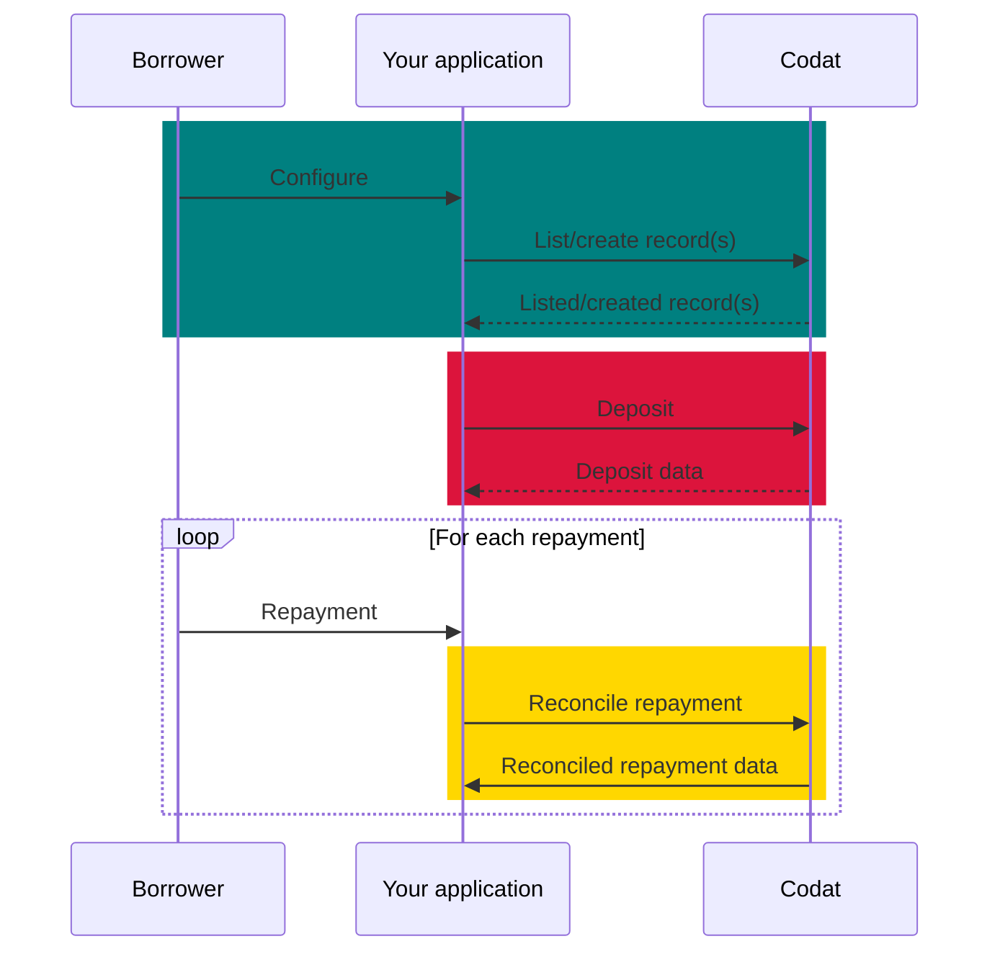
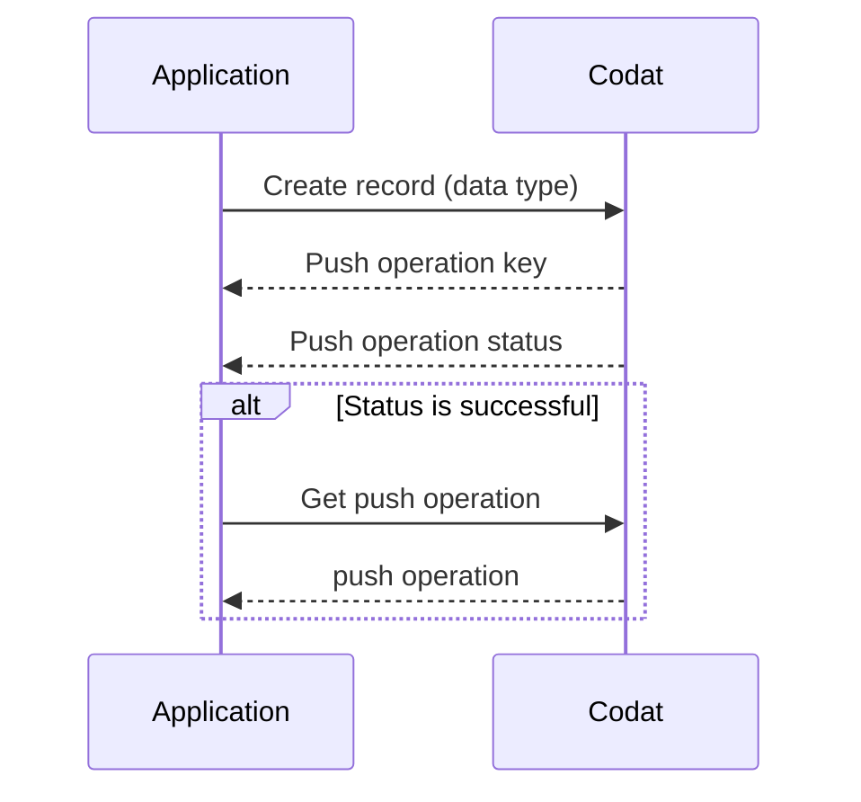
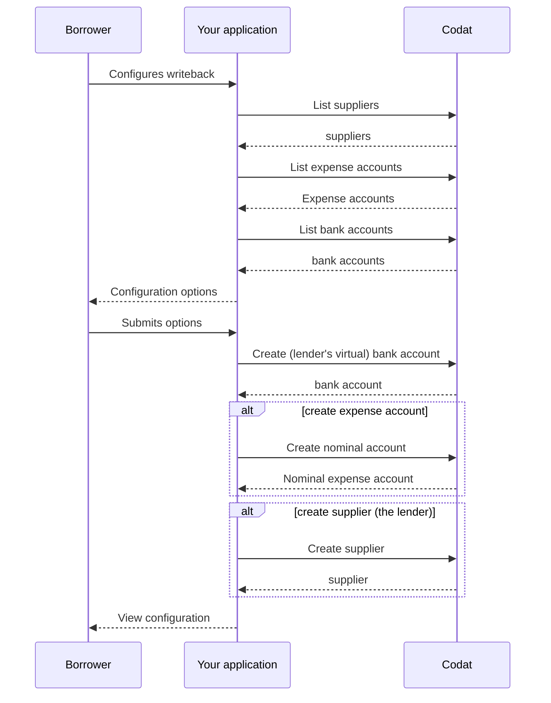
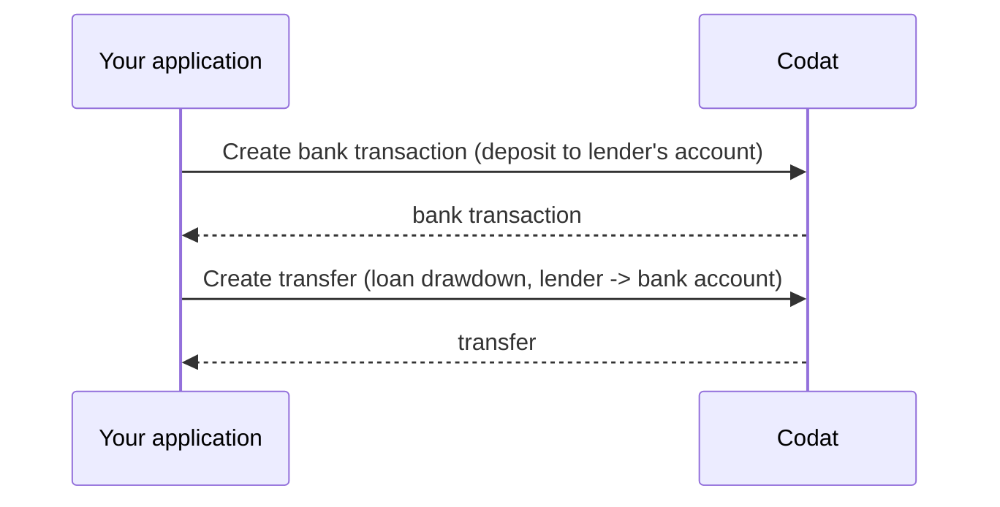
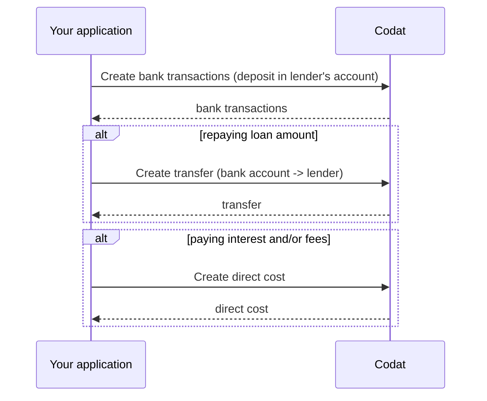

## What is it?

Loan writeback (also known as lending writeback) is the process of continuously updating an accounting platform with information on a loan. It helps maintain an accurate position of the loan during the entire lending cycle by recording the loan liability, any interest, fees, or repayments, and facilitating the reconciliation of bank transactions. 

:::info Mandatory loan writeback

Certain accounting platforms **require** lenders to continuously update their books with money lent to SMBs. For example, **Xero** obligates lenders going through the [App Partner certification](/integrations/accounting/xero/xero-app-partner-program) process to handle the writeback process. 

:::

## Why use it?

A bookkeeper can account for a loan in numerous ways in an accounting platform. For example, some bookkeepers may erroneously register a loan as a direct income or even a sales invoice. This results in loans being improperly recorded as revenue and repayments as operating costs. At the end of the reporting period, this can make it hard for the bookkeeper to close their books. 

By implementing loan writeback functionality in your application, you can make sure loan bookeeping is done regularly, correctly, and quickly, and always see an up-to-date state of the borrower's accounts.

## What's the process?

The process of loan writeback involves recording loan withdrawals, repayments, and interest in the SMB's accounting platform. It can be split into three stages, as shown on the diagram below: 

1. **Configure** loan writeback for your SMB customer.  

2. **Deposit** funds into your SMB's accounting platform.

3. **Repay** money owed to you, the lender, in your SMB's accounting platform.



## Prerequisites

* Check that you have [created a Codat company](/configure/portal/companies#add-a-new-company) that represents your SMB customer and linked it to an accounting platform. If you are using Codat for lending, it's likely you have already done this. You can also create and connect a test company to use while you build your solution.

* Familiarize yourself with Codat's approach of asynchronously [creating and updating data](/using-the-api/push), which can be summarized as follows:



* If you are implementing loan writeback for Xero, make sure that Xero have enabled the *Xero Bank Feeds API* for your registered app. In order to create and update bank transactions, your application must be approved by [Xero's certification program](https://developer.xero.com/documentation/xero-app-store/app-partner-guides/app-partner-steps/).

* Provide the customer with a user interface that gives the option to enable the loan writeback process flow and configure or update their account mapping, for example: 


## Configure loan writeback

First, your SMB customer will use your UI to configure loan writeback accounts so that the accounting entries are reflected correctly in their accounting platform. They will create or select existing, and subsequently map, the following elements:

* SMB bank account
* Lender bank account 
* Expense account
* Supplier record

Let's go through that in detail. 



### Bank account

Loan writeback process operates with two bank accounts: a borrower's business bank account, where the lent money is deposited, and a lender's bank account, which is a virtual account in the accounting platform that acts as a container for lender transactions. 

Your customer can choose to map their existing accounts to these concepts, or request to create a new one. First, use our [List accounts](/lending-api#/operations/list-banking-accounts) endpoint to retrieve the customer's existing bank accounts. 

```http
GET https://api.codat.io/companies/{companyId}/connections/{connectionId}/data/banking-accounts
```
Display the response to the customer and allow them to select the account their payments will be transferred to. Store the returned `id` and use it as the borrower account Id in future operations. 

Repeat this process to list and select a lender bank account.

If the customer wants to nominate a new account for the purposes of loan writeback, enable them to provide account details, such as name (AND SOMETHING ELSE I ASSUME?). Then, use our Create bank account(THIS ENDPOINT DOES NOT SEEM TO BE IN LENDING API? NO CREATE BANK ACCOUNT ONES THERE) endpoint to create the new account in the accounting platform.

```http
POST blabla
```
In response, you will receive account creation details which you can display to your customer. Similarly, store the `id` and use it in future transactions. 

### Supplier

In order to create a spend money transaction, Codat requires suppler details that represent the lender. You can let your customer choose an existing supplier to serve as a lender in their accounting system. Use our [List suppliers](/lending-api#/operations/list-accounting-suppliers) endpoint to fetch the list of existing suppliers. 

```http
GET https://api.codat.io/companies/{companyId}/data/suppliers
```

Display the response to the customer and allow them to select the suppliers that represents their lender. Store the `id` and use it as supplier Id in future transactions.

Alternatively, you can create a new lender in Codat using our Create supplier(THIS IS ALSO MISSING?) endpoint.

```http
create supplier
```

Similarly, store the `id` and use it in future transactions.

### Expense account

Finally, use our [List accounts](/lending-api#/operations/list-accounting-accounts) endpoint to retrieve the customer's existing expense accounts. You can even filter them by `type = Expense`. This account will be used to record fees and interest. 

```http
GET https://api.codat.io/companies/{companyId}/data/accounts
```
Display the response to the customer and allow them to select the desired expense account. Store the `id` and use it as the expense account Id in future operations. 

If the customer wants to create a new nominal expense account for this purpose, use our Create account(THIS ALSO DOESNT EXIST?) endpoint to enable that. 

```http
POST blabla
```

In response, you will receive account creation details which you can display to your customer. Similarly, store the `id` and use it in future transactions. 

## Deposit the loan

Once you receive the configuration information, you are ready to deposit funds into the borrower's bank account. This is also known as *loan drawdown*, and it is a two-step process.  

For each drawdown, [create a bank transaction](/lending/guides/general-loan-writeback#create-bank-transaction) depositing the amount into the lender's bank account to make the funds available for drawdown. Then, [create a transfer](/lending/guides/general-loan-writeback#create-transfer) from the lender's bank account to the borrower's bank account. 

(WHY IS THIS THE SEQUENCE? SURELY YOU NEED TO DO A BAN TRANSACTION FIRST TO HAVE THE FUND AVAILABLE, AND THEN THE TRANSFER TO MVOE THEM?)



### Create bank transaction

Use our Create bank transactions(THIS IS NOT IN LENDING API) to deposit the amount into the lender's bank account with the following information included:

```http
post trasaction
```
```json
{
  "accountId": lendersBankAccount.Id, // lender's bank account id you would have stored from the configuration step
  "transactions": [{
    "id": transactionId, // some unique identifier of the bank transaction
    "amount": amount, // amount to pay
    "date": date / time of the transfer,
    "description": description
  }]
}
```

### Create transfer

Next, transfer the money from the lender's bank account to the borrower's bank account using our Create transfer(THIS ALSO DOES NOT EXIST???). Note that you are performing a transfer *from* the lender's account Id *to* the borrower's account Id.

```http
post transfer
```
## Repay the loan

Based on the loan's terms and conditions, the borrower will preiodically repay the lender the loan amount and any associated fees. 

For each repayment, [create a transfer](/lending/guides/general-loan-writeback#create-transfer) from the borrower's bank account to the lender's. To record interest or fees, [create a direct cost](/lending/guides/general-loan-writeback#create-direct-cost). Finally, to follow the accepted accounting principles, [create bank transactions](/lending/guides/general-loan-writeback#create-bank-transaction) to deposit the repayment into the lender's account. Repeat these steps every time a repayment is made.

For example, if the borrower took out a loan of £1000 and agreed on a loan charge of 20%, the total amount due comes to £1200. With a 3-month equal instalment repayment plan, the borrower would pay back £400 each month. This means a transfer of £320 to represent the payment, a direct cost of £80 to record the fees, and a bank transaction of £400 to reduce the liability to the lender.



### Create bank transaction

Use the Create bank transactions(WHERE IS THIS ISH) endpoint to deposit the total amount (including the repayment, fees, and any interest) into the lender's bank account.

```http
post trasaction
```
### Create transfer

Next, transfer the money from the borrower's bank account to the lenders's bank account using the Create transfer(THIS ALSO DOES NOT EXIST???) endpoint to record the loan repayment amount. Note that you are performing a transfer *from* the borrower's account Id *to* the lender's account Id.

```http
post transfer
```

### Create direct cost

Finally, use the Create direct cost(GUESS WHAT, THIS ALSO DOESNT EXIST) endpoint to capture the amount of fees or interest incurred by the borrower.

```http
POST push it baby
```

Make sure to populate the following information:

```json
{
	"issueDate": current date time,
	"currency": Base currency of accounting platform,
	"taxAmount": 0.0,
	"totalAmount": direct cost amount,
	"contactRef": {
		"id": supplier.id, // supplier id you would have previouly stored
		"dataType": "suppliers"
	},
	"paymentAllocations": [{
		"payment": {
			"accountRef": {
				"id": depositBankAccountId // lender's bank account id
			}
		},
		"allocation": {
			"totalAmount": direct cost amount
		}
	}],
	"lineItems": [{
		"description": Fees and/or interest,
		"quantity": 1,
		"unitAmount": directCostAmount,
		"taxAmount": 0,
		"accountRef": {
			"id": expenseAccount.id // selected expense account id
		}
	}]
}
```

As a result of this process, your borrower will have the loan writeback reflected correctly in their accounting platform, saving their time on reconciliation and making sure they (and you!) have clarity on the state of the loan.

:::tip Recap
In this guide, you have learned:
* What is loan writeback and what it's used for.
* How to map and configure the loan writeback solution.
* How to perform the necessary postings using Codat's endpoints.
:::

---

## Read next

* Looking to implement loan writeback for Xero? Don't forget to view Xero's [own documentation](https://developer.xero.com/documentation/guides/how-to-guides/general-lending-integration-guide/).
* Review other features of the [Lending API](/lending/overview).