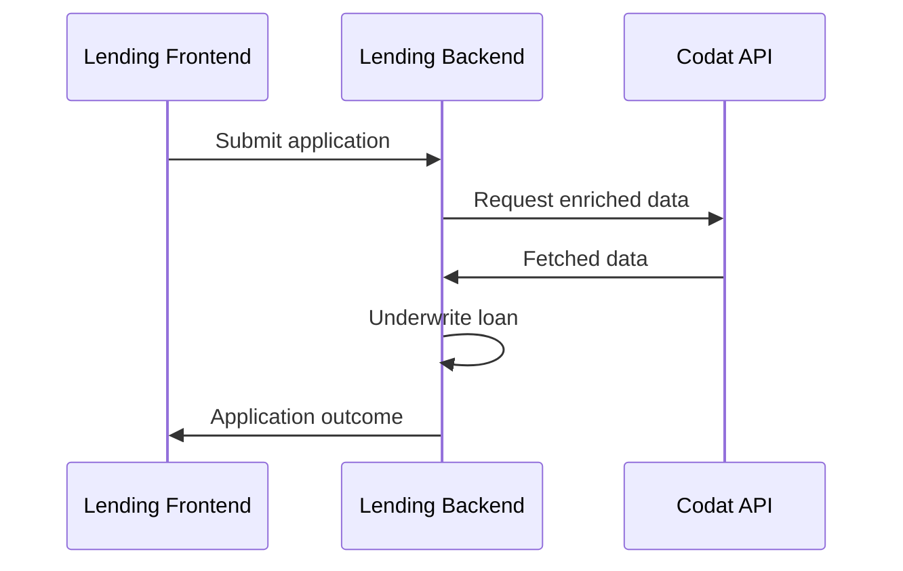

import Tabs from '@theme/Tabs';
import TabItem from '@theme/TabItem';

### 🚀 In this section, you will...

* Review the basic process flow followed by the demo app,
* Create a new loan application,
* Create a Codat company and connect it to the Codat Sandbox,
* Fetch financial data to assess the applicant's financial health, 
* Categorize accounts that were omitted by Lending, and
* Receive a decision on the loan. 

:::note Loan qualification demo process flow

This diagram shows the steps of the loan qualification process as performed by the demo app. It helps you visualize the relationship and information exchange between the app's different components.


You can also review the detailed technical [diagram](https://github.com/codatio/demo-loan-qualification#implementing-the-solution) of the flow that the demo app follows.
:::  

### <input type="checkbox" unchecked /> Start a new loan application  

🙏🏽 This step is normally performed by the borrower.

:::note Underwriting frontend

We use [Swagger](http://localhost:5069/swagger/index.html) to act as a presentation layer to interact with the demo endpoints. There are three endpoints that support the creation and processing of the application form, and three endpoints to interact with webhook rules you have previously set up. Remember to click **Try it out** and **Execute** when working with Swagger.
:::

Call the `/applications/start` endpoint to trigger the creation of a new loan application. In the background, the app creates a company using Codat's `POST /companies` endpoint using the application `id` as the company name.

Codat returns the company and application `id`s in the endpoint response together with a `linkUrl`. In the demo, we will use these elements to fill in the application details and connect a data source next.  

```json title="Example endpoint response"
  {
    "id": "1c727866-6923-4f81-aa7b-c7fd8c533586",
    "codatCompanyId": "a9e28b79-6a98-4190-948d-3bd4d60e7c0a",
    "status": "Started", 
    "linkUrl": "https://link.codat.io/company/a9e28b79-6a98-4190-948d-3bd4d60e7c0a"
  }
```

### <input type="checkbox" unchecked /> Provide application details  

🙏🏽 This step is normally performed by the borrower.

Once you receive the application id, complete the application form using the `/applications/{applicationId}/form` endpoint. In our demo, we request the applicant's full name, company name, and the loan amount, length, and purpose. If the details provided are valid, they are stored against the application `id` with an acknowledgment of their receipt. 

```json title="Example application form"
  {
    "id": "applicationId", 
    "companyName": "Example Company",
    "fullName": "John Smith",
    "loanAmount": 25000.00, // must be greater than zero 
    "loanTerm": 36, // must be at least 12 months
    "loanPurpose": "Growth marketing campaign"
  }
```

### <input type="checkbox" unchecked /> Share financial data  

🙏🏽 This step is normally performed by the borrower.

Next, you need to provide Codat access to an accounting platform so that we can fetch the data required to underwrite the application. Open the `linkUrl` returned by the new application response in your browser window. Follow the flow built using [Link](/auth-flow/overview), our hosted or embedded integrated authorization flow. 

Select the **Codat Sandbox** as the source of accounting data.
* You can choose any company type that best fits your use case.
* You don't need to enter any credentials to authorize this connection. 
* You should also skip the step of uploading business documents. 


### <input type="checkbox" unchecked /> Check categorized accounts 

💰 This step is normally performed by the lender.

The demo app makes use of the categorization feature of [Lending](/lending/overview). When fetching financial data, Codat’s Lending product analyses the full list of a company's accounts and assigns a category to each account. While it is able to automatically categorize most of the source accounts, it is not always possible, and manual intervention may be required. 

In our demo, all accounts are successfully categorized. However, your underwriter may want to review the suggested categories before continuing on with the assessment.

They can do this by navigating to the [companies page](https://app.codat.io/companies) of the portal.
Next, click on the company you are performing loan qualification for, and navigate to **Lending > Categorize accounts**.


This takes you to the **Account categorization** page which displays the categorized accounts.
Take a look and check that you are happy with Codat's suggestions or override a suggestion by selecting the tick box and re-categorize.


### <input type="checkbox" unchecked /> Make the decision on the loan 

🙏🏽💰 The decisioning is normally performed by the lender, but the borrower is able to query an application's status at any point.

The demo app now has all the components that it needs to produce a loan qualification decision. The decision is automatically made by the 
[LoanUnderwriter](https://github.com/codatio/demo-loan-qualification/blob/main/Codat.Demos.Underwriting.Api/Services/LoanUnderwriter.cs) service based on thresholds that need to be passed by the applicant. We then update the loan application with a relevant status to indicate the decision made on the loan or any errors that occurred in the process. You can poll the `GET applications/{applicationId}` endpoint in [Swagger](http://localhost:5069/swagger/index.html) anytime to check the status of your loan. 

### 💪 Ready for more? 

Try these suggestions to make the most of your experience with the demo app:

- **View Lending in the Portal**  
  Navigate to **Products > Lending** in the [Portal](https://app.codat.io/) to view a visual representation of the financial data pulled by our endpoints, including `balanceSheet` and `profitAndLoss`.
  
- **Play around with thresholds**  
  In the `appsettings.json` file in the `Codat.Demos.Underwriting.Api\` directory, set your own example thresholds for data points used by the app's loan qualification service and see how this affects the application decision.

- **Underwrite using different datasets**  
  Start another loan application, and choose a different Sandbox company type to get a different set of financial data to be used in the decision-making. 

- **Use a company's real data**  
  Take the demo one step further and use real credentials to access existing financial data in an accounting platform. Set up the [integration](/integrations/accounting/overview) you plan to use, and connect to it while following the auth flow. Then, review how the app makes a decision based on your company's real data. 

- **Inspect the loan qualification logic**  
  We provide [detailed information](/lending/guides/loan-qualification/uw-decision) about the loan qualification logic we included in our demo app, and how exactly the financial data is fetched. 
  

### Recap

You have now successfully run the demo app, covering all the key loan qualification process steps. You have started and completed an application, connected and fetched accounting data, and received a decision on your loan application. 
