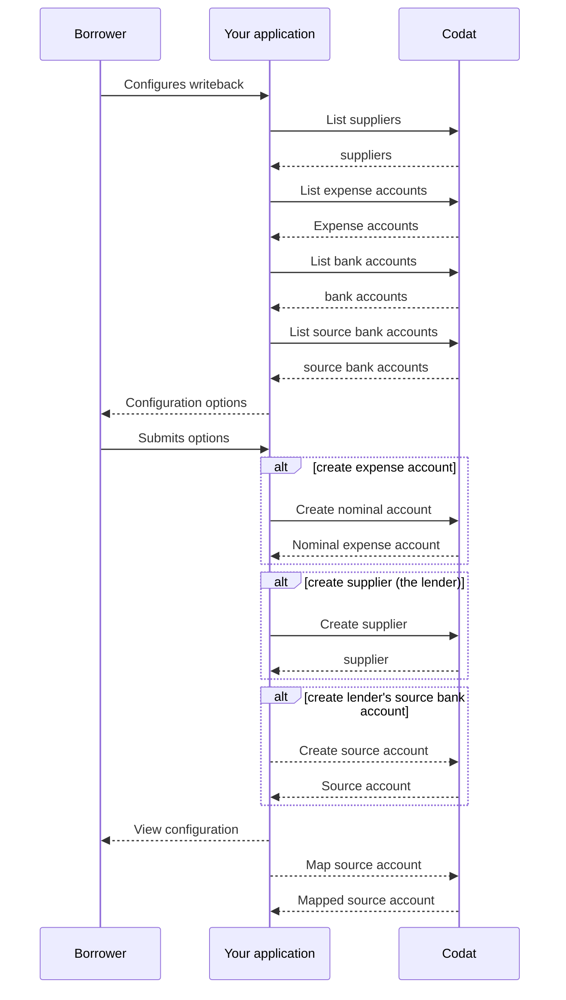

import Tabs from '@theme/Tabs';
import TabItem from '@theme/TabItem';
import WritebackMapping from "@components/Prototypes/WritebackMapping";

Once your SMB customer's loan has been approved, provide them with a user interface that lets them optionally enable the loan writeback and configure loan writeback accounts so that the accounting entries are reflected correctly in their accounting software. They will create or select existing, and subsequently map, the following elements:

* **SMB bank account**, the borrower's business account where the loan is deposited.
* **Expense account**, an account to record incurred fees and interest.
* **Supplier record**, a record to identify you, the lender, in future transactions.

Your solution also requires a **lender bank account** - a virtual account that contains the lender's transactions.
This account, also known as a container, clearing, or drawdown account, is used to manage and track funds related to lending activities.

:::info Let your customers take control

In some cases, the SMB's bookkeeper will want to manage their accounts themselves. To do this, make sure to offer your customers the option to disable loan writeback for manual reconciliation.

:::

For example, your user interface might look something like this:

<WritebackMapping/>

Let's go through this process in detail. On the diagram below, you can see the configuration sequence covering the display and selection of a bank account, an expense account, and a supplier record. Alternative steps are also provided in case a new account and a new supplier need to be created. 



### Bank account

The loan writeback process uses two bank accounts:
- A borrower's business bank account where the money lent is deposited.
- A lender's bank account, which is a virtual account in the accounting software that serves as a container for lender transactions. 
    
    The borrower can choose an existing source bank account or ask to create a new one. This is done when [setting up the bank feed source account](#bank-feed-source-account).

First, your customer needs to choose one of their existing business bank accounts. This account will be used to depost the loan. Call our [List bank accounts](/lending-api#/operations/list-accounting-bank-accounts) endpoint to retrieve the customer's existing bank accounts. 

<Tabs groupId="language">
<TabItem value="nodejs" label="TypeScript">

```javascript
codatLending.accountingBankData.accounts.list({
    companyId: companyId,
    connectionId: connectionId
}).then((res: ListAccountingBankAccountsResponse) => {
if (res.statusCode == 200) {
    // handle response
}
});
```
</TabItem>

<TabItem value="python" label="Python">

```python
bank_accounts_list_request = operations.ListAccountingBankAccountsRequest(
    company_id=company_id,
    connection_id=connection_id
)

bank_accounts_list_response = codat_lending.accounting_bank_data.accounts.list(bank_accounts_list_request)
```
</TabItem>

<TabItem value="csharp" label="C#">

```csharp
var bankAccountsListResponse = await codatLending.AccountingBankData.Accounts.ListAsync(new ListAccountingBankAccountsRequest() {
    CompanyId = companyId,
    ConnectionId = connectionId
});
```
</TabItem>

<TabItem value="go" label="Go">

```go
ctx := context.Background()
bankAccountsListResponse, err := codatLending.AccountingBankData.Accounts.List(
    ctx, 
    operations.ListAccountingBankAccountsRequest{
        CompanyID: companyID,
        ConnectionID: connectionID,
    })
```
</TabItem>

<TabItem value="http" label="HTTP">

```http
GET https://api.codat.io/companies/{companyId}/connections/{connectionId}/data/bankAccounts
```
</TabItem>

</Tabs>

Display the response to the customer and allow them to select the account. Store the returned bank account as `borrowersBankAccount` and use it to access properties on the borrower's bank account in future operations. 

### Supplier

In order to create a *spend money* transaction, Codat requires you, the lender, to be represented as a [supplier](../../../terms/supplier) in your SMB's accounting system. 

Let your customer check if your record already exists in their accounts. Use our [List suppliers](/lending-api#/operations/list-accounting-suppliers) endpoint to fetch the list of existing suppliers. 

<Tabs groupId="language">
<TabItem value="nodejs" label="TypeScript">

```javascript
codatLending.accountsPayable.suppliers.list({
    companyId: companyId,
}).then((res: ListAccountingSuppliersResponse) => {
if (res.statusCode == 200) {
    // handle response
}
});
```
</TabItem>

<TabItem value="python" label="Python">

```python
suppliers_list_request = operations.ListAccountingSuppliersRequest(
    company_id=company_id,
)

suppliers_list_response = codat_lending.accounts_payable.suppliers.list(suppliers_list_request)
```
</TabItem>

<TabItem value="csharp" label="C#">

```csharp
var suppliersListResponse = await codatLending.AccountsPayable.Suppliers.ListAsync(new ListAccountingSuppliersRequest() {
    CompanyId = companyId
});
```
</TabItem>

<TabItem value="go" label="Go">

```go
ctx := context.Background()
suppliersListResponse, err := codatLending.AccountsPayable.Suppliers.List(ctx, operations.ListAccountingSuppliersRequest{
    CompanyID: companyID
})
```
</TabItem>

<TabItem value="http" label="HTTP">

```http
GET https://api.codat.io/companies/{companyId}/data/suppliers
```
</TabItem>

</Tabs>

Display the response to the customer and allow them to find and select your lender record in their supplier list. Store the supplier `id` as `supplier` and use it in future transactions.

If this is the first time you have lent to this SMB customer, you may need to create yourself as a new supplier in their accounting software. 

1. Use our [Get create/update supplier model](/lending-api#/operations/get-create-update-suppliers-model) to get the expected data for the supplier creation request payload. The data required can vary depending on the platform.
2. Use that payload to call the [Create supplier](/lending-api#/operations/create-supplier) endpoint to create the new supplier record in the accounting software.

<Tabs groupId="language">
<TabItem value="nodejs" label="TypeScript">

```javascript
codatLending.loanWriteback.suppliers.create({
    accountingSupplier: {
        addresses: [
        {
            line1: "Stoney Business Park",
            city: "London",
            country: "UK",
            postalCode: "SE14 1PE",
            type: AccountingAddressType.Billing,
        },
        ],
        contactName: "David",
        defaultCurrency: "GBP",
        emailAddress: "david@example.com",
        phone: "+44 25691 154789",
        registrationNumber: "0115633",
        status: SupplierStatus.Active,
        supplierName: "Bank of Dave",
    },
    companyId: companyId,
    connectionId: connectionId,
    }).then((res: CreateSupplierResponse) => {
    if (res.statusCode == 200) {
        // handle response
    }
});
```
</TabItem>

<TabItem value="python" label="Python">

```python
supplier_create_request = operations.CreateSupplierRequest(
    accounting_supplier=shared.AccountingSupplier(
        addresses=[
            shared.AccountingAddress(
                line1='Stoney Business Park',
                city='London',
                country='UK',
                postal_code='SE14 1PE',
                type=shared.AccountingAddressType.BILLING,
            ),
        ],
        contact_name='David',
        default_currency='GBP',
        email_address='david@example.com',
        phone='+44 25691 154789',
        registration_number='0115633',
        status=shared.SupplierStatus.ACTIVE,
        supplier_name='Bank of Dave',
    ),
    company_id=company_id,
    connection_id=connection_id,
)

supplier_create_response = codat_lending.loan_writeback.suppliers.create(supplier_create_request)
```
</TabItem>

<TabItem value="csharp" label="C#">

```csharp
var suppliersCreateResponse = await codatLending.LoanWriteback.Suppliers.CreateAsync(new CreateSupplierRequest() {
    AccountingSupplier = new AccountingSupplier() {
        Addresses = new List<AccountingAddress>() {
            new AccountingAddress() {
                Line1 = "Stoney Business Park",
                City = "London",
                Country = "UK",
                PostalCode = "SE14 1PE",
                Type = CodatLending.Models.Shared.AccountingAddressType.Billing,
            },
        },
        ContactName = "David",
        DefaultCurrency = "GBP",
        EmailAddress = "david@example.com",
        Phone = "+44 25691 154789",
        RegistrationNumber = "0115633",
        Status = CodatLending.Models.Shared.SupplierStatus.Active,
        SupplierName = "Bank of Dave",
    },
    CompanyId = companyId,
    ConnectionId = connectionId,
});
```
</TabItem>

<TabItem value="go" label="Go">

```go
ctx := context.Background()
suppliersCreateResponse, err := codatLending.LoanWriteback.Suppliers.Create(ctx, operations.CreateSupplierRequest{
    AccountingSupplier: &shared.AccountingSupplier{
        Addresses: []shared.AccountingAddress{
            shared.AccountingAddress{
                Line1: lending.String("nulla"),
                City: lending.String("London"),
                Country: lending.String("UK"),
                PostalCode: lending.String("SE14 1PE"),
                Type: shared.AccountingAddressTypeBilling,
            },
        },
        ContactName: lending.String("David"),
        DefaultCurrency: lending.String("GBP"),
        EmailAddress: lending.String("david@example.com"),
        Phone: lending.String("+44 25691 154789"),
        RegistrationNumber: lending.String("0115633"),
        Status: shared.SupplierStatusActive,
        SupplierName: lending.String("Bank of Dave"),
    },
    CompanyID: companyID,
    ConnectionID: connectionID,
})
```
</TabItem>

<TabItem value="http" label="HTTP">

```http
POST https://api.codat.io/companies/{companyId}/connections/{connectionId}/push/suppliers
```

#### Request body
```json
{
    "contactName": "David",
    "defaultCurrency": "GBP",
    "emailAddress": "david@example.com",
    "phone": "+44 25691 154789",
    "registrationNumber": "0115633",
    "status": "Active",
    "supplierName": "Bank of Dave",
    "addresses": [
        {
            "line1": "Stoney Business Park",
            "city": "London",
            "country": "UK",
            "postalCode": "SE14 1PE",
            "type": "Billing",
        }
    ]
}
```
</TabItem>

</Tabs>

Similarly, store the `supplier` and use it in future transactions.

### Expense account

Next, use our [List accounts](/lending-api#/operations/list-accounting-accounts) endpoint filtered by `type=Expense` to retrieve the customer's existing expense accounts. Let them choose one that will be used to record fees and interest. 

<Tabs groupId="language">
<TabItem value="nodejs" label="TypeScript">

```javascript
codatLending.financialStatements.accounts.list({
    companyId: companyId,
    query: "type=Expense",
}).then((res: ListAccountingAccountsResponse) => {
if (res.statusCode == 200) {
    // handle response
}
});
```
</TabItem>

<TabItem value="python" label="Python">

```python
accounts_list_request = operations.ListAccountingAccountsRequest(
    company_id=company_id,
    query='type=Expense',
)

accounts_list_response = codat_lending.financial_statements.accounts.list(accounts_list_request)
```
</TabItem>

<TabItem value="csharp" label="C#">

```csharp
var accountsListResponse = await codatLending.FinancialStatements.Accounts.ListAsync(new ListAccountingAccountsRequest() {
    CompanyId = companyId,
    Query = "type=Expense",
});
```
</TabItem>

<TabItem value="go" label="Go">

```go
ctx := context.Background()
accountsListResponse, err := codatLending.FinancialStatements.Accounts.List(ctx, operations.ListAccountingAccountsRequest{
    CompanyID: companyId,
    Query: lending.String("type=Expense"),
})
```
</TabItem>

<TabItem value="http" label="HTTP">

```http
GET https://api.codat.io/companies/{companyId}/data/accounts?query=type%3e0Expense
```
</TabItem>

</Tabs>

Display the response to the customer and allow them to select the desired expense account. Store the account as `expenseAccount` and use it as the expense account in future operations. 

If the customer wants to create a new nominal expense account for this purpose, use our [Get create account model](/lending-api#/operations/get-create-chartOfAccounts-model) to figure out what payload is required for account creation. 

Next, call the [Create account](/lending-api#/operations/create-account) endpoint to create the new account. 

<Tabs groupId="language">
<TabItem value="nodejs" label="TypeScript">

```javascript
codatLending.loanWriteback.accounts.create({
accountingAccount: {
    currency: "USD",
    currentBalance: 0,
    description: "Invoices the business has issued but has not yet collected payment on.",
    fullyQualifiedCategory: "Asset.Current",
    fullyQualifiedName: "Cash On Hand",
    name: "Accounts Receivable",
    nominalCode: "610",
    status: AccountStatus.Active,
    type: AccountType.Asset,
    
},
companyId: companyId,
connectionId: connectionId,
}).then((res: CreateAccountResponse) => {
if (res.statusCode == 200) {
    // handle response
}
});
```
</TabItem>

<TabItem value="python" label="Python">

```python
accounts_create_request = operations.CreateAccountRequest(
    accounting_account=shared.AccountingAccount(
        currency='USD',
        current_balance=Decimal('0'),
        description='Invoices the business has issued but has not yet collected payment on.',
        fully_qualified_category='Asset.Current',
        fully_qualified_name='Cash On Hand',
        name='Accounts Receivable',
        nominal_code='610',
        status=shared.AccountStatus.ACTIVE,
        type=shared.AccountType.ASSET,
    ),
    company_id=company_id,
    connection_id=connection_id,
)

accounts_create_response = codat_lending.loan_writeback.accounts.create(accounts_create_request)
```
</TabItem>

<TabItem value="csharp" label="C#">

```csharp
var accountsCreateResponse = await codatLending.LoanWriteback.Accounts.CreateAsync(new CreateAccountRequest() {
    AccountingAccount = new AccountingAccount() {
        Currency = "USD",
        CurrentBalance = 0M,
        Description = "Invoices the business has issued but has not yet collected payment on.",
        FullyQualifiedCategory = "Asset.Current",
        FullyQualifiedName = "Cash On Hand",
        Name = "Accounts Receivable",
        NominalCode = "610",
        Status = CodatLending.Models.Shared.AccountStatus.Active,
        Type = CodatLending.Models.Shared.AccountType.Asset
    },
    CompanyId = companyId,
    ConnectionId = connectionId,
});
```
</TabItem>

<TabItem value="go" label="Go">

```go
ctx := context.Background()
accountsCreateResponse, err := codatLending.LoanWriteback.Accounts.Create(ctx, operations.CreateAccountRequest{
    AccountingAccount: &shared.AccountingAccount{
        Currency: lending.String("USD"),
        CurrentBalance: types.MustNewDecimalFromString("0"),
        Description: lending.String("Invoices the business has issued but has not yet collected payment on."),
        FullyQualifiedCategory: lending.String("Asset.Current"),
        FullyQualifiedName: lending.String("Cash On Hand"),
        Name: lending.String("Accounts Receivable"),
        NominalCode: lending.String("610"),
        Status: shared.AccountStatusActive.ToPointer(),
        Type: shared.AccountTypeAsset.ToPointer(),
    },
    CompanyID: companyID,
    ConnectionID: connectionID
})
```
</TabItem>

<TabItem value="http" label="HTTP">

```http
POST https://api.codat.io/companies/{companyId}/connections/{connectionId}/push/accounts
```

#### Request body

```json
{
    "currency": "USD",
    "currentBalance": 0,
    "description": "Invoices the business has issued but has not yet collected payment on.",
    "fullyQualifiedCategory": "Asset.Current",
    "fullyQualifiedName": "Cash On Hand",
    "name": "Accounts Receivable",
    "nominalCode": "610",
    "status": "Active",
    "type": "Asset"
}
```
</TabItem>

</Tabs>

In response, you will receive account creation details which you can display to your customer. Similarly, store the account as `expenseAccount` for use in future transactions.

### Bank feed source account

Finally, create and map a source account to enable the flow of bank transactions that the SMB can reconcile in their accounting software. This two-step process establishes the lender’s bank account, defined as `lendersBankAccountId`, in your solution.

If your borrower wants to use an existing bank feed source account to represent the lender, it's expected you have completed the mapping for this scenario using [Bank Feeds](/bank-feeds/mapping/api-mapping).

#### Create source account

Use the [Create source account](/lending-api#/operations/create-source-account) endpoint to create a representation of the lender's bank account within Codat's domain. The account must be in the loan's agreed currency. Ensure it has a zero balance and specify an ID and account number of your choice. For bank accounts in GBP, `sortCode` is also a required field. 

<Tabs>

<TabItem value="nodejs" label="TypeScript">

```javascript
const sourceAccountResponse = bankFeedsClient.sourceAccounts.create({
    sourceAccount: {
      id: "bank-of-dave-lenders-account",
      accountName: "Bank of Dave - loan account",
      accountType: "loan",
      accountNumber: "66260701",
      currency: loanCurrency,
      balance: 0.00
    },
    companyId: companyId,
    connectionId: connectionId
  });

const lendersBankAccountId = sourceAccountResponse.oneOf.sourceAccountV2.id;
```

</TabItem>

<TabItem value="python" label="Python">

```python
source_account_request = operations.CreateSourceAccountRequest(
    id="bank-of-dave-lenders-account",
    accountName="Bank of Dave - loan account",
    accountType=AccountType.LOAN,
    accountNumber="66260701",
    currency=loan_currency,
    balance=0.00
  ),
  company_id=company_id,
  connection_id=connection_id
)

source_account_response = codatLending.source_accounts.create(req)

lenders_bank_account_id = source_account_response.oneOf.sourceAccountV2.id
```

</TabItem>

<TabItem value="csharp" label="C#">

```csharp
var sourceAccountResponse = await codatLending.SourceAccounts.CreateAsync(new() {
    SourceAccount = new SourceAccount() {
      Id = "bank-of-dave-lenders-account",
      AccountName = "Bank of Dave - loan account",
      AccountType = AccountType.Loan,
      AccountNumber = "66260701",
      Currency = loanCurrency,
      Balance = 0.00
    },
    CompanyId = companyId,
    ConnectionId = connectionId
});

var lendersBankAccountId = sourceAccountResponse.OneOf.SourceAccountV2.Id;
```

</TabItem>

<TabItem value="go" label="Go">

```go
ctx := context.Background()
sourceAccountResponse, err := codatLending.LoanWriteback.SourceAccounts.Create(ctx, operations.CreateSourceAccountRequest{
    SourceAccount: &shared.SourceAccount{
      ID: lending.String("bank-of-dave-lenders-account"),
      AccountName: lending.String("Bank of Dave - loan account"),
      AccountType: shared.AccountTypeLoan,
      AccountNumber: lending.String("66260701"),
      Currency: lending.String(loanCurrency),
      Balance: 0.00
    },
    CompanyID: companyID,
    ConnectionID: connectionID
})

lendersBankAccountId := sourceAccountResponse.OneOf.SourceAccountV2.ID;
```
</TabItem>

<TabItem value="java" label="Java">

```java
CreateSourceAccountRequest req = CreateSourceAccountRequest.builder()
    .requestBody(CreateSourceAccountRequestBody.of(SourceAccountV2.builder()
        .id("bank-of-dave-lenders-account")
        .accountName("Bank of Dave - loan account")
        .accountType(AccountType.LOAN)
        .accountNumber("66260701")
        .currency(loanCurrency)
        .balance(new BigDecimal("0.00"))
        .build()))
    .companyId(companyId)
    .connectionId(connectionId)
    .build();

CreateSourceAccountResponse sourceAccountResponse = codatLending.loanWriteback()
    .sourceAccounts()
    .create()
    .request(req)
    .call();

String lendersBankAccountId = sourceAccountResponse.oneOf.sourceAccountV2.id;
```

</TabItem>

</Tabs>

#### Map source account

To complete the setup, create a representation of the source account in the accounting software. Use the [Create bank feed account mapping](/lending-api#/operations/create-bank-account-mapping) endpoint to achieve this, mapping the source account without assigning a target account. When implementing for Xero, this will create a target account automatically on the next operation (e.g. when you call the [List bank feed account mappings](https://docs.codat.io/lending-api#/operations/get-bank-account-mapping) endpoint).

<Tabs>

<TabItem value="nodejs" label="TypeScript">

```javascript
const mappingResponse = await codatLending.loanWriteback.sourceAccounts.createMapping({
    companyId: companyId,
    connectionId: connectionId,
    bankFeedBankAccountMapping: {
      sourceAccountId: lendersBankAccountId,
    },
  });
```

</TabItem>

<TabItem value="python" label="Python">

```python
mapping_response = codat_lending.loan_writeback.source_accounts.create_mapping(request={
    "company_id": company_id,
    "connection_id": connection_id,
    "bank_feed_bank_account_mapping": {
        "source_account_id": lenders_bank_account_id,
    },
})
```

</TabItem>

<TabItem value="csharp" label="C#">

```csharp
var mappingResponse = await codatLending.LoanWriteback.SourceAccounts.CreateMappingAsync(new() {
    CompanyId = companyId,
    ConnectionId = connectionId,
    BankFeedBankAccountMapping = new BankFeedBankAccountMapping() {
        SourceAccountId = lendersBankAccountId,
    },
});
```

</TabItem>

<TabItem value="go" label="Go">

```go
ctx := context.Background()
mappingResponse, err := codatLending.LoanWriteback.SourceAccounts.CreateMapping(
    ctx,
    operations.CreateBankAccountMappingRequest{
        CompanyID: companyID,
        ConnectionID: connectionID,
        BankFeedBankAccountMapping: &shared.BankFeedBankAccountMapping{
            SourceAccountID: lendersBankAccountID,
        }
    }
)
```
</TabItem>

<TabItem value="java" label="Java">

```java
CreateBankAccountMappingRequest req = CreateBankAccountMappingRequest.builder()
    .companyId(companyId)
    .connectionId(connectionId)
    .bankFeedBankAccountMapping(BankFeedBankAccountMapping.builder()
        .sourceAccountId(sourceAccountResponse.oneOf().sourceAccountV2().Id)
        .build())
    .build();

CreateBankAccountMappingResponse res = codatLending.loanWriteback().sourceAccounts().createMapping()
    .request(req)
    .call();
```

</TabItem>

</Tabs>

---

## Read next

* Learn how to [deposit](/lending/guides/loan-writeback/deposit) the lent funds into your SMB's accounting software.
