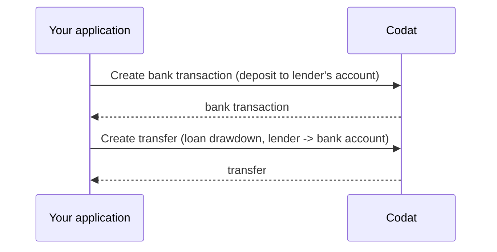

Once you receive the configuration information, you are ready to deposit funds into the borrower's bank account. This is also known as *loan drawdown*, and it is a two-step process:

1. [Create a bank transaction](/lending/guides/general-loan-writeback#create-bank-transaction) depositing the amount into the lender's bank account to make the funds available for drawdown. 

2. [Create a transfer](/lending/guides/general-loan-writeback#create-transfer) from the lender's bank account to the borrower's bank account. 



### Create bank transaction

To record the loan deposit into the lender's bank account: 

1. Get the [create bank account transactions model](/lending-api#/operations/get-create-bank-transactions-model) to determine the parameters required for transaction creation. 

2. [Create bank account transactions](/lending-api#/operations/create-bank-transactions) to deposit the amount into the lender's bank account.

We provided example bank transaction creation payloads in the snippets below:

<Tabs>
<TabItem value="nodejs" label="TypeScript">

```javascript
codatLending.loanWriteback.bankTransactions.create({
    accountingCreateBankTransactions: {
        accountId: lendersBankAccount.Id, // lender's virtual bank account id you would have stored from the configuration step
        transactions: [
        {
            id: transactionId, // some unique identifier of the bank transaction
            amount: amount, // amount to pay
            date: date time now,
            description: description,
        },
        ],
    },
    accountId: lendersBankAccount.Id,
    companyId: "8a210b68-6988-11ed-a1eb-0242ac120002",
    connectionId: "2e9d2c44-f675-40ba-8049-353bfcb5e171",
}).then((res: CreateBankTransactionsResponse) => {
if (res.statusCode == 200) {
    // handle response
}
});
```
</TabItem>

<TabItem value="python" label="Python">

```python
bank_transactions_create_request = operations.CreateBankTransactionsRequest(
    accounting_create_bank_transactions=shared.AccountingCreateBankTransactions(
        account_id=lenders_bank_account.id, # lender's virtual bank account id you would have stored from the configuration step
        transactions=[
            shared.CreateBankAccountTransaction(
                id=transaction_id, # some unique identifier of the bank transaction
                amount=Decimal(amount), # amount to pay
                date_=date time now,
                description=description,
            ),
        ],
    ),
    account_id=lenders_bank_account.id,
    company_id='8a210b68-6988-11ed-a1eb-0242ac120002',
    connection_id='2e9d2c44-f675-40ba-8049-353bfcb5e171',
)

bank_transactions_create_response = codat_lending.loan_writeback.bank_transactions.create(bank_transactions_create_request)
```
</TabItem>

<TabItem value="csharp" label="C#">

```csharp
var bankTransactionsCreateResponse = await codatLending.LoanWriteback.BankTransactions.CreateAsync(new CreateBankTransactionsRequest() {
    AccountingCreateBankTransactions = new AccountingCreateBankTransactions() {
        AccountId = lendersBankAccount.Id, // lender's virtual bank account id you would have stored from the configuration step
        Transactions = new List<CreateBankAccountTransaction>() {
            new CreateBankAccountTransaction() {
                Id = transactionId, // some unique identifier of the bank transaction
                Amount = amount, // amount to pay
                Date = date time now,
                Description = description,
            },
        },
    },
    AccountId = lendersBankAccount.Id,
    CompanyId = "8a210b68-6988-11ed-a1eb-0242ac120002",
    ConnectionId = "2e9d2c44-f675-40ba-8049-353bfcb5e171"
});
```
</TabItem>

<TabItem value="go" label="Go">

```go
ctx := context.Background()
bankTransactionsCreateRequest, err := codatLending.LoanWriteback.BankTransactions.Create(ctx, operations.CreateBankTransactionsRequest{
    AccountingCreateBankTransactions: &shared.AccountingCreateBankTransactions{
        AccountID: lending.String(lendersBankAccount.ID), // lender's virtual bank account id you would have stored from the configuration step
        Transactions: []shared.CreateBankAccountTransaction{ 
            shared.CreateBankAccountTransaction{
                ID: lending.String(transactionID), // some unique identifier of the bank transaction
                Amount: types.MustNewDecimalFromString(amount), // amount to pay
                Date: lending.String(date time now),
                Description: lending.String(description),
            },
        },
    },
    AccountID: lendersBankAccount.ID,
    CompanyID: "8a210b68-6988-11ed-a1eb-0242ac120002",
    ConnectionID: "2e9d2c44-f675-40ba-8049-353bfcb5e171",
})
```
</TabItem>

<TabItem value="http" label="HTTP">

```http
POST https://api.codat.io/companies/{companyId}/connections/{connectionId}/push/bankAccounts/{accountId}/bankTransactions
```

#### Request body

```json
{
  "accountId": lendersBankAccount.Id, // lender's bank account id you would have stored from the configuration step
  "transactions": [{
    "id": transactionId, // some unique identifier of the bank transaction
    "amount": amount, // amount to pay
    "date": date time now,
    "description": description
  }]
}
```
</TabItem>

</Tabs>

### Create transfer

Following Codat's async record creation process, use the [Get create transfer model](/lending-api#/operations/get-create-transfers-model) endpoint to determine the transfer request parameters. 

Next, call the [Create transfer](/lending-api#/operations/create-transfer) endpoint to transfer the money from the lender's bank account to the borrower's bank account. Note that you are performing a transfer *from* the lender's account Id *to* the borrower's account Id.

<Tabs>
<TabItem value="nodejs" label="TypeScript">

```javascript
codatLending.loanWriteback.transfers.create({
    accountingTransfer: {
        date: date time now,
        from: {
            accountRef: {
                id: lendersBankAccount.Id,
            },
            amount: amount,
            currency: "GBP",
        },
        to: {
            accountRef: {
                id: borrowersBankAccountId,
            },
            amount: amount,
            currency: "GBP",
        },
    },
    companyId: "8a210b68-6988-11ed-a1eb-0242ac120002",
    connectionId: "2e9d2c44-f675-40ba-8049-353bfcb5e171",
    }).then((res: CreateTransferResponse) => {
    if (res.statusCode == 200) {
        // handle response
    }
});
```
</TabItem>

<TabItem value="python" label="Python">

```python
transfers_create_request = operations.CreateTransferRequest(
    accounting_transfer=shared.AccountingTransfer(
        date_=date time now,
        from_=shared.TransferAccount(
            account_ref=shared.AccountRef(
                id=lenders_bank_account.id,
            ),
            amount=Decimal(amount),
            currency='GBP',
        ),
        to=shared.TransferAccount(
            account_ref=shared.AccountRef(
                id=borrowers_bank_account_id,
            ),
            amount=Decimal(amount),
            currency='GBP',
        ),
    ),
    company_id='8a210b68-6988-11ed-a1eb-0242ac120002',
    connection_id='2e9d2c44-f675-40ba-8049-353bfcb5e171',
)

transfers_create_response = codat_lending.loan_writeback.transfers.create(transfers_create_request)
```
</TabItem>

<TabItem value="csharp" label="C#">

```csharp
var transfersCreateResponse = await codatLending.LoanWriteback.Transfers.CreateAsync(new CreateTransferRequest() {
    AccountingTransfer = new AccountingTransfer() {
        Date = date time now,
        From = new TransferAccount() {
            AccountRef = new AccountRef() {
                Id = lendersBankAccount.Id,
            },
            Amount = amount,
            Currency = "GBP",
        },
        To = new TransferAccount() {
            AccountRef = new AccountRef() {
                Id = borrowersBankAccountId,
            },
            Amount = amount,
            Currency = "GBP",
        },
    },
    CompanyId = "8a210b68-6988-11ed-a1eb-0242ac120002",
    ConnectionId = "2e9d2c44-f675-40ba-8049-353bfcb5e171",
});
```
</TabItem>

<TabItem value="go" label="Go">

```go
ctx := context.Background()
transfersCreateResponse, err := codatLending.LoanWriteback.Transfers.Create(ctx, operations.CreateTransferRequest{
    AccountingTransfer: &shared.AccountingTransfer{
        Date: lending.String(date time now),
        From: &shared.TransferAccount{
            AccountRef: &shared.AccountRef{
                ID: lending.String(lendersBankAccount.ID),
            },
            Amount: types.MustNewDecimalFromString(amount),
            Currency: lending.String("GBP"),
        },
        To: &shared.TransferAccount{
            AccountRef: &shared.AccountRef{
                ID: lending.String(borrowersBankAccountID),
            },
            Amount: types.MustNewDecimalFromString(amount),
            Currency: lending.String("GBP"),
        },
    },
    CompanyID: "8a210b68-6988-11ed-a1eb-0242ac120002",
    ConnectionID: "2e9d2c44-f675-40ba-8049-353bfcb5e171",
})
```
</TabItem>

<TabItem value="http" label="HTTP">

```http
POST https://api.codat.io/companies/{companyId}/connections/{connectionId}/push/transfers
```

#### Request body

```json
{
    "date": "date time now",
    "from": {
        "accountRef": {
            "id": "lendersBankAccount.Id",
        },
        "account": amount,
        "currency": "GBP",
    },
    "to": {
        "accountRef": {
            "id": "borrowersBankAccountId",
        },
        "account": amount,
        "currency": "GBP",
    }
}
```

</TabItem>

</Tabs>
