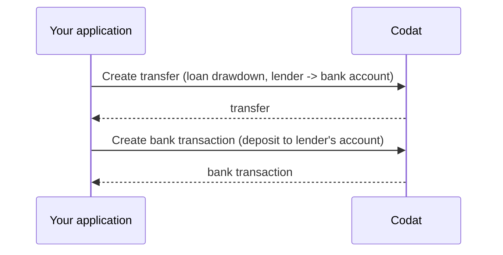

import Tabs from '@theme/Tabs';
import TabItem from '@theme/TabItem';

Once you receive the configuration information, you are ready to deposit funds into the borrower's bank account. This is known as *loan drawdown* general lending, and an *advance* in invoice finance. You will need to: 

1. [Create a transfer](/lending/guides/loan-writeback/deposit#create-transfer) from the lender's bank account to the borrower's bank account. 

2. [Create a bank feed transaction](/lending/guides/loan-writeback/deposit#create-bank-feed-transaction) to represent the account transfer in the lenders bank account. 




To perform these operations, you will need the following properties:

- Lender's [`lendersBankAccount.id`](/lending-api#/AccountingBankAccount)
- SMB's [`borrowersBankAccount.id`](/lending-api#/AccountingBankAccount) and `currency`
- `depositDate` - the date the funding was deposited into the borrower's bank account
- `depositAmount` - the funding amount or advance provided to the SMB

### Create transfer

To record the transfer of money from the lender's bank account to the borrower's bank account:

1. Use the [Get create transfer model](/lending-api#/operations/get-create-transfers-model) endpoint to determine the transfer request parameters.

2. Call the [Create transfer](/lending-api#/operations/create-transfer) endpoint to perform the transfer of money. Note that you are performing a transfer *from* `lendersBankAccount.id` *to* `borrowersBankAccount.id`.

<Tabs>
<TabItem value="nodejs" label="TypeScript">

```javascript
codatLending.loanWriteback.transfers.create({
    accountingTransfer: {
        date: depositDate,
        from: {
            accountRef: {
                id: lendersBankAccount.id,
            },
            amount: depositAmount,
            currency: borrowersBankAccount.currency,
        },
        to: {
            accountRef: {
                id: borrowersBankAccount.id,
            },
            amount: depositAmount,
            currency: borrowersBankAccount.currency,
        },
    },
    companyId: "8a210b68-6988-11ed-a1eb-0242ac120002",
    connectionId: "2e9d2c44-f675-40ba-8049-353bfcb5e171",
    }).then((res: CreateTransferResponse) => {
    if (res.statusCode == 200) {
        // handle response
    }
});
```
</TabItem>

<TabItem value="python" label="Python">

```python
transfers_create_request = operations.CreateTransferRequest(
    accounting_transfer=shared.AccountingTransfer(
        date_=deposit_date,
        from_=shared.TransferAccount(
            account_ref=shared.AccountRef(
                id=lenders_bank_account.id,
            ),
            amount=Decimal(deposit_amount),
            currency=borrowers_bank_account.currency,
        ),
        to=shared.TransferAccount(
            account_ref=shared.AccountRef(
                id=borrowers_bank_account_id,
            ),
            amount=Decimal(deposit_amount),
            currency=borrowers_bank_account.currency,
        ),
    ),
    company_id='8a210b68-6988-11ed-a1eb-0242ac120002',
    connection_id='2e9d2c44-f675-40ba-8049-353bfcb5e171',
)

transfers_create_response = codat_lending.loan_writeback.transfers.create(transfers_create_request)
```
</TabItem>

<TabItem value="csharp" label="C#">

```csharp
var transfersCreateResponse = await codatLending.LoanWriteback.Transfers.CreateAsync(new CreateTransferRequest() {
    AccountingTransfer = new AccountingTransfer() {
        Date = depositDate,
        From = new TransferAccount() {
            AccountRef = new AccountRef() {
                Id = lendersBankAccount.Id,
            },
            Amount = depositAmount,
            Currency = borrowersBankAccount.currency,
        },
        To = new TransferAccount() {
            AccountRef = new AccountRef() {
                Id = borrowersBankAccountId,
            },
            Amount = depositAmount,
            Currency = borrowersBankAccount.currency,
        },
    },
    CompanyId = "8a210b68-6988-11ed-a1eb-0242ac120002",
    ConnectionId = "2e9d2c44-f675-40ba-8049-353bfcb5e171",
});
```
</TabItem>

<TabItem value="go" label="Go">

```go
ctx := context.Background()
transfersCreateResponse, err := codatLending.LoanWriteback.Transfers.Create(ctx, operations.CreateTransferRequest{
    AccountingTransfer: &shared.AccountingTransfer{
        Date: lending.String(depositDate),
        From: &shared.TransferAccount{
            AccountRef: &shared.AccountRef{
                ID: lending.String(lendersBankAccount.ID),
            },
            Amount: types.MustNewDecimalFromString(depositAmount),
            Currency: lending.String(borrowersBankAccount.currency),
        },
        To: &shared.TransferAccount{
            AccountRef: &shared.AccountRef{
                ID: lending.String(borrowersBankAccountID),
            },
            Amount: types.MustNewDecimalFromString(depositAmount),
            Currency: lending.String(borrowersBankAccount.currency),
        },
    },
    CompanyID: "8a210b68-6988-11ed-a1eb-0242ac120002",
    ConnectionID: "2e9d2c44-f675-40ba-8049-353bfcb5e171",
})
```
</TabItem>

<TabItem value="http" label="HTTP">

```http
POST https://api.codat.io/companies/{companyId}/connections/{connectionId}/push/transfers
```

#### Request body

```json
{
    "date": depositDate,
    "from": {
        "accountRef": {
            "id": lendersBankAccount.id,
        },
        "account": depositAmount,
        "currency": borrowersBankAccount.currency,
    },
    "to": {
        "accountRef": {
            "id": borrowersBankAccount.id,
        },
        "account": depositAmount,
        "currency": borrowersBankAccount.currency,
    }
}
```

</TabItem>

</Tabs>


### Create bank transaction

To record the loan deposit into the lender's bank account: 

1. Get the [create bank account transactions model](/lending-api#/operations/get-create-bank-transactions-model) to determine the parameters required for transaction creation. 

2. [Create bank account transactions](/lending-api#/operations/create-bank-transactions) to deposit the amount into the lender's bank account.

We provided example bank transaction creation payloads in the snippets below:

<Tabs>
<TabItem value="nodejs" label="TypeScript">

```javascript
codatLending.loanWriteback.bankTransactions.create({
    accountingCreateBankTransactions: {
        accountId: lendersBankAccount.id,
        transactions: [
        {
            id: transactionId, // Unique identifier for this bank transaction
            amount: depositAmount,
            date: depositDate,
            description: description, // Include a reference to the transfer, the loan and you, the lender
        },
        ],
    },
    accountId: lendersBankAccount.Id,
    companyId: "8a210b68-6988-11ed-a1eb-0242ac120002",
    connectionId: "2e9d2c44-f675-40ba-8049-353bfcb5e171",
}).then((res: CreateBankTransactionsResponse) => {
if (res.statusCode == 200) {
    // handle response
}
});
```
</TabItem>

<TabItem value="python" label="Python">

```python
bank_transactions_create_request = operations.CreateBankTransactionsRequest(
    accounting_create_bank_transactions=shared.AccountingCreateBankTransactions(
        account_id=lenders_bank_account.id,
        transactions=[
            shared.CreateBankAccountTransaction(
                id=transaction_id, # Unique identifier for this bank transaction
                amount=Decimal(-deposit_amount),
                date_=deposit_Date,
                description=description, # Include a reference to the transfer, the loan and you, the lender
            ),
        ],
    ),
    account_id=lenders_bank_account.id,
    company_id='8a210b68-6988-11ed-a1eb-0242ac120002',
    connection_id='2e9d2c44-f675-40ba-8049-353bfcb5e171',
)

bank_transactions_create_response = codat_lending.loan_writeback.bank_transactions.create(bank_transactions_create_request)
```
</TabItem>

<TabItem value="csharp" label="C#">

```csharp
var bankTransactionsCreateResponse = await codatLending.LoanWriteback.BankTransactions.CreateAsync(new CreateBankTransactionsRequest() {
    AccountingCreateBankTransactions = new AccountingCreateBankTransactions() {
        AccountId = lendersBankAccount.Id,
        Transactions = new List<CreateBankAccountTransaction>() {
            new CreateBankAccountTransaction() {
                Id = transactionId, // Unique identifier for this bank transaction
                Amount = depositAmount,
                Date = depositDate,
                Description = description, // Include a reference to the transfer, the loan and you, the lender
            },
        },
    },
    AccountId = lendersBankAccount.Id,
    CompanyId = "8a210b68-6988-11ed-a1eb-0242ac120002",
    ConnectionId = "2e9d2c44-f675-40ba-8049-353bfcb5e171"
});
```
</TabItem>

<TabItem value="go" label="Go">

```go
ctx := context.Background()
bankTransactionsCreateRequest, err := codatLending.LoanWriteback.BankTransactions.Create(ctx, operations.CreateBankTransactionsRequest{
    AccountingCreateBankTransactions: &shared.AccountingCreateBankTransactions{
        AccountID: lending.String(lendersBankAccount.ID),
        Transactions: []shared.CreateBankAccountTransaction{ 
            shared.CreateBankAccountTransaction{
                ID: lending.String(transactionID), // Unique identifier for this bank transaction
                Amount: types.MustNewDecimalFromString(depositAmount),
                Date: lending.String(depositDate),
                Description: lending.String(description), // Include a reference to the transfer, the loan and you, the lender
            },
        },
    },
    AccountID: lendersBankAccount.ID,
    CompanyID: "8a210b68-6988-11ed-a1eb-0242ac120002",
    ConnectionID: "2e9d2c44-f675-40ba-8049-353bfcb5e171",
})
```
</TabItem>

<TabItem value="http" label="HTTP">

```http
POST https://api.codat.io/companies/{companyId}/connections/{connectionId}/push/bankAccounts/{accountId}/bankTransactions
```

#### Request body

```json
{
  "accountId": lendersBankAccount.id,
  "transactions": [{
    "id": transactionId, // Unique identifier for this bank transaction
    "amount": depositAmount,
    "date": depositDate,
    "description": description // Include a reference to the transfer, the loan and you, the lender
  }]
}
```
</TabItem>

</Tabs>

---

## Read next

* Record the repayment of a [general loan](/lending/guides/loan-writeback/repay-general-loan).
* Record the repayment of an [invoice finance](/lending/guides/loan-writeback/repay-invoice-finance) loan.