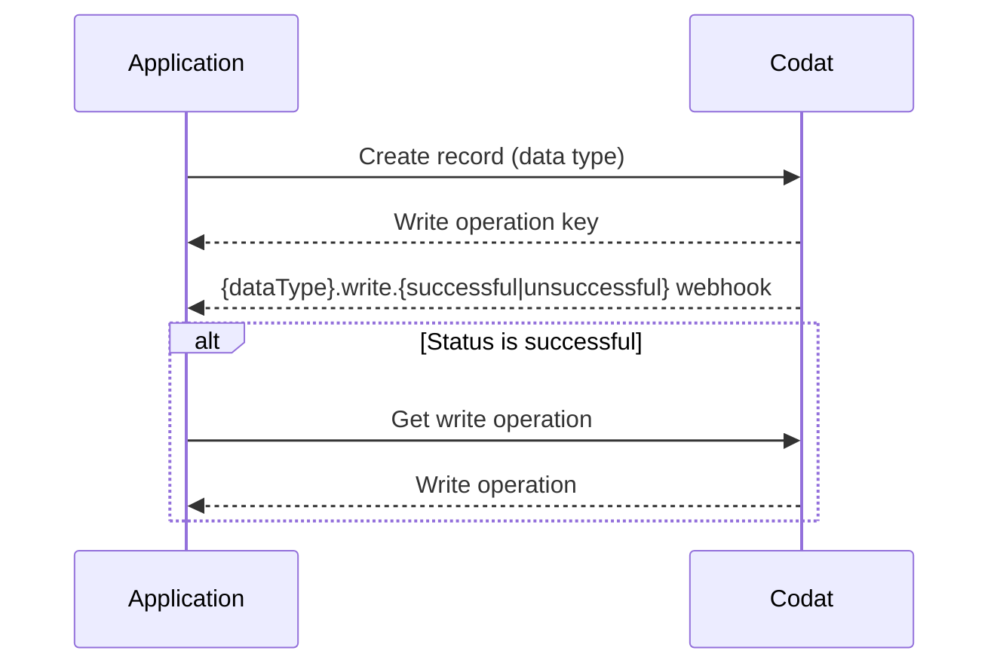

import Tabs from "@theme/Tabs";
import TabItem from "@theme/TabItem";

## Overview

This guide takes you through the steps needed to implement and run the loan writeback procedure in your lending business using Codat. You will learn how to configure Codat and use it to create transactions that represent the deposit and repayment of the loan in your customers' accounting software.

This solution covers the loan writeback procedure for both general lending, such as term loans, and selective invoice finance.

:::tip Save time with our SDK

Deploy your loan writeback solution quicker by using our Lending SDK to integrate directly with our API. The loan writeback namespace includes all the methods you need to develop your loan writeback solution.

Check out our SDKs for [TypeScript](https://github.com/codatio/client-sdk-typescript/tree/main/lending#loanwriteback), [Python](https://github.com/codatio/client-sdk-python/tree/main/lending#loan_writeback), [C#](https://github.com/codatio/client-sdk-csharp/tree/main/lending#loanwriteback), [Go](https://github.com/codatio/client-sdk-go/tree/main/lending#loanwriteback), and [Java](https://github.com/codatio/client-sdk-java/tree/main/lending#loanwriteback).

:::

### What is loan writeback?

Loan writeback (also known as lending writeback) is the process of continuously updating an accounting software with information about a loan. It helps maintain an accurate position of the loan during the entire lending cycle by recording the loan liability, any interest, fees, or repayments, and facilitating the reconciliation of bank accounts.

:::warning Bank feeds authorization

For some accounting software, you must obtain approval to integrate bank feeds prior to implementing loan writeback.

:::

### Why use it?

A bookkeeper can account for a loan in numerous ways in an accounting software. For example, some bookkeepers may erroneously register a loan as a direct income or even a sales invoice.

This results in loans being improperly recorded as revenue and repayments as operating costs. At the end of the reporting period, this can make it hard for the bookkeeper to close their books.

By implementing loan writeback functionality in your application, you can make sure loan bookkeeping is done regularly, correctly, and quickly so that you always see an up-to-date state of the borrower's accounts.

Critically, the loan writeback functionality helps lenders clearly identify loans in an SMB's accounting software. As a result, the lender sees a more accurate picture of the SMB's debt repayment history, which leads to improved underwriting.

:::info Mandatory loan writeback

Certain accounting software **require** lenders to continuously update their books with money lent to SMBs. For example, **Xero** obligates lenders going through the [App Partner certification](/integrations/accounting/xero/xero-app-partner-program) process to handle the writeback process.

:::

### What's the process?

The process of loan writeback involves recording loan withdrawals, repayments, and interest in the SMB's accounting software. It can be split into three stages, as shown on the diagram below:

1. **Configure** loan writeback for your SMB customer.

2. **Deposit** the loan and reflect it in the SMB's accounting software.

3. **Record** payments owed to you, the lender, in your SMB's accounting software.

The process is identical for the general lending and invoice finance scenarios.

### Examples

To gain additional context on the outcome of performing loan writeback, review the examples for both lending use cases. The examples provide a view of the [bank feed](/bank-feeds/overview) transactions and accounting transactions created during the process.

<Tabs>
<TabItem value="general-lending" label="General lending">

The lender agrees to provide an SMB a loan of £10,000 and charges a fee of £200, requesting the repayment in equal parts over 2 months.

The lender deposits £10,000 into the SMB's nominated bank account. Next month, the borrower repays the first half of the loan and repays the loan in full the month after.

In the example, you can also see that each bank feed transaction matches a bank account transaction in the accounting software. This helps the borrower to reconcile both bank accounts.

</TabItem>

<TabItem value="invoice-finance" label="Selective invoice finance">

The lender agrees to provide the SMB with an advance of £800 for a £1000 invoice with a £50 fee. The lender deposits £800 into the SMB's bank account and the SMB's customer pays for the invoice within the payment period.

When the SMB receives payment from the customer, the funds are transferred from the borrower's bank account into the lender's bank account, settling the loan and associated fees. The lender’s fee is then deducted from this payment.

As a result, the lender's account transactions balance to zero, and the advance and the outstanding amount remain in the borrower's account.

<!-- This is wrong and we need to find and amend the original -->
<!--  -->

</TabItem>
</Tabs>

## Prerequisites

- If you are implementing loan writeback for Xero, _Xero Bank Feeds API_ needs to be enabled for your registered app. Xero usually does this during the certification process for lenders' apps so that you can test your solution before completing the certification.

- Check that you have [created a Codat company](/configure/portal/companies#add-a-new-company) that represents your SMB customer and linked it to an accounting software. If you are already using Codat for lending, it's likely you have previously created some companies.

  You should also create and connect a test company to use while building your solution.

- As a lender, use Codat's [Bank Feeds](/bank-feeds/overview) solution to represent your bank account in Codat's domain. Keep hold of the [source bank account](/bank-feeds-api#/operations/create-source-account) `id` as you will use it when recording deposits and repayments.

- Familiarize yourself with Codat's asynchronous approach to [writing data](/using-the-api/push), which leverages [webhooks](/using-the-api/webhooks/overview). This process can be summarized as follows:

---

## Read next

- Learn how to [configure](/lending/guides/loan-writeback/configure) loan writeback, from creating key elements in Codat's domain to enabling your customer to map them.
