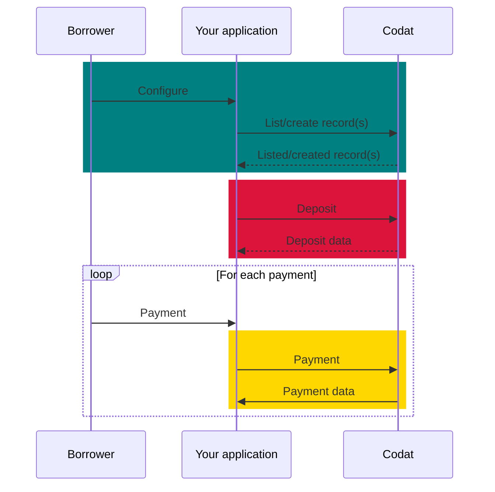
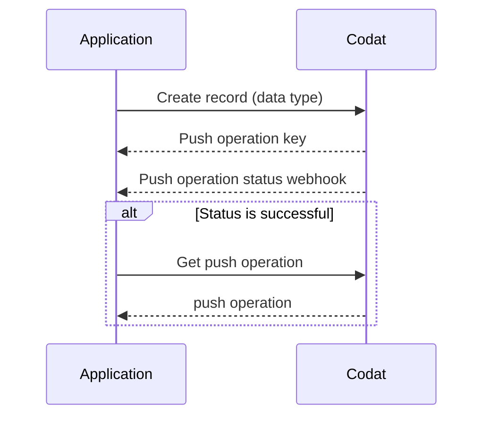

import Tabs from '@theme/Tabs';
import TabItem from '@theme/TabItem';

## Introduction

This guide takes you through the steps needed to implement and run the loan writeback procedure in your lending business using Codat. You will learn how to configure Codat and use it to create transactions that represent the deposit and repayment of the loan in your customers' accounting platforms. 

This solution covers the loan writeback procedure for both general lending, such as term loans, as well as selective invoice finance.

### What is loan writeback?

Loan writeback (also known as lending writeback) is the process of continuously updating an accounting platform with information on a loan.
It helps maintain an accurate position of the loan during the entire lending cycle by recording the loan liability, any interest, fees, or repayments, and facilitating the reconciliation of bank accounts.

Loan writeback requires the lender to support [Bank Feeds](/bank-feeds/overview) to allow the borrower to reconcile their bank account transactions
crated as a result of the loan.

Bank feeds are provided by banks and you, the lender, to outline ingoing and outgoing bank transactions from the business bank account they provide to the SMB.
Bank feeds allow bookkeepers to reconcile bank transactions against account transactions in the accounting platform.
Note that you, the lender, does not need to interact with the borrower's bank feeds when implementing your own loan writeback.

To give context on the outcome of performing loan writeback we provide the following examples for both use cases. 
We include a view of the transactions created in the relevant accounts. 
Both examples provide a view of the [bank feed](/bank-feeds/overview) transactions and accounting transactions created during the process.

<b>Examples</b>

<Tabs>
<TabItem value="general-lending" label="General lending">

You, the lender, agree to provide an SMB a loan of £10,000 and charge a fee of £200 repaying the total amount in equal parts over 2 months.
The borrower (SMB) is therefore required to pay £10,200 back to the lender over this period. 

The lender first deposits £10,000 into the SMBs nominated bank account.
The following month the borrower repays the first half of the loan and completes thier repayment for following month.

<table>
<thead>
  <tr>
    <th colspan="2">Lender's Account</th>
    <th></th>
    <th colspan="2">Borrower's Account</th>
  </tr>
</thead>
<tbody>
  <tr>
    <td>Bank feed</td>
    <td>Bank account</td>
    <td></td>
    <td>Bank feed</td>
    <td>Bank account</td>
  </tr>
  <tr>
    <td>0</td>
    <td>0</td>
    <td></td>
    <td>0</td>
    <td>0</td>
  </tr>
  <tr>
    <td>-10,000</td>
    <td>-10,000</td>
    <td style={{'text-align': 'center'}}>&#10145;&#65039; deposit (+10k) &#10145;&#65039;</td>
    <td>10,000</td>
    <td>10,000</td>
  </tr>
  <tr>
    <td>-5,000</td>
    <td>-5,000</td>
    <td style={{'text-align': 'center'}}>&#11013;&#65039; loan repayment (-5k) &#11013;&#65039;</td>
    <td>5,000</td>
    <td>5,000</td>
  </tr>
  <tr>
    <td>-4,900</td>
    <td>-4,900</td>
    <td style={{'text-align': 'center'}}>&#11013;&#65039; fees (-0.1k) &#11013;&#65039;</td>
    <td>4,900</td>
    <td>4,900</td>
  </tr>
  <tr>
    <td>100</td>
    <td>100</td>
    <td style={{'text-align': 'center'}}>&#11013;&#65039; loan repayment (-5k) &#11013;&#65039;</td>
    <td>-100</td>
    <td>-100</td>
  </tr>
  <tr>
    <td>200</td>
    <td>200</td>
    <td style={{'text-align': 'center'}}>&#11013;&#65039; fees (-0.1k) &#11013;&#65039;</td>
    <td>-200</td>
    <td>-200</td>
  </tr>
  <tr>
    <td></td>
    <td></td>
    <td style={{'text-align': 'center'}}>&#10145;&#65039; total 10k &#10145;&#65039;</td>
    <td></td>
    <td></td>
  </tr>
  <tr>
    <td></td>
    <td></td>
    <td style={{'text-align': 'center'}}>&#11013;&#65039; total 10.2k &#11013;&#65039;</td>
    <td></td>
    <td></td>
  </tr>
</tbody>
</table>

Here you can see that the lender sent a total of £10,000 to the borrower and the borrower successfully repaid £10,200 accounting for the loan amount plus fees.
Additionally, you can see that each bank feed transaction matches a bank account transaction in the accounting platform.
This ensures that the borrower will be able to reconcile both bank accounts.

</TabItem>

<TabItem value="invoice-finance" label="Selective invoice finance">  

You, the lender, agree an advance of £800 for a £1000 invoice for a £50 fee with an SMB.
The lender deposits £800 into the SMB's bank account and the SMB's customer pays for the invoice within the payment period.

<table>
<thead>
  <tr>
    <th colspan="2">Lender's Account</th>
    <th></th>
    <th colspan="2">Borrower's Account</th>
  </tr>
</thead>
<tbody>
  <tr>
    <td>Bank feed</td>
    <td>Bank account</td>
    <td></td>
    <td>Bank feed</td>
    <td>Bank account</td>
  </tr>
  <tr>
    <td>0</td>
    <td>0</td>
    <td></td>
    <td>0</td>
    <td>0</td>
  </tr>
  <tr>
    <td>-800</td>
    <td>-800</td>
    <td style={{'text-align': 'center'}}>&#10145;&#65039; deposit (-800) &#10145;&#65039;</td>
    <td>800</td>
    <td>800</td>
  </tr>
  <tr>
    <td>-950</td>
    <td>-950</td>
    <td style={{'text-align': 'center'}}>&#10145;&#65039; outstanding (-150) &#10145;&#65039;</td>
    <td>950</td>
    <td>950</td>
  </tr>
  <tr>
    <td>-1000</td>
    <td>-1000</td>
    <td style={{'text-align': 'center'}}>&#10145;&#65039; fees -50 &#128195;</td>
    <td>-</td>
    <td>-</td>
  </tr>
  <tr>
    <td>0</td>
    <td>0</td>
    <td style={{'text-align': 'center'}}>&#11013;&#65039; invoice payment 1000 &#128184;</td>
    <td>-</td>
    <td>-</td>
  </tr>
  <tr>
    <td></td>
    <td></td>
    <td style={{'text-align': 'center'}}>&#10145;&#65039; total 950 &#10145;&#65039;</td>
    <td></td>
    <td></td>
  </tr>
  <tr>
    <td></td>
    <td></td>
    <td style={{'text-align': 'center'}}>&#11013;&#65039; total 0 &#11013;&#65039;</td>
    <td></td>
    <td></td>
  </tr>
</tbody>
</table>

In this instance money only moves from the lender's bank account into the borrowers bank account as fees and the customer's invoice payment are made to the lender's account.
From the above, you can see that this results in the lender's account transactions balancing and no money remaining in the account and the advance plus the amount outstanding in the borrowers account.

</TabItem>
</Tabs>

:::info Mandatory loan writeback

Certain accounting platforms **require** lenders to continuously update their books with money lent to SMBs. For example, **Xero** obligates lenders going through the [App Partner certification](/integrations/accounting/xero/xero-app-partner-program) process to handle the writeback process. 

:::

### Why use it?

A bookkeeper can account for a loan in numerous ways in an accounting platform. For example, some bookkeepers may erroneously register a loan as a direct income or even a sales invoice. This results in loans being improperly recorded as revenue and repayments as operating costs. At the end of the reporting period, this can make it hard for the bookkeeper to close their books. 

By implementing loan writeback functionality in your application, you can make sure loan bookeeping is done regularly, correctly, and quickly, and always see an up-to-date state of the borrower's accounts.

### What's the process?

The process of loan writeback involves recording loan withdrawals, repayments, and interest in the SMB's accounting platform. It can be split into three stages, as shown on the diagram below: 

1. **Configure** loan writeback for your SMB customer.  

2. **Deposit** funds into your SMB's accounting platform.

3. **Repay** (maybe reconcile instead?) money owed to you, the lender, in your SMB's accounting platform. 

Both the configure and deposit steps are identical for general loans and invoice finance. 
However, the repayment process differs given how the lending option works.

## Prerequisites

* Check that you have [created a Codat company](/configure/portal/companies#add-a-new-company) that represents your SMB customer and linked it to an accounting platform. If you are already using Codat for lending, it's likely you have previously created some companies. 

You should also create and connect a test company to use while building your solution.

* Familiarize yourself with Codat's approach of asynchronously [creating and updating data](/using-the-api/push), which can be summarized as follows:

* If you are implementing loan writeback for Xero, *Xero Bank Feeds API* needs to be enabled for your registered app. Xero usually does this during the certification process for lenders' apps so that you can test your solution before completing the certification.

---

## Read next

* Learn how to [configure](/lending/guides/loan-writeback/configure)
