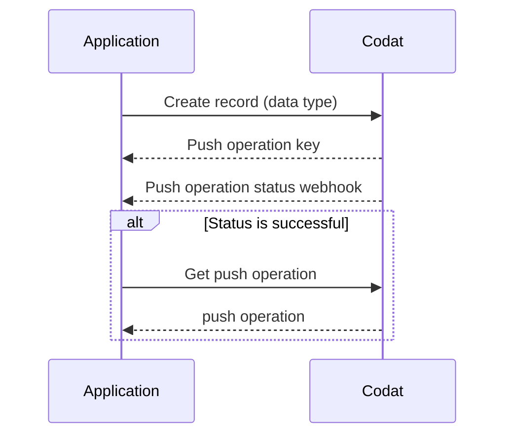

import Tabs from '@theme/Tabs';
import TabItem from '@theme/TabItem';

## Overview

This guide takes you through the steps needed to implement and run the loan writeback procedure in your lending business using Codat. You will learn how to configure Codat and use it to create transactions that represent the deposit and repayment of the loan in your customers' accounting platforms. 

This solution covers the loan writeback procedure for both general lending, such as term loans, and selective invoice finance.

### What is loan writeback?

Loan writeback (also known as lending writeback) is the process of continuously updating an accounting platform with information about a loan. It helps maintain an accurate position of the loan during the entire lending cycle by recording the loan liability, any interest, fees, or repayments, and facilitating the reconciliation of bank accounts.

:::tip Bank feeds for loan writeback

Loan writeback requires the lender to support the [bank feeds](/bank-feeds/overview) functionality so that the lender can record their own bank transactions associated with issuing the loan in their borrower's accounting platform. 

:::

### Why use it?

A bookkeeper can account for a loan in numerous ways in an accounting platform. For example, some bookkeepers may erroneously register a loan as a direct income or even a sales invoice. 

This results in loans being improperly recorded as revenue and repayments as operating costs. At the end of the reporting period, this can make it hard for the bookkeeper to close their books. 

By implementing loan writeback functionality in your application, you can make sure loan bookeeping is done regularly, correctly, and quickly so that you always see an up-to-date state of the borrower's accounts.

:::info Mandatory loan writeback

Certain accounting platforms **require** lenders to continuously update their books with money lent to SMBs. For example, **Xero** obligates lenders going through the [App Partner certification](/integrations/accounting/xero/xero-app-partner-program) process to handle the writeback process. 

:::

### What's the process?

The process of loan writeback involves recording loan withdrawals, repayments, and interest in the SMB's accounting platform. It can be split into three stages, as shown on the diagram below: 

1. **Configure** loan writeback for your SMB customer.  

2. **Deposit** the loan and reflect it in the SMB's accounting platform.

3. **Record** payments owed to you, the lender, in your SMB's accounting platform. 

The first two steps are identical for the general lending and invoice finance scenarios. The process of recording repayments differs based on the lending option.

### Examples

To gain additional context on the outcome of performing loan writeback, review the examples for both lending use cases. The examples provide a view of the [bank feed](/bank-feeds/overview) transactions and accounting transactions created during the process.

<Tabs>
<TabItem value="general-lending" label="General lending">

The lender agrees to provide an SMB a loan of £10,000 and charges a fee of £200, requesting the repayment in equal parts over 2 months. 

The lender deposits £10,000 into the SMB's nominated bank account. Next month, the borrower repays the first half of the loan and repays the loan in full the month after.

In the example, you can also see that each bank feed transaction matches a bank account transaction in the accounting platform. This helps the borrower to reconcile both bank accounts.

<table>
<tbody>
  <tr>
    <td colspan="2"><b>Lender's account</b></td>
    <td></td>
    <td colspan="2"><b>Borrower's account</b></td>
  </tr>
  <tr>
    <td>Bank feed</td>
    <td>Bank account</td>
    <td></td>
    <td>Bank feed</td>
    <td>Bank account</td>
  </tr>
  <tr>
    <td>0</td>
    <td>0</td>
    <td></td>
    <td>0</td>
    <td>0</td>
  </tr>
  <tr>
    <td>-10,000</td>
    <td>-10,000</td>
    <td style={{'text-align': 'center'}}>&#10145;&#65039; deposit (+10k) &#10145;&#65039;</td>
    <td>10,000</td>
    <td>10,000</td>
  </tr>
  <tr>
    <td>-5,000</td>
    <td>-5,000</td>
    <td style={{'text-align': 'center'}}>&#11013;&#65039; loan repayment (-5k) &#11013;&#65039;</td>
    <td>5,000</td>
    <td>5,000</td>
  </tr>
  <tr>
    <td>-4,900</td>
    <td>-4,900</td>
    <td style={{'text-align': 'center'}}>&#11013;&#65039; fees (-0.1k) &#11013;&#65039;</td>
    <td>4,900</td>
    <td>4,900</td>
  </tr>
  <tr>
    <td>100</td>
    <td>100</td>
    <td style={{'text-align': 'center'}}>&#11013;&#65039; loan repayment (-5k) &#11013;&#65039;</td>
    <td>-100</td>
    <td>-100</td>
  </tr>
  <tr>
    <td>200</td>
    <td>200</td>
    <td style={{'text-align': 'center'}}>&#11013;&#65039; fees (-0.1k) &#11013;&#65039;</td>
    <td>-200</td>
    <td>-200</td>
  </tr>
  <tr>
    <td></td>
    <td></td>
    <td style={{'text-align': 'center'}}>&#10145;&#65039; total 10k &#10145;&#65039;</td>
    <td></td>
    <td></td>
  </tr>
  <tr>
    <td></td>
    <td></td>
    <td style={{'text-align': 'center'}}>&#11013;&#65039; total 10.2k &#11013;&#65039;</td>
    <td></td>
    <td></td>
  </tr>
</tbody>
</table>

</TabItem>

<TabItem value="invoice-finance" label="Selective invoice finance">  

The lender agrees to provide the SMB with an advance of £800 for a £1000 invoice with a £50 fee. The lender deposits £800 into the SMB's bank account and the SMB's customer pays for the invoice within the payment period.

In this instance, money moves from the lender's bank account into the borrower's bank account as fees, and the customer's invoice is paid directly into the lender's account.

As a result, the lender's account transactions balance to zero, and the advance and the outstanding amount remain in the borrower's account.

<table>
<tbody>
  <tr>
    <td colspan="2"><b>Lender's account</b></td>
    <td></td>
    <td colspan="2"><b>Borrower's account</b></td>
  </tr>
  <tr>
    <td>Bank feed</td>
    <td>Bank account</td>
    <td></td>
    <td>Bank feed</td>
    <td>Bank account</td>
  </tr>
  <tr>
    <td>0</td>
    <td>0</td>
    <td></td>
    <td>0</td>
    <td>0</td>
  </tr>
  <tr>
    <td>-800</td>
    <td>-800</td>
    <td style={{'text-align': 'center'}}>&#10145;&#65039; deposit (-800) &#10145;&#65039;</td>
    <td>800</td>
    <td>800</td>
  </tr>
  <tr>
    <td>-950</td>
    <td>-950</td>
    <td style={{'text-align': 'center'}}>&#10145;&#65039; outstanding (-150) &#10145;&#65039;</td>
    <td>950</td>
    <td>950</td>
  </tr>
  <tr>
    <td>-1000</td>
    <td>-1000</td>
    <td style={{'text-align': 'center'}}>&#10145;&#65039; fees -50 &#128195;</td>
    <td>-</td>
    <td>-</td>
  </tr>
  <tr>
    <td>0</td>
    <td>0</td>
    <td style={{'text-align': 'center'}}>&#11013;&#65039; invoice payment 1000 &#128184;</td>
    <td>-</td>
    <td>-</td>
  </tr>
  <tr>
    <td></td>
    <td></td>
    <td style={{'text-align': 'center'}}>&#10145;&#65039; total 950 &#10145;&#65039;</td>
    <td></td>
    <td></td>
  </tr>
  <tr>
    <td></td>
    <td></td>
    <td style={{'text-align': 'center'}}>&#11013;&#65039; total 0 &#11013;&#65039;</td>
    <td></td>
    <td></td>
  </tr>
</tbody>
</table>

</TabItem>
</Tabs>

## Prerequisites

* Check that you have [created a Codat company](/configure/portal/companies#add-a-new-company) that represents your SMB customer and linked it to an accounting platform. If you are already using Codat for lending, it's likely you have previously created some companies. 

  You should also create and connect a test company to use while building your solution.

* Familiarize yourself with Codat's approach of asynchronously [creating and updating data](/using-the-api/push), which can be summarized as follows:

* If you are implementing loan writeback for Xero, *Xero Bank Feeds API* needs to be enabled for your registered app. Xero usually does this during the certification process for lenders' apps so that you can test your solution before completing the certification.

* As a lender, use Codat's [Bank Feeds API](/bank-feeds/overview) to represent your bank account in Codat's domain. Keep hold of the [source bank account](/bank-feeds-api#/operations/create-source-account) `id` as you will use it when recording deposits and repayments. 

---

## Read next

* Learn how to [configure](/lending/guides/loan-writeback/configure) loan writeback, from creating key elements in Codat's domain to enabling your customer to map them. 
