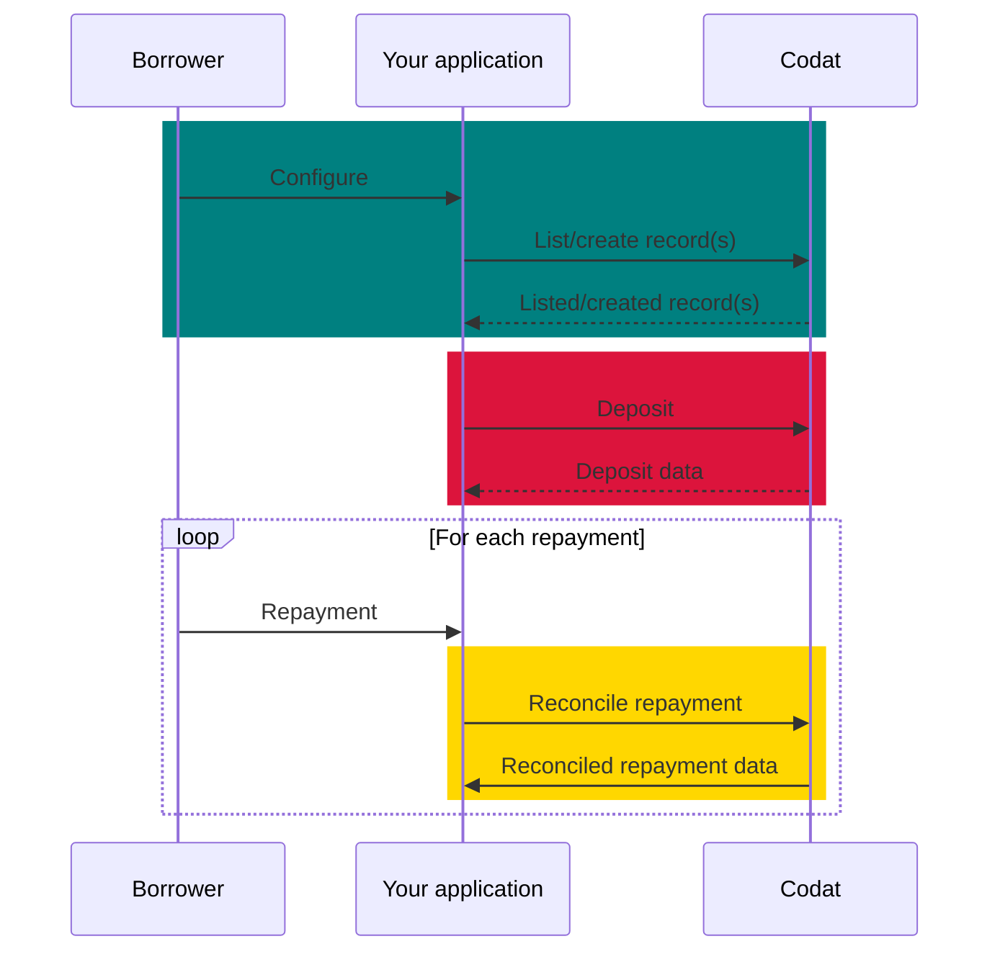
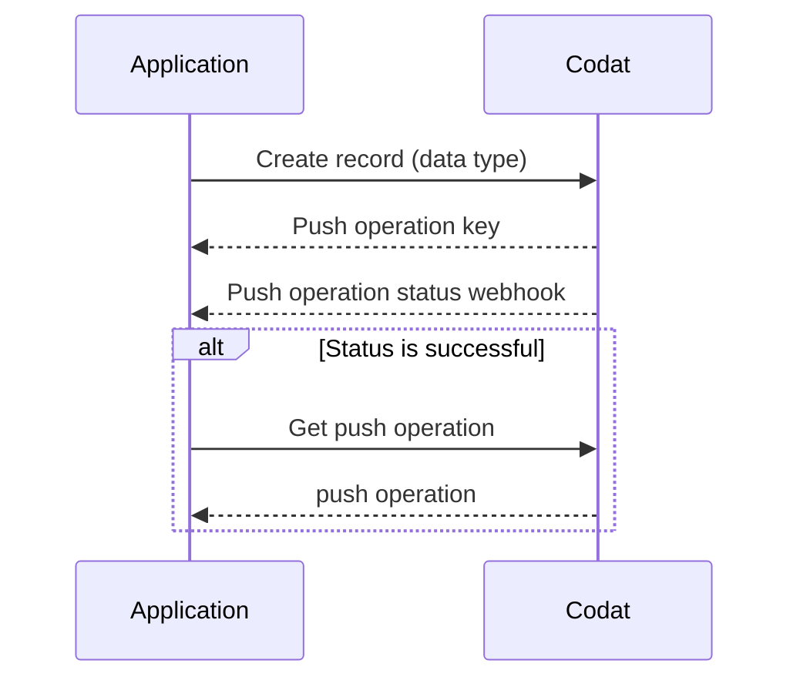

import Tabs from '@theme/Tabs';
import TabItem from '@theme/TabItem';
import WritebackMapping from "@components/global/Prototypes/WritebackMapping";

## Concept overview

This guide takes you through the steps needed to implement and run the loan writeback procedure in your lending business using Codat. You will learn how to configure Codat and use it to create transactions that represent the deposit and repayment of the loan in your customers' accounting platforms. 

This solution supports loan writeback procedure for general lending, such as term loans, but does not cover requirements specific to invoice finance.

### What is loan writeback?

Loan writeback (also known as lending writeback) is the process of continuously updating an accounting platform with information on a loan. It helps maintain an accurate position of the loan during the entire lending cycle by recording the loan liability, any interest, fees, or repayments, and facilitating the reconciliation of bank transactions. 

:::info Mandatory loan writeback

Certain accounting platforms **require** lenders to continuously update their books with money lent to SMBs. For example, **Xero** obligates lenders going through the [App Partner certification](/integrations/accounting/xero/xero-app-partner-program) process to handle the writeback process. 

:::

### Why use it?

A bookkeeper can account for a loan in numerous ways in an accounting platform. For example, some bookkeepers may erroneously register a loan as a direct income or even a sales invoice. This results in loans being improperly recorded as revenue and repayments as operating costs. At the end of the reporting period, this can make it hard for the bookkeeper to close their books. 

By implementing loan writeback functionality in your application, you can make sure loan bookeeping is done regularly, correctly, and quickly, and always see an up-to-date state of the borrower's accounts.

### What's the process?

The process of loan writeback involves recording loan withdrawals, repayments, and interest in the SMB's accounting platform. It can be split into three stages, as shown on the diagram below: 

1. **Configure** loan writeback for your SMB customer.  

2. **Deposit** funds into your SMB's accounting platform.

3. **Repay** money owed to you, the lender, in your SMB's accounting platform.

## Prerequisites

* Check that you have [created a Codat company](/configure/portal/companies#add-a-new-company) that represents your SMB customer and linked it to an accounting platform. If you are already using Codat for lending, it's likely you have previously created some companies. 

You should also create and connect a test company to use while building your solution.

* Familiarize yourself with Codat's approach of asynchronously [creating and updating data](/using-the-api/push), which can be summarized as follows:

* If you are implementing loan writeback for Xero, *Xero Bank Feeds API* needs to be enabled for your registered app. Xero usually does this during the certification process for lenders' apps so that you can test your solution before completing the certification.

* Provide the customer with a user interface that gives the option to enable the loan writeback process flow and configure or update their account mapping, for example: 

<WritebackMapping/>