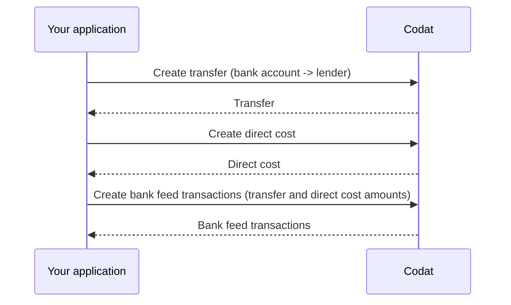

import Tabs from '@theme/Tabs';
import TabItem from '@theme/TabItem';
import WritebackMapping from "@components/Prototypes/WritebackMapping";

Once the borrower's customer has paid for the goods or services they purchased, the financed invoice is ready to be reconciled in the accounting software.  

To reflect that programmatically, perform these steps:

1. [Create a transfer](/lending/guides/loan-writeback/record-invoice-finance#create-transfer) from the borrower's bank account to the lender's to account for the advance amount plus fees and/or interest.

2. To record interest or fees, [create a direct cost](/lending/guides/loan-writeback/record-invoice-finance#create-direct-cost) against the lender's bank account.

3. [Create bank feed transactions](/lending/guides/loan-writeback/record-invoice-finance#create-bank-feed-transactions) to represent the transfer and direct cost in the lender's bank account.



To perform these operations, you will need the following properties:

- Lender's [`supplier.id`](/lending-api#/schemas/AccountingSupplier) and [`lendersBankAccountId`](/lending-api#/AccountingBankAccount)
- SMB's [`expenseAccount.id`](/lending-api#/schemas/AccountingAccount), [`borrowersBankAccount.id`](/lending-api#/AccountingBankAccount), and `currency`
- Interest and fee amounts (`feeAndInterestAmount`)

### Create transfer

Once the SMB's customer pays the invoice, use the [Create transfer](/lending-api#/operations/create-transfer) endpoint to record the advance and the fees/interest for the loan.
This transfer should be made *from* `borrowersBankAccount.id` *to* `lendersBankAccountId`.

The repayment amount is calculated as:

```
repaymentAmount = advanceAmount + feeAndInterestAmount
```
Store `repaymentAmount` and `repaymentDate` in your application for use later on.

<Tabs>
<TabItem value="nodejs" label="TypeScript">

```javascript
codatLending.loanWriteback.transfers.create({
    accountingTransfer: {
        date: repaymentDate,
        from: {
            accountRef: {
                id: borrowersBankAccount.id,
            },
            amount: repaymentAmount,
            currency: borrowersBankAccount.currency,
        },
        to: {
            accountRef: {
                id: lendersBankAccountId,
            },
            amount: repaymentAmount,
            currency: borrowersBankAccount.currency,
        },
    },
    companyId: companyId,
    connectionId: connectionId,
    }).then((res: CreateTransferResponse) => {
    if (res.statusCode == 200) {
        // handle response
    }
});
```
</TabItem>

<TabItem value="python" label="Python">

```python
transfers_create_request = operations.CreateTransferRequest(
    accounting_transfer=shared.AccountingTransfer(
        date_=repayment_date,
        from_=shared.TransferAccount(
            account_ref=shared.AccountRef(
                id=borrowers_bank_account.id,
            ),
            amount=Decimal(repayment_amount),
            currency=borrowers_bank_account.currency,
        ),
        to=shared.TransferAccount(
            account_ref=shared.AccountRef(
                id=lenders_bank_account_id,
            ),
            amount=Decimal(repayment_amount),
            currency=borrowers_bank_account.currency,
        ),
    ),
    company_id=company_id,
    connection_id=connection_id,
)

transfers_create_response = codat_lending.loan_writeback.transfers.create(transfers_create_request)
```
</TabItem>

<TabItem value="csharp" label="C#">

```csharp
var transfersCreateResponse = await codatLending.LoanWriteback.Transfers.CreateAsync(new CreateTransferRequest() {
    AccountingTransfer = new AccountingTransfer() {
        Date = repaymentDate,
        From = new TransferAccount() {
            AccountRef = new AccountRef() {
                Id = borrowersBankAccount.Id,
            },
            Amount = repaymentAmount,
            Currency = borrowersBankAccount.Currency,
        },
        To = new TransferAccount() {
            AccountRef = new AccountRef() {
                Id = lendersBankAccountId,
            },
            Amount = repaymentAmount,
            Currency = borrowersBankAccount.Currency,
        },
    },
    CompanyId = companyId,
    ConnectionId = connectionId,
});
```
</TabItem>

<TabItem value="go" label="Go">

```go
ctx := context.Background()
transfersCreateResponse, err := codatLending.LoanWriteback.Transfers.Create(ctx, operations.CreateTransferRequest{
    AccountingTransfer: &shared.AccountingTransfer{
        Date: lending.String(repaymentDate),
        From: &shared.TransferAccount{
            AccountRef: &shared.AccountRef{
                ID: lending.String(borrowersBankAccount.ID),
            },
            Amount: types.MustNewDecimalFromString(repaymentAmount),
            Currency: lending.String(borrowersBankAccount.Currency),
        },
        To: &shared.TransferAccount{
            AccountRef: &shared.AccountRef{
                ID: lending.String(lendersBankAccountID),
            },
            Amount: types.MustNewDecimalFromString(repaymentAmount),
            Currency: lending.String(borrowersBankAccount.Currency),
        },
    },
    CompanyID: companyID,
    ConnectionID: connectionID,
})
```
</TabItem>


<TabItem value="java" label="Java">

```java
CreateTransferRequest req = CreateTransferRequest.builder()
    .companyId(companyId)
    .connectionId(connectionId)
    .accountingTransfer(AccountingTransfer.builder()
        .date(repaymentDate)
        .from(TransferAccount.builder()
            .accountRef(AccountRef.builder()
                .id(borrowersBankAccount.id)
                .build()
            )
            .amount(repaymentAmount)
            .currency(borrowersBankAccount.currency)
            .build())
        .to(TransferAccount.builder()
            .accountRef(AccountRef.builder()
                .id(lendersBankAccountId)
                .build()
            )
            .amount(repaymentAmount)
            .currency(borrowersBankAccount.currency)
            .build())
        .build())
    .build();

CreateTransferResponse res = codatLending.loanWriteback().transfers().create()
    .request(req)
    .call();
```
</TabItem>

<TabItem value="http" label="HTTP">

```http
POST https://api.codat.io/companies/{companyId}/connections/{connectionId}/push/transfers
```

#### Request body

```json
{
    "date": repaymentDate,
    "from": {
        "accountRef": {
            "id": borrowersBankAccountId,
        },
        "account": repaymentAmount,
        "currency": borrowersBankAccount.currency,
    },
    "to": {
        "accountRef": {
            "id": lendersBankAccountId,
        },
        "account": repaymentAmount,
        "currency": borrowersBankAccount.currency,
    }
}
```

</TabItem>

</Tabs>

### Create direct cost

Check the [Get create direct cost model](/lending-api#/operations/get-create-directCosts-model), then use the [Create direct cost](/lending-api#/operations/create-direct-cost) endpoint to capture the amount of fees or interest (`feeAndInterestAmount`) incurred by the borrower. The direct cost is charged to the lender’s bank account to ensure the account balances to zero once the finance invoice repayment is complete.

<Tabs>
<TabItem value="nodejs" label="TypeScript">

```javascript
codatLending.loanWriteback.directCosts.create({
    accountingDirectCost: {
        contactRef: {
            dataType: "suppliers",
            id: supplier.id,
        },
        currency: borrowersBankAccount.currency,
        issueDate: repaymentDate,
        lineItems: [
        {
            accountRef: {
                id: expenseAccount.id,
            },
            description: "Fees and/or interest",
            quantity: 1,
            taxAmount: 0,
            unitAmount: feeAndInterestAmount,
        },
        ],
        paymentAllocations: [
        {
            allocation: {
                totalAmount: feeAndInterestAmount,
            },
            payment: {
                accountRef: {
                    id: lendersBankAccountId,
                },
            },
        },
        ],
        taxAmount: 0.0,
        totalAmount: feeAndInterestAmount,
    },
    companyId: companyId,
    connectionId: connectionId,
    }).then((res: CreateDirectCostResponse) => {
    if (res.statusCode == 200) {
        // handle response
    }
});
```
</TabItem>

<TabItem value="python" label="Python">

```python
direct_costs_create_request = operations.CreateDirectCostRequest(
    accounting_direct_cost=shared.AccountingDirectCost(
        contact_ref=shared.ContactRef(
            data_type='suppliers',
            id=supplier.id,
        ),
        currency=borrowers_bank_account.currency,
        issue_date=repayment_date,
        line_items=[
            shared.DirectCostLineItem(
                account_ref=shared.AccountRef(
                    id=expense_account.id,
                ),
                description='Fees and/or interest',
                quantity=Decimal('1'),
                tax_amount=Decimal('0'),
                unit_amount=Decimal(fee_and_interest_amount),
            ),
        ],
        payment_allocations=[
            shared.AccountingPaymentAllocation(
                allocation=shared.AccountingPaymentAllocationAllocation(
                    total_amount=Decimal(fee_and_interest_amount),
                ),
                payment=shared.PaymentAllocationPayment(
                    account_ref=shared.AccountRef(
                        id=lenders_bank_account_id,
                    ),
                ),
            ),
        ],
        tax_amount=Decimal('0'),
        total_amount=Decimal(fee_and_interest_amount),
    ),
    company_id=company_id,
    connection_id=connection_id,
)

direct_costs_create_response = codat_lending.loan_writeback.direct_costs.create(direct_costs_create_request)
```
</TabItem>

<TabItem value="csharp" label="C#">

```csharp
var redirectCostsCreateResponse = await codatLending.LoanWriteback.DirectCosts.CreateAsync(new CreateDirectCostRequest() {
    AccountingDirectCost = new AccountingDirectCost() {
        ContactRef = new ContactRef() {
            DataType = "suppliers",
            Id = supplier.id,
        },
        Currency = borrowersBankAccount.Currency,
        IssueDate = repaymentDate,
        LineItems = new List<DirectCostLineItem>() {
            new DirectCostLineItem() {
                AccountRef = new AccountRef() {
                    Id = expenseAccount.Id,
                },
                Description = "Fees and/or interest",
                Quantity = 1M,
                TaxAmount = 0M,
                UnitAmount = feeAndInterestAmount,
            },
        },
        PaymentAllocations = new List<AccountingPaymentAllocation>() {
            new AccountingPaymentAllocation() {
                Allocation = new AccountingPaymentAllocationAllocation() {
                    TotalAmount = feeAndInterestAmount,
                },
                Payment = new PaymentAllocationPayment() {
                    AccountRef = new AccountRef() {
                        Id = lendersBankAccountId,
                    },
                },
            },
        },
        TaxAmount = 0M,
        TotalAmount = feeAndInterestAmount,
    },
    CompanyId = companyId,
    ConnectionId = connectionId,
});
```
</TabItem>

<TabItem value="go" label="Go">

```go
ctx := context.Background()
res, err := s.LoanWriteback.DirectCosts.Create(ctx, operations.CreateDirectCostRequest{
    AccountingDirectCost: &shared.AccountingDirectCost{
        ContactRef: &shared.ContactRef{
            DataType: lending.String("suppliers"),
            ID: supplier.ID,
        },
        Currency: borrowersBankAccount.Currency,
        IssueDate: repaymentDate,
        LineItems: []shared.DirectCostLineItem{
            shared.DirectCostLineItem{
                AccountRef: &shared.AccountRef{
                    ID: lending.String(expenseAccount.ID),
                },
                Description: lending.String("Fees and/or interest"),
                Quantity: types.MustNewDecimalFromString("1"),
                TaxAmount: types.MustNewDecimalFromString("0"),
                UnitAmount: types.MustNewDecimalFromString(feeAndInterestAmount),
            },
        },
        PaymentAllocations: []shared.AccountingPaymentAllocation{
            shared.AccountingPaymentAllocation{
                Allocation: shared.AccountingPaymentAllocationAllocation{
                    TotalAmount: types.MustNewDecimalFromString(feeAndInterestAmount),
                },
                Payment: shared.PaymentAllocationPayment{
                    AccountRef: &shared.AccountRef{
                        ID: lending.String(lendersBankAccountID),
                    },
                },
            },
        },
        TaxAmount: types.MustNewDecimalFromString("0"),
        TotalAmount: types.MustNewDecimalFromString(feeAndInterestAmount),
    },
    CompanyID: companyID,
    ConnectionID: connectionID,
})
```
</TabItem>


<TabItem value="java" label="Java">

```java
CreateDirectCostRequest req = CreateDirectCostRequest.builder()
    .companyId(companyId)
    .connectionId(connectionId)
    .directCostPrototype(DirectCostPrototype.builder()
        contactRef(ContactRef.builder()
            .dataType("suppliers")
            .id(supplier.Id)
            .build()
        )
        .currency(borrowersBankAccount.currency)
        .issueDate(repaymentDate)
        .lineItems(List.of(
            DirectCostLineItem.builder()
                .accountRef(AccountRef.builder()
                    .id(expenseAccount.Id)
                    .build()
                )
                .description("Fees and/or interest")
                .quantity(new BigDecimal("1"))

                .taxAmount(new BigDecimal("0"))
                .unitAmount(new BigDecimal(feeAndInterestAmount))
                .build()
            )
        )
        .paymentAllocations(List.of(
            AccountingPaymentAllocation.builder()
                .allocation(Allocation.builder()
                    .totalAmount(new BigDecimal(feeAndInterestAmount))
                    .build()
                )
                .payment(PaymentAllocationPayment.builder()
                    .accountRef(AccountRef.builder()
                        .id(expenseAccount.Id)
                        .build()
                    )
                    .build()
                )
                .build()
            )
        )
        .taxAmount(new BigDecimal("0"))
        .totalAmount(new BigDecimal(feeAndInterestAmount))
        .build())
    .build();

CreateDirectCostResponse res = codatLending.loanWriteback().directCosts().create()
    .request(req)
    .call();
```
</TabItem>

<TabItem value="http" label="HTTP">

```http
POST https://api.codat.io/companies/{companyId}/connections/{connectionId}/push/directCosts
```

#### Request body

```json
{
	"issueDate": repaymentDate,
	"currency": borrowersBankAccount.currency,
	"taxAmount": 0.0,
	"totalAmount": feeAndInterestAmount,
	"contactRef": {
		"id": supplier.id,
		"dataType": "suppliers"
	},
	"paymentAllocations": [{
		"payment": {
			"accountRef": {
				"id": lendersBankAccountId
			}
		},
		"allocation": {
			"totalAmount": feeAndInterestAmount
		}
	}],
	"lineItems": [{
		"description": "Fees and/or interest",
		"quantity": 1,
		"unitAmount": feeAndInterestAmount,
		"taxAmount": 0,
		"accountRef": {
			"id": expenseAccount.id
		}
	}]
}
```
</TabItem>

</Tabs>

### Create bank feed transactions

Finally, use the [Create bank account transactions](/lending-api#/operations/create-bank-transactions) endpoint again to deposit the total amount (including the repayment, fees, and any interest) into the lender's bank account. You will need the previously stored values for this operation.

<Tabs>
<TabItem value="nodejs" label="TypeScript">

```javascript
codatLending.loanWriteback.bankTransactions.create({
    accountingCreateBankTransactions: {
        accountId: lendersBankAccountId, // Lender's virtual bank account ID you would have stored from the configuration step
        transactions: [
        {
            id: transactionId, // Unique identifier for this bank transaction
            amount: feeAndInterestAmount,
            date: repaymentDate,
            description: description, // Include a reference to supplier and direct cost
        },
        {
            id: transactionId, // Unique identifier for this bank transaction
            amount: advanceAmount,
            date: repaymentDate,
            description: description, // Include a reference to transfer
        }
        ],
    },
    accountId: lendersBankAccountId,
    companyId: companyId,
    connectionId: connectionId,
}).then((res: CreateBankTransactionsResponse) => {
if (res.statusCode == 200) {
    // handle response
}
});
```
</TabItem>

<TabItem value="python" label="Python">

```python
bank_transactions_create_request = operations.CreateBankTransactionsRequest(
    accounting_create_bank_transactions=shared.AccountingCreateBankTransactions(
        account_id=lenders_bank_account_id, # Lender's virtual bank account ID you would have stored from the configuration step
        transactions=[
            shared.CreateBankAccountTransaction(
                id=transactionId, # Unique identifier for this bank transaction
                amount=Decimal(fee_and_interest_amount),
                date=repayment_date,
                description=description, # Include a reference to supplier and direct cost
            ),
            shared.CreateBankAccountTransaction(
                id=transactionId, # Unique identifier for this bank transaction
                amount=Decimal(advanceAmount),
                date=repayment_date,
                description=description, # Include a reference to transfer
            )
        ],
    ),
    account_id=lenders_bank_account_id,
    company_id=company_id,
    connection_id=connection_id,
)

bank_transactions_create_response = codat_lending.loan_writeback.bank_transactions.create(bank_transactions_create_request)
```
</TabItem>

<TabItem value="csharp" label="C#">

```csharp
var bankTransactionsCreateResponse = await codatLending.LoanWriteback.BankTransactions.CreateAsync(new CreateBankTransactionsRequest() {
    AccountingCreateBankTransactions = new AccountingCreateBankTransactions() {
        AccountId = lendersBankAccount.Id, // Lender's virtual bank account ID you would have stored from the configuration step
        Transactions = new List<CreateBankAccountTransaction>() {
            new CreateBankAccountTransaction(){
                Id = transactionId, // Unique identifier for this bank transaction
                Amount = feeAndInterestAmount,
                date = repaymentDate,
                description = description, // Include a reference to supplier and direct cost
            },
            new CreateBankAccountTransaction(){
                Id = transactionId, // Unique identifier for this bank transaction
                Amount = repaymentAmount,
                Date = repaymentDate,
                Description = description, // Include a reference to transfer
            }
        },
    },
    AccountId = lendersBankAccount.Id,
    CompanyId = companyId,
    ConnectionId = connectionId
});
```
</TabItem>

<TabItem value="go" label="Go">

```go
ctx := context.Background()
bankTransactionsCreateRequest, err := codatLending.LoanWriteback.BankTransactions.Create(ctx, operations.CreateBankTransactionsRequest{
    AccountingCreateBankTransactions: &shared.AccountingCreateBankTransactions{
        AccountID: lending.String(lendersBankAccountID), // Lender's virtual bank account ID you would have stored from the configuration step
        Transactions: []shared.CreateBankAccountTransaction{ 
            shared.CreateBankAccountTransaction{
                ID: lending.String(transactionID), // Unique identifier for this bank transaction
                Amount: types.MustNewDecimalFromString(feeAndInterestAmount),
                Date: lending.String(repaymentDate),
                Description: lending.String(description), // Include a reference to supplier and direct cost
            },
            shared.CreateBankAccountTransaction{
                ID: lending.String(transactionID), // Unique identifier for this bank transaction
                Amount: types.MustNewDecimalFromString(repaymentAmount),
                Date: lending.String(repaymentDate),
                Description = lending.String(description), // Include a reference to transfer
            }
        },
    },
    AccountID: lendersBankAccountID,
    CompanyID: companyID,
    ConnectionID: connectionID,
})
```
</TabItem>

<TabItem value="java" label="Java">

```java
CreateBankTransactionsRequest req = CreateBankTransactionsRequest.builder()
    .companyId(companyId)
    .connectionId(connectionId)
    .accountId(lendersBankAccountId)
    .accountingCreateBankTransactions(AccountingCreateBankTransactions.builder()
        .accountId(lendersBankAccountId) // Lender's virtual bank account ID you would have stored from the configuration step
        .transactions(List.of(
            CreateBankAccountTransaction.builder()
                .id(transactionID) // Unique identifier for this bank transaction
                .amount(new BigDecimal(feeAndInterestAmount))
                .date(repaymentDate)
                .description(description) // Include a reference to supplier and direct cost
                .build(),
            CreateBankAccountTransaction.builder()
                .id(transactionID) // Unique identifier for this bank transaction
                .amount(new BigDecimal(repaymentAmount))
                .date(repaymentDate)
                .description(description) // Include a reference to transfer
                .build()))
        .build())
    .build();

CreateBankTransactionsResponse res = codatLending.loanWriteback().bankTransactions().create()
    .request(req)
    .call();

```
</TabItem>

<TabItem value="http" label="HTTP">

```http
POST https://api.codat.io/companies/{companyId}/connections/{connectionId}/push/bankAccounts/{accountId}/bankTransactions
```

#### Request body

```json
{
  "accountId": lendersBankAccountId, // Lender's virtual bank account ID you would have stored from the configuration step
  "transactions": [
    {
        "id": transactionId, // Unique identifier for this bank transaction
        "amount": feeAndInterestAmount,
        "date": repaymentDate,
        "description": description, // Include a reference to supplier and direct cost
    },
    {
        "id": transactionId, // Unique identifier for this bank transaction
        "amount": repaymentAmount,
        "date": repaymentDate,
        "description": description, // Include a reference to transfer
    }
  ]
}
```
</TabItem>

</Tabs>

At the end of this 3-stage process, your borrower will have the loan writeback reflected correctly in their accounting software. This saves them time on reconciliation and makes sure they (and you!) have clarity on the state of the loan.

:::tip Recap
In this guide, you have learned:
* What is loan writeback and what it's used for.
* How to map and configure the loan writeback solution.
* How to perform the necessary postings using Codat's endpoints.
:::

---

## Read next

* Check out our [invoice finance guide](/lending/guides/invoice-finance/introduction) to see how you can make automated decisions on selected invoices.
* Review other features of the [Lending API](/lending/overview).
