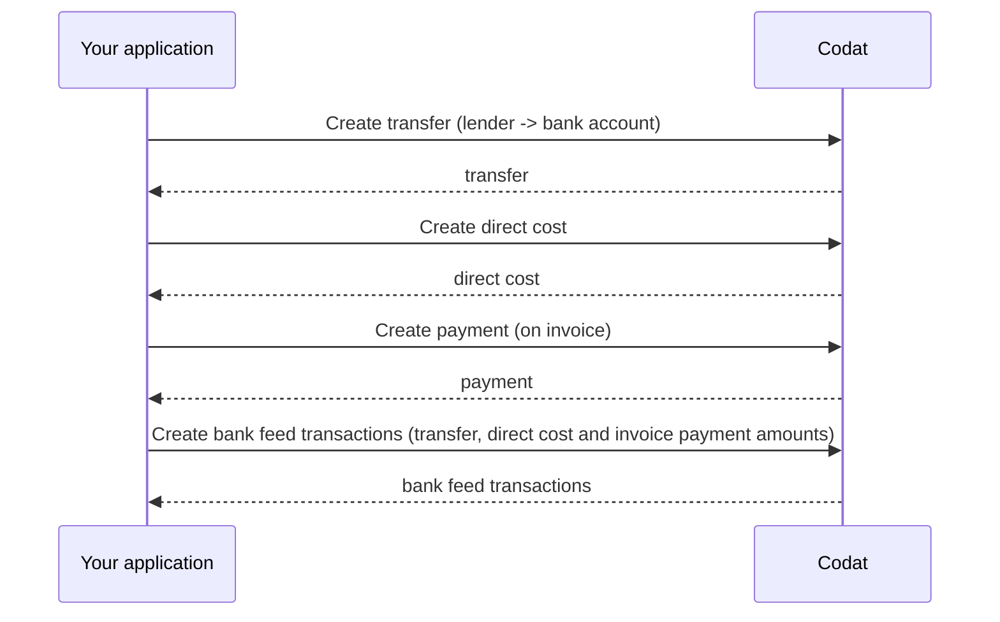

import Tabs from '@theme/Tabs';
import TabItem from '@theme/TabItem';
import WritebackMapping from "@components/global/Prototypes/WritebackMapping";

Once the borrower's customer has paid for the goods or services they purchased, the financed invoice is ready to be reconciled in the accounting platform.  

To reflect that programmatically, perform these steps:

1. [Create a transfer](/lending/guides/loan-writeback/record-invoice-finance#create-transfer) from the lender's bank account to the borrower's to account for the oustanding amount less fees.

2. To record interest or fees, [create a direct cost](/lending/guides/loan-writeback/record-invoice-finance#create-direct-cost) against the lender's bank account.

3. To update the invoice as paid, [create a payment](/lending/guides/loan-writeback/record-invoice-finance#create-payment) in the lender's bank account.

4. [Create bank feed transactions](/lending/guides/loan-writeback/record-invoice-finance#create-bank-feed-transactions) to represent the transfer, direct cost and invoice payment in the lender's bank account.



To perform these operations, you will need the following properties:

- Lender's [`supplier.id`](/lending-api#/schemas/AccountingSupplier) and [`lendersBankAccount.id`](/lending-api#/AccountingBankAccount)
- SMB's [`expenseAccount.id`](/lending-api#/schemas/AccountingAccount), [`borrowersBankAccount.id`](/lending-api#/AccountingBankAccount), and `currency`
- Interest and fee amounts
- [Invoice](/lending-api#/AccountingInvoice) properties of `id`, `totalAmount, and `customerRef.id`

### Create transfer

Once the SMB's customer pays the invoice, use the [Create transfer](/lending-api#/operations/create-transfer) endpoint to record the outstanding amount not covered by the loan. Note that you are performing a transfer *from* `lendersBankAccount.id` *to* `borrowersBankAccount.id`.

The amount outstanding is calculated as:

```
outstandingAmount = invoiceAmount - advanceAmount - feeAndInterestAmount
```
Store `outstandingAmount` and `outstandingAmountTransferDate` in your application for use later on.

<Tabs>
<TabItem value="nodejs" label="TypeScript">

```javascript
codatLending.loanWriteback.transfers.create({
    accountingTransfer: {
        date: outstandingAmountTransferDate,
        from: {
            accountRef: {
                id: lendersBankAccount.id,
            },
            amount: outstandingAmount,
            currency: borrowersBankAccount.currency,
        },
        to: {
            accountRef: {
                id: borrowersBankAccount.id,
            },
            amount: outstandingAmount,
            currency: borrowersBankAccount.currency,
        },
    },
    companyId: "8a210b68-6988-11ed-a1eb-0242ac120002",
    connectionId: "2e9d2c44-f675-40ba-8049-353bfcb5e171",
    }).then((res: CreateTransferResponse) => {
    if (res.statusCode == 200) {
        // handle response
    }
});
```
</TabItem>

<TabItem value="python" label="Python">

```python
transfers_create_request = operations.CreateTransferRequest(
    accounting_transfer=shared.AccountingTransfer(
        date_=outstanding_amount_transfer_date,
        from_=shared.TransferAccount(
            account_ref=shared.AccountRef(
                id=lenders_bank_account.id,
            ),
            amount=Decimal(outstanding_amount),
            currency=borrowers_bank_account.currency,
        ),
        to=shared.TransferAccount(
            account_ref=shared.AccountRef(
                id=borrowers_bank_account.id,
            ),
            amount=Decimal(outstanding_amount),
            currency=borrowers_bank_account.currency,
        ),
    ),
    company_id='8a210b68-6988-11ed-a1eb-0242ac120002',
    connection_id='2e9d2c44-f675-40ba-8049-353bfcb5e171',
)

transfers_create_response = codat_lending.loan_writeback.transfers.create(transfers_create_request)
```
</TabItem>

<TabItem value="csharp" label="C#">

```csharp
var transfersCreateResponse = await codatLending.LoanWriteback.Transfers.CreateAsync(new CreateTransferRequest() {
    AccountingTransfer = new AccountingTransfer() {
        Date = outstandingAmountTransferDate,
        From = new TransferAccount() {
            AccountRef = new AccountRef() {
                Id = lendersBankAccount.Id,
            },
            Amount = outstandingAmount,
            Currency = borrowersBankAccount.Currency,
        },
        To = new TransferAccount() {
            AccountRef = new AccountRef() {
                Id = borrowersBankAccount.Id,
            },
            Amount = outstandingAmount,
            Currency = borrowersBankAccount.Currency,
        },
    },
    CompanyId = "8a210b68-6988-11ed-a1eb-0242ac120002",
    ConnectionId = "2e9d2c44-f675-40ba-8049-353bfcb5e171",
});
```
</TabItem>

<TabItem value="go" label="Go">

```go
ctx := context.Background()
transfersCreateResponse, err := codatLending.LoanWriteback.Transfers.Create(ctx, operations.CreateTransferRequest{
    AccountingTransfer: &shared.AccountingTransfer{
        Date: lending.String(outstandingAmountTransferDate),
        From: &shared.TransferAccount{
            AccountRef: &shared.AccountRef{
                ID: lending.String(lendersBankAccount.ID),
            },
            Amount: types.MustNewDecimalFromString(outstandingAmount),
            Currency: lending.String(borrowersBankAccount.Currency),
        },
        To: &shared.TransferAccount{
            AccountRef: &shared.AccountRef{
                ID: lending.String(borrowersBankAccount.ID),
            },
            Amount: types.MustNewDecimalFromString(outstandingAmount),
            Currency: lending.String(borrowersBankAccount.Currency),
        },
    },
    CompanyID: "8a210b68-6988-11ed-a1eb-0242ac120002",
    ConnectionID: "2e9d2c44-f675-40ba-8049-353bfcb5e171",
})
```
</TabItem>

<TabItem value="http" label="HTTP">

```http
POST https://api.codat.io/companies/{companyId}/connections/{connectionId}/push/transfers
```

#### Request body

```json
{
    "date": outstandingAmountTransferDate,
    "from": {
        "accountRef": {
            "id": lendersBankAccount.id,
        },
        "account": outstandingAmount,
        "currency": borrowersBankAccount.currency,
    },
    "to": {
        "accountRef": {
            "id": borrowersBankAccount.id,
        },
        "account": outstandingAmount,
        "currency": borrowersBankAccount.currency,
    }
}
```

</TabItem>

</Tabs>

### Create direct cost

Check the [Get create direct cost model](/lending-api#/operations/get-create-directCosts-model), then use the [Create direct cost](/lending-api#/operations/create-direct-cost) endpoint to capture the amount of fees or interest (`feeAndInterestAmount`) incurred by the borrower.

Store the `feeAndInterestAmount` and the direct cost's `issueDate` for use later on in your application.

<Tabs>
<TabItem value="nodejs" label="TypeScript">

```javascript
codatLending.loanWriteback.directCosts.create({
    accountingDirectCost: {
        contactRef: {
            dataType: "suppliers",
            id: supplier.id,
        },
        currency: borrowersBankAccount.currency,
        issueDate: feeAndInterestIssueDate,
        lineItems: [
        {
            accountRef: {
                id: expenseAccount.id,
            },
            description: "Fees and/or interest",
            quantity: 1,
            taxAmount: 0,
            unitAmount: feeAndInterestAmount,
        },
        ],
        paymentAllocations: [
        {
            allocation: {
                totalAmount: feeAndInterestAmount,
            },
            payment: {
                accountRef: {
                    id: lendersBankAccount.id,
                },
            },
        },
        ],
        taxAmount: 0.0,
        totalAmount: feeAndInterestAmount,
    },
    companyId: "8a210b68-6988-11ed-a1eb-0242ac120002",
    connectionId: "2e9d2c44-f675-40ba-8049-353bfcb5e171",
    }).then((res: CreateDirectCostResponse) => {
    if (res.statusCode == 200) {
        // handle response
    }
});
```
</TabItem>

<TabItem value="python" label="Python">

```python
direct_costs_create_request = operations.CreateDirectCostRequest(
    accounting_direct_cost=shared.AccountingDirectCost(
        contact_ref=shared.ContactRef(
            data_type='suppliers',
            id=supplier.id,
        ),
        currency=borrowers_bank_account.currency,
        issue_date=direct_cost_issue_date,
        line_items=[
            shared.DirectCostLineItem(
                account_ref=shared.AccountRef(
                    id=expense_account.id,
                ),
                description='Fees and/or interest',
                quantity=Decimal('1'),
                tax_amount=Decimal('0'),
                unit_amount=Decimal(fee_and_interest_amount),
            ),
        ],
        payment_allocations=[
            shared.AccountingPaymentAllocation(
                allocation=shared.AccountingPaymentAllocationAllocation(
                    total_amount=Decimal(fee_and_interest_amount),
                ),
                payment=shared.PaymentAllocationPayment(
                    account_ref=shared.AccountRef(
                        id=lenders_bank_account.id,
                    ),
                ),
            ),
        ],
        tax_amount=Decimal('0'),
        total_amount=Decimal(fee_and_interest_amount),
    ),
    company_id='8a210b68-6988-11ed-a1eb-0242ac120002',
    connection_id='2e9d2c44-f675-40ba-8049-353bfcb5e171',
)

direct_costs_create_response = codat_lending.loan_writeback.direct_costs.create(direct_costs_create_request)
```
</TabItem>

<TabItem value="csharp" label="C#">

```csharp
var redirectCostsCreateResponse = await codatLending.LoanWriteback.DirectCosts.CreateAsync(new CreateDirectCostRequest() {
    AccountingDirectCost = new AccountingDirectCost() {
        ContactRef = new ContactRef() {
            DataType = "suppliers",
            Id = supplier.id,
        },
        Currency = borrowersBankAccount.Currency,
        IssueDate = feeAndInterestIssueDate,
        LineItems = new List<DirectCostLineItem>() {
            new DirectCostLineItem() {
                AccountRef = new AccountRef() {
                    Id = expenseAccount.Id,
                },
                Description = "Fees and/or interest",
                Quantity = 1M,
                TaxAmount = 0M,
                UnitAmount = feeAndInterestAmount,
            },
        },
        PaymentAllocations = new List<AccountingPaymentAllocation>() {
            new AccountingPaymentAllocation() {
                Allocation = new AccountingPaymentAllocationAllocation() {
                    TotalAmount = feeAndInterestAmount,
                },
                Payment = new PaymentAllocationPayment() {
                    AccountRef = new AccountRef() {
                        Id = lendersBankAccount.Id,
                    },
                },
            },
        },
        TaxAmount = 0M,
        TotalAmount = feeAndInterestAmount,
    },
    CompanyId = "8a210b68-6988-11ed-a1eb-0242ac120002",
    ConnectionId = "2e9d2c44-f675-40ba-8049-353bfcb5e171",
});
```
</TabItem>

<TabItem value="go" label="Go">

```go
ctx := context.Background()
res, err := s.LoanWriteback.DirectCosts.Create(ctx, operations.CreateDirectCostRequest{
    AccountingDirectCost: &shared.AccountingDirectCost{
        ContactRef: &shared.ContactRef{
            DataType: lending.String("suppliers"),
            ID: supplier.ID,
        },
        Currency: borrowersBankAccount.Currency,
        IssueDate: feeAndInterestIssueDate,
        LineItems: []shared.DirectCostLineItem{
            shared.DirectCostLineItem{
                AccountRef: &shared.AccountRef{
                    ID: lending.String(expenseAccount.ID),
                },
                Description: lending.String("Fees and/or interest"),
                Quantity: types.MustNewDecimalFromString("1"),
                TaxAmount: types.MustNewDecimalFromString("0"),
                UnitAmount: types.MustNewDecimalFromString(feeAndInterestAmount),
            },
        },
        PaymentAllocations: []shared.AccountingPaymentAllocation{
            shared.AccountingPaymentAllocation{
                Allocation: shared.AccountingPaymentAllocationAllocation{
                    TotalAmount: types.MustNewDecimalFromString(feeAndInterestAmount),
                },
                Payment: shared.PaymentAllocationPayment{
                    AccountRef: &shared.AccountRef{
                        ID: lending.String(lendersBankAccount.ID),
                    },
                },
            },
        },
        TaxAmount: types.MustNewDecimalFromString("0"),
        TotalAmount: types.MustNewDecimalFromString(feeAndInterestAmount),
    },
    CompanyID: "8a210b68-6988-11ed-a1eb-0242ac120002",
    ConnectionID: "2e9d2c44-f675-40ba-8049-353bfcb5e171",
})
```
</TabItem>

<TabItem value="http" label="HTTP">

```http
POST https://api.codat.io/companies/{companyId}/connections/{connectionId}/push/directCosts
```

#### Request body

```json
{
	"issueDate": feeAndInterestIssueDate,
	"currency": borrowersBankAccount.currency,
	"taxAmount": 0.0,
	"totalAmount": feeAndInterestAmount,
	"contactRef": {
		"id": supplier.id,
		"dataType": "suppliers"
	},
	"paymentAllocations": [{
		"payment": {
			"accountRef": {
				"id": lendersBankAccount.id
			}
		},
		"allocation": {
			"totalAmount": feeAndInterestAmount
		}
	}],
	"lineItems": [{
		"description": "Fees and/or interest",
		"quantity": 1,
		"unitAmount": feeAndInterestAmount,
		"taxAmount": 0,
		"accountRef": {
			"id": expenseAccount.id
		}
	}]
}
```
</TabItem>

</Tabs>

### Create payment

Next, use the [Create payment](/lending-api#/operations/create-payment) endpoint to acknowledge payment has been received for the invoice. Store the `invoicePaymentDate` for use later on in your application.

<Tabs>
<TabItem value="nodejs" label="TypeScript">

```javascript
sdk.loanWriteback.payments.create({
  accountingPayment: {
    accountRef: {
      id: lendersBankAccount.id,
    },
    currency: borrowersBankAccount.Currency,
    customerRef: {
      id: invoice.customerRef.id,
    },
    date: invoicePaymentDate,
    lines: [
      {
        allocatedOnDate: invoicePaymentDate,
        amount: invoice.totalAmount, // The sum of the link amounts plus the line amount must equal zero
        links: [
          {
            amount: -invoice.totalAmount, // Note the negative sign is here
            currencyRate: 1,
            id: invoice.id,
            type: PaymentLinkType.Invoice,
          },
        ],
      },
    ],
    totalAmount: invoice.totalAmount,
  },
  companyId: "8a210b68-6988-11ed-a1eb-0242ac120002",
  connectionId: "2e9d2c44-f675-40ba-8049-353bfcb5e171",
}).then((res: CreatePaymentResponse) => {
  if (res.statusCode == 200) {
    // handle response
  }
});
```
</TabItem>

<TabItem value="python" label="Python">

```python
payment_create_request = operations.CreatePaymentRequest(
    accounting_payment=shared.AccountingPayment(
        account_ref=shared.AccountRef(
            id=lenders_bank_account.id,
        ),
        currency=borrowers_bank_account.currency,
        customer_ref=shared.AccountingCustomerRef(
            id=invoice.customer_ref.id,
        ),
        date_=invoice_payment_date,
        lines=[
            shared.PaymentLine(
                allocated_on_date=invoice_payment_date,
                amount=Decimal(f'{invoice.total_amount}'), # The sum of the link amounts plus the line amount must equal zero
                links=[
                    shared.PaymentLineLink(
                        amount=Decimal(f'-{invoice.total_amount}'), # Note the negative sign is here
                        currency_rate=Decimal('1'),
                        id=invoice.id,
                        type=shared.PaymentLinkType.INVOICE,
                    ),
                ],
            ),
        ],
        total_amount=Decimal(f'{invoice.total_amount}'),
    ),
    company_id='8a210b68-6988-11ed-a1eb-0242ac120002',
    connection_id='2e9d2c44-f675-40ba-8049-353bfcb5e171',
)

payment_create_response = codat_lending.loan_writeback.payments.create(payment_create_request)
```
</TabItem>

<TabItem value="csharp" label="C#">

```csharp
var res = await codatLending.LoanWriteback.Payments.CreateAsync(new CreatePaymentRequest() {
    AccountingPayment = new AccountingPayment() {
        AccountRef = new AccountRef() {
            Id = lendersBankAccount.Id,
        },
        Currency = borrowersBankAccount.Currency,
        CustomerRef = new AccountingCustomerRef() {
            Id = invoice.CustomerRef.Id,
        },
        Date = invoicePaymentDate,
        Lines = new List<PaymentLine>() {
            new PaymentLine() {
                AllocatedOnDate = invoicePaymentDate,
                Amount = invoice.TotalAmount, // The sum of the link amounts plus the line amount must equal zero
                Links = new List<PaymentLineLink>() {
                    new PaymentLineLink() {
                        Amount = -invoice.TotalAmount, // Note the negative sign is here
                        CurrencyRate = 1M,
                        Id = invoice.Id,
                        Type = PaymentLinkType.Invoice,
                    },
                },
            },
        },
        TotalAmount = invoice.TotalAmount,
    },
    CompanyId = "8a210b68-6988-11ed-a1eb-0242ac120002",
    ConnectionId = "2e9d2c44-f675-40ba-8049-353bfcb5e171",
});
```
</TabItem>

<TabItem value="go" label="Go">

```go
ctx := context.Background()
res, err := codatLending.LoanWriteback.Payments.Create(ctx, operations.CreatePaymentRequest{
    AccountingPayment: &shared.AccountingPayment{
        AccountRef: &shared.AccountRef{
            ID: lending.String(lendersBankAccount.ID),
        },
        Currency: lending.String(borrowersBankAccount.Currency),
        CustomerRef: &shared.AccountingCustomerRef{
            ID: invoice.CustomerRef.ID,
        },
        Date: invoicePaymentDate,
        Lines: []shared.PaymentLine{
            shared.PaymentLine{
                AllocatedOnDate: lending.String(invoicePaymentDate),
                Amount: invoice.TotalAmount,// The sum of the link amounts plus the line amount must equal zero
                Links: []shared.PaymentLineLink{
                    shared.PaymentLineLink{
                        Amount: -invoice.TotalAmount, // Note the negative sign is here
                        CurrencyRate: types.MustNewDecimalFromString("1"),
                        ID: lending.String(invoice.ID),
                        Type: shared.PaymentLinkTypeInvoice,
                    },
                },
            },
        },
        TotalAmount: types.MustNewDecimalFromString(invoice.TotalAmount),
    },
    CompanyID: "8a210b68-6988-11ed-a1eb-0242ac120002",
    ConnectionID: "2e9d2c44-f675-40ba-8049-353bfcb5e171",
})
```
</TabItem>

<TabItem value="http" label="HTTP">

```http
POST https://api.codat.io/companies/{companyId}/connections/{connectionId}/push/payments
```

#### Request body

```json
{
  "customerRef": {
    "id": invoice.customerRef.id,
  },
  "accountRef": {
    "id": lendersBankAccount.id,
  },
  "totalAmount": invoice.totalAmount,
  "currency": borrowersBankAccount.currency,
  "currencyRate": 1,
  "date": invoicePaymentDate,
  "lines": [
    {
      "amount": invoice.totalAmount, // The sum of amount and line amounts must equal zero
      "links": [
        {
          "type": "Invoice",
          "id": invoice.id,
          "amount": -invoice.totalAmount, // Note the negative sign is here
          "currencyRate": 1
        }
      ],
      "allocatedOnDate": invoicePaymentDate
    }
  ],
}
```
</TabItem>

</Tabs>

### Create bank feed transactions

Finally, use the [Create bank account transactions](/lending-api#/operations/create-bank-transactions) endpoint again to deposit the total amount (including the repayment, fees, and any interest) into the lender's bank account. You will need the previously stored values for this operation.

<Tabs>
<TabItem value="nodejs" label="TypeScript">

```javascript
codatLending.loanWriteback.bankTransactions.create({
    accountingCreateBankTransactions: {
        accountId: lendersBankAccount.id, // Lender's virtual bank account ID you would have stored from the configuration step
        transactions: [
        {
            id: transactionId, // Unique identifier for this bank transaction
            amount: feeAndInterestAmount,
            date: feeAndInterestIssueDate,
            description: description, // Include a reference to supplier and direct cost
        },
        {
            id: transactionId, // Unique identifier for this bank transaction
            amount: outstandingAmount,
            date: outstandingAmountTransferDate,
            description: description, // Include a reference to transfer
        },
        {
            id: transactionId, // Unique identifier for this bank transaction
            amount: invoice.totalAmount,
            date: invoicePaymentDate,
            description: description, // Include a reference to the customer and invoice number/ID
        },
        ],
    },
    accountId: lendersBankAccount.Id,
    companyId: "8a210b68-6988-11ed-a1eb-0242ac120002",
    connectionId: "2e9d2c44-f675-40ba-8049-353bfcb5e171",
}).then((res: CreateBankTransactionsResponse) => {
if (res.statusCode == 200) {
    // handle response
}
});
```
</TabItem>

<TabItem value="python" label="Python">

```python
bank_transactions_create_request = operations.CreateBankTransactionsRequest(
    accounting_create_bank_transactions=shared.AccountingCreateBankTransactions(
        account_id=lenders_bank_account.id, # Lender's virtual bank account ID you would have stored from the configuration step
        transactions=[
            shared.CreateBankAccountTransaction(
                id=transactionId, # Unique identifier for this bank transaction
                amount=Decimal(fee_and_interest_amount),
                date=fee_and_interest_issue_date,
                description=description, # Include a reference to supplier and direct cost
            ),
            shared.CreateBankAccountTransaction(
                id=transactionId, # Unique identifier for this bank transaction
                amount=Decimal(outstanding_amount),
                date=outstanding_amount_transfer_date,
                description=description, # Include a reference to transfer
            ),
            shared.CreateBankAccountTransaction(
                id=transactionId, # Unique identifier for this bank transaction
                amount=Decimal(invoice_amount),
                date=invoice_payment_date,
                description=description, # Include a reference to the customer and invoice number/ID
            ),
        ],
    ),
    account_id=lenders_bank_account.id,
    company_id='8a210b68-6988-11ed-a1eb-0242ac120002',
    connection_id='2e9d2c44-f675-40ba-8049-353bfcb5e171',
)

bank_transactions_create_response = codat_lending.loan_writeback.bank_transactions.create(bank_transactions_create_request)
```
</TabItem>

<TabItem value="csharp" label="C#">

```csharp
var bankTransactionsCreateResponse = await codatLending.LoanWriteback.BankTransactions.CreateAsync(new CreateBankTransactionsRequest() {
    AccountingCreateBankTransactions = new AccountingCreateBankTransactions() {
        AccountId = lendersBankAccount.Id, // Lender's virtual bank account ID you would have stored from the configuration step
        Transactions = new List<CreateBankAccountTransaction>() {
            new CreateBankAccountTransaction(){
                Id = transactionId, // Unique identifier for this bank transaction
                Amount = feeAndInterestAmount,
                date = feeAndInterestIssueDate,
                description = description, // Include a reference to supplier and direct cost
            },
            new CreateBankAccountTransaction(){
                Id = transactionId, // Unique identifier for this bank transaction
                Amount = outstandingAmount,
                Date = outstandingAmountTransferDate,
                Description = description, // Include a reference to transfer
            },
            new CreateBankAccountTransaction(){
                Id = transactionId, // Unique identifier for this bank transaction
                Amount = invoiceAmount, 
                Date = invoicePaymentDate,
                Description = description, // Include a reference to the customer and invoice number/ID 
            },
        },
    },
    AccountId = lendersBankAccount.Id,
    CompanyId = "8a210b68-6988-11ed-a1eb-0242ac120002",
    ConnectionId = "2e9d2c44-f675-40ba-8049-353bfcb5e171"
});
```
</TabItem>

<TabItem value="go" label="Go">

```go
ctx := context.Background()
bankTransactionsCreateRequest, err := codatLending.LoanWriteback.BankTransactions.Create(ctx, operations.CreateBankTransactionsRequest{
    AccountingCreateBankTransactions: &shared.AccountingCreateBankTransactions{
        AccountID: lending.String(lendersBankAccount.ID), // Lender's virtual bank account ID you would have stored from the configuration step
        Transactions: []shared.CreateBankAccountTransaction{ 
            shared.CreateBankAccountTransaction{
                ID: lending.String(transactionID), // Unique identifier for this bank transaction
                Amount: types.MustNewDecimalFromString(feeAndInterestAmount),
                Date: lending.String(feeAndInterestIssueDate),
                Description: lending.String(description), // Include a reference to supplier and direct cost
            },
            shared.CreateBankAccountTransaction{
                ID: lending.String(transactionID), // Unique identifier for this bank transaction
                Amount: types.MustNewDecimalFromString(outstandingAmount),
                Date: lending.String(outstandingAmountTransferDate),
                Description = lending.String(description), // Include a reference to transfer
            },
            shared.CreateBankAccountTransaction{
                ID: lending.String(transactionID), // Unique identifier for this bank transaction
                Amount: types.MustNewDecimalFromString(invoice.totalAmount), 
                Date: lending.String(invoicePaymentDate),
                Description: lending.String(description), // Include a reference to the customer and invoice number/ID
            },
        },
    },
    AccountID: lendersBankAccount.ID,
    CompanyID: "8a210b68-6988-11ed-a1eb-0242ac120002",
    ConnectionID: "2e9d2c44-f675-40ba-8049-353bfcb5e171",
    })
```
</TabItem>

<TabItem value="http" label="HTTP">

```http
POST https://api.codat.io/companies/{companyId}/connections/{connectionId}/push/bankAccounts/{accountId}/bankTransactions
```

#### Request body

```json
{
  "accountId": lendersBankAccount.id, // Lender's virtual bank account ID you would have stored from the configuration step
  "transactions": [
    {
        "id": transactionId, // Unique identifier for this bank transaction
        "amount": feeAndInterestAmount,
        "date": feeAndInterestIssueDate,
        "description": description, // Include a reference to supplier and direct cost
    },
    {
        "id": transactionId, // Unique identifier for this bank transaction
        "amount": outstandingAmount,
        "date": outstandingAmountTransferDate,
        "description": description, // Include a reference to transfer
    },
    {
        "id": transactionId, // Unique identifier for this bank transaction
        "amount": invoice.totalAmount,
        "date": invoicePaymentDate, 
        "description": description, // Include a reference to the customer and invoice number/ID
    },
  ]
}
```
</TabItem>

</Tabs>

At the end of this 3-stage process, your borrower will have the loan writeback reflected correctly in their accounting platform. This saves them time on reconciliation and makes sure they (and you!) have clarity on the state of the loan.

:::tip Recap
In this guide, you have learned:
* What is loan writeback and what it's used for.
* How to map and configure the loan writeback solution.
* How to perform the necessary postings using Codat's endpoints.
:::

---

## Read next

* Check out our [invoice finance guide](/lending/guides/invoice-finance/introduction) to see how you can make automated decisions on selected invoices.
* Review other features of the [Lending API](/lending/overview).