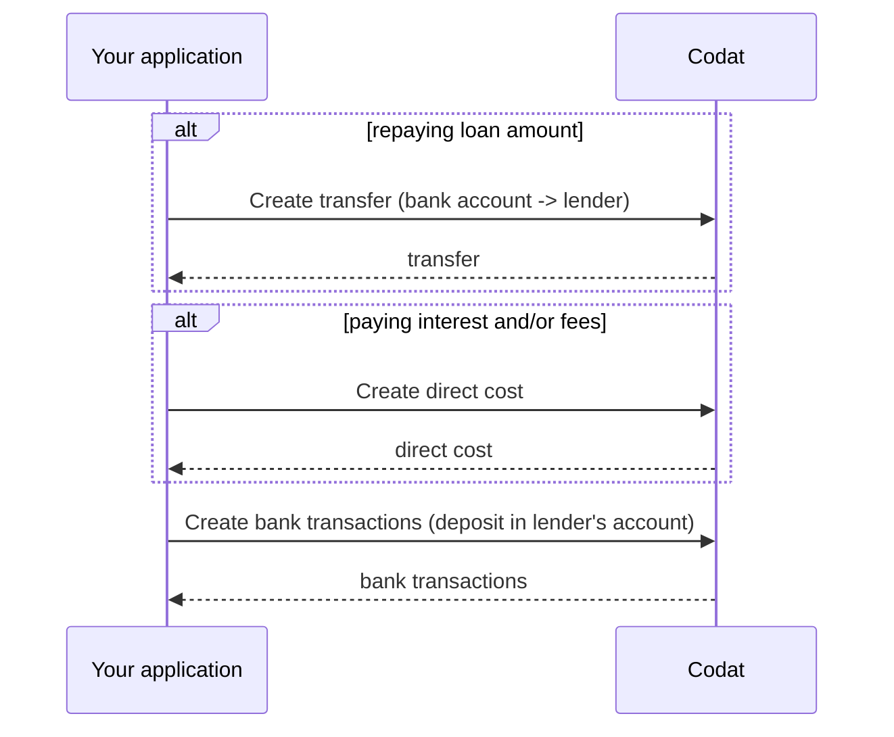

import Tabs from '@theme/Tabs';
import TabItem from '@theme/TabItem';

Based on the loan's terms and conditions, the borrower will periodically repay the lender the loan amount and any associated fees. 

To reflect that programmatically, perform these steps every time a repayment is made:

1. [Create a transfer](/lending/guides/loan-writeback/repay-general-loan#create-transfer) from the borrower's bank account to the lender's for each repayment.

2. [Create a direct cost](/lending/guides/loan-writeback/repay-general-loan#create-direct-cost) to record interest or fees.

3. [Create bank feed transactions](/lending/guides/loan-writeback/repay-general-loan#create-bank-feed-transactions) to represent the transfer and direct cost in the lender's bank account.

For example, if the borrower took out a loan of £1000 with a loan charge of 20%, the total amount due comes to £1200. With a 3-month equal instalment repayment plan, the borrower pays back £400 each month. 

This means you need to create a transfer of £320 to represent the payment, a direct cost of £80 to record the fees, and a bank transaction of £400 to reduce the liability to the lender.


To perform these operations, you will need the following properties:

- Lender's [`supplier.id`](/lending-api#/schemas/AccountingSupplier) and [`lendersBankAccount.id`](/lending-api#/AccountingBankAccount)
- SMB's [`expenseAccount.id`](/lending-api#/schemas/AccountingAccount), [`borrowersBankAccount.id`](/lending-api#/AccountingBankAccount), and `currency`
- `repaymentDate` - the date of the repayment
- `repaymentAmount` - the amount repaying the loan amount
- `interestAndFeesAmount` - the amount paying for interest and fees
- `totalRepaymentAmount`, where `totalRepaymentAmount = repaymentAmount + interestAndFeesAmount`

### Create transfer

Use the [Create transfer](/lending-api#/operations/create-transfer) endpoint again, this time to record the loan repayment amount. Note that you are performing a transfer *from* `borrowersBankAccount.id` *to* `lendersBankAccount.id`.

<Tabs>
<TabItem value="nodejs" label="TypeScript">

```javascript
codatLending.loanWriteback.transfers.create({
    accountingTransfer: {
        date: repaymentDate,
        from: {
            accountRef: {
                id: borrowersBankAccount.id,
            },
            amount: repaymentAmount,
            currency: borrowersBankAccount.currency,
        },
        to: {
            accountRef: {
                id: lendersBankAccount.id,
            },
            amount: repaymentAmount,
            currency: borrowersBankAccount.currency,
        },
    },
    companyId: "8a210b68-6988-11ed-a1eb-0242ac120002",
    connectionId: "2e9d2c44-f675-40ba-8049-353bfcb5e171",
    }).then((res: CreateTransferResponse) => {
    if (res.statusCode == 200) {
        // handle response
    }
});
```
</TabItem>

<TabItem value="python" label="Python">

```python
transfers_create_request = operations.CreateTransferRequest(
    accounting_transfer=shared.AccountingTransfer(
        date_=repaymentDate,
        from_=shared.TransferAccount(
            account_ref=shared.AccountRef(
                id=borrowers_bank_account.id,
            ),
            amount=Decimal(repayment_amount),
            currency=borrowers_bank_account.currency,
        ),
        to=shared.TransferAccount(
            account_ref=shared.AccountRef(
                id=lenders_bank_account.id,
            ),
            amount=Decimal(repayment_amount),
            currency=borrowers_bank_account.currency,
        ),
    ),
    company_id='8a210b68-6988-11ed-a1eb-0242ac120002',
    connection_id='2e9d2c44-f675-40ba-8049-353bfcb5e171',
)

transfers_create_response = codat_lending.loan_writeback.transfers.create(transfers_create_request)
```
</TabItem>

<TabItem value="csharp" label="C#">

```csharp
var transfersCreateResponse = await codatLending.LoanWriteback.Transfers.CreateAsync(new CreateTransferRequest() {
    AccountingTransfer = new AccountingTransfer() {
        Date = repaymentDate,
        From = new TransferAccount() {
            AccountRef = new AccountRef() {
                Id = borrowersBankAccount.Id,
            },
            Amount = repaymentAmount,
            Currency = borrowersBankAccount.Currency,
        },
        To = new TransferAccount() {
            AccountRef = new AccountRef() {
                Id = lendersBankAccount.Id,
            },
            Amount = repaymentAmount,
            Currency = borrowersBankAccount.Currency,
        },
    },
    CompanyId = "8a210b68-6988-11ed-a1eb-0242ac120002",
    ConnectionId = "2e9d2c44-f675-40ba-8049-353bfcb5e171",
});
```
</TabItem>

<TabItem value="go" label="Go">

```go
ctx := context.Background()
transfersCreateResponse, err := codatLending.LoanWriteback.Transfers.Create(ctx, operations.CreateTransferRequest{
    AccountingTransfer: &shared.AccountingTransfer{
        Date: lending.String(repaymentDate),
        From: &shared.TransferAccount{
            AccountRef: &shared.AccountRef{
                ID: lending.String(borrowersBankAccountID),
            },
            Amount: types.MustNewDecimalFromString(repaymentAmount),
            Currency: lending.String(borrowersBankAccount.Currency),
        },
        To: &shared.TransferAccount{
            AccountRef: &shared.AccountRef{
                ID: lending.String(lendersBankAccount.ID),
            },
            Amount: types.MustNewDecimalFromString(repaymentAmount),
            Currency: lending.String(borrowersBankAccount.Currency),
        },
    },
    CompanyID: "8a210b68-6988-11ed-a1eb-0242ac120002",
    ConnectionID: "2e9d2c44-f675-40ba-8049-353bfcb5e171",
})
```
</TabItem>

<TabItem value="http" label="HTTP">

```http
POST https://api.codat.io/companies/{companyId}/connections/{connectionId}/push/transfers
```

#### Request body

```json
{
    "date": repaymentDate,
    "from": {
        "accountRef": {
            "id": borrowersBankAccount.id,
        },
        "account": repaymentAmount,
        "currency": borrowersBankAccount.currency,
    },
    "to": {
        "accountRef": {
            "id": lendersBankAccount.id,
        },
        "account": repaymentAmount,
        "currency": borrowersBankAccount.currency,
    }
}
```

</TabItem>

</Tabs>

### Create direct cost

Check the [Get create direct cost model](/lending-api#/operations/get-create-directCosts-model), then use the [Create direct cost](/lending-api#/operations/create-direct-cost) endpoint to capture the amount of fees or interest incurred by the borrower.

<Tabs>
<TabItem value="nodejs" label="TypeScript">

```javascript
codatLending.loanWriteback.directCosts.create({
    accountingDirectCost: {
        contactRef: {
            dataType: "suppliers",
            id: supplier.id,
        },
        currency: borrowersBankAccount.currency,
        issueDate: repaymentDate,
        lineItems: [
        {
            accountRef: {
                id: expenseAccount.id,
            },
            description: "Fees and/or interest",
            quantity: 1,
            taxAmount: 0,
            unitAmount: interestAndFeesAmount,
        },
        ],
        paymentAllocations: [
        {
            allocation: {
                totalAmount: interestAndFeesAmount,
            },
            payment: {
                accountRef: {
                    id: borrowersBankAccount.id,
                },
            },
        },
        ],
        taxAmount: 0.0,
        totalAmount: interestAndFeesAmount,
    },
    companyId: "8a210b68-6988-11ed-a1eb-0242ac120002",
    connectionId: "2e9d2c44-f675-40ba-8049-353bfcb5e171",
    }).then((res: CreateDirectCostResponse) => {
    if (res.statusCode == 200) {
        // handle response
    }
});
```
</TabItem>

<TabItem value="python" label="Python">

```python
direct_costs_create_request = operations.CreateDirectCostRequest(
    accounting_direct_cost=shared.AccountingDirectCost(
        contact_ref=shared.ContactRef(
            data_type='suppliers',
            id=supplier.id,
        ),
        currency=borrowersBankAccount.currency,
        issue_date=repaymentDate,
        line_items=[
            shared.DirectCostLineItem(
                account_ref=shared.AccountRef(
                    id=expense_account.id,
                ),
                description='Fees and/or interest',
                quantity=Decimal('1'),
                tax_amount=Decimal('0'),
                unit_amount=Decimal(interest_and_fees_amount),
            ),
        ],
        payment_allocations=[
            shared.AccountingPaymentAllocation(
                allocation=shared.AccountingPaymentAllocationAllocation(
                    total_amount=Decimal(interest_and_fees_amount),
                ),
                payment=shared.PaymentAllocationPayment(
                    account_ref=shared.AccountRef(
                        id=borrowers_bank_account.id,
                    ),
                ),
            ),
        ],
        tax_amount=Decimal('0'),
        total_amount=Decimal(interest_and_fees_amount),
    ),
    company_id='8a210b68-6988-11ed-a1eb-0242ac120002',
    connection_id='2e9d2c44-f675-40ba-8049-353bfcb5e171',
)

direct_costs_create_response = codat_lending.loan_writeback.direct_costs.create(direct_costs_create_request)
```
</TabItem>

<TabItem value="csharp" label="C#">

```csharp
var redirectCostsCreateResponse = await codatLending.LoanWriteback.DirectCosts.CreateAsync(new CreateDirectCostRequest() {
    AccountingDirectCost = new AccountingDirectCost() {
        ContactRef = new ContactRef() {
            DataType = "suppliers",
            Id = supplier.id,
        },
        Currency = borrowersBankAccount.Currency,
        IssueDate = repaymentDate,
        LineItems = new List<DirectCostLineItem>() {
            new DirectCostLineItem() {
                AccountRef = new AccountRef() {
                    Id = expenseAccount.Id,
                },
                Description = "Fees and/or interest",
                Quantity = 1M,
                TaxAmount = 0M,
                UnitAmount = interestAndFeesAmount,
            },
        },
        PaymentAllocations = new List<AccountingPaymentAllocation>() {
            new AccountingPaymentAllocation() {
                Allocation = new AccountingPaymentAllocationAllocation() {
                    TotalAmount = interestAndFeesAmount,
                },
                Payment = new PaymentAllocationPayment() {
                    AccountRef = new AccountRef() {
                        Id = borrowersBankAccount.Id,
                    },
                },
            },
        },
        TaxAmount = 0M,
        TotalAmount = interestAndFeesAmount,
    },
    CompanyId = "8a210b68-6988-11ed-a1eb-0242ac120002",
    ConnectionId = "2e9d2c44-f675-40ba-8049-353bfcb5e171",
});
```
</TabItem>

<TabItem value="go" label="Go">

```go
ctx := context.Background()
res, err := s.LoanWriteback.DirectCosts.Create(ctx, operations.CreateDirectCostRequest{
    AccountingDirectCost: &shared.AccountingDirectCost{
        ContactRef: &shared.ContactRef{
            DataType: lending.String("suppliers"),
            ID: supplier.ID,
        },
        Currency: borrowersBankAccount.Currency,
        IssueDate: repaymentDate,
        LineItems: []shared.DirectCostLineItem{
            shared.DirectCostLineItem{
                AccountRef: &shared.AccountRef{
                    ID: lending.String(expenseAccount.ID),
                },
                Description: lending.String("Fees and/or interest"),
                Quantity: types.MustNewDecimalFromString("1"),
                TaxAmount: types.MustNewDecimalFromString("0"),
                UnitAmount: types.MustNewDecimalFromString(interestAndFeesAmount),
            },
        },
        PaymentAllocations: []shared.AccountingPaymentAllocation{
            shared.AccountingPaymentAllocation{
                Allocation: shared.AccountingPaymentAllocationAllocation{
                    TotalAmount: types.MustNewDecimalFromString(interestAndFeesAmount),
                },
                Payment: shared.PaymentAllocationPayment{
                    AccountRef: &shared.AccountRef{
                        ID: lending.String(borrowersBankAccount.ID),
                    },
                },
            },
        },
        TaxAmount: types.MustNewDecimalFromString("0"),
        TotalAmount: types.MustNewDecimalFromString(interestAndFeesAmount),
    },
    CompanyID: "8a210b68-6988-11ed-a1eb-0242ac120002",
    ConnectionID: "2e9d2c44-f675-40ba-8049-353bfcb5e171",
})
```
</TabItem>

<TabItem value="http" label="HTTP">

```http
POST https://api.codat.io/companies/{companyId}/connections/{connectionId}/push/directCosts
```

#### Request body

```json
{
	"issueDate": repaymentDate,
	"currency": borrowersBankAccount.currency,
	"taxAmount": 0.0,
	"totalAmount": interestAndFeesAmount,
	"contactRef": {
		"id": supplier.id,
		"dataType": "suppliers"
	},
	"paymentAllocations": [{
		"payment": {
			"accountRef": {
				"id": borrowersBankAccount.id
			}
		},
		"allocation": {
			"totalAmount": interestAndFeesAmount
		}
	}],
	"lineItems": [{
		"description": Fees and/or interest,
		"quantity": 1,
		"unitAmount": interestAndFeesAmount,
		"taxAmount": 0,
		"accountRef": {
			"id": expenseAccount.id
		}
	}]
}
```
</TabItem>

</Tabs>

### Create bank transaction

Use the [Create bank account transactions](/lending-api#/operations/create-bank-transactions) endpoint to deposit the total amount (including the repayment, fees, and any interest) into the lender's bank account.

<Tabs>
<TabItem value="nodejs" label="TypeScript">

```javascript
codatLending.loanWriteback.bankTransactions.create({
    accountingCreateBankTransactions: {
        accountId: lendersBankAccount.id,
        transactions: [
        {
            id: transactionId, // Unique identifier for this bank transaction
            amount: totalRepaymentAmount,
            date: repaymentDate,
            description: description, // Include a reference to the direct cost, the loan and you, the lender
        },
        ],
    },
    accountId: lendersBankAccount.Id,
    companyId: "8a210b68-6988-11ed-a1eb-0242ac120002",
    connectionId: "2e9d2c44-f675-40ba-8049-353bfcb5e171",
}).then((res: CreateBankTransactionsResponse) => {
if (res.statusCode == 200) {
    // handle response
}
});
```
</TabItem>

<TabItem value="python" label="Python">

```python
bank_transactions_create_request = operations.CreateBankTransactionsRequest(
    accounting_create_bank_transactions=shared.AccountingCreateBankTransactions(
        account_id=lenders_bank_account.id,
        transactions=[
            shared.CreateBankAccountTransaction(
                id=transaction_id, # Unique identifier for this bank transaction
                amount=Decimal(total_repayment_amount),
                date_=repayment_date,
                description=description, # Include a reference to the direct cost, the loan and you, the lender
            ),
        ],
    ),
    account_id=lenders_bank_account.id,
    company_id='8a210b68-6988-11ed-a1eb-0242ac120002',
    connection_id='2e9d2c44-f675-40ba-8049-353bfcb5e171',
)

bank_transactions_create_response = codat_lending.loan_writeback.bank_transactions.create(bank_transactions_create_request)
```
</TabItem>

<TabItem value="csharp" label="C#">

```csharp
var bankTransactionsCreateResponse = await codatLending.LoanWriteback.BankTransactions.CreateAsync(new CreateBankTransactionsRequest() {
    AccountingCreateBankTransactions = new AccountingCreateBankTransactions() {
        AccountId = lendersBankAccount.Id,
        Transactions = new List<CreateBankAccountTransaction>() {
            new CreateBankAccountTransaction() {
                Id = transactionId, // Unique identifier for this bank transaction
                Amount = totalRepaymentAmount,
                Date = repaymentDate,
                Description = description, // Include a reference to the direct cost, the loan and you, the lender
            },
        },
    },
    AccountId = lendersBankAccount.Id,
    CompanyId = "8a210b68-6988-11ed-a1eb-0242ac120002",
    ConnectionId = "2e9d2c44-f675-40ba-8049-353bfcb5e171"
});
```
</TabItem>

<TabItem value="go" label="Go">

```go
ctx := context.Background()
bankTransactionsCreateRequest, err := codatLending.LoanWriteback.BankTransactions.Create(ctx, operations.CreateBankTransactionsRequest{
    AccountingCreateBankTransactions: &shared.AccountingCreateBankTransactions{
        AccountID: lending.String(lendersBankAccount.ID),
        Transactions: []shared.CreateBankAccountTransaction{ 
            shared.CreateBankAccountTransaction{
                ID: lending.String(transactionID), // Unique identifier for this bank transaction
                Amount: types.MustNewDecimalFromString(totalRepaymentAmount),
                Date: lending.String(repaymentDate),
                Description: lending.String(description), // Include a reference to the direct cost, the loan and you, the lender
            },
        },
    },
    AccountID: lendersBankAccount.ID,
    CompanyID: "8a210b68-6988-11ed-a1eb-0242ac120002",
    ConnectionID: "2e9d2c44-f675-40ba-8049-353bfcb5e171",
    })
```
</TabItem>

<TabItem value="http" label="HTTP">

```http
POST https://api.codat.io/companies/{companyId}/connections/{connectionId}/push/bankAccounts/{accountId}/bankTransactions
```

#### Request body

```json
{
  "accountId": lendersBankAccount.Id,
  "transactions": [{
    "id": transactionId, // Unique identifier for this bank transaction
    "amount": totalRepaymentAmount,
    "date": repaymentDate,
    "description": description // Include a reference to the direct cost, the loan and you, the lender
  }]
}
```
</TabItem>

</Tabs>

At the end of this 3-stage process, your borrower will have the loan writeback reflected correctly in their accounting platform. This saves them time on reconciliation and makes sure they (and you!) have clarity on the state of the loan.

:::tip Recap
In this guide, you have learned:
* What is loan writeback and what it's used for.
* How to map and configure the loan writeback solution.
* How to perform the necessary postings using Codat's endpoints.
:::

---

## Read next

* Looking to implement loan writeback for Xero? View Xero's [own documentation](https://developer.xero.com/documentation/guides/how-to-guides/general-lending-integration-guide/).
* Review other features of the [Lending API](/lending/overview).
