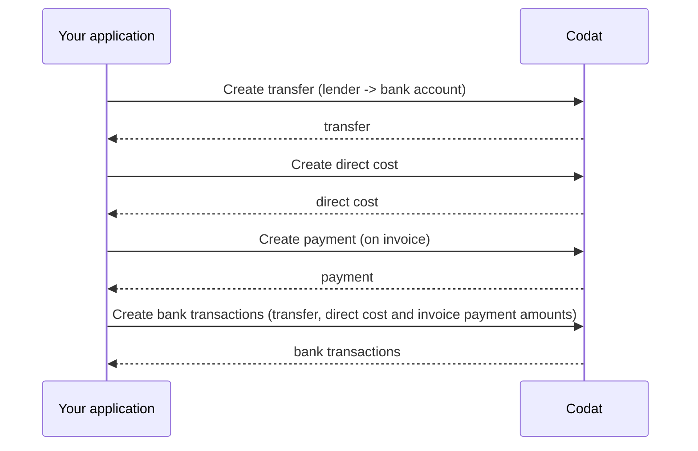

import Tabs from '@theme/Tabs';
import TabItem from '@theme/TabItem';
import WritebackMapping from "@components/global/Prototypes/WritebackMapping";

## Dave's notes

- Configure and deposit are identical to general loan writeback (winning)
- Difference occurs in the repayment/payment of the loan.

Given the above, I think we should split this guide section into:

```sh
├── guides
|     ├── loan writeback -- this page contains high-level stuff: what, why, etc
|     |         ├── Configure
|     |         ├── Deposit -- CTA to either repay loan or invoice payment
|     |         ├── Repay: general lending
|     |         ├── Repay: invoice finance
```
From above: Each one is a separate page.

## Repay the loan

Once the borrower's customer has paid for the goods/services the financed invoice is ready to be reconciled. To reflect that programmatically:

1. Account outstanding amount less fees, [create a transfer](/lending/guides/selective-invoice-finance-loan-writeback#create-transfer-1) from the lender's bank account to the borrower's. 

2. To record interest or fees, [create a direct cost](/lending/guides/selective-invoice-finance-loan-writeback#create-direct-cost). 

3. To update the invoice as paid, [create a payment](/lending/guides/selective-invoice-finance-loan-writeback#create-payment).

4. [Create bank transactions](/lending/guides/selective-invoice-finance-loan-writeback#create-bank-transaction-1) to keep the lender's account accurate. 




TODO: Document payment

### Create bank transaction

Use the [Create bank account transactions](/lending-api#/operations/create-bank-transactions) endpoint again to deposit the total amount (including the repayment, fees, and any interest) into the lender's bank account.

<Tabs>
<TabItem value="nodejs" label="TypeScript">

```javascript
codatLending.loanWriteback.bankTransactions.create({
    accountingCreateBankTransactions: {
        accountId: lendersBankAccount.id, // lender's virtual bank account id you would have stored from the configuration step
        transactions: [
        {
            id: transactionId, // some unique identifier of the bank transaction
            amount: amount, // amount to pay
            date: date time now,
            description: description,
        },
        ],
    },
    accountId: lendersBankAccount.Id,
    companyId: "8a210b68-6988-11ed-a1eb-0242ac120002",
    connectionId: "2e9d2c44-f675-40ba-8049-353bfcb5e171",
}).then((res: CreateBankTransactionsResponse) => {
if (res.statusCode == 200) {
    // handle response
}
});
```
</TabItem>

<TabItem value="python" label="Python">

```python
bank_transactions_create_request = operations.CreateBankTransactionsRequest(
    accounting_create_bank_transactions=shared.AccountingCreateBankTransactions(
        account_id=lenders_bank_account.id, # lender's virtual bank account id you would have stored from the configuration step
        transactions=[
            shared.CreateBankAccountTransaction(
                id=transaction_id, # some unique identifier of the bank transaction
                amount=Decimal(amount), # amount to pay
                date_=date time now,
                description=description,
            ),
        ],
    ),
    account_id=lenders_bank_account.id,
    company_id='8a210b68-6988-11ed-a1eb-0242ac120002',
    connection_id='2e9d2c44-f675-40ba-8049-353bfcb5e171',
)

bank_transactions_create_response = codat_lending.loan_writeback.bank_transactions.create(bank_transactions_create_request)
```
</TabItem>

<TabItem value="csharp" label="C#">

```csharp
var bankTransactionsCreateResponse = await codatLending.LoanWriteback.BankTransactions.CreateAsync(new CreateBankTransactionsRequest() {
    AccountingCreateBankTransactions = new AccountingCreateBankTransactions() {
        AccountId = lendersBankAccount.Id, // lender's virtual bank account id you would have stored from the configuration step
        Transactions = new List<CreateBankAccountTransaction>() {
            new CreateBankAccountTransaction() {
                Id = transactionId, // some unique identifier of the bank transaction
                Amount = amount, // amount to pay
                Date = date time now,
                Description = description,
            },
        },
    },
    AccountId = lendersBankAccount.Id,
    CompanyId = "8a210b68-6988-11ed-a1eb-0242ac120002",
    ConnectionId = "2e9d2c44-f675-40ba-8049-353bfcb5e171"
});
```
</TabItem>

<TabItem value="go" label="Go">

```go
ctx := context.Background()
bankTransactionsCreateRequest, err := codatLending.LoanWriteback.BankTransactions.Create(ctx, operations.CreateBankTransactionsRequest{
    AccountingCreateBankTransactions: &shared.AccountingCreateBankTransactions{
        AccountID: lending.String(lendersBankAccount.ID), // lender's virtual bank account id you would have stored from the configuration step
        Transactions: []shared.CreateBankAccountTransaction{ 
            shared.CreateBankAccountTransaction{
                ID: lending.String(transactionID), // some unique identifier of the bank transaction
                Amount: types.MustNewDecimalFromString(amount), // amount to pay
                Date: lending.String(date time now),
                Description: lending.String(description),
            },
        },
    },
    AccountID: lendersBankAccount.ID,
    CompanyID: "8a210b68-6988-11ed-a1eb-0242ac120002",
    ConnectionID: "2e9d2c44-f675-40ba-8049-353bfcb5e171",
    })
```
</TabItem>

<TabItem value="http" label="HTTP">

```http
POST https://api.codat.io/companies/{companyId}/connections/{connectionId}/push/bankAccounts/{accountId}/bankTransactions
```

#### Request body

```json
{
  "accountId": lendersBankAccount.Id, // lender's bank account id you would have stored from the configuration step
  "transactions": [{
    "id": transactionId, // some unique identifier of the bank transaction
    "amount": amount, // amount to pay
    "date": date time now,
    "description": description
  }]
}
```
</TabItem>

</Tabs>

### Create transfer

Next, use the [Create transfer](/lending-api#/operations/create-transfer) endpoint again - this time to record the loan repayment amount. Note that you are performing a transfer *from* the borrower's account Id *to* the lender's account Id.

<Tabs>
<TabItem value="nodejs" label="TypeScript">

```javascript
codatLending.loanWriteback.transfers.create({
    accountingTransfer: {
        date: date time now,
        from: {
            accountRef: {
                id: borrowersBankAccountId,
            },
            amount: amount,
            currency: "GBP",
        },
        to: {
            accountRef: {
                id: lendersBankAccount.id,
            },
            amount: amount,
            currency: "GBP",
        },
    },
    companyId: "8a210b68-6988-11ed-a1eb-0242ac120002",
    connectionId: "2e9d2c44-f675-40ba-8049-353bfcb5e171",
    }).then((res: CreateTransferResponse) => {
    if (res.statusCode == 200) {
        // handle response
    }
});
```
</TabItem>

<TabItem value="python" label="Python">

```python
transfers_create_request = operations.CreateTransferRequest(
    accounting_transfer=shared.AccountingTransfer(
        date_=date time now,
        from_=shared.TransferAccount(
            account_ref=shared.AccountRef(
                id=borrowers_bank_account_id,
            ),
            amount=Decimal(amount),
            currency='GBP',
        ),
        to=shared.TransferAccount(
            account_ref=shared.AccountRef(
                id=lenders_bank_account.id,
            ),
            amount=Decimal(amount),
            currency='GBP',
        ),
    ),
    company_id='8a210b68-6988-11ed-a1eb-0242ac120002',
    connection_id='2e9d2c44-f675-40ba-8049-353bfcb5e171',
)

transfers_create_response = codat_lending.loan_writeback.transfers.create(transfers_create_request)
```
</TabItem>

<TabItem value="csharp" label="C#">

```csharp
var transfersCreateResponse = await codatLending.LoanWriteback.Transfers.CreateAsync(new CreateTransferRequest() {
    AccountingTransfer = new AccountingTransfer() {
        Date = date time now,
        From = new TransferAccount() {
            AccountRef = new AccountRef() {
                Id = borrowersBankAccountId,
            },
            Amount = amount,
            Currency = "GBP",
        },
        To = new TransferAccount() {
            AccountRef = new AccountRef() {
                Id = lendersBankAccount.Id,
            },
            Amount = amount,
            Currency = "GBP",
        },
    },
    CompanyId = "8a210b68-6988-11ed-a1eb-0242ac120002",
    ConnectionId = "2e9d2c44-f675-40ba-8049-353bfcb5e171",
});
```
</TabItem>

<TabItem value="go" label="Go">

```go
ctx := context.Background()
transfersCreateResponse, err := codatLending.LoanWriteback.Transfers.Create(ctx, operations.CreateTransferRequest{
    AccountingTransfer: &shared.AccountingTransfer{
        Date: lending.String(date time now),
        From: &shared.TransferAccount{
            AccountRef: &shared.AccountRef{
                ID: lending.String(borrowersBankAccountID),
            },
            Amount: types.MustNewDecimalFromString(amount),
            Currency: lending.String("GBP"),
        },
        To: &shared.TransferAccount{
            AccountRef: &shared.AccountRef{
                ID: lending.String(lendersBankAccount.ID),
            },
            Amount: types.MustNewDecimalFromString(amount),
            Currency: lending.String("GBP"),
        },
    },
    CompanyID: "8a210b68-6988-11ed-a1eb-0242ac120002",
    ConnectionID: "2e9d2c44-f675-40ba-8049-353bfcb5e171",
})
```
</TabItem>

<TabItem value="http" label="HTTP">

```http
POST https://api.codat.io/companies/{companyId}/connections/{connectionId}/push/transfers
```

#### Request body

```json
{
    "date": "date time now",
    "from": {
        "accountRef": {
            "id": "borrowersBankAccountId",
        },
        "account": amount,
        "currency": "GBP",
    },
    "to": {
        "accountRef": {
            "id": "lendersBankAccount.Id",
        },
        "account": amount,
        "currency": "GBP",
    }
}
```

</TabItem>

</Tabs>

### Create direct cost

Finally, check the [Get create direct cost model](/lending-api#/operations/get-create-directCosts-model), then use the [Create direct cost](/lending-api#/operations/create-direct-cost) endpoint to capture the amount of fees or interest incurred by the borrower.

<Tabs>
<TabItem value="nodejs" label="TypeScript">

```javascript
codatLending.loanWriteback.directCosts.create({
    accountingDirectCost: {
        contactRef: {
            dataType: "suppliers",
            id: supplier.Id,
        },
        currency: "GBP",
        issueDate: date time now,
        lineItems: [
        {
            accountRef: {
                id: expenseAccount.id,
            },
            description: "Fees and/or interest",
            quantity: 1,
            taxAmount: 0,
            unitAmount: directCostAmount,
        },
        ],
        paymentAllocations: [
        {
            allocation: {
                totalAmount: directCostAmount,
            },
            payment: {
                accountRef: {
                    id: depositBankAccountId,
                },
            },
        },
        ],
        taxAmount: 0.0,
        totalAmount: directCostAmount,
    },
    companyId: "8a210b68-6988-11ed-a1eb-0242ac120002",
    connectionId: "2e9d2c44-f675-40ba-8049-353bfcb5e171",
    }).then((res: CreateDirectCostResponse) => {
    if (res.statusCode == 200) {
        // handle response
    }
});
```
</TabItem>

<TabItem value="python" label="Python">

```python
direct_costs_create_request = operations.CreateDirectCostRequest(
    accounting_direct_cost=shared.AccountingDirectCost(
        contact_ref=shared.ContactRef(
            data_type='suppliers',
            id=supplier.id,
        ),
        currency='GBP',
        issue_date=date time now,
        line_items=[
            shared.DirectCostLineItem(
                account_ref=shared.AccountRef(
                    id=expense_account.id,
                ),
                description='Fees and/or interest',
                quantity=Decimal('1'),
                tax_amount=Decimal('0'),
                unit_amount=Decimal(direct_cost_amount),
            ),
        ],
        payment_allocations=[
            shared.AccountingPaymentAllocation(
                allocation=shared.AccountingPaymentAllocationAllocation(
                    total_amount=Decimal(direct_cost_amount),
                ),
                payment=shared.PaymentAllocationPayment(
                    account_ref=shared.AccountRef(
                        id=deposit_bank_account_id,
                    ),
                ),
            ),
        ],
        tax_amount=Decimal('0'),
        total_amount=Decimal(direct_cost_amount),
    ),
    company_id='8a210b68-6988-11ed-a1eb-0242ac120002',
    connection_id='2e9d2c44-f675-40ba-8049-353bfcb5e171',
)

direct_costs_create_response = codat_lending.loan_writeback.direct_costs.create(direct_costs_create_request)
```
</TabItem>

<TabItem value="csharp" label="C#">

```csharp
var redirectCostsCreateResponse = await codatLending.LoanWriteback.DirectCosts.CreateAsync(new CreateDirectCostRequest() {
    AccountingDirectCost = new AccountingDirectCost() {
        ContactRef = new ContactRef() {
            DataType = "suppliers",
            Id = supplier.id,
        },
        Currency = "GBP",
        IssueDate = date time now,
        LineItems = new List<DirectCostLineItem>() {
            new DirectCostLineItem() {
                AccountRef = new AccountRef() {
                    Id = expenseAccount.Id,
                },
                Description = "Fees and/or interest",
                Quantity = 1M,
                TaxAmount = 0M,
                UnitAmount = directCostAmount,
            },
        },
        PaymentAllocations = new List<AccountingPaymentAllocation>() {
            new AccountingPaymentAllocation() {
                Allocation = new AccountingPaymentAllocationAllocation() {
                    TotalAmount = directCostAmount,
                },
                Payment = new PaymentAllocationPayment() {
                    AccountRef = new AccountRef() {
                        Id = depositBankAccountId,
                    },
                },
            },
        },
        TaxAmount = 0M,
        TotalAmount = directCostAmount,
    },
    CompanyId = "8a210b68-6988-11ed-a1eb-0242ac120002",
    ConnectionId = "2e9d2c44-f675-40ba-8049-353bfcb5e171",
});
```
</TabItem>

<TabItem value="go" label="Go">

```go
ctx := context.Background()
res, err := s.LoanWriteback.DirectCosts.Create(ctx, operations.CreateDirectCostRequest{
    AccountingDirectCost: &shared.AccountingDirectCost{
        ContactRef: &shared.ContactRef{
            DataType: lending.String("suppliers"),
            ID: supplier.ID,
        },
        Currency: "GBP",
        IssueDate: date time now,
        LineItems: []shared.DirectCostLineItem{
            shared.DirectCostLineItem{
                AccountRef: &shared.AccountRef{
                    ID: lending.String(expenseAccount.ID),
                },
                Description: lending.String("Fees and/or interest"),
                Quantity: types.MustNewDecimalFromString("1"),
                TaxAmount: types.MustNewDecimalFromString("0"),
                UnitAmount: types.MustNewDecimalFromString(directCostAmount),
            },
        },
        PaymentAllocations: []shared.AccountingPaymentAllocation{
            shared.AccountingPaymentAllocation{
                Allocation: shared.AccountingPaymentAllocationAllocation{
                    TotalAmount: types.MustNewDecimalFromString(directCostAmount),
                },
                Payment: shared.PaymentAllocationPayment{
                    AccountRef: &shared.AccountRef{
                        ID: lending.String(depositBankAccountID),
                    },
                },
            },
        },
        TaxAmount: types.MustNewDecimalFromString("0"),
        TotalAmount: types.MustNewDecimalFromString(directCostAmount),
    },
    CompanyID: "8a210b68-6988-11ed-a1eb-0242ac120002",
    ConnectionID: "2e9d2c44-f675-40ba-8049-353bfcb5e171",
})
```
</TabItem>

<TabItem value="http" label="HTTP">

```http
POST https://api.codat.io/companies/{companyId}/connections/{connectionId}/push/directCosts
```

#### Request body

```json
{
	"issueDate": current date time,
	"currency": Base currency of accounting platform,
	"taxAmount": 0.0,
	"totalAmount": direct cost amount,
	"contactRef": {
		"id": supplier.id, // supplier id you would have previouly stored
		"dataType": "suppliers"
	},
	"paymentAllocations": [{
		"payment": {
			"accountRef": {
				"id": depositBankAccountId // lender's bank account id
			}
		},
		"allocation": {
			"totalAmount": direct cost amount
		}
	}],
	"lineItems": [{
		"description": Fees and/or interest,
		"quantity": 1,
		"unitAmount": directCostAmount,
		"taxAmount": 0,
		"accountRef": {
			"id": expenseAccount.id // selected expense account id
		}
	}]
}
```
</TabItem>

</Tabs>

As a result of this process, your borrower will have the loan writeback reflected correctly in their accounting platform, saving their time on reconciliation and making sure they (and you!) have clarity on the state of the loan.

:::tip Recap
In this guide, you have learned:
* What is loan writeback and what it's used for.
* How to map and configure the loan writeback solution.
* How to perform the necessary postings using Codat's endpoints.
:::

---

## Read next

* Looking to implement loan writeback for Xero? Don't forget to view Xero's [own documentation](https://developer.xero.com/documentation/guides/how-to-guides/general-lending-integration-guide/).
* Review other features of the [Lending API](/lending/overview).
