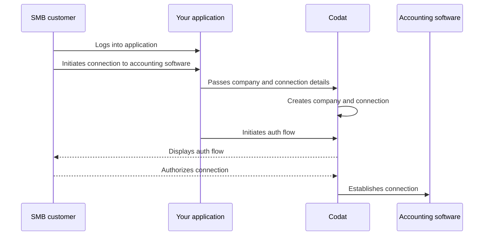

## Overview

When implementing your Bill Pay solution, you need to create your SMB customer as a **company** in Codat before registering their accounting software as a connection. You can do that when the customer starts interacting with your application.  

We have highlighted this sequence of steps in our detailed process diagram below. 

<b>Detailed process diagram</b>

  

:::tip Authorize your API calls
Remember to [authenticate](/using-the-api/authentication) when making calls to our API. Navigate to **Developers > API keys** in the Portal to pick up your authorization header.
:::