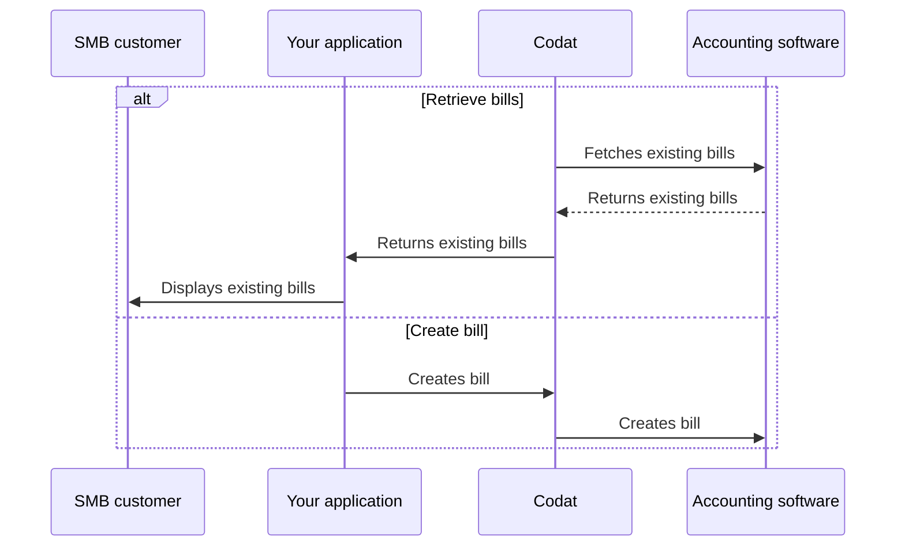

import Tabs from "@theme/Tabs";
import TabItem from "@theme/TabItem"
import RetrieveBills from '../_retrieve-bills.md'
import CreateBills from '../_create-bills.md'
import UploadAttachment from '../_upload-attachment.md'

:::tip Invoices or bills?

We distinguish between invoices where the company *owes* money and those where the company *is owed* money. If the company receives an invoice and owes money as a result, we call this a **bill**.
:::

## Overview

In Codat, a bill represents an *accounts payable* invoice issued to an SMB by their supplier. With asynchronous Bill Pay, you can:

- Retrieve and update your customer's existing bills.
- Create new bills in your system and reflect them in your customer's accounting software.  

We have highlighted this alternative sequence of steps in our detailed process diagram below.

<details>
<summary><b>Detailed process diagram</b></summary>



</details>

## Retrieve bills

:::tip Narrow down the bill list

Bill endpoints of the async Bill Pay solution provide full, unfiltered bill records. You can use [query parameters](/using-the-api/querying) to narrow down the list of results. For example:

- `supplierRef.supplierName=acme` returns bills associated with the specified supplier.
- `dueDate>2023-06-01&&dueDate<2023-06-30` returns bills due for payment between 1 and 30 June.
- `amountDue>0` returns outstanding bills with non-zero due amounts.
:::

<RetrieveBills listendpoint="/sync-for-payables-api#/operations/list-suppliers" createendpoint="/sync-for-payables-api#/operations/create-supplier" downloadendpoint="/sync-for-payables-api#/operations/download-bill-attachment" />

## Create bill

:::tip Reference data

Bills should always correspond to a supplier that issued them. Ensure the relevant supplier exists before creating a new bill.

You may also need to associate the bill's line items with a specific account or tax rate. Use the [List accounts](/sync-for-payables-api#/operations/list-accounts) or [Create account](/sync-for-payables-api#/operations/create-account) endpoints to manage available reference accounts and [List tax rates](/sync-for-payables-api#/operations/list-tax-rates) to view tax rates available to assign. 

:::

<CreateBills endpoint="/sync-for-payables-api#/operations/create-bill" />

## Update bill

In some cases, your SMB customer may want to update their existing bill - for example, to change a tax rate, change a nominal code for a line item, or associate it to a different supplier. Use our [Update bill](/sync-for-payables-api#/operations/update-bill) endpoint to perform this operation.

<Tabs groupId="language">

<TabItem value="nodejs" label="TypeScript">

```javascript
const billUpdateResponse = await payablesClient.bills.update({
    bill: {
      supplierRef: {
        id: supplierCreateResponse.supplier.id,
        supplierName: supplierCreateResponse.supplier.supplierName
      },
      issueDate: "2023-04-23T00:00:00",
      dueDate: "2023-06-23T00:00:00",
      lineItems: [
        {
          "description": "Half day training - Microsoft Paint",
          "unitAmount": 1000.00,
          "quantity": 1,
          "totalAmount": 1000.00,
        }
      ],
      status: BillStatus.Open,
      subTotal: 1000.00,
      taxAmount: 200.00,
      totalAmount: 1200.00,
      amountDue: 1200.00
    },
    companyId: companyId,
    connectionId: connectionId,
    billId: billId,
  });
```

</TabItem>

<TabItem value="python" label="Python">

```python
bill_update_request = operations.UpdateBillRequest(
    bill=shared.Bill(
      supplierRef: shared.SupplierRef(
        id=supplier_create_response.supplier.id,
        supplier_name=supplier_create_response.supplier.supplier_name
      ),
      issueDate="2023-04-23T00:00:00",
      dueDate="2023-06-23T00:00:00",
      lineItems=[
        shared.BillLineItem(
          description="Half day training - Microsoft Paint",
          unitAmount=1000.00,
          quantity=1,
          totalAmount=1000.00,
        )
      ],
      status=shared.BillStatus.OPEN,
      subTotal=1000.00,
      taxAmount=200.00,
      totalAmount=1200.00,
      amountDue=1200.00
    ),
    company_id=company_id,
    connection_id=connection_id,
    bill_id=bill_id,
)

bill_update_response = payables_client.bills.update(bill_update_request)
```

</TabItem>

<TabItem value="csharp" label="C#">

```csharp
var billUpdateResponse = await payablesClient.Bills.UpdateAsync(new UpdateBillRequest() {
    Bill = new Bill() {
      SupplierRef = new SupplierRef(){
        Id = supplierCreateResponse.Supplier.Id,
        SupplierName = supplierCreateResponse.Supplier.SupplierName
      },
      IssueDate = "2023-04-23T00:00:00",
      DueDate = "2023-06-23T00:00:00",
      LineItems = new List<BillLinItem>(){
        new(){
          Description = "Half day training - Microsoft Paint",
          UnitAmount = 1000.00,
          Quantity = 1,
          TotalAmount = 1000.00,
        }
      },
      Status: BillStatus.Open,
      SubTotal: 1000.00,
      TaxAmount: 200.00,
      TotalAmount: 1200.00,
      AmountDue: 1200.00
    },
    CompanyId = companyId,
    ConnectionId = connectionId,
    BillId = billId
});
```
</TabItem>

<TabItem value="go" label="Go">

```go
ctx := context.Background()
billUpdateResponse, err := payablesClient.Bills.Update(ctx, operations.UpdateBillRequest{
    Bill: &shared.Bill{
      SupplierRef: &shared.SupplierRef{
          ID: supplierCreateResponse.Supplier.ID,
          SupplierName: supplierCreateResponse.Supplier.SupplierName
      },
      IssueDate: "2023-04-23T00:00:00",
      DueDate: "2023-06-23T00:00:00",
      LineItems: []shared.BillLineItem{
          shared.BillLineItem{
            Description: "Half day training - Microsoft Paint",
            Quantity: types.MustNewDecimalFromString("1"),
            UnitAmount: types.MustNewDecimalFromString("1000.00"),
            TotalAmount: types.MustNewDecimalFromString("1000.00"),
          }
      },
      Status: shared.BillStatusOpen,
      SubTotal: types.MustNewDecimalFromString("1000.00"),
      TaxAmount: types.MustNewDecimalFromString("200.00"),
      TotalAmount: types.MustNewDecimalFromString("1200.00"),
      AmountDue: types.MustNewDecimalFromString("1200.00"),
    },
    CompanyID: companyID,
    ConnectionID: connectionID,
    BillID: billID,
})
```
</TabItem>

</Tabs>

## Delete bill

In certain scenarios, your SMB customer may want to delete an existing bill or a bill payment - for example, if they made a mistake or no longer want to process the bill. 

Use the [Delete bill](/sync-for-payables-api#/operations/delete-bill) endpoint to support these requirements, and check the OAS for the most up-to-date integration coverage. 

<Tabs groupId="language">

<TabItem value="nodejs" label="TypeScript">

```javascript
const billDeleteResponse = await payablesClient.bills.delete({
  companyId: companyId,
  connectionId: connectionId,
  billId: billId,
});
```

</TabItem>

<TabItem value="python" label="Python">

```python
bill_delete_request = operations.DeleteBillRequest(
  company_id=company_id,
  connection_id=connection_id,
  bill_id=bill_id,
)

bill_delete_response = payables_client.bills.delete(bill_delete_request)
```

</TabItem>

<TabItem value="csharp" label="C#">

```csharp
var res = await payablesClient.Bills.DeleteAsync(new() {
    CompanyId = companyId,
    ConnectionId = connectionId,
    BillId = billId,
};);
```
</TabItem>

<TabItem value="go" label="Go">

```go
ctx := context.Background()
billDeleteResponse, err := payablesClient.Bills.Delete(ctx, operations.DeleteBillRequest{
  CompanyID: companyID,
  ConnectionID: connectionID,
  BillID: billID,
})
```
</TabItem>

</Tabs>

<UploadAttachment endpoint="/sync-for-payables-api#/operations/upload-bill-attachments" schema="/sync-for-payables-api#/schemas/Attachment" />

---

## Read next

- Enable your customers to [make payments](/payables/async/payments) covering their outstanding bills.
