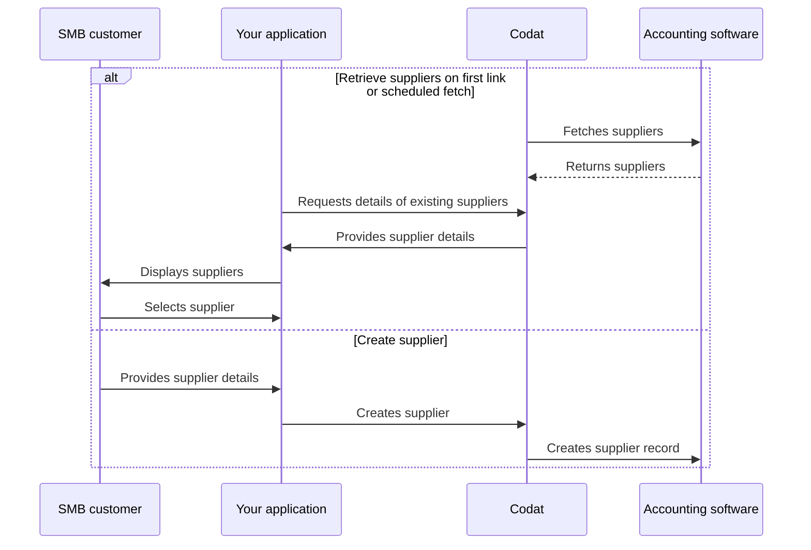

import Tabs from "@theme/Tabs";
import TabItem from "@theme/TabItem";
import ManageSuppliers from '../_manage-suppliers.md'

## Overview

In accounts payable, each bill is associated with a *supplier*. The supplier represents a business or a sole trader that provides goods or services to your SMB customer. 

Their records also contain key information, such as contact details, that can be used to notify the supplier once a payment is made.

To pay a bill in Bill Pay, you can use your customer's existing suppliers or create a new one. We have highlighted this alternative sequence of steps in our detailed process diagram below. 

<details>
<summary><b>Detailed process diagram</b></summary>



</details>

:::tip Narrow down the supplier list

Supplier endpoints of the async Bill Pay solution provide full, unfiltered supplier records. You can use [query parameters](/using-the-api/querying) to narrow down the list of results. For example:

- `status=Active` returns only active suppliers.
- `defaultCurrency=USD` returns suppliers that provide goods or services in dollars.
- `supplierName=Acme` returns suppliers with a name that matches the query.
:::

<ManageSuppliers listendpoint="/sync-for-payables-api#/operations/list-suppliers" createendpoint="/sync-for-payables-api#/operations/create-supplier" />

## Update supplier

If your customer's existing supplier changes address or business name, you can reflect this change in their accounting software using the <a href="/sync-for-payables-api#/operations/update-supplier" target="_blank">Update supplier</a> endpoint.

<Tabs groupId="language">

<TabItem value="nodejs" label="TypeScript">

```javascript
const supplierUpdateResponse = await payablesClient.suppliers.update({
    supplier: {
      supplierName: "Kelly's Industrial Supplies",
      contactName: "Kelly's Industrial Supplies",
      emailAddress: "sales@kellysupplies.com",
      phone: "(877) 492-8687"
      status: SupplierStatus.Active,
    },
    companyId: companyId,
    connectionId: connectionId,
    supplierId: supplierCreateResponse.supplier.id
  });
```

</TabItem>

<TabItem value="python" label="Python">

```python
supplier_update_request = operations.UpdateSupplierRequest(
    supplier=shared.Supplier(
        supplier_name="Kelly's Industrial Supplies",
        contact_name="Kelly's Industrial Supplies",
        phone="(877) 492-8687",
        status=shared.SupplierStatus.ACTIVE,
    ),
    company_id=company_id,
    connection_id=connection_id,
    supplier_id=supplier_create_response.supplier.id
)

supplier_update_response = payables_client.suppliers.update(supplier_update_request)
```

</TabItem>

<TabItem value="csharp" label="C#">

```csharp
var supplierUpdateResponse = await payablesClient.Suppliers.UpdateAsync(new() {
    Supplier = new Supplier() {
        SupplierName = "Kelly's Industrial Supplies",
        ContactName = "Kelly's Industrial Supplies",
        Phone = "(877) 492-8687",
        Status = SupplierStatus.Active,
    },
    CompanyId = companyId,
    ConnectionId = connectionId,
    SupplierId = supplierCreateResponse.Supplier.Id
});
```

</TabItem>

<TabItem value="go" label="Go">

```go
ctx := context.Background()
supplierCreateResponse, err := payablesClient.Suppliers.Create(ctx, operations.CreateSupplierRequest{
    Supplier: &shared.Supplier{
        SupplierName: syncforpayables.String("Kelly's Industrial Supplies"),
        ContactName: syncforpayables.String("Kelly's Industrial Supplies"),
        Phone = syncforpayables.String("(877) 492-8687"),
        Status: shared.SupplierStatusActive,
    },
    CompanyID: companyID,
    ConnectionID: connectionID,
    SupplierID = supplierCreateResponse.Supplier.ID
})
```

</TabItem>

</Tabs>

:::tip Recap

You have learnt how to view, create, and update your customer's suppliers who provide them with goods and services. 

Next, you can choose to manage your supplier's bills or payment methods prior to paying those bills.

:::

---
## Read next

* [Manage your customer's bills](/payables/bills)
* [Manage your customer's payment methods](/payables/mapping)
