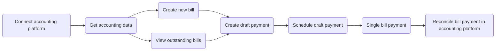

import { IntegrationsList } from "@components/global/Integrations";
import { integrationsFilterBillPayKit } from "@components/global/Integrations/integrations";

## Overview

#### What is it?

The **Bill pay kit** is our solution designed to help neobanks and B2B payment providers integrate a bill pay flow into their app as quickly as possible. It's ideal for facilitating essential bill payment processes within your SMB's accounting platforms.

We have streamlined and enhanced the logic in our kit's endpoints to focus on simplicity and efficiency, and not on complex procurement functionalities and use cases.

#### Why use it?

Crucially, the kit offers synchronous functionality, providing real-time updates between your platform and your SMBs' accounting systems. In today's fast-paced industry landscape, this enables you to meet user demands with a seamless, near-real-time experience. Have a look at the streamlined process below: 

## Supported integrations

 

<IntegrationsList filter={integrationsFilterBillPayKit} />

:::tip Java client library

Use our comprehensive [Java library](https://github.com/codatio/client-sdk-java/tree/main/sync-for-payables) to kick-start and simplify your implementation of the bill pay kit.

:::

## Prerequisites

When using the Bill pay kit, you need to create your SMB customer as a [company](../terms/company) in Codat before registering their accounting platform as a connection. You can do that when the customer starts interacting with your application.  

1. **Create a company**

A company represents your SMB customer that pays and manages their bills using your application. To create it, use our [Create company](/sync-for-payables-v2-api#/operations/create-company) endpoint. It returns the company schema containing the ID that you will use to establish a connection to an accounting platform.

2. **Create a connection**

Next, use the [Create connection](/sync-for-payables-v2-api#/operations/create-connection) endpoint to connect the company to an accounting data source via one of our integrations. This will allow you to synchronize data with that source, fetching or creating bills and payments. 

:::tip Authorize your API calls

Remember to [authenticate](/using-the-api/authentication) when making calls to our API. Navigate to **Developers > API keys** in the [Portal](https://app.codat.io/) to pick up your authorization header.

:::

For a deeper dive into creating companies and connections, see how to [Configure customer in Codat](/payables/configure-customer), or read more about the concepts of a [company](/core-concepts/companies) and a [connection](/core-concepts/connections).

## Pay a bill

With the Bill pay kit, your customer can create a new bill or view and choose a bill from a list of unpaid bills from their accounting platform. 

### Create a bill

Use the [Create bill](/sync-for-payables-v2-api#/operations/create-bill) endpoint to create a new bill in your SMB customer's accounting software. Ensure you have the following detail:

1. Tax rate and a nominal account

    You  need to provide a tax rate and a nominal account that the bill will be recorded against. Call our [Get bill mapping options](/sync-for-payables-v2-api#/operations/get-mapping-options-bills) endpoint to get this detail from your customer's accounting platform. 

2. Supplier record

    Bills should always correspond to a supplier that issued them. Use the [List suppliers](https://docs.codat.io/sync-for-payables-v2-api#/operations/list-suppliers) endpoint to check that the relevant supplier exists and then associate it with the bill. You can use querying to retrieve only suppliers with unpaid bills or suppliers created within a specific timeframe. If the supplier doesn't exist, you can create it using the [Create supplier](https://docs.codat.io/sync-for-payables-v2-api#/operations/create-suppliers) endpoint.

Use the [Upload bill attachment](https://docs.codat.io/sync-for-payables-v2-api#/operations/upload-bill-attachment) endpoint to assign an attachment against a specific `billId`. This ensures your accounts payable flow has a full audit trail for your SMB and confirms the legitimacy and accuracy of the transaction in the accounting platform. 

### Retrieve a bill

When the [List bills](/sync-for-payables-v2-api#/operations/list-bills) endpoint is called, you will receive a list of all outstanding bills. We define outstanding bills as those with the status of `Open` and `Partially paid`. 

Alongside these bills, you can also view attachments for a specific bill using the [List bill attachments](/sync-for-payables-v2-api#/operations/list-bill-attachments) endpoint and download them by calling the [Download bill attachment](/sync-for-payables-v2-api#/operations/download-bill-attachment) endpoint.

## Record a payment 

When an SMB pays their bill in your application, use the [Create bill payment](/sync-for-payables-v2-api#/operations/create-bill-payment) endpoint to represent an allocation of money within any of your customer's accounts payable accounts. 

To create the payment, your SMB customer must set the bank account used to process the payment. You can retrieve and display a list of relevant accounts using the [Get payment mapping options](/sync-for-payables-v2-api#/operations/get-mapping-options-payments) endpoint.

:::tip Partial payments

The kit is built for the scenario where a single bill is paid in full. If you need to record a partial payment, use the same [Create bill payment](/sync-for-payables-v2-api#/operations/create-bill-payment) endpoint and adjust the values to reflect the amount of the partial payment.

:::

---
## Read next

- [Bill pay kit API reference](/sync-for-payables-v2-api#/)
