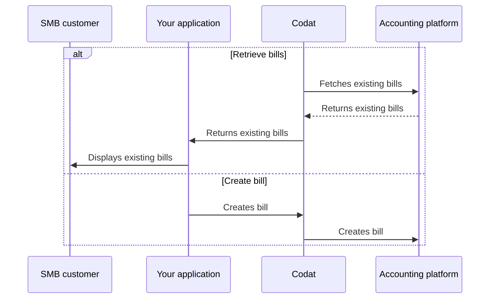

import Tabs from "@theme/Tabs";
import TabItem from "@theme/TabItem"

:::tip Invoices or bills?

We distinguish between invoices where the company *owes* money and those where the company *is owed* money. 

If the company receives an invoice and owes money as a result, we call this a **bill**.
:::

## Overview

In Codat, a [bill](../terms/bill) represents an *accounts payable* invoice issued to an SMB by their [supplier](../terms/supplier). With Sync for Payables, you can:

- Retrieve and update your customer's existing bills.
- Create new bills in your system and reflect them in your customer's accounting software.  

We have highlighted this alternative sequence of steps in our detailed process diagram below. 

<details>
<summary><b>Detailed process diagram</b></summary>



</details>

## Retrieve bills

Call our [List bills](/sync-for-payables-api#/operations/list-bills) endpoint to retrieve the full list of a company's existing bills. You can use [query parameters](/using-the-api/querying) to narrow down the list of results, for example:

- `supplierRef.supplierName=acme` returns bills associated with the specified supplier.
- `dueDate>2023-06-01&&dueDate<2023-06-30` returns bills due for payment between 1 and 30 June.
- `amountDue>0` returns outstanding bills with non-zero due amounts.

You can also retrieve [attachments](/sync-for-payables-api#/operations/download-bill-attachment) associated with a given bill, such as a PDF copy of the accounts payable invoice issued by the supplier.

<Tabs>

<TabItem value="HTTP" label="HTTP">

```http
GET https://api.codat.io/companies/{companyId}/data/bills?page=1&pageSize=100
```
</TabItem >

</Tabs>

## Update bill

In some cases, your SMB customer may want to update their existing bill - for example, to change a tax rate, change a nominal code for a line item, or associate it to a different supplier. 

Use our [Update bill](/sync-for-payables-api#/operations/update-bill) endpoint to perform this operation.

<Tabs>

<TabItem value="HTTP" label="HTTP">

```http
PUT https://api.codat.io/companies/{companyId}/connections/{connectionId}/push/bills/{billId}
```
</TabItem >

</Tabs>

## Create bill

:::tip Corresponding supplier

Bills should always correspond to a supplier that issued them. Ensure the relevant supplier exists before creating a new bill.

:::

Use the [Create bill](/sync-for-payables-api#/operations/create-bill) endpoint to create a new bill in your SMB customer's accounting software that represents the outstanding payment for goods or services purchased from a supplier.

<Tabs>

<TabItem value="HTTP" label="HTTP">

```http
POST https://api.codat.io/companies/{companyId}/connections/{connectionId}/push/bills
```
</TabItem>

</Tabs>

## Upload attachment

When creating a new bill, your SMB customer may want to save a copy of the PDF invoice issued by their supplier against the bill in their accounting software. Use the [Upload bill attachment](/sync-for-payables-api#/operations/upload-bill-attachments) to support this action. 

Different accounting software supports different file formats and sizes. View the [attachment schema](/sync-for-payables-api#/schemas/Attachment) for integration-specific guidance or check the platform's own documentation. 

<Tabs>

<TabItem value="HTTP" label="HTTP">

```http
POST https://api.codat.io/companies/{companyId}/connections/{connectionId}/push/bills/{billId}/attachments
```
</TabItem>

</Tabs>

---

## Read next

- [Manage your customers' payment methods](/payables/mapping) so they can choose how to make payments.
