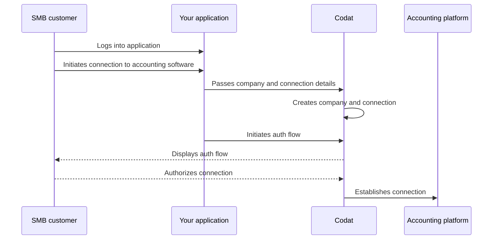

import Tabs from "@theme/Tabs";
import TabItem from "@theme/TabItem"

## Overview

When implementing your Sync for Payables solution, you need to create your SMB customer as a [company](../terms/company) in Codat before registering their accounting platform as a connection. You can do that when the customer starts interacting with your application.  

We have highlighted this sequence of steps in our detailed process diagram below. 

<details>
<summary><b>Detailed process diagram</b></summary>



</details>  

:::tip Authorize your API calls
Remember to [authenticate](/using-the-api/authentication) when making calls to our API. Navigate to **Developers > API keys** in the Portal to pick up your authorization header.
:::

## Create a company

Within Sync for Payables, a company represents your SMB customer that pays and manages their bills using your application. To create it, use our [Create company](/sync-for-payables-api#/operations/create-company) endpoint. It returns the company schema containing the ID that you will use to establish a connection to an accounting platform. 

<Tabs>

<TabItem value="nodejs" label="TypeScript">

```javascript
const companyResponse = payablesClient.companies.create({
    name: companyName,
});

if(companyResponse.statusCode == 200){
  throw new Error("Could not create company")
}

const companyId = companyResponse.company.id
console.log(companyId)
```

</TabItem>

<TabItem value="python" label="Python">

```python
company_request = shared.CompanyRequestBody(
    name=company_name,
)

company_response = payables_client.companies.create(company_request)

if company_response.status_code != 200:
  raise Exception('Could not create company')

company_id = company_response.company.id
print(company_id)
```

</TabItem>

<TabItem value="csharp" label="C#">

```csharp
var companyResponse = await payablesClient.Companies.CreateAsync(new() {
    Name = companyName,
});

if(companyResponse.StatusCode != 200){
  throw new Exception("Could not create company");
}

var companyId = companyResponse.Company.Id;
console.log(companyId)
```

</TabItem>

<TabItem value="go" label="Go">

```go
ctx := context.Background()
companyResponse, err := payablesClient.Companies.Create(ctx, &shared.CompanyRequestBody{
  Name: companyName,
	})

if companyResponse.StatusCode == 200 {
  companyID := companyResponse.Company.ID
  fmt.Println("%s", companyID)
}
```
</TabItem>

</Tabs>

## Create a connection

Next, use the [Create connection](/sync-for-payables-api#/operations/create-connection) endpoint to connect the company to an accounting data source via one of our integrations. This will allow you to synchronize data with that source, fetching or creating suppliers, bills, and payment methods. 

In the request body, specify a `platformKey` of the accounting platform you're looking to connect.

| Accounting platform | platformKey |
| ---  | ---  |
| MYOB Business | `pdvj` |
| Oracle NetSuite | `akxx` |
| QuickBooks Online | `qhyg` |
| QuickBooks Desktop | `pqsw` |
| Sage Intacct | `knfz` |
| Xero | `gbol` |

As an example, let's create a QuickBooks Online (QBO) connection. In response, the endpoint returns a `dataConnection` object with a `PendingAuth` status and a `linkUrl`. Direct your customer to the `linkUrl` to initiate our [Link auth flow](/auth-flow/overview) and enable them to authorize this connection.

<Tabs>

<TabItem value="nodejs" label="TypeScript">

```javascript
const connectionResponse = payablesClient.connections.create({
    requestBody: {
      platformKey: "qhyg",
    },
    companyId: companyResponse.company.id,
  });

console.log(connectionResponse.connection.linkUrl)
```

</TabItem>

<TabItem value="python" label="Python">

```python
connection_request = operations.CreateConnectionRequest(
    request_body=operations.CreateConnectionRequestBody(
        platform_key='qhyg',
    ),
    company_id=company_response.company.id,
)

connection_response = payables_client.connections.create(connection_request)

console.log(connection_response.connection.link_url)
```

</TabItem>

<TabItem value="csharp" label="C#">

```csharp
var connectionResponse = await payablesClient.Connections.CreateAsync(new() {
    RequestBody = new CreateConnectionRequestBody() {
        PlatformKey = "qhyg",
    },
    CompanyId = companyResponse.Company.Id,
});

Console.WriteLine(connectionResponse.Connection.LinkUrl)
```

</TabItem>

<TabItem value="go" label="Go">

```go
ctx := context.Background()
connectionResponse, err := payablesClient.Connections.Create(ctx, operations.CreateConnectionRequest{
    RequestBody: &operations.CreateConnectionRequestBody{
        PlatformKey: syncforpayables.String("qhyg"),
    },
    CompanyID: companyResponse.Company.ID,
})

fmt.Println(connectionResponse.Connection.LinkUrl)
```
</TabItem>

</Tabs>

## Deauthorize a connection

If your customer wants to revoke their approval and sever the connection to their accounting package, use the [Unlink connection](/sync-for-payables-api#/operations/unlink-connection) endpoint.

You can [learn more](/auth-flow/optimize/connection-management) about connection management best practices and see how you can provide this functionality in your app's UI.

<Tabs>

<TabItem value="nodejs" label="TypeScript">

```javascript
const unlinkResponse = payablesClient.connections.unlink({
    requestBody: {
      status: DataConnectionStatus.Unlinked
    },
    companyId: companyResponse.company.id,
    connectionId: connectionResponse.connection.id,
  });
```

</TabItem>

<TabItem value="python" label="Python">

```python
unlink_request = operations.UnlinkConnectionRequest(
    request_body=operations.UnlinkConnectionUpdateConnection(
      status=shared.DataConnectionStatus.UNLINKED
    ),
    company_id=company_response.company.id,
    connection_id=connection_response.connection.id,
)

unlink_response = payables_client.connections.unlink(unlink_request)

```

</TabItem>

<TabItem value="csharp" label="C#">

```csharp
var unlinkResponse = await payablesClient.Connections.UnlinkAsync(new() {
    RequestBody = new UnlinkConnectionUpdateConnection() {
      Status = DataConnectionStatus.Unlinked
    },
    CompanyId = companyResponse.Company.Id,
    ConnectionId = connectionResponse.Connection.Id,
});
```

</TabItem>

<TabItem value="go" label="Go">

```go
ctx := context.Background()
unlinkResponse, err := payablesClient.Connections.Unlink(ctx, operations.UnlinkConnectionRequest{
    RequestBody: &operations.UnlinkConnectionUpdateConnection{
      Status: shared.DataConnectionStatusUnlinked
    },
    CompanyID: companyResponse.Company.ID,
    ConnectionID: connectionResponse.Connection.ID,
})
```
</TabItem>

</Tabs>

:::tip Recap

You have created the structure of key objects required by Codat's Sync for Payables: a company and its connection to an accounting data source.

Next, you can choose to manage your customer's suppliers, bills or payment methods prior to paying the bills.

:::

---

## Read next

* [Manage your customer's suppliers](/payables/suppliers)
* [Manage your customer's bills](/payables/bills)
* [Manage your customer's payment methods](/payables/mapping)

