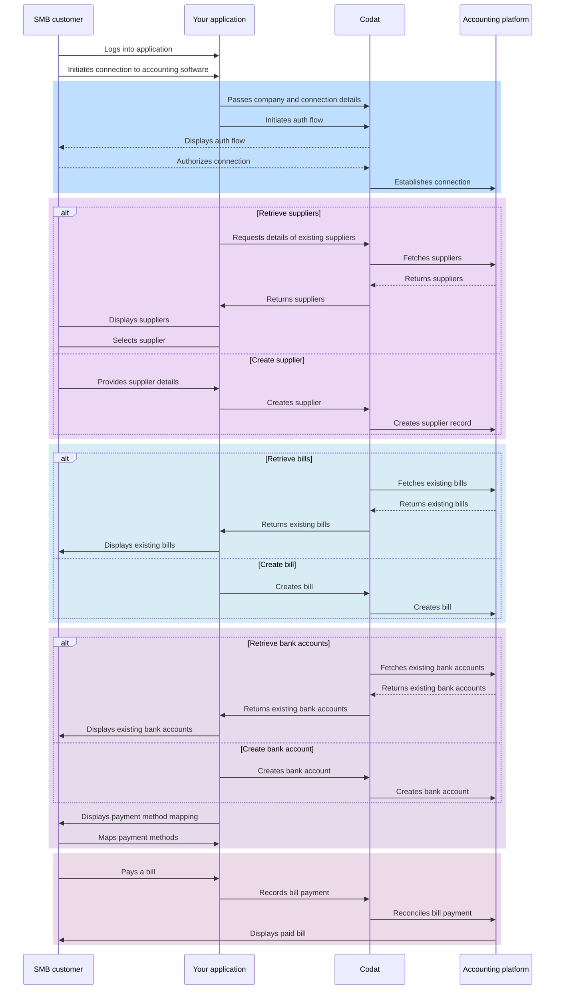
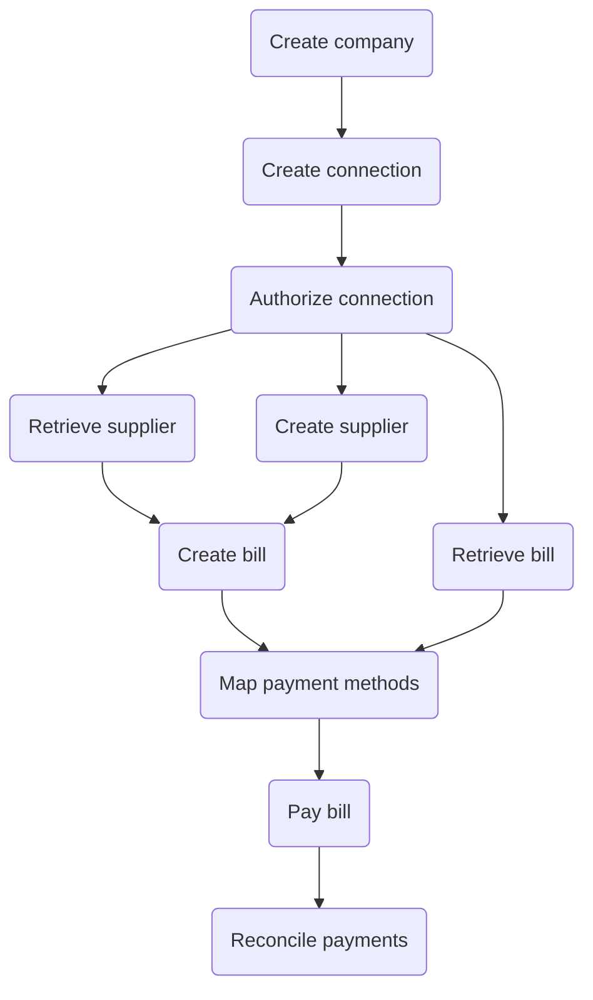

import { IntegrationsList } from "@components/global/Integrations";
import { bankfeedsIntegrations } from "@components/global/Integrations/integrations";

## Journey overview

The diagram below represents the overall activity flow when using Sync for Payables. You can manage bills, suppliers, and payment methods in different ways and order, so we chose to represent these options as alternative scenarios. Consider them elements you can use to build the flow that suits you and your customers best.

## Configure Sync for Payables

Once you decide to build this flow with Sync for Payables, you need to configure Codat accordingly. Let's go through these requirements in detail.

### Enable the product

1. Open the <a href="https://app.codat.io" target="_blank">Codat Portal</a> and sign in.
2. Click on **Settings > Organizational settings > Products**.
3. In the list of products, find _Sync for Payables_ and click **Enable**. Then, follow the on-screen prompt.

### Data types

Set the minimum set of [data types](/core-concepts/data-type-settings#override-the-default-sync-settings) required for the Lending API to `fetch on first link`. Each feature may also have additional data type requirements, so be sure to review these for the feature you want to use.

In the <a href="https://app.codat.io" target="_blank">Codat Portal</a>, navigate to **Settings > Integrations > Data types**. As a minimum, you need the following data types enabled:

|  Data source          | Accounting                                                                                                                                                                                            | Banking                                                                                                                                                                             | Commerce                                                                                                     |
|------------|-------------------------------------------------------------------------------------------------------------------------------------------------------------------------------------------------------|-------------------------------------------------------------------------------------------------------------------------------------------------------------------------------------|--------------------------------------------------------------------------------------------------------------|
| Data types | `company` `chartOfAccounts` `balanceSheet` `profitAndLoss` `bankAccounts` `bankTransactions` | `banking-accounts` `banking-transactions` `banking-transactionCategories` `banking-accountBalances` | `commerce-companyInfo` `commerce-customers` `commerce-orders` |

Configure the solution to refresh data when you need it by [setting a synchronization frequency](/core-concepts/data-type-settings#choose-a-synchronization-frequency) on the same screen. We recommend setting it to a daily or a monthly sync.

bills
billpayments
accounts
bankaccounts
suppliers
billcreditnotes
paymentmethods
tracking categories
taxrates

### Manage data sources

In the <a href="https://app.codat.io" target="_blank">Codat Portal</a>, navigate to **Settings > Integrations** and click **Manage integrations**. Next, click **Manage** next to the specific integration you want to enable and set it up to serve as a data source for the product. 

<IntegrationsList integrations={bankfeedsIntegrations}/>

Some of these integrations may require enhanced setup specific to bank feeds. We walk you through these in our integration-specific instructions in the _Manage integrations_ section of our documentation. 

### Authorization flow

As part of using Sync for Payables, you will need your customers to authorize your access to their data. To do so, use Link - our pre-built, conversion-optimized, and white-labelled authorization flow. 

We recommend you fully embed the Link auth flow in your experience by using our [Embedded Link](/auth-flow/authorize-embedded-link) SDK in your front-end code. You can also choose our out-of-the-box [Hosted Link](/auth-flow/authorize-hosted-link) auth flow option to get up and running as quick as possible. 

The solution lets you tailor the authorization journey to your business needs. You can:

* [Customize Link settings](/auth-flow/customize/customize-link)
* [Set up company branding](/auth-flow/customize/branding)
* [Set up redirects](/auth-flow/customize/set-up-redirects)

### Webhooks

Codat supports a range of [webhooks](/using-the-api/webhooks/core-rules-types) to help you manage your data pipelines. In the <a href="https://app.codat.io" target="_blank">Codat Portal</a>, navigate to **Settings > Webhooks > Rules** and click **Create new rule** to set up the following webhook and get the most out of Bank Feeds API:

- [Push operation status has changed](/using-the-api/webhooks/core-rules-types#push-operation-status-has-changed)  

  Use this webhook to track the completion of the operation to create bank transactions in the target platform. When you receive a notification from this webhook, check the `status` value in the body. A `Success` status means the `transactions` array has been successfully pushed to the accounting software.

--- 

## Read next

SDK