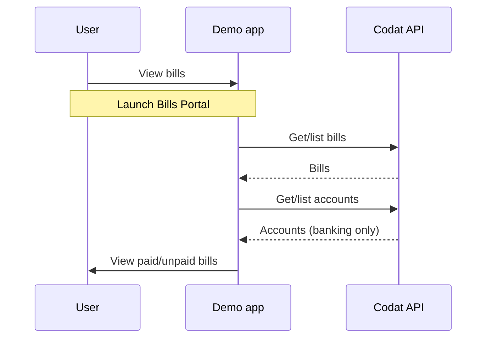
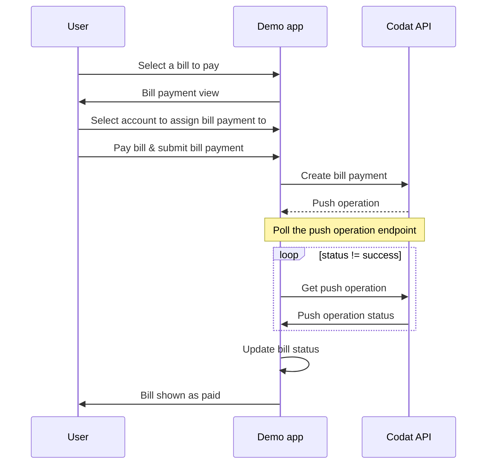

import Tabs from "@theme/Tabs";
import TabItem from "@theme/TabItem"

Now you're ready to explore the functionality of the bill pay demo app in more depth. The user flow diagrams describe the demo app's functionality at a high level, while the example API calls show the exchange of data with the Codat API.

## Understand the auth flow

The company creation feature and authorization flow were built using the [Platform API](/platform-api#/) and [Hosted Link](/auth-flow/authorize-hosted-link). For a seamless user experience, we customized the Hosted Link flow with the same branding and colors as the demo app UI - see [Customize Link](/auth-flow/customize/customize-link) for more details.

Its main features are:

- Creating a company to represent the user using the [Create company](/sync-for-payables-api#/operations/create-company) endpoint. This returns a unique company ID and Link URL.
- Redirecting the user to their chosen accounting platform via the Link URL. This opens the OAuth login window for the accounting platform, where the user can authenticate and authorize access to their accounting data. 
- Creating a data connection to the accounting platform using the [Create connection](/sync-for-payables-api#/operations/create-connection) endpoint.
- When the company is successfully connected, redirecting the user to the demo app's redirect URL, as defined in the [Link settings](/auth-flow/customize/customize-link).

## View bills

The following diagram illustrates the user flow for viewing bills in the demo app UI.

:::note User flow for viewing bills


:::

### Fetch bills

When launched, the demo app retrieves a list of all bills from your sandbox QuickBooks Online company, in descending order of issue date, using the [List bills](/sync-for-payables-api#/operations/list-bills) endpoint.

Here is an example request:

<Tabs>

<TabItem value="HTTP" label="HTTP">

#### Request

```http
GET https://api.codat.io/companies/{companyId}/data/bills?page=1&pageSize=100&orderBy=-issueDate
```

#### Example response

```json
{
    "results": [
      {
        "id": "181",
        "supplierRef": {
          "id": "41",
          "supplierName": "Mac's Supply Store"
        },
        "purchaseOrderRefs": [],
        "issueDate": "2023-04-01T00:00:00",
        "dueDate": "2023-04-01T00:00:00",
        "currency": "GBP",
        "currencyRate": 1,
        "lineItems": [
          {
            #...
          }
        ],
        "withholdingTax": [],
        "status": "Open",
        "subTotal": 1250,
        "taxAmount": 250,
        "totalAmount": 1500,
        "amountDue": 1500,
        "modifiedDate": "2023-05-02T10:35:04Z",
        "sourceModifiedDate": "2023-03-27T23:30:01Z",
        "paymentAllocations": [],
        "metadata": {
          "isDeleted": false
        }
      },
      # ...
    ],
    "pageNumber": 1,
    "pageSize": 100,
    "totalResults": 8,
    "_links": {
      "current": {
        "href": "/companies/0f655a48-f6c2-43b4-857b-f2d6793f90b8/data/bills?page=1&pageSize=100&orderBy=-issueDate"
      },
      "self": {
        "href": "/companies/0f655a48-f6c2-43b4-857b-f2d6793f90b8/data/bills"
      }
    }
  }
```

</TabItem>

</Tabs>

:::info View unpaid bills query
When the **View unpaid bills only** toggle is selected in the UI, the `&query=status=Open` query is appended to the request URL as a [Codat query string](/using-the-api/querying). This returns only unpaid bills.
:::

### Fetch accounts

When launched, the demo app uses the [List accounts](/sync-for-payables-api#/operations/list-accounts) endpoint to fetch the company's latest accounts. The account name is displayed against its respective bill in the **Reference** column of the bills table.

Here is an example request:

<Tabs>

<TabItem value="HTTP" label="HTTP">

#### Request

```http
GET https://codat.io/companies/{companyId}/data/accounts
```

#### Example response

```json
{
    "results": [
      {
        "id": "84",
        "name": "Accounts Receivable (A/R)",
        "fullyQualifiedCategory": "Asset.Accounts Receivable.AccountsReceivable",
        "fullyQualifiedName": "Asset.Accounts Receivable.AccountsReceivable.Accounts Receivable (A/R)",
        "currency": "USD",
        "currentBalance": 5281.52,
        "type": "Asset",
        "status": "Active",
        "isBankAccount": false,
        "modifiedDate": "2023-05-11T09:46:07Z",
        "sourceModifiedDate": "2023-03-12T20:16:17Z",
        "validDatatypeLinks": [],
        "metadata": {
          "isDeleted": false
        }
      },
      #...
     ],
        "metadata": {
          "isDeleted": false
        }
      }
    ],
    "pageNumber": 1,
    "pageSize": 100,
    "totalResults": 90,
    "_links": {
      "current": {
        "href": "/companies/3e67a1ea-a124-4a54-a241-698169eb19fb/data/accounts?page=1"
      },
      "self": {
        "href": "/companies/3e67a1ea-a124-4a54-a241-698169eb19fb/data/accounts"
      }
    }
  }
```

</TabItem>

</Tabs>

## Pay a bill

The following diagram illustrates the user flow for selecting and paying a bill in the demo app UI.

:::note User flow for paying a bill



:::

The bill remains in a `pending` status during the polling process.

When selecting an account in the **Bill Payment** dialog, the **Account name** dropdown only displays banking accounts in the same currency as the bill. The account type is determined using a query parameter for `isBankAccount=true`. 

The bill payment will be assigned to the selected account in your sandbox QuickBooks Online company.

#### Pay a bill

When you pay a bill, the demo app uses the [Create bill payment](/sync-for-payables-api#/operations/create-bill-payment) endpoint to create the payment in QuickBooks Online for the total amount due. This process reconciles the payment against the outstanding bill.

Here is an example request:

<Tabs>

<TabItem value="HTTP" label="HTTP">

#### Request

```http
POST https://api.codat.io/companies/{companyId}/connections/{connectionId}/push/billPayments
```
#### Example request body

```json
{
    "supplierRef": {
        "id": "<SUPPLIER_ID>" // ID of the supplier to reconcile payment against
    },
    "accountRef": {
        "id" : "<ACCOUNT_ID>" // ID of the bank account for the payment
    },
    "totalAmount": 2400.00,
    "date": "<ISO_TIMESTAMP>", // date and time of payment
    "currency": "USD",
    "lines": [
      {
        "amount": 2400.00, // total amount of bill
        "links": [
          {
            "type": "Bill",
            "id": "<BILL_ID>", // separate link for each bill the bill payment should be reconciled against
            "amount": -2400.00
          }
        ]
      }
    ]
  }
```
</TabItem>

</Tabs>

## 💪 Ready for more?

Try these suggestions to make the most of your experience with the demo app:

- **Access sandbox data for a different region**  
  You can set up a sandbox QuickBooks Online company that contains data for a different region, then run through the demo app guide again. For more information, see [Create and test with a sandbox company](https://developer.intuit.com/app/developer/qbo/docs/develop/sandboxes/manage-your-sandboxes) in the Intuit developer documentation.

- **Expand the app's functionality**  
  Go one step further and develop other features that make the Accounts Payable process simpler for your customers. For example, you could provide the ability to pay a bill using a credit note or create a new bill from within your application.

- **Further reading**  
  Explore accounting automation topics in the [Codat Blog](https://www.codat.io/blog/), find out more about [Sync for Payables](/payables/overview) or explore our other [use cases](/usecases/overview).
