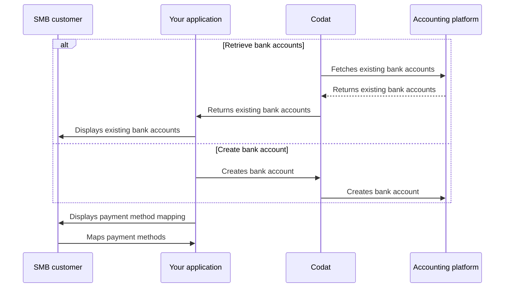

import Tabs from "@theme/Tabs";
import TabItem from "@theme/TabItem"

## Overview

Your SMB customers may have multiple bank accounts they can use to pay for a bill. In your application, you should enable them to select the account the payment should originate from.

Retrieve the list of existing bank accounts from the SMB's accounting platform and display the available mapping options to them in a UI, or allow them to create a new account when needed.

We have highlighted this alternative sequence of steps in our detailed process diagram below. 

<details>
<summary><b>Detailed process diagram</b></summary>



</details>

If your platform supports multiple payment methods that can be mapped to a separate account, store the mapping of the relevant `accountId` - you will need this to create the [bill payment](/payables/payments) later.

### Foreign currency payments

:::tip Foreign currency payments

If you facilitate payments in a foreign currency, you should convert the payment to the currency of the account or create a new account in that currency.

Use the [Get create account model](/sync-for-payables-api#/operations/get-create-chartOfAccounts-model) endpoint to view the list of the company's currently enabled currencies. It can return:

- *Single value*: the account's base currency in platforms that only support the base currency
- *Multiple values*: several currencies enabled by the SMB user in their accounting platform
- *No values*: empty array for platforms where any and all currencies can be selected

:::

## Retrieve bank accounts

If your SMB customer is making payments from a pre-existing bank account, retrieve a list of their accounts and allow them to map payment methods against each one. Use the [List accounts](/sync-for-payables-api#/operations/list-accounts) endpoint to do that.

For example, if you offer the option to make payments from a credit card, the company's bill payments should be mapped and reconciled to a credit account.

<Tabs>

<TabItem value="HTTP" label="HTTP">

#### Request

```http
GET https://api.codat.io/companies/{companyId}/connections/{connectionId}/data/bankAccounts
```

#### Response

```json
{
	"results": [
		{
			"id": "164",
			"accountName": "BillPay Debit Card",
			"accountType": "Debit",
			"nominalCode": "123456788",
			"currency": "USD",
			"balance": 0,
			"availableBalance": 0,
			"modifiedDate": "2023-04-14T09:31:24Z",
			"sourceModifiedDate": "2023-04-14T09:31:23Z",
			"metadata": {
				"isDeleted": false
			}
		},
		{
			"id": "163",
			"accountName": "BillPay Credit Card",
			"accountType": "Credit",
			"nominalCode": "123456789",
			"currency": "USD",
			"balance": 0,
			"availableBalance": 0,
			"modifiedDate": "2023-04-14T09:30:03Z",
			"sourceModifiedDate": "2023-04-14T09:30:02Z",
			"metadata": {
				"isDeleted": false
			}
		}
	]
}
```

</TabItem>

</Tabs>

## Create new account

If the SMB customer plans to make payments from a new payment method or account that you provide, use the [Create account](/operations/create-account) endpoint to reflect that account in their accounting software. It will contain their transactions, making the SMB's payment reconciliation workflows easier. 

You can also use the [Get create account model](/sync-for-payables-api#/operations/get-create-chartOfAccounts-model) endpoint first to check integration-specific requirements for account creation, or [read more](/using-the-api/push) about creating data with Codat.

<Tabs>

<TabItem value="HTTP" label="HTTP">

#### Request

```http
POST https://api.codat.io/companies/{companyId}/connections/{connectionId}/push/bankAccounts
```

#### Example request body

```json
{
    "accountName": "BillPay Debit Account",
    "accountType": "Debit",
    "accountNumber": "123456789",
    "currency": "USD",
    "balance": 0,
    "availableBalance": 0,
    "modifiedDate": "2023-04-14T09:25:10Z"
}
```

</TabItem >

</Tabs>  

### Pre-pay account

Create a bank account with an `accountType` of `Debit` if you need to represent the following payment methods: 

- Automated Clearing House (ACH) or Real-Time Payments (RTP) networks
- Cheque/check payments
- Electronic bank transfer
- BACS (Bankers' Automated Clearing System)


### Credit account

Create a bank account with an `accountType` of `Credit` if you are providing a credit facility for the payment, such as:

- Commercial/business credit card
- BNPL (Buy Now, Pay Later)

---

## Read next

- [Reflect and reconcile bill payments](/payables/payments) in the SMB's accounting software