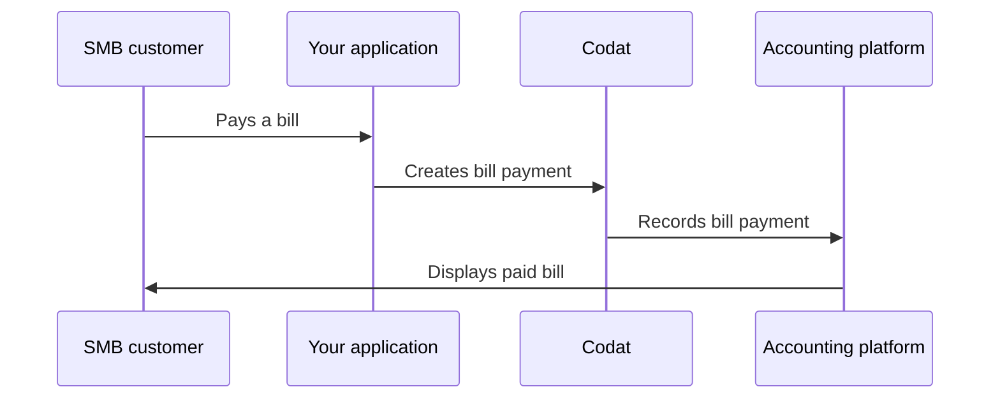
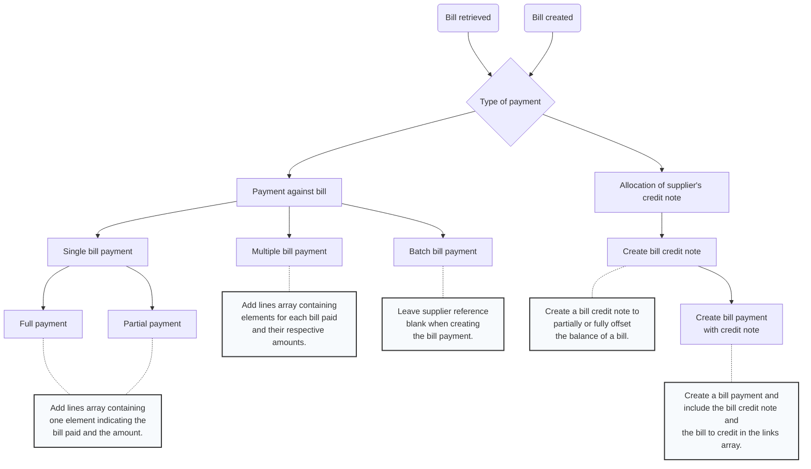

import Tabs from "@theme/Tabs";
import TabItem from "@theme/TabItem"

## Overview

Once the mapping is complete, your SMB customer will make a payment from your application, which you should then record and reconcile back to the SMB's accounting platform. A **bill payment** represents an allocation of money within any of your customer's accounts payable (AP) accounts.

You can see how this flow completes on our detailed process diagram below. 

<details>
<summary><b>Detailed process diagram</b></summary>



</details>

We built Sync for Payables to handle various bill pay scenarios, for example:

- A payment made against a bill, e.g. a credit card payment, cheque payment, or cash payment
- An allocation of a supplier's credit note to a bill or a refund
- A bill payment made directly to an AP account, e.g. an overpayment or a prepayment

## Ways to pay a bill

In this diagram, we have summarized approaches to bill payments and reconciliation that are available to you via Sync for Payables. Next, we will go through those options in detail. 



### Single bill payment

If your SMB customer is making a payment to pay off a bill in full, use the [Create bill payments](/sync-for-payables-api#/operations/create-bill-payment) endpoint and include the following properties in the request:

- A `totalAmount` value (**always positive**) that indicates the amount of the bill that was paid. 
- A `lines` array that contains one element with the following properties:
  - An `amount` equal to the `totalAmount` above
  - A `links` array that contains one element with the following properties:
    - A `type` of link, in this case a `Bill`
    - An `id` of the bill that was paid
    - An `amount` with value of **`-totalAmount`** to indicate the full amount is allocated to the bill.

In case of **partial payments**, use the same endpoint and adjust the `amount` values according to the amount of the partial payment.

When paying a bill, pay attention to the following:

- `supplierRef.id` is the same `id` as the `supplierRef.id` on the bill.
- `accountRef.id` is the account the payment is made from as indicated during mapping.
- `totalAmount` is the same as the `amountDue` on the bill.
- `date` is the date that the payment is made to the supplier.

For example, review the bill mapped from Xero in the dropdown below and see how it can be paid using the [Create bill payments](/sync-for-payables-api#/operations/create-bill-payment) in the subsequent code snippets.

<details>
<summary><b>Bill mapped from Xero</b></summary>

```json
{
  "id": "59978bef-af2f-4a7e-9728-4997597c0980",
  "reference": "RPT445-1",
  "supplierRef": {
    "id": "dec56ceb-65e9-43b3-ac98-7fe09eb37e31",
    "supplierName": "PowerDirect"
  },
  "purchaseOrderRefs": [],
  "issueDate": "2023-02-09T00:00:00",
  "dueDate": "2023-02-19T00:00:00",
  "currency": "GBP",
  "currencyRate": 1,
  "lineItems": [
    {
      "description": "Monthly electricity",
      "unitAmount": 129.38,
      "quantity": 1,
      "discountAmount": 0,
      "subTotal": 129.38,
      "taxAmount": 6.47,
      "totalAmount": 135.85,
      "discountPercentage": 0,
      "accountRef": {
        "id": "d50842c3-af67-4233-b8c9-df3180f5b7bd"
      },
      "taxRateRef": {
        "id": "RRINPUT",
        "name": "5% (VAT on Expenses)",
        "effectiveTaxRate": 5
      },
      "trackingCategoryRefs": [],
      "isDirectCost": false
    }
  ],
  "withholdingTax": [],
  "status": "Open",
  "subTotal": 129.38,
  "taxAmount": 6.47,
  "totalAmount": 135.85,
  "amountDue": 135.85,
  "modifiedDate": "2023-04-17T14:51:35Z",
  "sourceModifiedDate": "2021-01-03T21:56:20",
  "paymentAllocations": [],
  "metadata": {
    "isDeleted": false
  }
}
```
</details>

<Tabs>

<TabItem value="nodejs" label="TypeScript">

```javascript
const billPaymentResponse = await payablesClient.billPayments.create({
  billPayment: {
    supplierRef: {
      id: "dec56ceb-65e9-43b3-ac98-7fe09eb37e31"
    },
    accountRef: {
      id: "bd9e85e0-0478-433d-ae9f-0b3c4f04bfe4"
    },
    totalAmount: 135.85,
    currency: "GBP",
    currencyRate: 1,
    date: "2023-04-17T00:00:00",
    lines: [
      {
        amount: 135.85,
        links: [
          {
            id: "59978bef-af2f-4a7e-9728-4997597c0980",
            type: BillPaymentLineLinkType.Bill,
            amount: -135.85,
            currencyRate: 1,
          },
        ],
      },
    ]
  },
  companyId: companyId,
  connectionId: connectionId,
});
```

</TabItem>

<TabItem value="python" label="Python">

```python
bill_payment_request = operations.CreateBillPaymentRequest(
    bill_payment=shared.BillPayment(
      supplier_ref=shared.SupplierRef(
        id='dec56ceb-65e9-43b3-ac98-7fe09eb37e31',
      ),
      account_ref=shared.AccountRef(
        id='bd9e85e0-0478-433d-ae9f-0b3c4f04bfe4'
      ),
      total_amount=Decimal('135.85'),
      currency='GBP',
      currency_rate=1,
      date='2023-04-17T00:00:00',
      lines=[
        shared.BillPaymentLine(
          amount=Decimal('135.85'),
          links=[
            shared.BillPaymentLineLink(
              id='59978bef-af2f-4a7e-9728-4997597c0980',
              type=shared.BillPaymentLineLinkType.BILL,
              amount=Decimal('-135.85'),
              currency_rate=Decimal('1'),
            )
          ],
        ),
      ]
    ),
    company_id=company_id,
    connection_id=connection_id,
)

bill_payment_response = payables_client.bill_payments.create(bill_payment_request)
```

</TabItem>

<TabItem value="csharp" label="C#">

```csharp
var billPaymentResponse = await payablesClient.BillPayments.CreateAsync(new() {
  BillPayment = new BillPayment() {
    SupplierRef = new SupplierRef() {
        Id = "dec56ceb-65e9-43b3-ac98-7fe09eb37e31",
    },
    AccountRef = new AccountRef() {
      Id = "bd9e85e0-0478-433d-ae9f-0b3c4f04bfe4"
    },
    TotalAmount = 135.85M,
    Currency = "USD",
    CurrencyRate = 1M,
    Date = "2023-04-17T00:00:00",
    Lines = new List<BillPaymentLine>() {
      new BillPaymentLine() {
        Amount = 135.85M,
        Links = new List<BillPaymentLineLink>() {
          new BillPaymentLineLink() {
            Id = "59978bef-af2f-4a7e-9728-4997597c0980",
            Type = BillPaymentLineLinkType.Bill,
            Amount = -135.85M,
            CurrencyRate = 1M
          },
        },
      },
    },
  },
  CompanyId = companyId,
  ConnectionId = connectionId,
});
```
</TabItem>

<TabItem value="go" label="Go">

```go
ctx := context.Background()
billPaymentResponse, err := payablesClient.BillPayments.Create(ctx, 
  operations.CreateBillPaymentRequest{
    BillPayment: &shared.BillPayment{
      SupplierRef: &shared.SupplierRef{
          ID: "dec56ceb-65e9-43b3-ac98-7fe09eb37e31",
      },
      AccountRef: &shared.AccountRef{
        ID: "bd9e85e0-0478-433d-ae9f-0b3c4f04bfe4"
      },
      TotalAmount: types.MustNewDecimalFromString("135.85"),
      Currency: syncforpayables.String("USD"),
      CurrencyRate: types.MustNewDecimalFromString("1"),
      Date: "2023-04-17T00:00:00",
      Lines: []shared.BillPaymentLine{
        shared.BillPaymentLine{
          Amount: types.MustNewDecimalFromString("135.85"),
          Links: []shared.BillPaymentLineLink{
            shared.BillPaymentLineLink{
              Id: "59978bef-af2f-4a7e-9728-4997597c0980",
              Type: shared.BillPaymentLineLinkTypeBill,
              Amount = types.MustNewDecimalFromString("-135.85"),
              CurrencyRate = types.MustNewDecimalFromString("1")
            },
          },
        },
      },
    },
    CompanyID: companyId,
    ConnectionID: connectionID
})
```
</TabItem>

</Tabs>

### Multiple bill payment

Your SMB customer may want pay multiple bills from a single supplier using one payment. Use the [Create bill payments](/sync-for-payables-api#/operations/create-bill-payment) endpoint to do so and include a `lines` array with multiple elements for each bill and its respective amount.

<details>
<summary><b>Integration-specific examples</b></summary>

<Tabs>

<TabItem value="Xero" label="Xero">

```json
{
  "supplierRef": {
    "id": "dec56ceb-65e9-43b3-ac98-7fe09eb37e31"
  },
  "accountRef": {
    "id": "bd9e85e0-0478-433d-ae9f-0b3c4f04bfe4"
  },
  "totalAmount": 244.45,
  "currency": "GBP",
  "currencyRate": 1,
  "date": "2023-04-17T00:00:00",
  "lines": [
    {
      "amount": 135.85,
      "links": [
        {
          "type": "Bill",
          "id": "59978bef-af2f-4a7e-9728-4997597c0980",
          "amount": -135.85,
          "currencyRate": 1
        }
      ]
    },
    {
      "amount": 108.6,
      "links": [
        {
          "type": "Bill",
          "id": "2175c381-d323-4e20-8c94-7680ea7f85d3",
          "amount": -108.6,
          "currencyRate": 1
        }
      ]
    }
  ]
}
```

</TabItem>

<TabItem value="QuickBooks Online" label="QuickBooks Online">

```json
{
    "supplierRef": {
      "id": "77",
      "supplierName": "AtoB"
    },
    "accountRef": {
      "id": "122"
    },
    "totalAmount": 2500,
    "currency": "USD",
    "currencyRate": 1,
    "date": "2023-04-17T00:00:00",
    "lines": [
      {
        "amount": 2500,
        "links": [
          {
            "type": "Bill",
            "id": "302",
            "amount": -1200,
            "currencyRate": 1
          },
          {
            "type": "Bill",
            "id": "303",
            "amount": -1300,
            "currencyRate": 1
          }
        ]
      }
    ],
    "reference": "1"
  }
```

</TabItem>

<TabItem value="NetSuite" label="NetSuite">

:::info Considerations

If locations are set to mandatory in the company's NetSuite account, the `reference` is required and should be an `id` from the [tracking categories](/sync-for-payables-api#/operations/list-tracking-categories) prefixed with location.

:::

```json
{
  "supplierRef":{
    "id":"727",
    "supplierName":"Vendor -.B"
  },
  "totalAmount":2,
  "accountRef": {
    "id": "854"
  },
  "currency":"GBP",
  "currencyRate":1,
  "date":"2023-04-18T00:00:00",
  "lines":[
    {
      "amount":2,
      "links":[
        {
          "type":"Bill",
          "id":"288274",
          "amount":-1,
          "currencyRate":1
        },
        {
          "type":"Bill",
          "id":"287594",
          "amount":-1,
          "currencyRate":1
        }
      ]
    }
  ],
  "reference":"location-5"
}
```

</TabItem>

<TabItem value="Sage Intacct" label="Sage Intacct">

:::info Considerations

Sage Intacct uses a `paymentMethodRef`. You can retrieve the payment methods for a company using the [Get create/update bill model](/sync-for-payables-api#/operations/get-create-update-bills-model) endpoint.

:::

```json
{
  "id": "26491",
  "supplierRef": {
    "id": "15",
    "supplierName": "HC Equipment Repair"
  },
  "accountRef": {
    "id": "84"
  },
  "totalAmount": 30000,
  "currency": "USD",
  "date": "2023-04-19T00:00:00",
  "note": "",
  "paymentMethodRef": {
    "id": "6"
  },
  "lines": [
    {
      "amount": 15000,
      "links": [
        {
          "type": "Bill",
          "id": "26492",
          "amount": -15000
        }
      ]
    },
    {
      "amount": 15000,
      "links": [
        {
          "type": "Bill",
          "id": "26493",
          "amount": -15000
        }
      ]
    }
  ]
}
```

</TabItem>

<TabItem value="MYOB" label="MYOB">

```json
{
  "supplierRef": {
    "id": "0749b9a9-4fd1-4d5e-ae5f-7de3887c933a"
  },
  "accountRef": {
    "id": "161904cc-c2be-4cd7-afbd-ccd304473216"
  },
  "totalAmount": 105,
  "currency": "AUD",
  "date": "2023-04-19T00:00:00",
  "note": "Payment; Sydney Coaches & Buses (YAHOO MAIL)",
  "lines": [
    {
      "amount": 5,
      "links": [
        {
          "type": "Bill",
          "id": "cd5029ae-5548-4bd0-ae9e-bb572d40349d",
          "amount": -5,
          "currencyRate": 1
        }
      ]
    },
    {
      "amount": 100,
      "links": [
        {
          "type": "Bill",
          "id": "edaff6be-43c2-4f1d-9511-11605ae310f0",
          "amount": -100,
          "currencyRate": 1
        }
      ]
    }
  ]
}
```
</TabItem>

</Tabs>

</details>

### Batch bill payment

In some accounting platforms (for example, Xero) your SMB customer can make a batch payment. It allows them to pay multiple bills from multiple suppliers in a single payment.

To do this with Sync for Payables, use the [Create bill payments](/sync-for-payables-api#/operations/create-bill-payment) endpoint and leave the `supplierRef` parameter blank.

<Tabs>

<TabItem value="nodejs" label="TypeScript">

```javascript
const billPaymentResponse = await payablesClient.billPayments.create({
  billPayment: {
    accountRef: {
      id: "d96ffd74-2394-4666-81c4-eebb76e51e21"
    },
    totalAmount: 6,
    date: "2022-09-06T00:00:00",
    lines: [
      {
        amount: 1,
        links: [
          {
            id: "0394819c-b784-454d-991c-c4711b9aca12",
            type: BillPaymentLineLinkType.Bill,
            amount: -1,
          },
        ],
      },
      {
        amount: 2,
        links: [
          {
            id: "428e3e38-e8fb-4c56-91b5-dd09dc2e6505",
            type: BillPaymentLineLinkType.Bill,
            amount: -2,
          },
        ],
      },
      {
        amount: 3,
        links: [
          {
            id: "76129542-2b2f-482f-b2b3-e612d9c1ba08",
            type: BillPaymentLineLinkType.Bill,
            amount: -3,
          },
        ],
      },
    ]
  },
  companyId: companyId,
  connectionId: connectionId,
});
```

</TabItem>

<TabItem value="python" label="Python">

```python
bill_payment_request = operations.CreateBillPaymentRequest(
    bill_payment=shared.BillPayment(
      account_ref=shared.AccountRef(
        id='d96ffd74-2394-4666-81c4-eebb76e51e21'
      ),
      total_amount=Decimal('6'),
      date='2022-09-06T00:00:00',
      lines=[
        shared.BillPaymentLine(
          amount=Decimal('1'),
          links=[
            shared.BillPaymentLineLink(
              id='0394819c-b784-454d-991c-c4711b9aca12',
              type=shared.BillPaymentLineLinkType.BILL,
              amount=Decimal('-1'),
            )
          ],
        ),
        shared.BillPaymentLine(
          amount=Decimal('2'),
          links=[
            shared.BillPaymentLineLink(
              id='428e3e38-e8fb-4c56-91b5-dd09dc2e6505',
              type=shared.BillPaymentLineLinkType.BILL,
              amount=Decimal('-2'),
            )
          ],
        ),
        shared.BillPaymentLine(
          amount=Decimal('3'),
          links=[
            shared.BillPaymentLineLink(
              id='76129542-2b2f-482f-b2b3-e612d9c1ba08',
              type=shared.BillPaymentLineLinkType.BILL,
              amount=Decimal('-3'),
            )
          ],
        ),
      ]
    ),
    company_id=company_id,
    connection_id=connection_id,
)

bill_payment_response = payables_client.bill_payments.create(bill_payment_request)
```

</TabItem>

<TabItem value="csharp" label="C#">

```csharp
var billPaymentResponse = await payablesClient.BillPayments.CreateAsync(new() {
  BillPayment = new BillPayment() {
      AccountRef = new AccountRef() {
        Id = "d96ffd74-2394-4666-81c4-eebb76e51e21"
      },
      TotalAmount = 6M,
      Date = "2022-09-06T00:00:00",
      Lines = new List<BillPaymentLine>() {
          new BillPaymentLine() {
              Amount = 1M,
              Links = new List<BillPaymentLineLink>() {
                  new BillPaymentLineLink() {
                    Id = "0394819c-b784-454d-991c-c4711b9aca12",
                    Type = BillPaymentLineLinkType.Bill,
                    Amount = -1M,
                  },
              },
          },
          new BillPaymentLine() {
              Amount = 2M,
              Links = new List<BillPaymentLineLink>() {
                  new BillPaymentLineLink() {
                    Id = "428e3e38-e8fb-4c56-91b5-dd09dc2e6505",
                    Type = BillPaymentLineLinkType.Bill,
                    Amount = -2M,
                  },
              },
          },
          new BillPaymentLine() {
              Amount = 3M,
              Links = new List<BillPaymentLineLink>() {
                  new BillPaymentLineLink() {
                    Id = "76129542-2b2f-482f-b2b3-e612d9c1ba08",
                    Type = BillPaymentLineLinkType.Bill,
                    Amount = -3M,
                  },
              },
          },
      },
  },
  CompanyId = companyId,
  ConnectionId = connectionId,
});
```
</TabItem>

<TabItem value="go" label="Go">

```go
ctx := context.Background()
billPaymentResponse, err := payablesClient.BillPayments.Create(ctx, 
  operations.CreateBillPaymentRequest{
    BillPayment: &shared.BillPayment{
      AccountRef: &shared.AccountRef{
        ID: "d96ffd74-2394-4666-81c4-eebb76e51e21"
      },
      TotalAmount: types.MustNewDecimalFromString("6"),
      Date: "2022-09-06T00:00:00",
      Lines: []shared.BillPaymentLine{
        shared.BillPaymentLine{
          Amount: types.MustNewDecimalFromString("1"),
          Links: []shared.BillPaymentLineLink{
            shared.BillPaymentLineLink{
              Id: "0394819c-b784-454d-991c-c4711b9aca12",
              Type: shared.BillPaymentLineLinkTypeBill,
              Amount = types.MustNewDecimalFromString("-1"),
            },
          },
        },
        shared.BillPaymentLine{
          Amount: types.MustNewDecimalFromString("2"),
          Links: []shared.BillPaymentLineLink{
            shared.BillPaymentLineLink{
              Id: "428e3e38-e8fb-4c56-91b5-dd09dc2e6505",
              Type: shared.BillPaymentLineLinkTypeBill,
              Amount = types.MustNewDecimalFromString("-2"),
            },
          },
        },
        shared.BillPaymentLine{
          Amount: types.MustNewDecimalFromString("3"),
          Links: []shared.BillPaymentLineLink{
            shared.BillPaymentLineLink{
              Id: "76129542-2b2f-482f-b2b3-e612d9c1ba08",
              Type: shared.BillPaymentLineLinkTypeBill,
              Amount = types.MustNewDecimalFromString("-3"),
            },
          },
        },
      },
    },
    CompanyID: companyID,
    ConnectionID: connectionID
})
```
</TabItem>

</Tabs>

### Bill credit note

If a company receives a credit note from their supplier, the company could use it to partially or fully offset the balance of any outstanding bills from the same supplier. 

With Sync for Payables, you can do that using the following steps:

1. Create a bill credit note.
2. Allocate the credit note to a bill.

#### Create a credit note

Start by creating a credit note using our [Create bill credit note](/sync-for-payables-api#/operations/create-bill-credit-note) endpoint. 

<Tabs>

<TabItem value="nodejs" label="TypeScript">

```javascript
const billCreditNoteCreateResponse = await payablesClient.billCreditNotes.create({
    billCreditNote: {
      billCreditNoteNumber: "JMY-1987",
      supplierRef: {
        id: "3a0d40a2-2698-4cf5-b7b2-30133c632ab6",
        supplierName: "Swanston Security"
      },
      withholdingTax: [],
      totalAmount: 25.44,
      totalDiscount: 0,
      subTotal: 25.44,
      totalTaxAmount: 4.24,
      discountPercentage: 0,
      remainingCredit: 0,
      status: BillCreditNoteStatus.Submitted,
      issueDate: "2023-02-09T00:00:00",
      currency: "GBP",
      currencyRate: 1,
      lineItems: [
        {
          description: "Refund as agreed due to window break when guard absent",
          unitAmount: 21.2,
          quantity: 1,
          discountAmount: 0,
          subTotal: 21.2,
          taxAmount: 4.24,
          totalAmount: 25.44,
          accountRef: {
            id: "f96c9458-d724-47bf-8f74-a9d5726465ce"
          },
          discountPercentage: 0,
          taxRateRef: {
            id: "INPUT2",
            name: "20% (VAT on Expenses)",
            effectiveTaxRate: 20
          },
          trackingCategoryRefs: []
        }
      ]
    },
    companyId: companyId,
    connectionId: connectionId,
  });
```

</TabItem>

<TabItem value="python" label="Python">

```python
bill_credit_note_create_request = operations.CreateBillCreditNoteRequest(
  bill_credit_note=shared.BillCreditNote(
    bill_credit_note_number='JMY-1987',
    supplier_ref=shared.SupplierRef(
      id='3a0d40a2-2698-4cf5-b7b2-30133c632ab6',
      supplier_name='Swanston Security'
    ),
    withholding_tax=[],
    total_amount=Decimal('25.44'),
    total_discount=Decimal('0'),
    sub_total=Decimal('25.44'),
    total_tax_amount=Decimal('4.24'),
    discount_percentage=Decimal('0'),
    remaining_credit=Decimal('0'),
    status=shared.BillCreditNoteStatus.SUBMITTED,
    issue_date='2023-02-09T00:00:00',
    currency='GBP',
    currency_rate=Decimal('1'),
    line_items=[
      shared.BillCreditNoteLineItem(
        description="Refund as agreed due to window break when guard absent",
        unit_amount=Decimal('21.2'),
        quantity=Decimal('1'),
        discount_amount=Decimal('0'),
        sub_total=Decimal('21.2'),
        tax_amount=Decimal('4.24'),
        total_amount=Decimal('25.44'),
        account_ref=shared.AccountRef(
          id='f96c9458-d724-47bf-8f74-a9d5726465ce'
        ),
        discount_percentage=Decimal('0'),
        tax_rate_ref=shared.TaxRateRef(
          id='INPUT2',
          name='20% (VAT on Expenses)',
          effective_tax_rate=Decimal('20')
        ),
        tracking_category_refs=[]
      )
    ]
  ),
  company_id=company_id,
  connection_id=connection_id,
)

bill_credit_note_create_response = payablesClient.bill_credit_notes.create(bill_credit_note_create_request)
```

</TabItem>

<TabItem value="csharp" label="C#">

```csharp
var billCreditNoteCreateResponse = await payablesClient.BillCreditNotes.CreateAsync(new(){
  BillCreditNote = new BillCreditNote(){
    BillCreditNoteNumber = "JMY-1987",
    SupplierRef = new SupplierRef {
      Id = "3a0d40a2-2698-4cf5-b7b2-30133c632ab6",
      SupplierName = "Swanston Security"
    },
    WithholdingTax = new List<WithholdingTaxItems>(),
    TotalAmount = 25.44M,
    TotalDiscount = 0M,
    SubTotal = 25.44M,
    TotalTaxAmount = 4.24M,
    DiscountPercentage = 0M,
    RemainingCredit = 0M,
    Status = BillCreditNoteStatus.Submitted,
    IssueDate = "2023-02-09T00:00:00",
    Currency = "GBP",
    CurrencyRate = 1M,
    LineItems = new List<BillCreditNoteLineItem>(){
      new BillCreditNoteLineItem(){
        Description = "Refund as agreed due to window break when guard absent",
        UnitAmount = 21.2M,
        Quantity = 1M,
        DiscountAmount = 0M,
        SubTotal = 21.2M,
        TaxAmount = 4.24M,
        TotalAmount = 25.44M,
        AccountRef = new AccountRef(){
          Id = "f96c9458-d724-47bf-8f74-a9d5726465ce"
        },
        DiscountPercentage = 0M,
        TaxRateRef = new TaxRateRef(){
          Id = "INPUT2",
          Name = "20% (VAT on Expenses)",
          EffectiveTaxRate = 20M
        },
        TrackingCategoryRefs = new List<TrackingCategoryRef>()
      }
    }
  },
  CompanyId = companyId,
  ConnectionId = connectionId
});
```
</TabItem>

<TabItem value="go" label="Go">

```go
ctx := context.Background()
billCreditNoteCreateResponse, err := payablesClient.BillCreditNotes.Create(ctx,
  operations.CreateBillCreditNoteRequest{
    BillCreditNote: &shared.BillCreditNote{
      BillCreditNoteNumber: syncforpayables.String("JMY-1987"),
      SupplierRef: new SupplierRef {
        ID: syncforpayables.String("3a0d40a2-2698-4cf5-b7b2-30133c632ab6"),
        SupplierName: syncforpayables.String("Swanston Security")
      },
      WithholdingTax: []shared.WithholdingTaxItems{},
      TotalAmount: types.MustNewDecimalFromString("25.44"),
      TotalDiscount: types.MustNewDecimalFromString("0"),
      SubTotal: types.MustNewDecimalFromString("25.44"),
      TotalTaxAmount: types.MustNewDecimalFromString("4.24"),
      DiscountPercentage: types.MustNewDecimalFromString("0"),
      RemainingCredit: types.MustNewDecimalFromString("0"),
      Status: BillCreditNoteStatus.Submitted,
      IssueDate: syncforpayables.String("2023-02-09T00:00:00"),
      Currency: syncforpayables.String("GBP"),
      CurrencyRate: types.MustNewDecimalFromString("1"),
      LineItems: []shared.BillCreditNoteLineItem{
        shared.BillCreditNoteLineItem{
          Description: syncforpayables.String("Refund as agreed due to window break when guard absent"),
          UnitAmount: types.MustNewDecimalFromString("21.2"),
          Quantity: types.MustNewDecimalFromString("1"),
          DiscountAmount: types.MustNewDecimalFromString("0"),
          SubTotal: types.MustNewDecimalFromString("21.2"),
          TaxAmount: types.MustNewDecimalFromString("4.24"),
          TotalAmount: types.MustNewDecimalFromString("25.44"),
          AccountRef: &shared.AccountRef{
            ID: syncforpayables.String("f96c9458-d724-47bf-8f74-a9d5726465ce")
          },
          DiscountPercentage: types.MustNewDecimalFromString("0"),
          TaxRateRef: &shared.TaxRateRef(){
            ID: syncforpayables.String("INPUT2"),
            Name: syncforpayables.String("20% (VAT on Expenses)"),
            EffectiveTaxRate: types.MustNewDecimalFromString("20")
          },
          TrackingCategoryRefs: []shared.TrackingCategoryRef{}
        }
      }
    },
    CompanyID: companyID,
    ConnectionID: connectionID,
  }
)
```
</TabItem>

</Tabs>

<details>
<summary><b>Integration-specific examples</b></summary>

<Tabs>

<TabItem value="Xero" label="Xero">

```json
{
	"billCreditNoteNumber": "JMY-1987",
	"supplierRef": {
		"id": "3a0d40a2-2698-4cf5-b7b2-30133c632ab6",
		"supplierName": "Swanston Security"
	},
	"withholdingTax": [],
	"totalAmount": 25.44,
	"totalDiscount": 0,
	"subTotal": 25.44,
	"totalTaxAmount": 4.24,
	"discountPercentage": 0,
	"remainingCredit": 0,
	"status": "Submitted",
	"issueDate": "2023-02-09T00:00:00",
	"currency": "GBP",
	"currencyRate": 1,
	"lineItems": [
		{
			"description": "Refund as agreed due to window break when guard absent",
			"unitAmount": 21.2,
			"quantity": 1,
			"discountAmount": 0,
			"subTotal": 21.2,
			"taxAmount": 4.24,
			"totalAmount": 25.44,
			"accountRef": {
				"id": "f96c9458-d724-47bf-8f74-a9d5726465ce"
			},
			"discountPercentage": 0,
			"taxRateRef": {
				"id": "INPUT2",
				"name": "20% (VAT on Expenses)",
				"effectiveTaxRate": 20
			},
			"trackingCategoryRefs": []
		}
	]
}
```

</TabItem>

<TabItem value="QuickBooks Online" label="QuickBooks Online">

```json
{
  "billCreditNoteNumber": "309",
  "supplierRef": {
    "id": "87",
    "supplierName": "Ankunding Inc"
  },
  "withholdingTax": [],
  "totalAmount": 100,
  "totalDiscount": 0,
  "subTotal": 100,
  "totalTaxAmount": 0,
  "discountPercentage": 0,
  "remainingCredit": 100,
  "status": "Submitted",
  "issueDate": "2023-04-20T00:00:00",
  "currency": "GBP",
  "currencyRate": 1.242097,
  "lineItems": [
    {
      "description": "",
      "unitAmount": 100,
      "quantity": 1,
      "subTotal": 100,
      "taxAmount": 0,
      "totalAmount": 100,
      "accountRef": {
        "id": "7"
      },
      "taxRateRef": {
        "id": "NON",
        "name": "NON",
        "effectiveTaxRate": 0
      },
      "trackingCategoryRefs": [],
      "tracking": {
        "categoryRefs": [],
        "isBilledTo": "Unknown",
        "isRebilledTo": "NotApplicable"
      }
    }
  ]
}
```

</TabItem>

<TabItem value="NetSuite" label="NetSuite">

```json
{
  "billCreditNoteNumber": "VENDCRED1987",
  "supplierRef": {
    "id": "727",
    "supplierName": "Vendor -.B"
  },
  "withholdingTax": [],
  "totalAmount": 10,
  "totalDiscount": 0,
  "subTotal": 10,
  "totalTaxAmount": 0,
  "discountPercentage": 0,
  "status": "Submitted",
  "issueDate": "2023-04-20T00:00:00",
  "currency": "GBP",
  "currencyRate": 1,
  "lineItems": [
    {
      "description": "",
      "unitAmount": 10,
      "quantity": 1,
      "subTotal": 10,
      "totalAmount": 10,
      "accountRef": {
        "id": "714"
      },
      "trackingCategoryRefs": [
        {
          "id": "department-4",
          "name": "DP Department - incl children"
        }
      ],
      "tracking": {
        "categoryRefs": [
          {
            "id": "department-4",
            "name": "DP Department - incl children"
          }
        ],
        "isBilledTo": "Unknown",
        "isRebilledTo": "Unknown"
      }
    }
  ]
}

```

</TabItem>

<TabItem value="Sage Intacct" label="Sage Intacct">

```json
{
  "supplierRef": {
    "id": "3"
  },
  "withholdingTax": [],
  "totalAmount": 360,
  "totalDiscount": 0,
  "subTotal": 300,
  "totalTaxAmount": 60,
  "discountPercentage": 0,
  "status": "Submitted",
  "issueDate": "2021-09-24T00:00:00",
  "currency": "GBP",
  "currencyRate": 1,
  "lineItems": [
    {
      "description": "No Description Provided",
      "unitAmount": 300,
      "quantity": 1,
      "subTotal": 300,
      "taxAmount": 60,
      "totalAmount": 360,
      "accountRef": {
        "id": "197",
        "name": "Software and Licenses"
      },
      "taxRateRef": {
        "id": "81",
        "name": "UK Purchase Goods Standard Rate",
        "effectiveTaxRate": 20
      },
      "trackingCategoryRefs": [
        {
          "id": "LOCATION-15",
          "name": "United Kingdom"
        },
        {
          "id": "SUPPLIER-3",
          "name": "ADP"
        }
      ],
      "tracking": {
        "categoryRefs": [
          {
            "id": "LOCATION-15"
          },
          {
            "id": "SUPPLIER-3",
            "name": "ADP"
          }
        ],
        "isBilledTo": "Unknown",
        "isRebilledTo": "Unknown"
      }
    }
  ]
}

```

</TabItem>

<TabItem value="MYOB" label="MYOB">

```json
{
  "billCreditNoteNumber": "JMY0002",
  "supplierRef": {
    "id": "5c0664ca-6eb1-4085-9da4-37ef748bc65e",
    "supplierName": "Metropolitan Electricity"
  },
  "withholdingTax": [],
  "totalAmount": 900,
  "totalDiscount": 0,
  "subTotal": 1000,
  "totalTaxAmount": 100,
  "discountPercentage": 0,
  "status": "Submitted",
  "issueDate": "2023-04-20T00:00:00",
  "currency": "AUD",
  "lineItems": [
    {
      "description": "Credit note for incorrect bill",
      "unitAmount": 900,
      "quantity": 1,
      "subTotal": 900,
      "taxAmount": 100,
      "totalAmount": 900,
      "accountRef": {
        "id": "f04d046b-0137-4d95-8af7-ed9fef1a4ba3"
      },
      "taxRateRef": {
        "id": "ff083e95-de4e-4c56-87dd-32ad9cdac172",
        "name": "Capital Acquisitions",
        "effectiveTaxRate": 10
      },
      "trackingCategoryRefs": []
    }
  ]
}
```

</TabItem>

</Tabs>

</details>

#### Allocate credit note to a bill

Now that you have the credit note, offset its balance against outstanding bills. [Create a bill payment](/payables/payments#single-bill-payment) and include the credit note in the `links` array.

In some accounting platforms, you can combine a credit note and a partial payment to pay off the full balance of a bill.

<Tabs>

<TabItem value="nodejs" label="TypeScript">

```javascript
const billPaymentResponse = await payablesClient.billPayments.create({
  billPayment: {
    supplierRef: {
      id: "3a0d40a2-2698-4cf5-b7b2-30133c632ab6"
    },
    accountRef: {
      id: "94b02f61-f95f-4873-b5b7-651ff9707325"
    },
    totalAmount: 0.00,
    currency: "GBP",
    currencyRate: 1,
    date: "2023-05-09T00:00:00",
    lines: [
      {
        amount: 45.00,
        links: [
          {
            id: "59978bef-af2f-4a7e-9728-4997597c0980",
            type: BillPaymentLineLinkType.Bill,
            amount: -25.44,
          },
          {
            id: "ee8bec08-2be8-40ba-acd0-d53d5df11235",
            type: BillPaymentLineLinkType.CreditNote,
            amount: 25.44,
          },
        ],
      },
    ]
  },
  companyId: companyId,
  connectionId: connectionId,
});
```

</TabItem>

<TabItem value="python" label="Python">

```python
bill_payment_request = operations.CreateBillPaymentRequest(
    bill_payment=shared.BillPayment(
      supplier_ref=shared.SupplierRef(
        id='3a0d40a2-2698-4cf5-b7b2-30133c632ab6',
      ),
      account_ref=shared.AccountRef(
        id='94b02f61-f95f-4873-b5b7-651ff9707325'
      ),
      total_amount=Decimal('0.00'),
      currency='GBP',
      date='2023-05-09T00:00:00',
      lines=[
        shared.BillPaymentLine(
          amount=Decimal('45.00'),
          links=[
            shared.BillPaymentLineLink(
              id='59978bef-af2f-4a7e-9728-4997597c0980',
              type=shared.BillPaymentLineLinkType.BILL,
              amount=Decimal('-25.44'),
            ),
            shared.BillPaymentLineLink(
              id='ee8bec08-2be8-40ba-acd0-d53d5df11235',
              type=shared.BillPaymentLineLinkType.CREDIT_NOTE,
              amount=Decimal('25.44'),
            )
          ],
        ),
      ]
    ),
    company_id=company_id,
    connection_id=connection_id,
)

bill_payment_response = payables_client.bill_payments.create(bill_payment_request)
```

</TabItem>

<TabItem value="csharp" label="C#">

```csharp
var billPaymentResponse = await payablesClient.BillPayments.CreateAsync(new() {
  BillPayment = new BillPayment() {
    SupplierRef = new SupplierRef() {
        Id = "3a0d40a2-2698-4cf5-b7b2-30133c632ab6",
    },
    AccountRef = new AccountRef() {
      Id = "94b02f61-f95f-4873-b5b7-651ff9707325"
    },
    TotalAmount = 0M,
    Currency = "GBP",
    Date = "2023-05-09T00:00:00",
    Lines = new List<BillPaymentLine>() {
      new BillPaymentLine() {
        Amount = 45.00M,
        Links = new List<BillPaymentLineLink>() {
          new BillPaymentLineLink() {
            Id = "59978bef-af2f-4a7e-9728-4997597c0980",
            Type = BillPaymentLineLinkType.Bill,
            Amount = -25.44M,
          },
          new BillPaymentLineLink() {
            Id = "ee8bec08-2be8-40ba-acd0-d53d5df11235",
            Type = BillPaymentLineLinkType.CreditNote,
            Amount = 25.44M,
          },
        },
      },
    },
  },
  CompanyId = companyId,
  ConnectionId = connectionId,
});
```
</TabItem>

<TabItem value="go" label="Go">

```go
ctx := context.Background()
billPaymentResponse, err := payablesClient.BillPayments.Create(ctx, 
  operations.CreateBillPaymentRequest{
    BillPayment: &shared.BillPayment{
      SupplierRef: &shared.SupplierRef{
          ID: "3a0d40a2-2698-4cf5-b7b2-30133c632ab6",
      },
      AccountRef: &shared.AccountRef{
        ID: "94b02f61-f95f-4873-b5b7-651ff9707325"
      },
      TotalAmount: types.MustNewDecimalFromString("0.00"),
      Currency: syncforpayables.String("GBP"),
      Date: "2023-05-09T00:00:00",
      Lines: []shared.BillPaymentLine{
        shared.BillPaymentLine{
          Amount: types.MustNewDecimalFromString("45.00"),
          Links: []shared.BillPaymentLineLink{
            shared.BillPaymentLineLink{
              ID: "59978bef-af2f-4a7e-9728-4997597c0980",
              Type: shared.BillPaymentLineLinkTypeBill,
              Amount = types.MustNewDecimalFromString("-25.44"),
            },
            shared.BillPaymentLineLink{
              ID: "ee8bec08-2be8-40ba-acd0-d53d5df11235",
              Type: shared.BillPaymentLineLinkTypeCreditNote,
              Amount = types.MustNewDecimalFromString("25.44"),
            },
          },
        },
      },
    },
    CompanyID: companyID,
    ConnectionID: connectionID
})
```
</TabItem>

</Tabs>

<details>
<summary><b>Integration-specific examples</b></summary>

<Tabs>

<TabItem value="Xero" label="Xero">

:::info Considerations
With Xero, you can only fully allocate a `billCreditNote` to a `bill` using a `billPayment`. If you want to also use a partial payment, two separate transactions should be created.
:::

```json
{
  "supplierRef": {
    "id": "3a0d40a2-2698-4cf5-b7b2-30133c632ab6"
  },
  "accountRef": {
    "id": "94b02f61-f95f-4873-b5b7-651ff9707325"
  },
  "totalAmount": 0,
  "currency": "GBP",
  "date": "2023-05-09T00:00:00",
  "lines": [
    {
      "amount": 45,
      "links": [
        {
          "type": "Bill",
          "id": "8e65df54-4bbd-41f3-b241-8da2588be341",
          "amount": -25.44
        },
        {
          "type": "CreditNote",
          "id": "ee8bec08-2be8-40ba-acd0-d53d5df11235",
          "amount": 25.44
        }
      ]
    }
  ]
}
```

</TabItem>

<TabItem value="QuickBooks Online" label="QuickBooks Online">

:::info Considerations
With QBO, you can only fully allocate a `billCreditNote` to a `bill` using a `billPayment`. If you want to also use a partial payment, two separate transactions should be created.
:::

```json
{
  "supplierRef": {
    "id": "87"
  },
  "accountRef": {
    "id": "35"
  },
  "totalAmount": 0,
  "currency": "GBP",
  "currencyRate": 1,
  "date": "2023-05-09T00:00:00",
  "lines": [
    {
      "amount": 0,
      "links": [
        {
          "type": "Bill",
          "id": "328",
          "amount": -100
        },
        {
          "type": "CreditNote",
          "id": "308",
          "amount": 100
        }
      ]
    }
  ]
}
```

</TabItem>

<TabItem value="NetSuite" label="NetSuite">

This example shows a partial bill payment and bill credit note used to pay the full balance of a bill.

```json
{
  "supplierRef": {
    "id": "727"
  },
  "accountRef": {
    "id": "854"
  },
  "totalAmount": 110,
  "currency": "GBP",
  "date": "2023-05-09T00:00:00",
  "lines": [
    {
      "amount": 110,
      "links": [
        {
          "type": "Bill",
          "id": "8",
          "amount": -120
        },
        {
          "type": "CreditNote",
          "id": "462792",
          "amount": 10
        }
      ]
    }
  ]
}
```

</TabItem>

<TabItem value="Sage Intacct" label="Sage Intacct">

This example shows the payment of a bill with credit and partial payment.

:::info Considerations

Sage Intacct uses a `paymentMethodRef`. You can retrieve the payment methods for a company using the [Get create/update bill model](/sync-for-payables-api#/operations/get-create-update-bills-model) endpoint.

:::

```json
{
  "supplierRef": {
    "id": "3"
  },
  "paymentMethodRef": {
    "id": "6",
    "name": "Cash"
  },
  "accountRef": {
    "id": "360"
  },
  "totalAmount": 45,
  "currency": "USD",
  "date": "2023-04-25T00:00:00",
  "lines": [
    {
      "amount": 45,
      "links": [
        {
          "type": "Bill",
          "id": "26572",
          "amount": -405
        },
        {
          "type": "CreditNote",
          "id": "26573",
          "amount": 360
        }
      ]
    }
  ]
}
```

</TabItem>

<TabItem value="MYOB" label="MYOB">

:::note Coming soon

Credit note allocations are coming soon for MYOB.

:::

</TabItem>

</Tabs>

</details>

### Delete bills and payments

In certain scenarios, your SMB customer may want to delete an existing bill or a bill payment - for example, if they made a mistake or no longer want to process the bill. 

Use the [Delete bill](/sync-for-payables-api#/operations/delete-bill) and [Delete bill payment](/sync-for-payables-api#/operations/delete-billPayment) endpoints to support these requirements, and check them in our OAS for the most up-to-date integration coverage. 

#### Delete bills

<Tabs>

<TabItem value="nodejs" label="TypeScript">

```javascript
const billDeleteResponse = await payablesClient.bills.delete({
  companyId: companyId,
  connectionId: connectionId,
  billId: billId,
});
```

</TabItem>

<TabItem value="python" label="Python">

```python
bill_delete_request = operations.DeleteBillRequest(
  company_id=company_id,
  connection_id=connection_id,
  bill_id=bill_id,
)

bill_delete_response = payables_client.bills.delete(bill_delete_request)
```

</TabItem>

<TabItem value="csharp" label="C#">

```csharp
var res = await payablesClient.Bills.DeleteAsync(new() {
    CompanyId = companyId,
    ConnectionId = connectionId,
    BillId = billId,
};);
```
</TabItem>

<TabItem value="go" label="Go">

```go
ctx := context.Background()
billDeleteResponse, err := payablesClient.Bills.Delete(ctx, operations.DeleteBillRequest{
  CompanyID: companyID,
  ConnectionID: connectionID,
  BillID: billID,
})
```
</TabItem>

</Tabs>

#### Delete bill payments

<Tabs>

<TabItem value="nodejs" label="TypeScript">

```javascript
const billPaymentDeleteResponse = await payablesClient.billPayments.delete({
  companyId: companyId,
  connectionId: connectionId,
  billPaymentId: billPaymentId,
});
```

</TabItem>

<TabItem value="python" label="Python">

```python
bill_payment_delete_request = operations.DeleteBillPaymentRequest(
  company_id=company_id,
  connection_id=connection_id,
  bill_payment_id=bill_payment_id,
)

bill_payment_delete_response = payables_client.bills.delete(bill_payment_delete_request)
```

</TabItem>

<TabItem value="csharp" label="C#">

```csharp
var billPaymentDeleteResponse = await payablesClient.BillPayments.DeleteAsync(new() {
    CompanyId = companyId,
    ConnectionId = connectionId,
    BillPaymentId = billPaymentId,
});
```
</TabItem>

<TabItem value="go" label="Go">

```go
ctx := context.Background()
billPaymentDeleteResponse, err := payablesClient.BillPayments.Delete(ctx, 
  operations.DeleteBillPaymentRequest{
    CompanyID: companyID,
    ConnectionID: connectionID,
    BillPaymentID: billPaymentID,
  }
)
```
</TabItem>

</Tabs>

:::tip Recap

This concludes the bill pay process supported by Sync for Payables. You have provided your customer with their suppliers, bills, and bank accounts and enabled them to choose relevant payment methods. You have reflected the bill payments in their accounting system. 

As a result, the customer will see these bills marked as paid in their software and their accounts payable liability and supplier balances reduced.

:::


