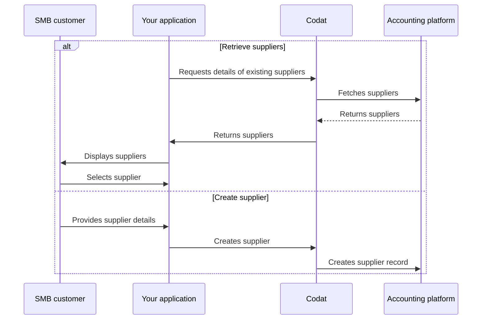

import Tabs from "@theme/Tabs";
import TabItem from "@theme/TabItem"

## Overview

In accounts payable, each bill is associated with a [supplier](/sync-for-payables-api#/schemas/Supplier). The supplier represents a business or a sole trader that provides goods or services to your SMB customer. 

Their records also contain key information, such as contact details, that can be used to notify the supplier once a payment is made.

To pay a bill in Sync for Payables, you can use your customer's existing supplier or create a new one. We have highlighted this alternative sequence of steps in our detailed process diagram below. 

<details>
<summary><b>Detailed process diagram</b></summary>



</details>

## Retrieve supplier

Call our [List suppliers](/sync-for-payables-api#/operations/list-suppliers) to retrieve the full list of your customer's existing suppliers. You can also use [query parameters](/using-the-api/querying) to narrow down the list of results, for example:

- `status=Active` returns only active suppliers.
- `defaultCurrency=USD` returns suppliers that provide goods or services in dollars.
- `supplierName=Acme` returns suppliers with a name that matches the query.

<Tabs>

<TabItem value="HTTP" label="HTTP">

```http
GET https://api.codat.io/companies/{companyId}/data/suppliers?page=1&pageSize=100
```
</TabItem >

</Tabs>

:::tip Supplier balances

Sync for Payables does not expose supplier balances on the supplier endpoints. Instead, you can:
- Aggregate bills by supplier
- Use the [Aged debtors](/sync-for-payables-api#/operations/get-aged-debtors-report) report
:::

## Create supplier

When your customer's company does business with a new supplier for the first time, you will need to create a supplier before creating a bill against that supplier. Use the [Create supplier](/sync-for-payables-api#/operations/create-supplier) endpoint to do that.

<Tabs>

<TabItem value="HTTP" label="HTTP">

```http
POST https://api.codat.io/companies/{companyId}/connections/{connectionId}/push/suppliers
```
</TabItem >

</Tabs>

### Update supplier

If your customer's existing supplier changes address or business name, you can reflect this change in their accounting software using the [Update supplier](/sync-for-payables-api#/operations/put-supplier) endpoint.


```http request title="Update supplier"
PUT https://api.codat.io/companies/{companyId}/connections/{connectionId}/push/suppliers/{supplierId}
```

:::tip Recap

You have learnt how to view, create, and update your customer's suppliers who provide them with goods and services. 

Next, you can choose to manage your supplier's bills or payment methods prior to paying those bills.

:::

---
### Read next

* [Manage your customer's bills](/payables/bills)
* [Manage your customer's payment methods](/payables/mapping)