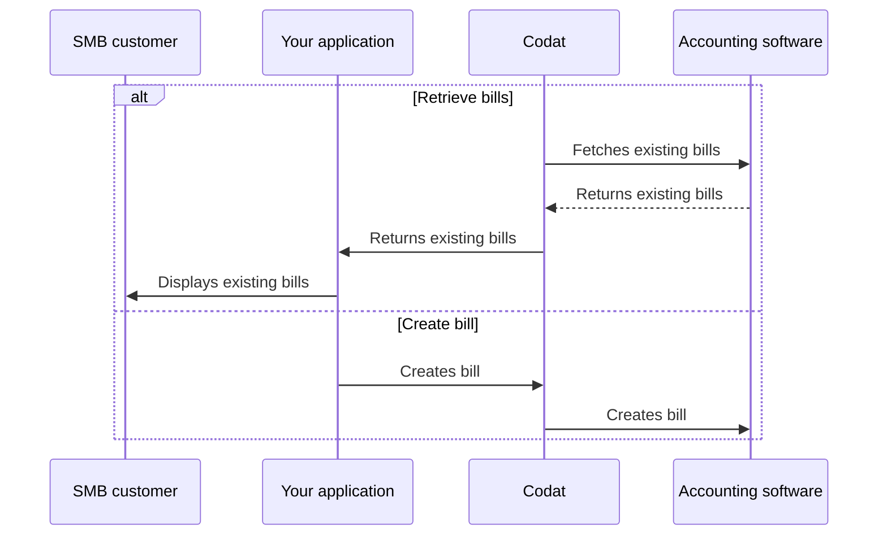

import Tabs from "@theme/Tabs";
import TabItem from "@theme/TabItem"
import RetrieveBills from '../_retrieve-bills.md'
import CreateBills from '../_create-bills.md'
import UploadAttachment from '../_upload-attachment.md'

:::tip Invoices or bills?

We distinguish between invoices where the company *owes* money and those where the company *is owed* money. If the company receives an invoice and owes money as a result, we call this a **bill**.
:::

## Overview

In Codat, a bill represents an *accounts payable* invoice issued to an SMB by their supplier. With synchronous Bill Pay, you can:

- Retrieve your customer's existing bills.
- Create new bills in your system and reflect them in your customer's accounting software.  

We have highlighted this alternative sequence of steps in our detailed process diagram below.

<b>Detailed process diagram</b>

## Retrieve bills

:::tip Filter the bill list

Bill endpoints of the sync Bill Pay solution only return **open** or **partially paid** bills from the accounting platform. You can use [query parameters](/using-the-api/querying) to change the scope of results. 
:::

<RetrieveBills listendpoint="/sync-for-payables-v2-api#/operations/list-bills" createendpoint="/sync-for-payables-v2-api#/operations/create-bill" downloadendpoint="/sync-for-payables-v2-api#/operations/download-bill-attachment" />

## Create bill

:::tip Reference data

Bills should always correspond to a supplier that issued them. Ensure the relevant supplier exists before creating a new bill.

You must also associate the bill's line items with a specific account or tax rate. Use the [Get bill mapping options](/sync-for-payables-v2-api#/operations/get-mapping-options-bills) endpoint to view available accounts and tax rates.

:::

<CreateBills endpoint="/sync-for-payables-v2-api#/operations/create-bill" />

<UploadAttachment endpoint="/sync-for-payables-v2-api#/operations/upload-bill-attachment" schema="/sync-for-payables-v2-api#/schemas/Attachment" />

---

## Read next

- Enable your customers to [pay single bills](/payables/sync/pay-bill) to complete the Bill Pay process.