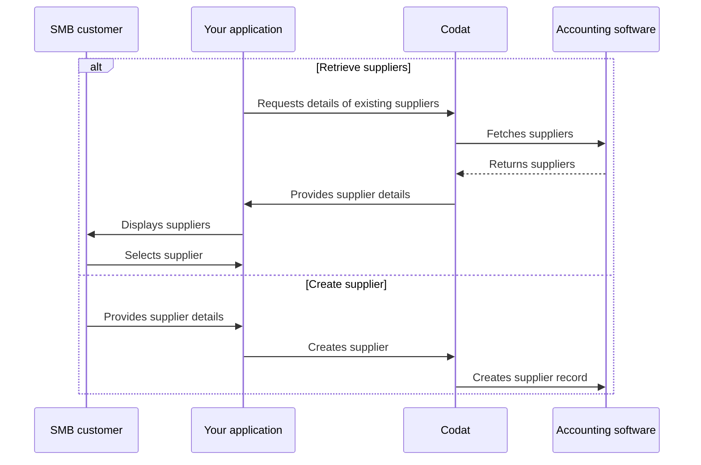

import Tabs from "@theme/Tabs";
import TabItem from "@theme/TabItem";
import ManageSuppliers from '../_manage-suppliers.md'

## Overview

In accounts payable, each bill is associated with a *supplier*. The supplier represents a business or a sole trader that provides goods or services to your SMB customer. 

Their records also contain key information, such as contact details, that can be used to notify the supplier once a payment is made.

To pay a bill in Bill Pay, you can use your customer's existing suppliers or create a new one. We have highlighted this alternative sequence of steps in our detailed process diagram below. 

<b>Detailed process diagram</b>

:::tip Narrow down the supplier list

Supplier endpoints of the sync Bill Pay solution return only **active** suppliers from the accounting platform. You can use [query parameters](/using-the-api/querying) to narrow down the list of results further. 
:::

<ManageSuppliers listendpoint="/sync-for-payables-v2-api#/operations/list-suppliers" createendpoint="/sync-for-payables-v2-api#/operations/create-supplier" />

:::tip Recap

You have learnt how to view, create, and update your customer's suppliers who provide them with goods and services. 

Next, you can choose to manage your supplier's bills or payment methods prior to paying those bills.

:::

---
## Read next

* [Manage your customer's bills](/payables/sync/bills)
* [Pay your customer's bills](/payables/sync/pay-bill)
